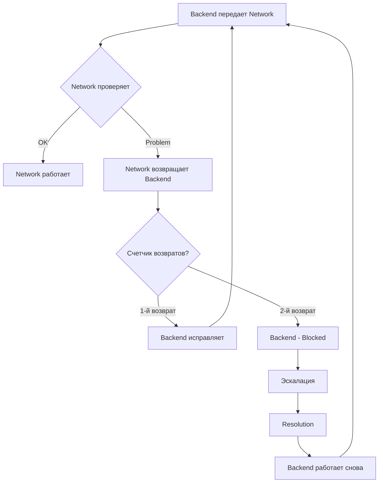

# 🔄 Return Limit Policy

**Политика ограничения возвратов задач между агентами**

## 🎯 Цель

**Предотвратить "пинг-понг"** между агентами, когда задача возвращается туда-сюда без реального прогресса.

## 📊 Правило

**Максимум 2 возврата между одними и теми же агентами.**

```
Backend → Network → Backend (1-й возврат) → Network → 
Backend (2-й возврат) → СТОП
```

**После 2-го возврата:**
- Статус → `{Agent} - Blocked`
- Эскалация к tech lead или Architect
- Обсуждение для resolution

## 🔄 Как считать возвраты

### Пример 1: Backend ↔ Network

```
1. Backend → Network (передача)
2. Network → Backend (1-й возврат) ❶
3. Backend → Network (передача после исправления)
4. Network → Backend (2-й возврат) ❷
5. СТОП → Backend - Blocked
```

### Пример 2: QA ↔ Backend

```
1. Backend → QA (передача)
2. QA → Backend (1-й возврат: баги) ❶
3. Backend → QA (исправлено)
4. QA → Backend (2-й возврат: новые баги) ❷
5. СТОП → Blocked + эскалация
```

### Пример 3: Architect ↔ Idea Writer

```
1. Idea Writer → Architect (передача)
2. Architect → Idea Writer (1-й возврат: unclear) ❶
3. Idea Writer → Architect (clarified)
4. Architect → Idea Writer (2-й возврат: still unclear) ❷
5. СТОП → Blocked + meeting
```

## WARNING Действия после 2-го возврата

### Шаг 1: Блокировка

```javascript
// Обновить статус на Blocked
mcp_github_update_project_item({
  owner_type: 'user',
  owner: 'gc-lover',
  project_number: 1,
  item_id: project_item_id,
  updated_field: {
    id: 239690516,
    value: '{agent_blocked_id}'  // Например: '504999e1' для Backend - Blocked
  }
});

// Добавить комментарий
mcp_github_add_issue_comment({
  owner: 'gc-lover',
  repo: 'necpgame-monorepo',
  issue_number: issue_number,
  body: '🔴 **Return limit reached: 2 returns between Backend ↔ Network**\n\n' +
        '**History:**\n' +
        '1. Backend → Network (передача)\n' +
        '2. Network → Backend (1-й возврат: OpenAPI issues)\n' +
        '3. Backend → Network (исправлено)\n' +
        '4. Network → Backend (2-й возврат: still issues)\n\n' +
        '**Problem:**\n' +
        '- Task returning back and forth without clear resolution\n' +
        '- Miscommunication or unclear requirements\n\n' +
        '**Action required:**\n' +
        '- @tech-lead: please review and resolve\n' +
        '- @architect: may need architecture clarification\n' +
        '- Schedule meeting to discuss\n\n' +
        '**Status updated:** `Backend - Blocked`\n\n' +
        '**Return count:** 2/2 (LIMIT REACHED)\n\n' +
        'Issue: #' + issue_number
});
```

### Шаг 2: Создать Resolution Issue

```javascript
// Создать отдельный Issue для обсуждения
mcp_github_issue_write({
  method: 'create',
  owner: 'gc-lover',
  repo: 'necpgame-monorepo',
  title: '[BLOCKED] Resolution needed: Issue #' + original_issue + ' - Backend ↔ Network ping-pong',
  body: '**Original Issue:** #' + original_issue + '\n\n' +
        '**Problem:**\n' +
        'Task has been returned 2 times between Backend and Network.\n\n' +
        '**Return history:**\n' +
        '1. Network → Backend: OpenAPI spec incomplete\n' +
        '2. Network → Backend: Still missing fields in spec\n\n' +
        '**Root cause (suspected):**\n' +
        '- Unclear requirements in original Issue\n' +
        '- Miscommunication between agents\n' +
        '- Architecture may need revision\n\n' +
        '**Action needed:**\n' +
        '- [ ] Tech lead review\n' +
        '- [ ] Architect clarification\n' +
        '- [ ] Meeting with Backend + Network + Architect\n' +
        '- [ ] Update requirements/architecture\n\n' +
        '**Participants:**\n' +
        '- @backend-agent\n' +
        '- @network-agent\n' +
        '- @architect\n' +
        '- @tech-lead',
  labels: ['blocked', 'needs-discussion', 'priority-high']
});
```

### Шаг 3: Эскалация

**Привлечь:**
- Tech lead (обязательно)
- Architect (если архитектурные проблемы)
- Product owner (если неясны требования)

**Действия:**
- Созвать встречу/обсуждение
- Выяснить root cause
- Определить план действий
- Обновить требования/архитектуру

## 📋 Отслеживание возвратов

### В комментариях к Issue

**При каждом возврате указывай счетчик:**

```markdown
WARNING **Task returned (1/2)**

**Reason:** ...

**Status updated:** `Backend - Returned`
```

```markdown
WARNING **Task returned (2/2) - LIMIT REACHED**

**Reason:** ...

**Action:** Task blocked, escalation needed

**Status updated:** `Backend - Blocked`
```

### В Project (custom field)

**Опционально:** Добавить custom field `Return Count`
- Type: Number
- Default: 0
- Increment при каждом возврате

## 🎯 Исключения

**Лимит НЕ применяется:**

### 1. Возврат к разным агентам

```
Backend → Network (передача)
Network → Backend (1-й возврат)
Backend → Security (передача)
Security → Backend (1-й возврат)
```
**Это OK:** Каждая пара агентов имеет свой лимит.

### 2. Возврат после Blocked resolution

```
Backend → Network (1-й возврат)
Backend → Network (2-й возврат)
Backend - Blocked → Resolution → Architect clarification
Backend → Network (счетчик сброшен)
```
**После resolution:** Счетчик возвратов сбрасывается.

### 3. Разные проблемы

```
Backend → QA (1-й возврат: bug A)
Backend → QA (2-й возврат: bug B, не связан с A)
```
**Может быть OK:** Если это действительно разные независимые проблемы.
**НО:** Всё равно нужна осторожность - возможно QA пропустил что-то при первом тестировании.

## 🚨 Root Causes частых возвратов

**Если задача возвращается 2+ раза, проверь:**

### 1. Неясные требования
- Issue description неполный
- Acceptance criteria нечеткие
- Противоречия в требованиях

**Решение:**
- Вернуть к Idea Writer для clarification
- Обновить Issue description
- Добавить примеры/use cases

### 2. Архитектурные проблемы
- Архитектура неполная
- Компоненты плохо определены
- Неясные интеграции

**Решение:**
- Вернуть к Architect
- Обновить архитектурный документ
- Добавить диаграммы взаимодействия

### 3. Технические проблемы
- Технология/библиотека не подходит
- Инфраструктурные ограничения
- Performance issues

**Решение:**
- Architect пересмотреть tech stack
- DevOps проверить инфраструктуру
- Performance Engineer провести анализ

### 4. Недостаток коммуникации
- Агенты не понимают друг друга
- Разные ожидания
- Неполная информация при передаче

**Решение:**
- Улучшить комментарии при передаче
- Добавить больше контекста
- Синхронная встреча агентов

### 5. Качество работы
- Агент не валидирует результат перед передачей
- Пропускает очевидные проблемы
- Не читает требования

**Решение:**
- Использовать `/agent-validate-result` перед передачей
- Проверять чек-лист готовности
- Читать Issue полностью перед началом

## 📊 Метрики возвратов

**Отслеживать:**

```markdown
## Return Rate по агентам

| Агент | Задач передано | Возвращено | Return Rate |
|-------|----------------|------------|-------------|
| Backend | 50 | 8 | 16% |
| Network | 40 | 3 | 7.5% |
| QA | 60 | 12 | 20% |
```

**Цель:** <15% return rate для каждого агента

**Если >20%:**
- Проверить quality процесса
- Возможно агент не валидирует результат
- Нужно training/clarification

## OK Предотвращение возвратов

### Для передающего агента:

**Перед передачей:**
- [ ] Прочитал Issue полностью
- [ ] Проверил acceptance criteria
- [ ] Использовал `/agent-validate-result`
- [ ] Прошел чек-лист готовности
- [ ] Добавил комментарий с summary

### Для принимающего агента:

**При получении:**
- [ ] Прочитал Issue полностью
- [ ] Проверил что всё готово для моего этапа
- [ ] Использовал проверочные команды (`/agent-check-*`)
- [ ] Если проблемы - возвращаю с ДЕТАЛЬНЫМ описанием

**При возврате:**
- [ ] Указываю ЧТО именно не так
- [ ] Указываю ЧТО нужно исправить
- [ ] Даю примеры/ссылки
- [ ] Указываю счетчик возврата (1/2 или 2/2)

## 🔄 Workflow с лимитом



## WARNING Особые случаи

### QA нашел множество багов

**Ситуация:**
```
Backend → QA (передача)
QA нашел 10 багов
QA → Backend (1-й возврат)
Backend исправил
Backend → QA (передача)
QA нашел еще 5 новых багов
QA → Backend (2-й возврат)
```

**Анализ:**
- Возможно Backend не тестирует перед передачей
- Возможно QA нужно улучшить первоначальное тестирование

**Решение:**
- Backend: обязательно запускать тесты перед передачей
- QA: создавать comprehensive test plan с первого раза
- Если паттерн повторяется → Blocked + discussion

### Critical production bug

**Исключение:**
Для critical bugs лимит может быть гибким:
- Приоритет - исправить быстро
- Но всё равно track возвраты
- После исправления - post-mortem: почему так много возвратов?

## 📝 Summary

**Лимит 2 возврата помогает:**
- OK Избежать бесконечного пинг-понга
- OK Обнаружить системные проблемы рано
- OK Улучшить качество передачи между агентами
- OK Форсировать эскалацию когда нужно

**Используй лимит как:**
- 🎯 Триггер для escalation
- 🔍 Индикатор quality problems
- 💡 Opportunity для process improvement

**НЕ используй как:**
- ❌ Жесткое правило без исключений
- ❌ Punishment для агентов
- ❌ Способ скрыть проблемы

