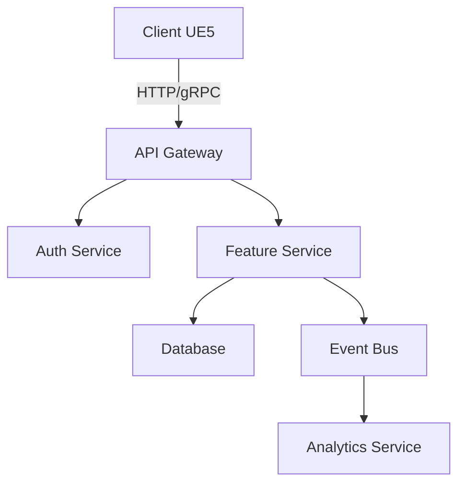
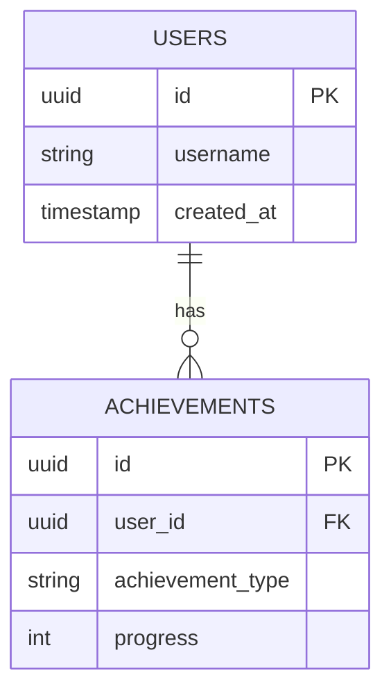

# Architect: Validate Result

Проверка готовности архитектуры перед передачей Database/API Designer.

## 📋 Чек-лист готовности

**Архитектура готова когда:**

### Архитектурный документ
- [ ] Документ создан в `knowledge/implementation/architecture/`
- [ ] Формат: Markdown с Mermaid диаграммами
- [ ] Issue указан в начале: `<!-- Issue: #123 -->`
- [ ] Файл <500 строк (разбить если больше)

### Компоненты системы
- [ ] Все компоненты идентифицированы
- [ ] Микросервисы определены (если нужны новые)
- [ ] Взаимодействие между компонентами описано
- [ ] Data flow diagram (Mermaid)

### API endpoints (high-level)
- [ ] Список всех нужных endpoints
- [ ] HTTP методы определены (GET, POST, PUT, DELETE)
- [ ] Основные request/response поля указаны
- [ ] Аутентификация/авторизация определена

### База данных
- [ ] Основные сущности (entities) определены
- [ ] Связи между сущностями описаны (1:1, 1:N, N:M)
- [ ] ERD диаграмма (Mermaid) создана

### Синхронизация данных (если нужно)
- [ ] Event Sourcing спроектирован (если применимо)
- [ ] CQRS паттерн определен (если применимо)
- [ ] Saga Pattern для distributed transactions (если нужно)
- [ ] Event bus выбран (Kafka, NATS, etc.)

### Тикрейт и сетевая нагрузка (если игровая механика)
- [ ] Требования к тикрейту определены:
  - PvE: 20-30 Hz
  - PvP small: 60-128 Hz
  - GvG 200: 60-80 Hz
  - Massive war: 20-40 Hz
- [ ] Протокол выбран (WebSocket/UDP)
- [ ] Spatial partitioning спроектирован (если нужно)

### Масштабируемость
- [ ] Horizontal scaling стратегия определена
- [ ] Load balancing рассмотрен
- [ ] Caching strategy определена (если нужно)
- [ ] Database sharding спроектирован (если нужно)

### SOLID принципы
- [ ] Single Responsibility для каждого компонента
- [ ] Интерфейсы для расширяемости
- [ ] Dependency Injection паттерн применен

## 🔍 Автоматические проверки

```bash
# 1. Проверить наличие документа
ls knowledge/implementation/architecture/{feature}-architecture.yaml
# или
ls knowledge/implementation/architecture/{feature}-architecture.md

# 2. Валидировать YAML (если YAML)
yamllint knowledge/implementation/architecture/{feature}-architecture.yaml

# 3. Проверить Mermaid диаграммы (визуально)
# Открыть в редакторе с поддержкой Mermaid
```

## 📊 Примеры готовых диаграмм

### Component Diagram


### ERD Diagram


## OK Если всё готово

**Определи следующий этап:**

### Если нужна БД → Database Engineer

```javascript
mcp_github_update_project_item({
  owner_type: 'user',
  owner: 'gc-lover',
  project_number: 1,
  item_id: project_item_id,
  updated_field: {
    id: 239690516,
    value: '58644d24'  // STATUS_OPTIONS['Database - Todo']
  }
});

mcp_github_add_issue_comment({
  owner: 'gc-lover',
  repo: 'necpgame-monorepo',
  issue_number: issue_number,
  body: 'OK Architecture ready. Handed off to Database Engineer\n\n' +
        '**Completed:**\n' +
        '- Architecture diagram created\n' +
        '- Components identified\n' +
        '- ERD diagram ready\n' +
        '- API endpoints defined (high-level)\n\n' +
        'Issue: #' + issue_number
});
```

### Если БД НЕ нужна → API Designer

```javascript
mcp_github_update_project_item({
  owner_type: 'user',
  owner: 'gc-lover',
  project_number: 1,
  item_id: project_item_id,
  updated_field: {
    id: 239690516,
    value: '3eddfee3'  // STATUS_OPTIONS['API Designer - Todo']
  }
});

mcp_github_add_issue_comment({
  owner: 'gc-lover',
  repo: 'necpgame-monorepo',
  issue_number: issue_number,
  body: 'OK Architecture ready. Handed off to API Designer\n\n' +
        '**Completed:**\n' +
        '- Architecture diagram created\n' +
        '- Components identified\n' +
        '- API endpoints defined (high-level)\n\n' +
        '**Note:** No database changes needed\n\n' +
        'Issue: #' + issue_number
});
```

### Если это UI задача → UI/UX Designer

```javascript
mcp_github_update_project_item({
  owner_type: 'user',
  owner: 'gc-lover',
  project_number: 1,
  item_id: project_item_id,
  updated_field: {
    id: 239690516,
    value: '49689997'  // STATUS_OPTIONS['UI/UX - Todo']
  }
});
```

### Если это контент-квест → Content Writer

```javascript
mcp_github_update_project_item({
  owner_type: 'user',
  owner: 'gc-lover',
  project_number: 1,
  item_id: project_item_id,
  updated_field: {
    id: 239690516,
    value: 'c62b60d3'  // STATUS_OPTIONS['Content Writer - Todo']
  }
});
```

## ❌ Если НЕ готово

**Исправь проблемы перед передачей!**

Оставь статус `Architect - In Progress` и продолжи работу.

## 🔄 Review (опционально)

Для сложной архитектуры можешь использовать:

```javascript
mcp_github_update_project_item({
  owner_type: 'user',
  owner: 'gc-lover',
  project_number: 1,
  item_id: project_item_id,
  updated_field: {
    id: 239690516,
    value: '2c2a7b69'  // STATUS_OPTIONS['Architect - Review']
  }
});
```

После review → передать дальше.

