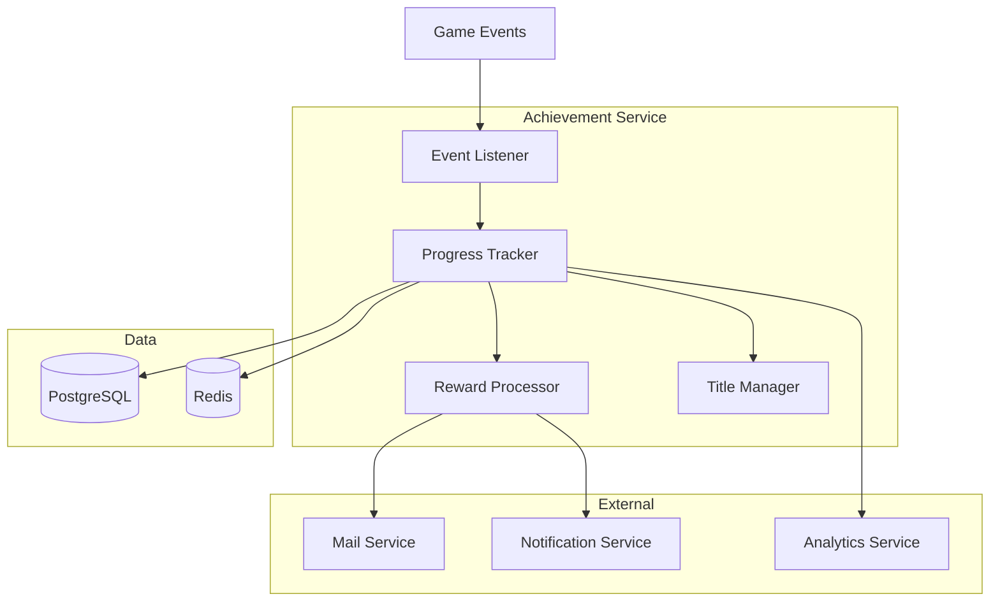
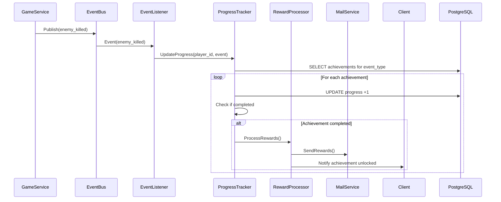

<!-- Issue: #138 -->

# Архитектура системы достижений (Achievement System)

## Метаданные

- **ID:** architecture-achievement-system
- **Версия:** 1.0.0
- **Дата:** 2025-12-02
- **Автор:** Architect Agent
- **Статус:** Draft
- **Теги:** architecture, achievements, engagement, event-driven

## Краткое описание

Achievement System отслеживает прогресс игроков во всех игровых активностях и выдает награды, титулы и уведомления за выполнение целей.

## Связанные документы

- `knowledge/implementation/backend/achievement-system.yaml`
- `knowledge/mechanics/progression/progression-skills.yaml`

---

## 1. Архитектурный обзор

### 1.1. Цели

1. **Мотивация игроков** - цели для всех типов активностей
2. **Отслеживание прогресса** - event-driven подсчёт
3. **Награды** - валюта, предметы, титулы, баффы
4. **Престиж** - титулы и визуальные элементы
5. **Удержание** - ежедневные/еженедельные достижения

### 1.2. Компоненты



---

## 2. Компоненты

### 2.1. Achievement Service (World Service)

**Технологии:** Go, Event Bus (Kafka/NATS), PostgreSQL, Redis

**Подкомпоненты:**

#### Event Listener
- Подписка на события всех сервисов
- Фильтрация релевантных событий
- Routing к Progress Tracker

#### Progress Tracker
- Обновление прогресса
- Проверка completion criteria
- Unlock достижений

#### Reward Processor
- Выдача наград (валюта, предметы, XP)
- Отправка через Mail Service
- Уведомления

#### Title Manager
- Управление титулами
- Активация/деактивация
- Отображение

### 2.2. Data Storage

#### PostgreSQL

```sql
CREATE TABLE achievement_definitions (
    id UUID PRIMARY KEY,
    achievement_name VARCHAR(255) NOT NULL,
    category VARCHAR(50) NOT NULL,       -- 'combat', 'exploration', 'economic', etc.
    achievement_type VARCHAR(50) NOT NULL, -- 'standard', 'progressive', 'repeatable'
    description TEXT,
    
    -- Criteria
    event_type VARCHAR(100),              -- 'enemy_killed', 'quest_completed', etc.
    target_count INTEGER,
    criteria JSONB,                        -- дополнительные условия
    
    -- Rewards
    rewards JSONB,                         -- {currency: {}, items: [], title_id: ...}
    
    -- Display
    icon_url VARCHAR(500),
    points INTEGER DEFAULT 10,
    is_hidden BOOLEAN DEFAULT FALSE,
    
    created_at TIMESTAMP NOT NULL DEFAULT NOW()
);

CREATE INDEX idx_achievement_category ON achievement_definitions(category);
CREATE INDEX idx_achievement_event ON achievement_definitions(event_type);

CREATE TABLE player_achievement_progress (
    id UUID PRIMARY KEY,
    player_id UUID NOT NULL,
    achievement_id UUID NOT NULL REFERENCES achievement_definitions(id),
    current_progress INTEGER DEFAULT 0,
    target_count INTEGER NOT NULL,
    status VARCHAR(50) NOT NULL,          -- 'in_progress', 'completed'
    started_at TIMESTAMP NOT NULL DEFAULT NOW(),
    completed_at TIMESTAMP,
    
    UNIQUE(player_id, achievement_id)
);

CREATE INDEX idx_progress_player ON player_achievement_progress(player_id, status);
CREATE INDEX idx_progress_completed ON player_achievement_progress(player_id, completed_at);

CREATE TABLE player_titles (
    id UUID PRIMARY KEY,
    player_id UUID NOT NULL,
    title_id UUID NOT NULL,
    title_name VARCHAR(255) NOT NULL,
    is_active BOOLEAN DEFAULT FALSE,
    unlocked_at TIMESTAMP NOT NULL DEFAULT NOW()
);

CREATE INDEX idx_titles_player ON player_titles(player_id);
CREATE UNIQUE INDEX idx_active_title ON player_titles(player_id) WHERE is_active = TRUE;
```

#### Redis

- `achievement:progress:{player_id}` - кэш прогресса (TTL: 10 мин)
- `achievement:unlocked:{player_id}` - список unlocked (TTL: 1 час)
- `achievement:leaderboard:{category}` - топ игроков (TTL: 5 мин)

---

## 3. API Endpoints

### 3.1. Achievement Management

#### GET /api/v1/world/achievements
**Список всех достижений**

Parameters: `category`, `status` (all, completed, in_progress)

Response:
```json
{
  "achievements": [{
    "id": "uuid",
    "name": "First Blood",
    "category": "combat",
    "description": "Kill your first enemy",
    "progress": 1,
    "target": 1,
    "status": "completed",
    "rewards": {"gold": 100},
    "points": 10
  }]
}
```

#### GET /api/v1/world/achievements/player/{player_id}
**Достижения игрока**

Response:
```json
{
  "total_points": 1250,
  "completed_count": 45,
  "in_progress_count": 23,
  "achievements": [...]
}
```

#### POST /api/v1/world/titles/{title_id}/activate
**Активировать титул**

### 3.2. Internal API

#### POST /internal/v1/achievements/process-event
**Обработка события** (вызывается Event Listener)

Request:
```json
{
  "event_type": "enemy_killed",
  "player_id": "uuid",
  "payload": {"enemy_type": "elite", "level": 50}
}
```

---

## 4. Категории достижений

### 4.1. Combat
- Убить N врагов
- Убить боссов
- Критические удары
- PvP победы

### 4.2. Exploration
- Открыть локации
- Найти секреты
- Путешествия

### 4.3. Economic
- Заработать N золота
- Торговые сделки
- Auction house

### 4.4. Social
- Добавить друзей
- Создать гильдию
- Помочь новичкам

### 4.5. Quests
- Завершить N квестов
- Сюжетные квесты
- Ежедневные квесты

### 4.6. Progression
- Достичь уровня
- Развить навыки
- Экипировка

### 4.7. PvP
- Рейтинг
- Арены
- Clan wars

### 4.8. Special
- Сезонные события
- Первопроходцы
- Редкие достижения

---

## 5. Типы достижений

| Type | Описание | Пример |
|------|----------|--------|
| Standard | Одноразовое выполнение | "Kill first enemy" |
| Progressive | Несколько уровней | "Kill 10/100/1000 enemies" |
| Repeatable | Можно выполнять многократно | "Complete daily quest" |
| Hidden | Скрыто до unlock | "Secret boss defeated" |

---

## 6. Потоки данных

### 6.1. Обработка события



---

## 7. События

**Subscribed Events:**
- `combat:enemy_killed`
- `quest:completed`
- `trade:completed`
- `friend:added`
- `level:gained`
- `boss:defeated`
- `pvp:match_won`
- `exploration:location_discovered`

**Published Events:**
- `achievement:unlocked`
- `achievement:progress_updated`
- `title:unlocked`

---

## 8. Производительность

- Event processing: < 50ms
- Progress update: < 30ms
- Unlock notification: < 100ms
- Cache hit rate: > 85%

---

## 9. Разбиение на подзадачи

### 9.1. Database Schema (P0)
**Срок:** 1 неделя

### 9.2. Event Listener (P0)
**Срок:** 1.5 недели

### 9.3. Progress Tracker (P0)
**Срок:** 2 недели

### 9.4. Reward Processor (P1)
**Срок:** 1 неделя

### 9.5. Title System (P2)
**Срок:** 1 неделя

### 9.6. Analytics Integration (P2)
**Срок:** 0.5 недели

---

## 10. Критерии готовности

- [x] Архитектура спроектирована
- [x] Компоненты определены
- [x] Микросервисы идентифицированы
- [x] API endpoints описаны
- [x] Event-driven архитектура спроектирована
- [x] Техническое задание готово

---

**Конец документа**


