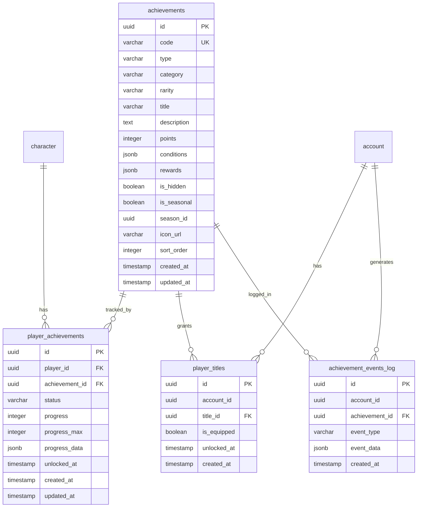

<!-- Issue: #140887366 -->
# Achievement System - Database Schema

## Обзор

Схема базы данных для системы достижений, включающая определения достижений, прогресс игроков, титулы и лог событий для аналитики.

## ERD Диаграмма



## Описание таблиц

### achievements

Таблица определений достижений. Хранит информацию о всех доступных достижениях в игре.

**Ключевые поля:**
- `code`: Уникальный код достижения (VARCHAR(100), UNIQUE)
- `type`: Тип достижения (one_time, progressive, recurring, hidden, seasonal, meta)
- `category`: Категория (combat, quest, social, economy, exploration, skills, collections, special)
- `rarity`: Редкость (common, uncommon, rare, epic, legendary)
- `title`: Название достижения
- `description`: Описание достижения
- `points`: Очки за достижение
- `conditions`: JSONB условия для разблокировки
- `rewards`: JSONB награды за достижение
- `is_hidden`: Скрытое достижение
- `is_seasonal`: Сезонное достижение
- `season_id`: ID сезона (для сезонных достижений)
- `icon_url`: URL иконки достижения
- `sort_order`: Порядок сортировки

**Индексы:**
- Уникальный индекс по `code`
- По `category` для фильтрации по категориям
- По `type` для фильтрации по типам
- По `rarity` для фильтрации по редкости
- Композитный индекс `(category, type)` для оптимизации запросов
- По `sort_order` для сортировки

### player_achievements

Таблица прогресса игроков по достижениям. Хранит информацию о прогрессе каждого игрока по каждому достижению.

**Ключевые поля:**
- `player_id`: ID персонажа (FK к characters)
- `achievement_id`: ID достижения (FK к achievements)
- `status`: Статус (locked, progress, unlocked)
- `progress`: Текущий прогресс (INTEGER)
- `progress_max`: Целевой прогресс (INTEGER)
- `progress_data`: JSONB дополнительные данные прогресса
- `unlocked_at`: Время разблокировки (nullable)

**Индексы:**
- Уникальный индекс `(player_id, achievement_id)` - один прогресс на достижение
- Композитный индекс `(player_id, status, updated_at DESC)` для получения достижений игрока
- Композитный индекс `(achievement_id, status)` для статистики по достижениям
- По `(player_id, unlocked_at DESC)` для разблокированных достижений

### player_titles

Таблица титулов игроков. Хранит информацию о титулах, полученных за достижения.

**Ключевые поля:**
- `account_id`: ID аккаунта игрока
- `title_id`: ID достижения, которое даёт титул (FK к achievements, где reward_type = title)
- `is_equipped`: Флаг экипированного титула
- `unlocked_at`: Время получения титула

**Индексы:**
- Уникальный индекс `(account_id, title_id)` - один титул на аккаунт
- По `account_id` для поиска титулов игрока
- Композитный индекс `(account_id, is_equipped)` для активного титула
- Композитный индекс `(account_id, title_id)` для оптимизации запросов

### achievement_events_log

Таблица лога событий достижений для аналитики. Хранит все события, связанные с достижениями.

**Ключевые поля:**
- `account_id`: ID аккаунта игрока
- `achievement_id`: ID достижения (FK к achievements)
- `event_type`: Тип события (progress_updated, unlocked, reward_distributed)
- `event_data`: JSONB данные события для аналитики
- `created_at`: Время события

**Индексы:**
- Композитный индекс `(account_id, created_at DESC)` для событий игрока
- Композитный индекс `(achievement_id, created_at DESC)` для событий по достижению
- По `created_at DESC` для аналитики по времени
- Композитный индекс `(event_type, created_at DESC)` для фильтрации по типу события

## Constraints и валидация

### CHECK Constraints

- `achievement_events_log.event_type`: Допустимые значения: 'progress_updated', 'unlocked', 'reward_distributed'

### Unique Constraints

- `achievements.code`: Уникальный код достижения
- `player_achievements(player_id, achievement_id)`: Один прогресс на достижение
- `player_titles(account_id, title_id)`: Один титул на аккаунт

### Foreign Keys

- `player_achievements.player_id` → `characters.id` (ON DELETE CASCADE)
- `player_achievements.achievement_id` → `achievements.id` (ON DELETE CASCADE)
- `player_titles.title_id` → `achievements.id` (ON DELETE CASCADE)
- `achievement_events_log.achievement_id` → `achievements.id` (ON DELETE CASCADE)

## Оптимизация запросов

### Частые запросы

1. **Получение достижений игрока:**
   ```sql
   SELECT * FROM player_achievements 
   WHERE player_id = $1 AND status = $2 
   ORDER BY updated_at DESC;
   ```
   Использует композитный индекс `(player_id, status, updated_at DESC)`.

2. **Получение разблокированных достижений:**
   ```sql
   SELECT * FROM player_achievements 
   WHERE player_id = $1 AND status = 'unlocked' 
   ORDER BY unlocked_at DESC;
   ```
   Использует индекс `(player_id, unlocked_at DESC)`.

3. **Получение титулов игрока:**
   ```sql
   SELECT * FROM player_titles 
   WHERE account_id = $1;
   ```
   Использует индекс по `account_id`.

4. **Получение активного титула:**
   ```sql
   SELECT * FROM player_titles 
   WHERE account_id = $1 AND is_equipped = true;
   ```
   Использует композитный индекс `(account_id, is_equipped)`.

5. **Аналитика событий:**
   ```sql
   SELECT * FROM achievement_events_log 
   WHERE account_id = $1 AND created_at >= $2 
   ORDER BY created_at DESC;
   ```
   Использует композитный индекс `(account_id, created_at DESC)`.

### Партиционирование

Для больших объемов данных рекомендуется партиционирование:
- По `created_at` для таблицы `achievement_events_log` (логи событий)
- По `account_id` для распределения нагрузки

## Миграции

### Существующие миграции:
- `V1_13__achievement_tables.sql` - базовые таблицы (achievements, player_achievements)
- `V1_50__achievement_system_enhancement.sql` - дополнение схемы (player_titles, achievement_events_log, дополнительные поля)

### Применение миграций:
```bash
liquibase update --changelog-file=infrastructure/liquibase/changelog.yaml
```

## Соответствие архитектуре

Схема БД полностью соответствует архитектуре из `knowledge/implementation/architecture/achievement-system-architecture.yaml`:
- [OK] Все таблицы из архитектуры созданы
- [OK] Все поля соответствуют описанию
- [OK] Индексы оптимизированы для частых запросов
- [OK] Constraints обеспечивают целостность данных
- [OK] Foreign Keys настроены с CASCADE для автоматической очистки
- [OK] Поддержка JSONB для гибкого хранения данных

## Особенности реализации

### JSONB поля

Использование JSONB для гибкого хранения:
- `conditions`: Условия для разблокировки достижения
- `rewards`: Награды за достижение (валюта, предметы, титулы)
- `progress_data`: Дополнительные данные прогресса
- `event_data`: Данные события для аналитики

### Event-driven архитектура

Система достижений полностью event-driven:
- События обрабатываются асинхронно
- Прогресс обновляется на основе событий
- Лог событий используется для аналитики и восстановления состояния

### Титулы

Титулы связаны с достижениями через `title_id`:
- Титул получается при разблокировке достижения с `reward_type = title`
- Один аккаунт может иметь несколько титулов
- Только один титул может быть экипирован одновременно


