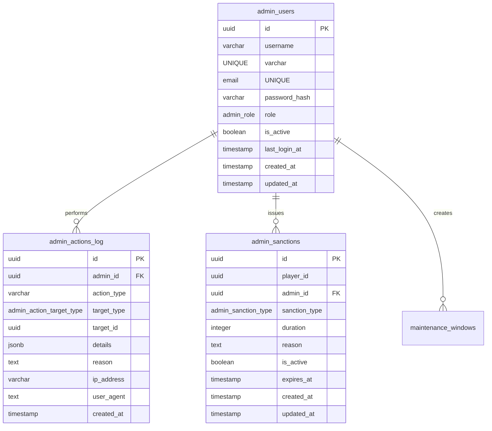

<!-- Issue: #403 -->
# Admin Moderation System - Database Schema

## Обзор

Схема базы данных для системы администрирования и модерации, управляющей администраторами, журналом действий и санкциями.

## ERD Диаграмма

## Таблицы

### admin_users

Администраторы и модераторы системы.

**Колонки:**
- `id` (UUID, PK) - Уникальный идентификатор
- `username` (VARCHAR(100), UNIQUE) - Имя пользователя
- `email` (VARCHAR(255), UNIQUE) - Email
- `password_hash` (VARCHAR(255)) - Хеш пароля
- `role` (admin_role) - Роль: SUPER_ADMIN, ADMIN, MODERATOR
- `is_active` (BOOLEAN) - Активен ли администратор
- `last_login_at` (TIMESTAMP) - Время последнего входа
- `created_at` (TIMESTAMP) - Время создания
- `updated_at` (TIMESTAMP) - Время обновления

**Индексы:**
- `idx_admin_users_username` - По имени пользователя
- `idx_admin_users_email` - По email
- `idx_admin_users_role` - По роли
- `idx_admin_users_is_active` - По активности
- `idx_admin_users_last_login_at` - По времени последнего входа

### admin_actions_log

Журнал действий администраторов.

**Колонки:**
- `id` (UUID, PK) - Уникальный идентификатор
- `admin_id` (UUID, FK) - ID администратора
- `action_type` (VARCHAR(100)) - Тип действия (например, ban_player, edit_economy, moderate_content)
- `target_type` (admin_action_target_type) - Тип цели: player, economy, content, moderation
- `target_id` (UUID) - ID цели
- `details` (JSONB) - Детали действия
- `reason` (TEXT) - Причина действия
- `ip_address` (VARCHAR(45)) - IP адрес
- `user_agent` (TEXT) - User-Agent
- `created_at` (TIMESTAMP) - Время действия

**Индексы:**
- `idx_admin_actions_log_admin_id` - По администратору и времени
- `idx_admin_actions_log_action_type` - По типу действия и времени
- `idx_admin_actions_log_target` - По типу цели, ID цели и времени
- `idx_admin_actions_log_created_at` - По времени действия
- `idx_admin_actions_log_ip_address` - По IP адресу

### admin_sanctions

Санкции, выданные администраторами.

**Колонки:**
- `id` (UUID, PK) - Уникальный идентификатор
- `player_id` (UUID) - ID игрока
- `admin_id` (UUID, FK) - ID администратора
- `sanction_type` (admin_sanction_type) - Тип санкции: WARNING, TEMPORARY_BAN, PERMANENT_BAN, MUTE, KICK
- `duration` (INTEGER) - Длительность в секундах (NULL для постоянных)
- `reason` (TEXT) - Причина санкции
- `is_active` (BOOLEAN) - Активна ли санкция
- `expires_at` (TIMESTAMP) - Время истечения (NULL для постоянных)
- `created_at` (TIMESTAMP) - Время создания
- `updated_at` (TIMESTAMP) - Время обновления

**Ограничения:**
- CHECK: для PERMANENT_BAN expires_at должен быть NULL, для остальных - NOT NULL

**Индексы:**
- `idx_admin_sanctions_player_id` - По игроку, активности и времени истечения
- `idx_admin_sanctions_admin_id` - По администратору и времени создания
- `idx_admin_sanctions_is_active` - По активности и времени истечения
- `idx_admin_sanctions_expires_at` - По времени истечения
- `idx_admin_sanctions_sanction_type` - По типу санкции и активности
- `idx_admin_sanctions_active_expired` - По активным и истекшим санкциям

## ENUM типы

### admin_role
- `SUPER_ADMIN` - Супер-администратор
- `ADMIN` - Администратор
- `MODERATOR` - Модератор

### admin_action_target_type
- `player` - Игрок
- `economy` - Экономика
- `content` - Контент
- `moderation` - Модерация

### admin_sanction_type
- `WARNING` - Предупреждение
- `TEMPORARY_BAN` - Временный бан
- `PERMANENT_BAN` - Постоянный бан
- `MUTE` - Мут
- `KICK` - Кик

## Связи

- `admin_actions_log.admin_id` → `admin.admin_users.id` (RESTRICT при удалении)
- `admin_sanctions.admin_id` → `admin.admin_users.id` (RESTRICT при удалении)

## Миграция

Файл: `infrastructure/liquibase/migrations/V1_84__admin_moderation_system_tables.sql`

