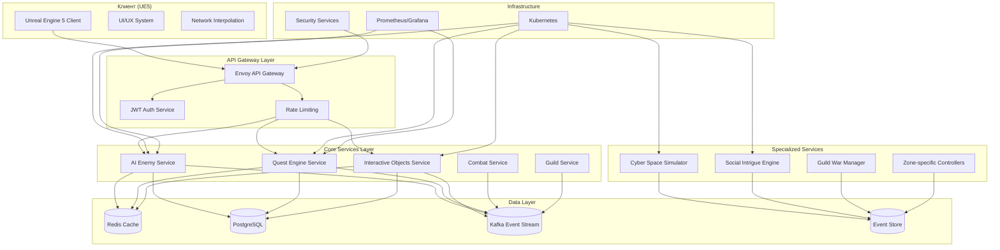
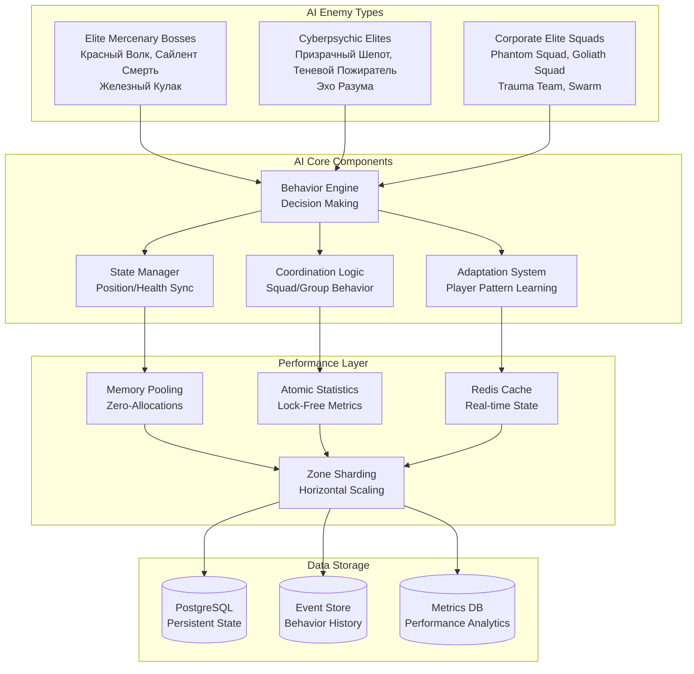
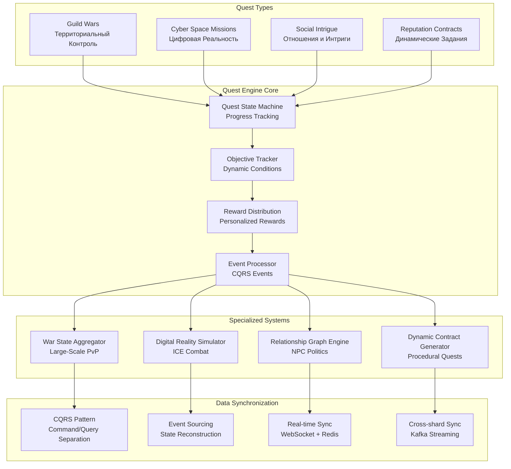
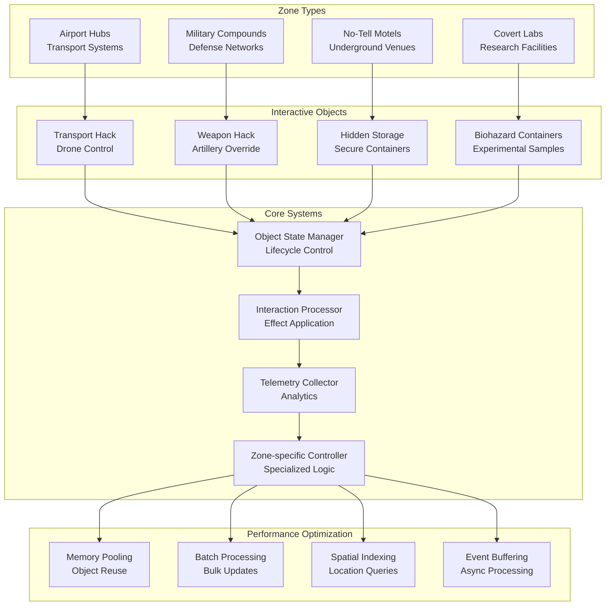
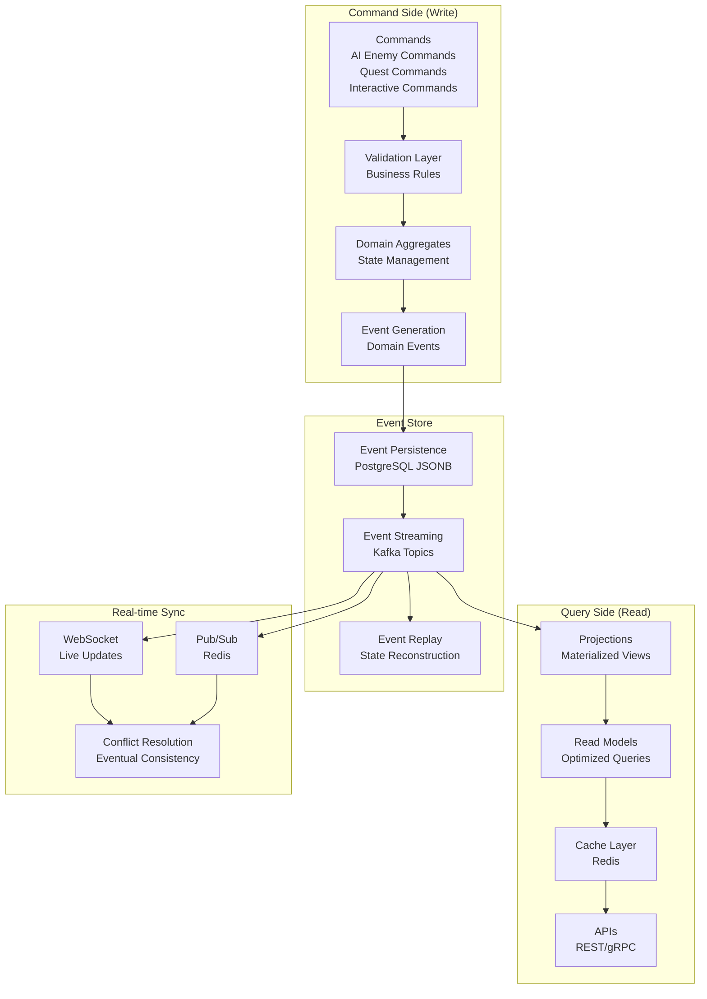
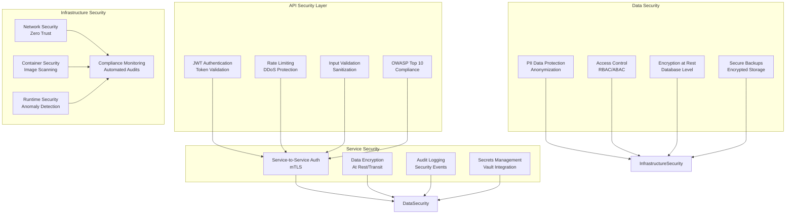
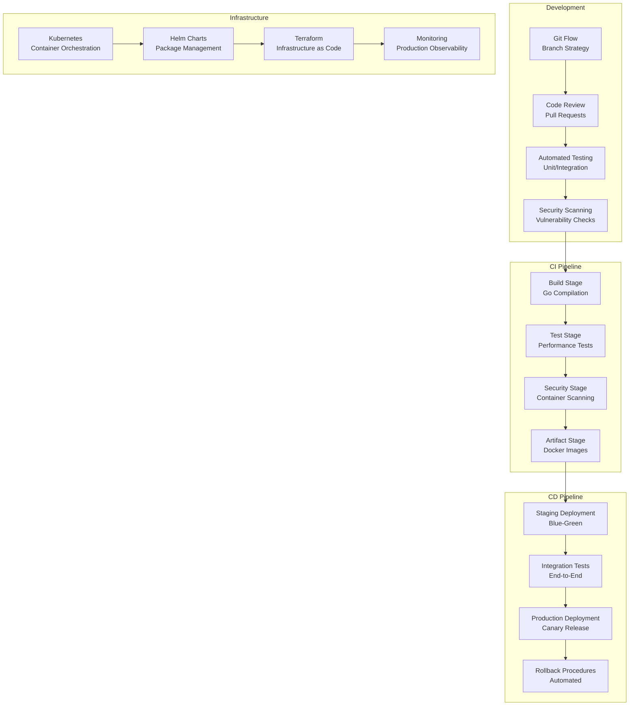

# Архитектурные Диаграммы: AI Враги и Новые Типы Квестов

## Общая Архитектура Систем

## AI Враги: Архитектура Систем

## Система Квестов: Event-Driven Architecture

## Интерактивные Объекты: Зональная Архитектура

## CQRS/Event Sourcing: Синхронизация Данных

## Масштабируемость и Производительность

```mermaid
graph TD
    subgraph "Horizontal Scaling"
        ZoneSharding[Zone-based Sharding<br/>Geographic Distribution]
        ServiceMesh[Service Mesh<br/>Load Balancing]
        HPA[Horizontal Pod Autoscaler<br/>Kubernetes]
        MultiRegion[Multi-region Deployment<br/>Global Distribution]
    end

    subgraph "Performance Optimization"
        MemoryPooling[Memory Pooling<br/>Object Reuse]
        ZeroAlloc[Zero-Allocations<br/>Hot Path Optimization]
        ConnectionPool[Connection Pooling<br/>Database Connections]
        CDNCaching[CDN + Caching<br/>Static Assets]
    end

    subgraph "Monitoring & Observability"
        Metrics[Metrics Collection<br/>Prometheus]
        Tracing[Distributed Tracing<br/>Jaeger]
        Logging[Structured Logging<br/>Loki]
        Alerting[Alerting<br/>Custom Rules]
    end

    subgraph "Resilience Patterns"
        CircuitBreaker[Circuit Breaker<br/>Failure Isolation]
        RetryLogic[Retry Logic<br/>Transient Failures]
        GracefulDegradation[Graceful Degradation<br/>Service Degradation]
        ChaosEngineering[Chaos Engineering<br/>Failure Testing]
    end

    ZoneSharding --> ServiceMesh
    ServiceMesh --> HPA
    HPA --> MultiRegion

    MemoryPooling --> ZeroAlloc
    ZeroAlloc --> ConnectionPool
    ConnectionPool --> CDNCaching

    Metrics --> Tracing
    Tracing --> Logging
    Logging --> Alerting

    CircuitBreaker --> RetryLogic
    RetryLogic --> GracefulDegradation
    GracefulDegradation --> ChaosEngineering
```

## Безопасность: Многоуровневая Архитектура

## Deployment и CI/CD

