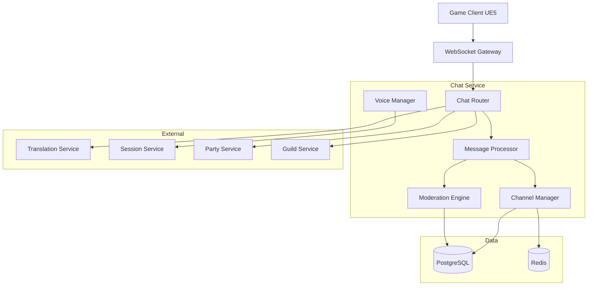
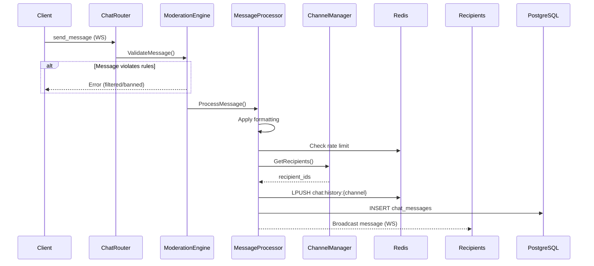
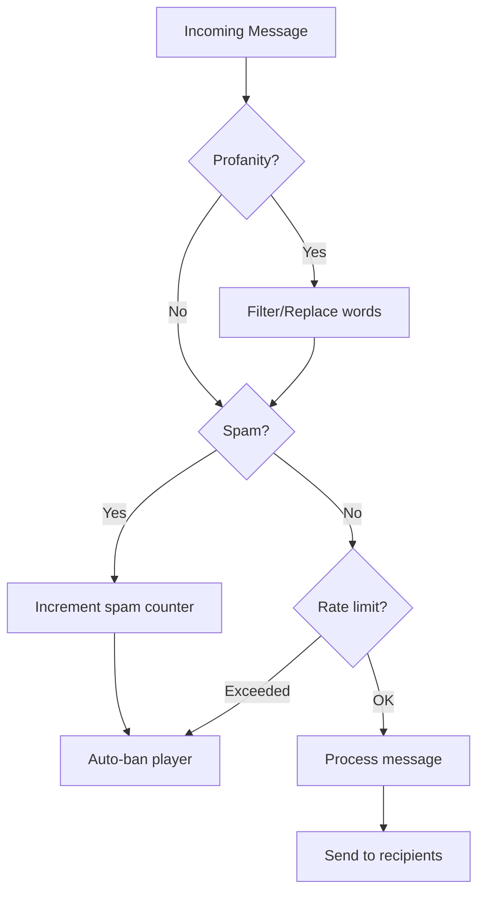

<!-- Issue: #172 -->

# Архитектура системы чата (Chat System)

## Метаданные

- **ID:** architecture-chat-system  
- **Версия:** 1.0.0
- **Дата:** 2025-12-02
- **Автор:** Architect Agent
- **Статус:** Draft
- **Теги:** architecture, chat, communication, social

## Краткое описание

Chat System обеспечивает текстовую и голосовую коммуникацию игроков через множественные каналы с поддержкой модерации, форматирования, переводов и истории сообщений.

## Связанные документы

- `knowledge/implementation/backend/chat/chat-features.yaml`
- `knowledge/implementation/backend/chat/chat-channels.yaml`
- `knowledge/implementation/backend/chat/chat-moderation.yaml`

---

## 1. Архитектурный обзор

### 1.1. Цели системы

1. **Многоканальная коммуникация** - 10+ типов каналов (global, local, party, guild, whisper)
2. **Real-time доставка** - WebSocket для мгновенных сообщений
3. **Модерация контента** - фильтры, анти-спам, баны
4. **Rich форматирование** - bold, italic, ссылки, emoji, @mentions
5. **Голосовой чат** - WebRTC для party/raid/guild
6. **Автоперевод** - поддержка множественных языков
7. **История сообщений** - хранение и поиск

### 1.2. Компоненты



---

## 2. Компоненты системы

### 2.1. Chat Service

**Технологии:** Go, WebSocket, gRPC, PostgreSQL, Redis, WebRTC

**Подкомпоненты:**

#### Chat Router
- Маршрутизация сообщений по каналам
- Определение получателей
- WebSocket broadcasting

#### Message Processor
- Обработка команд (/whisper, /party, etc.)
- Rich форматирование (bold, italic, links, emoji)
- Валидация сообщений

#### Channel Manager
- Управление каналами
- Права доступа (read/write)
- Подписка/отписка

#### Moderation Engine
- Profanity filter
- Spam detection
- Auto-ban система
- Жалобы игроков

#### Voice Manager
- WebRTC signaling
- Голосовые каналы
- Mute/unmute управление

### 2.2. Data Storage

#### PostgreSQL Schema

```sql
CREATE TABLE chat_channels (
    id UUID PRIMARY KEY,
    channel_type VARCHAR(50) NOT NULL,    -- 'global', 'local', 'party', etc.
    owner_id UUID,                         -- для guild/party каналов
    channel_name VARCHAR(255),
    max_message_length INTEGER DEFAULT 500,
    cooldown_seconds INTEGER DEFAULT 0,
    read_permission VARCHAR(50),
    write_permission VARCHAR(50),
    is_active BOOLEAN DEFAULT TRUE,
    created_at TIMESTAMP DEFAULT NOW()
);

CREATE TABLE chat_messages (
    id UUID PRIMARY KEY,
    channel_id UUID NOT NULL,
    sender_id UUID NOT NULL,
    message_text TEXT NOT NULL,
    formatted_text TEXT,                   -- после форматирования
    translation_cache JSONB,               -- {lang: translated_text}
    sent_at TIMESTAMP NOT NULL DEFAULT NOW()
);

CREATE INDEX idx_chat_messages_channel ON chat_messages(channel_id, sent_at DESC);

CREATE TABLE chat_bans (
    id UUID PRIMARY KEY,
    player_id UUID NOT NULL,
    channel_id UUID,                       -- NULL = global ban
    ban_type VARCHAR(50) NOT NULL,         -- 'chat', 'voice', 'all'
    reason TEXT,
    banned_by UUID,                        -- admin id
    banned_at TIMESTAMP NOT NULL DEFAULT NOW(),
    expires_at TIMESTAMP,                  -- NULL = permanent
    is_active BOOLEAN DEFAULT TRUE
);

CREATE INDEX idx_chat_bans_player ON chat_bans(player_id, is_active);
CREATE INDEX idx_chat_bans_expires ON chat_bans(expires_at) WHERE is_active = TRUE;
```

#### Redis

- `chat:channel:{channel_id}:subscribers` - подписчики канала (SET)
- `chat:history:{channel_id}` - последние 100 сообщений (LIST, TTL: 1 час)
- `chat:ratelimit:{player_id}:{channel}` - счётчик сообщений (TTL: 1 минута)
- `chat:spam:{player_id}` - детекция спама (TTL: 5 минут)

---

## 3. API Endpoints

### 3.1. WebSocket API

#### /ws/chat
**Подключение к чату**

**Incoming Messages:**
```json
{
  "type": "send_message",
  "channel": "global",
  "text": "Hello world!",
  "formatting": {"bold": [0, 5]}
}
```

**Outgoing Messages:**
```json
{
  "type": "message",
  "channel": "global",
  "sender_id": "uuid",
  "sender_name": "Player123",
  "text": "Hello world!",
  "formatted_text": "<b>Hello</b> world!",
  "sent_at": "2025-12-02T10:00:00Z"
}
```

### 3.2. REST API

#### GET /api/v1/chat/channels
**Список доступных каналов**

Response:
```json
{
  "channels": [
    {
      "id": "uuid",
      "type": "global",
      "name": "Global Chat",
      "can_read": true,
      "can_write": true,
      "cooldown": 5
    }
  ]
}
```

#### GET /api/v1/chat/history/{channel_id}
**История сообщений**

Parameters: `before_message_id`, `limit`

Response:
```json
{
  "messages": [...],
  "has_more": true
}
```

#### POST /api/v1/chat/report
**Пожаловаться на сообщение**

Request:
```json
{
  "message_id": "uuid",
  "reason": "spam"
}
```

#### POST /api/v1/chat/ban (Admin only)
**Забанить игрока**

Request:
```json
{
  "player_id": "uuid",
  "channel_id": "uuid",
  "ban_type": "chat",
  "reason": "Spam",
  "duration_hours": 24
}
```

### 3.3. Voice API

#### POST /api/v1/chat/voice/{channel_id}/join
**Присоединиться к голосовому каналу**

Response:
```json
{
  "webrtc_token": "...",
  "ice_servers": [...]
}
```

#### POST /api/v1/chat/voice/{channel_id}/mute
**Mute/unmute**

Request: `{"muted": true}`

---

## 4. Типы каналов

| Channel Type | Scope | Write Access | Cooldown | Max Length |
|--------------|-------|--------------|----------|------------|
| GLOBAL | Server-wide | All players | 5s | 500 |
| TRADE | Server-wide | All players | 10s | 300 |
| NEWBIE | Server-wide | Level < 20 | 3s | 500 |
| LOCAL | Zone | In same zone | 0s | 500 |
| PARTY | Party members | Party members | 0s | 1000 |
| RAID | Raid members | Raid members | 0s | 1000 |
| GUILD | Guild members | Guild members | 0s | 1000 |
| GUILD_OFFICER | Officers | Officers only | 0s | 2000 |
| WHISPER | 1-to-1 | Sender/recipient | 0s | 1000 |
| SYSTEM | Broadcast | System only | 0s | 2000 |
| COMBAT_LOG | Combat events | System only | 0s | 500 |

---

## 5. Потоки данных

### 5.1. Отправка сообщения



### 5.2. Модерация сообщения



---

## 6. Модерация

### 6.1. Profanity Filter

**Процесс:**
1. Проверка по словарю запрещённых слов
2. Замена на `***`
3. Whitelist для ссылок
4. Нормализация повторяющихся символов
5. Ограничение CAPS

### 6.2. Spam Detection

**Критерии:**
- \> 10 сообщений в минуту
- Идентичный текст 3+ раза подряд
- Длинные сообщения с повторениями

**Действия:**
- 1-е нарушение: предупреждение
- 2-е нарушение: 1 час бан
- 3-е нарушение: 24 часа бан
- 4-е нарушение: permanent ban

### 6.3. Auto-ban

**Автоматические баны за:**
- Severe profanity (расистские/угрозы)
- Спам (> 3 нарушений)
- Flood (> 20 сообщений в минуту)

---

## 7. Производительность

### 7.1. Метрики

- WebSocket latency: < 50ms
- Message delivery: < 100ms
- History query: < 200ms
- Throughput: 10,000+ messages/sec

### 7.2. Оптимизации

**Redis:**
- Кэш истории (100 последних сообщений)
- Rate limiting counters
- Spam detection counters

**PostgreSQL:**
- Партиционирование `chat_messages` по дате (ежедневно)
- Индексы на `channel_id` + `sent_at`
- Архивация старых сообщений (> 30 дней)

**WebSocket:**
- Connection pooling
- Message batching (каждые 50ms)
- Региональные кластеры

---

## 8. Разбиение на подзадачи

### 8.1. Database Schema (P0)
Схемы `chat_channels`, `chat_messages`, `chat_bans`
**Срок:** 1 неделя

### 8.2. WebSocket Server (P0)
WebSocket gateway для real-time сообщений
**Срок:** 2 недели

### 8.3. Channel Manager (P0)
Управление каналами и подписками
**Срок:** 1.5 недели

### 8.4. Message Processor (P0)
Обработка, форматирование, валидация
**Срок:** 2 недели

### 8.5. Moderation Engine (P0)
Фильтры, спам-детекция, баны
**Срок:** 2 недели

### 8.6. Voice Chat (WebRTC) (P1)
WebRTC signaling и управление
**Срок:** 3 недели

### 8.7. Translation Integration (P2)
Автоперевод сообщений
**Срок:** 1 неделя

### 8.8. History & Search (P2)
История и поиск по сообщениям
**Срок:** 1 неделя

---

## 9. Безопасность

### 9.1. Защита от злоупотреблений

- Rate limiting (10 msg/min для global, без лимитов для party)
- Profanity filter (словарь + whitelist URLs)
- Spam detection (частота + дубликаты)
- Auto-ban (progressive escalation)

### 9.2. Приватность

- Whisper сообщения зашифрованы
- История доступна только участникам
- Модераторы имеют доступ к истории

---

## 10. События

**Published:**
- `chat:message_sent`
- `chat:player_banned`
- `chat:channel_created`

**Subscribed:**
- `player:connected` - добавить в каналы
- `player:disconnected` - удалить из каналов
- `party:disbanded` - закрыть party chat

---

## 11. Критерии готовности

- [x] Архитектура спроектирована
- [x] Компоненты определены
- [x] Микросервисы идентифицированы
- [x] API endpoints описаны
- [x] Система каналов спроектирована
- [x] Система модерации спроектирована
- [x] Система форматирования спроектирована
- [x] Техническое задание готово

---

**Конец документа**


