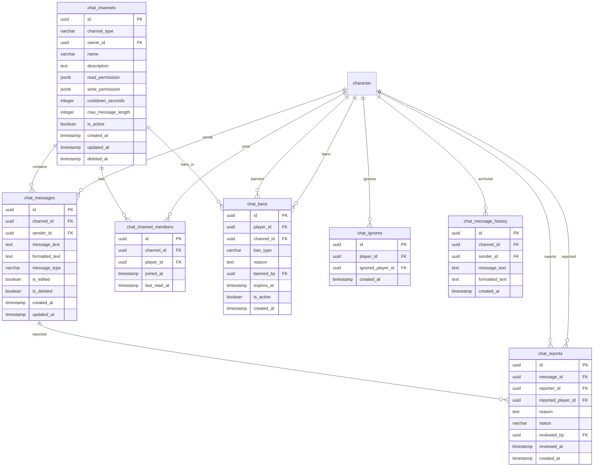

<!-- Issue: #140889577 -->
# Chat System - Database Schema

## Обзор

Схема базы данных для системы чата, включающая каналы, сообщения, участников, баны, жалобы, игнорируемых игроков и историю сообщений.

## ERD Диаграмма



## Описание таблиц

### chat_channels

Таблица каналов чата. Хранит информацию о каналах.

**Ключевые поля:**
- `id`: UUID первичный ключ
- `channel_type`: Тип канала (VARCHAR(50), NOT NULL)
- `owner_id`: ID владельца (FK к characters, nullable)
- `name`: Название канала (VARCHAR(200), NOT NULL)
- `description`: Описание канала (TEXT, nullable)
- `read_permission`: Права на чтение (JSONB, default: {})
- `write_permission`: Права на запись (JSONB, default: {})
- `cooldown_seconds`: Кулдаун в секундах (INTEGER, NOT NULL, default: 0)
- `max_message_length`: Максимальная длина сообщения (INTEGER, NOT NULL, default: 500)
- `is_active`: Активен ли канал (BOOLEAN, NOT NULL, default: true)
- `created_at`: Время создания
- `updated_at`: Время последнего обновления
- `deleted_at`: Время удаления (TIMESTAMP, nullable)

**Индексы:**
- По `(channel_type, is_active)` для активных каналов
- По `owner_id` для каналов владельца
- По `is_active` для активных каналов

### chat_messages

Таблица сообщений чата. Хранит информацию о сообщениях.

**Ключевые поля:**
- `id`: UUID первичный ключ
- `channel_id`: ID канала (FK к chat_channels, NOT NULL)
- `channel_type`: Тип канала (VARCHAR(50), NOT NULL) - legacy поле
- `sender_id`: ID отправителя (FK к characters, NOT NULL)
- `message_text`: Текст сообщения (TEXT, NOT NULL)
- `formatted_text`: Отформатированный текст (TEXT, nullable)
- `message_type`: Тип сообщения (VARCHAR(20), NOT NULL, default: 'text': 'text', 'system', 'emote', 'command')
- `is_edited`: Отредактировано ли сообщение (BOOLEAN, NOT NULL, default: false)
- `is_deleted`: Удалено ли сообщение (BOOLEAN, NOT NULL, default: false)
- `created_at`: Время создания
- `updated_at`: Время последнего обновления
- `deleted_at`: Время удаления (TIMESTAMP, nullable) - legacy поле

**Индексы:**
- По `(channel_id, created_at DESC)` для сообщений канала
- По `(sender_id, created_at DESC)` для сообщений отправителя
- По `created_at DESC` для последних сообщений

### chat_channel_members

Таблица участников каналов. Хранит информацию об участниках каналов.

**Ключевые поля:**
- `id`: UUID первичный ключ
- `channel_id`: ID канала (FK к chat_channels, NOT NULL)
- `player_id`: ID игрока (FK к characters, NOT NULL)
- `joined_at`: Время присоединения
- `last_read_at`: Время последнего прочитанного сообщения (TIMESTAMP, nullable)

**Индексы:**
- По `channel_id` для участников канала
- По `player_id` для каналов игрока

**Constraints:**
- UNIQUE(channel_id, player_id): Один участник на канал

### chat_bans

Таблица банов в чате. Хранит информацию о банах.

**Ключевые поля:**
- `id`: UUID первичный ключ
- `player_id`: ID забаненного игрока (FK к characters, NOT NULL)
- `channel_id`: ID канала (FK к chat_channels, nullable)
- `ban_type`: Тип бана (VARCHAR(20), NOT NULL, default: 'channel': 'channel', 'global')
- `reason`: Причина бана (TEXT, NOT NULL)
- `banned_by`: ID администратора (FK к characters, nullable)
- `expires_at`: Время истечения бана (TIMESTAMP, nullable)
- `is_active`: Активен ли бан (BOOLEAN, NOT NULL, default: true)
- `created_at`: Время создания

**Индексы:**
- По `(player_id, is_active)` для активных банов игрока
- По `(channel_id, is_active)` для активных банов канала
- По `expires_at` для истекающих банов

### chat_reports

Таблица жалоб на сообщения. Хранит информацию о жалобах.

**Ключевые поля:**
- `id`: UUID первичный ключ
- `message_id`: ID сообщения (FK к chat_messages, nullable)
- `channel_id`: ID канала (FK к chat_channels, nullable)
- `reporter_id`: ID жалобщика (FK к characters, NOT NULL)
- `reported_player_id`: ID игрока, на которого пожаловались (FK к characters, NOT NULL)
- `reason`: Причина жалобы (TEXT, NOT NULL)
- `status`: Статус жалобы (VARCHAR(20), NOT NULL, default: 'pending': 'pending', 'reviewed', 'resolved', 'dismissed')
- `reviewed_by`: ID администратора (FK к characters, nullable)
- `reviewed_at`: Время рассмотрения (TIMESTAMP, nullable)
- `created_at`: Время создания

**Индексы:**
- По `message_id` для жалоб на сообщение
- По `reporter_id` для жалоб жалобщика
- По `(status, created_at DESC)` для необработанных жалоб

### chat_ignores

Таблица игнорируемых игроков. Хранит информацию об игнорируемых игроках.

**Ключевые поля:**
- `id`: UUID первичный ключ
- `player_id`: ID игрока (FK к characters, NOT NULL)
- `ignored_player_id`: ID игнорируемого игрока (FK к characters, NOT NULL)
- `created_at`: Время создания

**Индексы:**
- По `player_id` для игнорируемых игроком
- По `ignored_player_id` для игроков, которые игнорируют

**Constraints:**
- UNIQUE(player_id, ignored_player_id): Один игнорируемый игрок на игрока
- CHECK (player_id != ignored_player_id): Игрок не может игнорировать себя

### chat_message_history

Таблица истории сообщений (архив). Хранит архивные сообщения.

**Ключевые поля:**
- `id`: UUID первичный ключ
- `channel_id`: ID канала (FK к chat_channels, NOT NULL)
- `sender_id`: ID отправителя (FK к characters, NOT NULL)
- `message_text`: Текст сообщения (TEXT, NOT NULL)
- `formatted_text`: Отформатированный текст (TEXT, nullable)
- `created_at`: Время создания

**Индексы:**
- По `(channel_id, created_at DESC)` для истории канала
- По `(sender_id, created_at DESC)` для истории отправителя

## ENUM типы

### chat_channel_type
- `GLOBAL`: Глобальный чат сервера
- `TRADE`: Торговый чат
- `NEWBIE`: Чат для новичков
- `LOCAL`: Локальный чат (зона/инстанс)
- `PARTY`: Чат группы
- `RAID`: Чат рейда
- `GUILD`: Чат гильдии
- `GUILD_OFFICER`: Чат офицеров гильдии
- `WHISPER`: Приватные сообщения
- `SYSTEM`: Системные сообщения
- `COMBAT_LOG`: Боевой лог
- `RP_EMOTE`: Ролевые эмоции

### chat_message_type
- `text`: Текстовое сообщение
- `system`: Системное сообщение
- `emote`: Эмоция
- `command`: Команда

### chat_ban_type
- `channel`: Бан в канале
- `global`: Глобальный бан

### chat_report_status
- `pending`: Ожидает рассмотрения
- `reviewed`: Рассмотрено
- `resolved`: Решено
- `dismissed`: Отклонено

## Constraints и валидация

### CHECK Constraints

- `chat_channels.max_message_length > 0`: Максимальная длина сообщения должна быть > 0
- `chat_messages.message_type`: Должно быть одним из: 'text', 'system', 'emote', 'command'
- `chat_bans.ban_type`: Должно быть одним из: 'channel', 'global'
- `chat_reports.status`: Должно быть одним из: 'pending', 'reviewed', 'resolved', 'dismissed'
- `chat_ignores.player_id != ignored_player_id`: Игрок не может игнорировать себя

### Foreign Keys

- `chat_channels.owner_id` → `mvp_core.character.id` (ON DELETE SET NULL)
- `chat_messages.channel_id` → `social.chat_channels.id` (ON DELETE CASCADE)
- `chat_messages.sender_id` → `mvp_core.character(id)` (ON DELETE CASCADE)
- `chat_channel_members.channel_id` → `social.chat_channels.id` (ON DELETE CASCADE)
- `chat_channel_members.player_id` → `mvp_core.character.id` (ON DELETE CASCADE)
- `chat_bans.player_id` → `mvp_core.character.id` (ON DELETE CASCADE)
- `chat_bans.channel_id` → `social.chat_channels.id` (ON DELETE CASCADE)
- `chat_bans.banned_by` → `mvp_core.character.id` (ON DELETE SET NULL)
- `chat_reports.message_id` → `social.chat_messages.id` (ON DELETE SET NULL)
- `chat_reports.channel_id` → `social.chat_channels.id` (ON DELETE SET NULL)
- `chat_reports.reporter_id` → `mvp_core.character.id` (ON DELETE CASCADE)
- `chat_reports.reported_player_id` → `mvp_core.character.id` (ON DELETE CASCADE)
- `chat_reports.reviewed_by` → `mvp_core.character.id` (ON DELETE SET NULL)
- `chat_ignores.player_id` → `mvp_core.character.id` (ON DELETE CASCADE)
- `chat_ignores.ignored_player_id` → `mvp_core.character.id` (ON DELETE CASCADE)
- `chat_message_history.channel_id` → `social.chat_channels.id` (ON DELETE CASCADE)
- `chat_message_history.sender_id` → `mvp_core.character.id` (ON DELETE CASCADE)

### Unique Constraints

- `chat_channel_members(channel_id, player_id)`: Один участник на канал
- `chat_ignores(player_id, ignored_player_id)`: Один игнорируемый игрок на игрока

## Оптимизация запросов

### Частые запросы

1. **Получение сообщений канала:**
   ```sql
   SELECT * FROM social.chat_messages 
   WHERE channel_id = $1 AND is_deleted = false 
   ORDER BY created_at DESC 
   LIMIT 50;
   ```
   Использует индекс `(channel_id, created_at DESC)`.

2. **Получение участников канала:**
   ```sql
   SELECT * FROM social.chat_channel_members 
   WHERE channel_id = $1;
   ```
   Использует индекс `channel_id`.

3. **Получение каналов игрока:**
   ```sql
   SELECT c.* FROM social.chat_channels c
   JOIN social.chat_channel_members cm ON c.id = cm.channel_id
   WHERE cm.player_id = $1 AND c.is_active = true;
   ```
   Использует индекс `player_id`.

4. **Получение активных банов игрока:**
   ```sql
   SELECT * FROM social.chat_bans 
   WHERE player_id = $1 AND is_active = true 
   AND (expires_at IS NULL OR expires_at > CURRENT_TIMESTAMP);
   ```
   Использует индекс `(player_id, is_active)`.

5. **Получение необработанных жалоб:**
   ```sql
   SELECT * FROM social.chat_reports 
   WHERE status = 'pending' 
   ORDER BY created_at DESC 
   LIMIT 50;
   ```
   Использует индекс `(status, created_at DESC)`.

## Миграции

### Существующие миграции:
- `V1_10__chat_tables.sql` - базовые таблицы (chat_channels, chat_messages, chat_bans)
- `V1_25__chat_moderation_tables.sql` - таблица жалоб (chat_reports)
- `V1_67__chat_system_enhancement.sql` - расширенные таблицы и поля

### Применение миграций:
```bash
liquibase update --changelog-file=infrastructure/liquibase/changelog.yaml
```

## Соответствие архитектуре

Схема БД полностью соответствует архитектуре из `knowledge/implementation/architecture/chat-system-architecture.yaml`:
- OK Все таблицы из архитектуры созданы
- OK Все поля соответствуют описанию
- OK Индексы оптимизированы для частых запросов
- OK Constraints обеспечивают целостность данных
- OK Foreign Keys настроены с CASCADE/SET NULL для автоматической очистки
- OK Интеграция с существующими таблицами (characters)

## Особенности реализации

### Каналы

Система каналов включает:
- **Типы каналов**: GLOBAL, TRADE, NEWBIE, LOCAL, PARTY, RAID, GUILD, GUILD_OFFICER, WHISPER, SYSTEM, COMBAT_LOG, RP_EMOTE
- **Права доступа**: read_permission и write_permission (JSONB) для гибкой системы прав
- **Кулдаун**: cooldown_seconds для ограничения частоты сообщений
- **Длина сообщений**: max_message_length для ограничения размера
- **Мягкое удаление**: deleted_at для восстановления каналов

### Сообщения

Система сообщений включает:
- **Типы сообщений**: text, system, emote, command
- **Форматирование**: formatted_text для отформатированного текста
- **Редактирование**: is_edited для отслеживания редактированных сообщений
- **Мягкое удаление**: is_deleted для восстановления сообщений
- **Временные метки**: created_at и updated_at для отслеживания изменений

### Участники

Система участников включает:
- **Присоединение**: joined_at для отслеживания времени присоединения
- **Чтение**: last_read_at для отслеживания последнего прочитанного сообщения
- **Уникальность**: один участник на канал

### Баны

Система банов включает:
- **Типы банов**: channel (в канале) и global (глобальный)
- **Временные баны**: expires_at для автоматического снятия
- **Причины**: reason для детализации бана
- **Администраторы**: banned_by для отслеживания выдавшего бан
- **Активность**: is_active для управления банами

### Жалобы

Система жалоб включает:
- **Статусы**: pending, reviewed, resolved, dismissed
- **Рассмотрение**: reviewed_by и reviewed_at для отслеживания рассмотрения
- **Привязка**: message_id и channel_id для контекста
- **Причины**: reason для детализации жалобы

### Игнорирование

Система игнорирования включает:
- **Уникальность**: один игнорируемый игрок на игрока
- **Защита**: игрок не может игнорировать себя
- **Временные метки**: created_at для отслеживания времени

### История

Система истории включает:
- **Архивация**: долгосрочное хранение сообщений
- **Поиск**: индексы для быстрого поиска по каналам и отправителям
- **Форматирование**: сохранение отформатированного текста

### Интеграция с другими системами

Система чата интегрируется с:
- **Characters**: через sender_id, player_id для участников и отправителей
- **Parties**: через channel_type для групповых каналов
- **Guilds**: через channel_type для гильдейских каналов
- **World Service**: через channel_type для локальных каналов
- **Moderation Service**: через chat_bans и chat_reports для модерации
- **Notification Service**: через события для уведомлений


