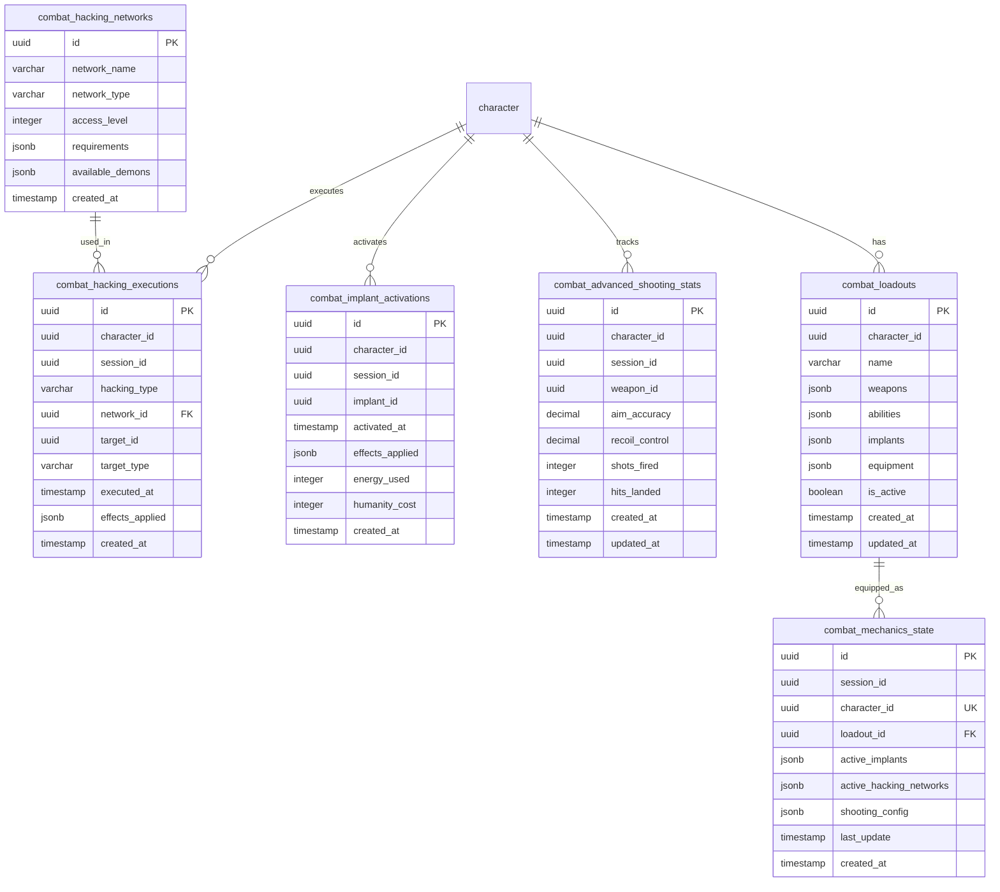

<!-- Issue: #140875781 -->
# Combat Extended Mechanics - Database Schema

## Обзор

Схема базы данных для расширенных механик боевой системы, включающая взлом в бою, активации имплантов, продвинутую стрельбу, лоадауты и состояние всех механик.

## ERD Диаграмма



## Описание таблиц

### combat_hacking_executions

Таблица выполнений взлома в бою. Хранит информацию о взломах, выполненных игроками во время боевых сессий.

**Ключевые поля:**
- `hacking_type`: Тип взлома (VARCHAR(100))
- `network_id`: ID сети для взлома (UUID, nullable)
- `target_id`: ID цели взлома (UUID, nullable)
- `target_type`: Тип цели (player, npc, device, infrastructure)
- `effects_applied`: JSONB эффекты взлома `{damage, debuff, control, etc.}`

**Индексы:**
- По `character_id` для поиска взломов игрока
- По `session_id` для поиска взломов в сессии
- Композитный индекс `(character_id, session_id)` для оптимизации запросов

### combat_hacking_networks

Таблица сетей для взлома. Хранит информацию о доступных сетях для взлома в боевых сценариях.

**Ключевые поля:**
- `network_name`: Название сети
- `network_type`: Тип сети (enemy, device, infrastructure, combat_scenario)
- `access_level`: Уровень доступа (INTEGER)
- `available_demons`: JSONB доступные демоны для взлома

**Индексы:**
- По `network_type` для фильтрации по типу сети
- По `access_level` для поиска по уровню доступа

### combat_implant_activations

Таблица активаций имплантов в бою. Хранит информацию о активациях имплантов во время боевых сессий.

**Ключевые поля:**
- `implant_id`: ID импланта (UUID)
- `effects_applied`: JSONB эффекты импланта `{buffs, debuffs, abilities, etc.}`
- `energy_used`: Потраченная энергия (INTEGER)
- `humanity_cost`: Стоимость человечности за активацию (INTEGER)

**Индексы:**
- По `character_id` для поиска активаций игрока
- По `session_id` для поиска активаций в сессии
- По `implant_id` для поиска по типу импланта
- Композитный индекс `(character_id, session_id)` для оптимизации запросов

### combat_advanced_shooting_stats

Таблица статистики продвинутой стрельбы. Хранит информацию о прицеливании, отдаче и точности стрельбы.

**Ключевые поля:**
- `weapon_id`: ID оружия (UUID)
- `aim_accuracy`: Точность прицеливания (0-100%, DECIMAL(5,2))
- `recoil_control`: Контроль отдачи (0-100%, DECIMAL(5,2))
- `shots_fired`: Количество выстрелов (INTEGER)
- `hits_landed`: Количество попаданий (INTEGER)

**Индексы:**
- По `character_id` для поиска статистики игрока
- По `session_id` для поиска статистики в сессии
- По `weapon_id` для поиска по оружию
- Композитный индекс `(character_id, session_id)` для оптимизации запросов

### combat_loadouts

Таблица лоадаутов боевой системы. Хранит информацию о конфигурациях оружия, способностей, имплантов и экипировки.

**Ключевые поля:**
- `name`: Название лоадаута (VARCHAR(255))
- `weapons`: JSONB оружие `[{weapon_id, attachments, mods}, ...]`
- `abilities`: JSONB способности `[{ability_id, level, mods}, ...]`
- `implants`: JSONB импланты `[{implant_id, level, mods}, ...]`
- `equipment`: JSONB экипировка `[{item_id, slot, mods}, ...]`
- `is_active`: Флаг активного лоадаута (BOOLEAN)

**Индексы:**
- По `character_id` для поиска лоадаутов игрока
- По `is_active` для фильтрации активных лоадаутов
- Композитный индекс `(character_id, is_active)` для оптимизации запросов

### combat_mechanics_state

Таблица состояния всех механик в боевой сессии. Хранит объединенное состояние всех расширенных механик для оркестрации.

**Ключевые поля:**
- `session_id`: ID боевой сессии (UUID)
- `character_id`: ID персонажа (UUID)
- `loadout_id`: ID активного лоадаута (UUID, nullable)
- `active_implants`: JSONB активные импланты `[{implant_id, effects, energy}, ...]`
- `active_hacking_networks`: JSONB активные сети `[{network_id, access_level, demons}, ...]`
- `shooting_config`: JSONB конфигурация стрельбы `{aim_sensitivity, recoil_pattern, etc.}`

**Индексы:**
- Уникальный индекс `(session_id, character_id)` - одно состояние на персонажа в сессии
- По `session_id` для поиска состояний в сессии
- По `character_id` для поиска состояний персонажа
- По `loadout_id` для поиска по лоадауту

## Constraints и валидация

### CHECK Constraints

- `combat_hacking_executions.target_type`: Допустимые значения: 'player', 'npc', 'device', 'infrastructure'
- `combat_hacking_networks.network_type`: Допустимые значения: 'enemy', 'device', 'infrastructure', 'combat_scenario'
- `combat_advanced_shooting_stats.aim_accuracy`: Диапазон 0-100
- `combat_advanced_shooting_stats.recoil_control`: Диапазон 0-100

### Unique Constraints

- `combat_mechanics_state(session_id, character_id)`: Одно состояние на персонажа в сессии

## Оптимизация запросов

### Частые запросы

1. **Получение состояния механик в сессии:**
   ```sql
   SELECT * FROM combat_mechanics_state 
   WHERE session_id = $1 AND character_id = $2;
   ```
   Использует уникальный индекс `(session_id, character_id)`.

2. **Получение активного лоадаута персонажа:**
   ```sql
   SELECT * FROM combat_loadouts 
   WHERE character_id = $1 AND is_active = true;
   ```
   Использует композитный индекс `(character_id, is_active)`.

3. **Получение активаций имплантов в сессии:**
   ```sql
   SELECT * FROM combat_implant_activations 
   WHERE session_id = $1 AND character_id = $2;
   ```
   Использует композитный индекс `(character_id, session_id)`.

4. **Получение статистики стрельбы:**
   ```sql
   SELECT * FROM combat_advanced_shooting_stats 
   WHERE character_id = $1 AND session_id = $2;
   ```
   Использует композитный индекс `(character_id, session_id)`.

### Партиционирование

Для больших объемов данных рекомендуется партиционирование:
- По `created_at` для таблиц логов (combat_hacking_executions, combat_implant_activations)
- По `session_id` для таблиц состояний (combat_mechanics_state)

## Миграция

Миграция создана в файле: `infrastructure/liquibase/migrations/V1_49__combat_extended_mechanics_tables.sql`

Для применения миграции:
```bash
liquibase update --changelog-file=infrastructure/liquibase/changelog.yaml
```

## Соответствие архитектуре

Схема БД полностью соответствует архитектуре из `knowledge/implementation/architecture/combat-extended-mechanics-architecture.yaml`:
- OK Все таблицы из архитектуры созданы
- OK Все поля соответствуют описанию
- OK Индексы оптимизированы для частых запросов
- OK Constraints обеспечивают целостность данных
- OK Поддержка JSONB для гибкого хранения конфигураций

## Особенности реализации

### JSONB поля

Использование JSONB для гибкого хранения:
- `effects_applied`: Эффекты взлома/имплантов
- `available_demons`: Доступные демоны для взлома
- `weapons`, `abilities`, `implants`, `equipment`: Конфигурации лоадаутов
- `active_implants`, `active_hacking_networks`, `shooting_config`: Состояние механик

### Отношения между таблицами

- `combat_hacking_executions.network_id` → `combat_hacking_networks.id` (опциональная связь)
- `combat_mechanics_state.loadout_id` → `combat_loadouts.id` (опциональная связь)
- Все таблицы связаны через `character_id` и `session_id` для объединения данных


