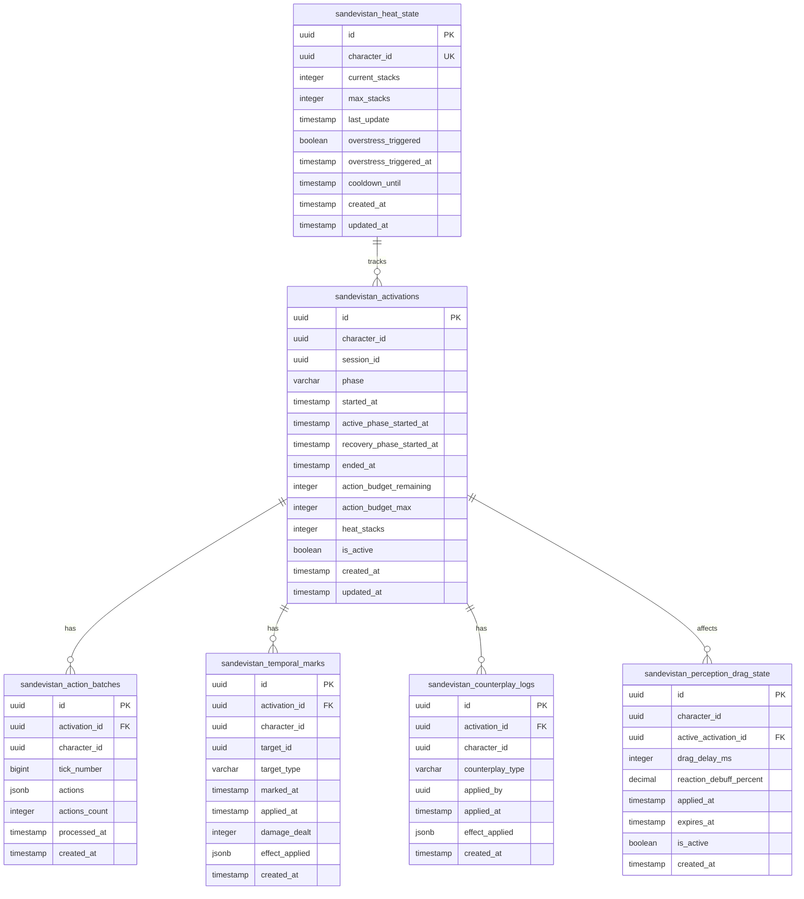

<!-- Issue: #140875766 -->
# Sandevistan Temporal Overdrive - Database Schema

## Обзор

Схема базы данных для системы Sandevistan Temporal Overdrive, реализующей эффект замедления времени для конкретного игрока в MMO без изменения серверного тайминга.

## ERD Диаграмма



## Описание таблиц

### sandevistan_activations

Основная таблица активаций Sandevistan. Хранит информацию о фазах активации (подготовка, активная, рекуперация), Action Priority Budget и уровне перегрева.

**Ключевые поля:**
- `phase`: Фаза активации (preparation, active, recovery)
- `action_budget_remaining`: Оставшийся Action Priority Budget (максимум 3 действия за тик)
- `heat_stacks`: Текущий уровень перегрева (0-4, при 4 - overstress)
- `is_active`: Флаг активной активации

**Индексы:**
- По `character_id` для быстрого поиска активаций игрока
- По `is_active` для фильтрации активных активаций
- Композитный индекс `(character_id, is_active)` для оптимизации частых запросов

### sandevistan_action_batches

Таблица батчей действий в MicroTick Window. Хранит до 3 действий, собранных на клиенте и отправленных батчем.

**Ключевые поля:**
- `actions`: JSONB массив действий `[{type, target_id, position, timestamp}, ...]`
- `actions_count`: Количество действий в батче (1-3)
- `tick_number`: Номер серверного тика

**Индексы:**
- По `activation_id` для связи с активацией
- По `tick_number` для временных запросов

### sandevistan_temporal_marks

Таблица Temporal Marks целей. Хранит до 3 целей, помеченных во время активной фазы для delayed burst эффектов.

**Ключевые поля:**
- `target_id`: ID цели (игрок, NPC, враг)
- `target_type`: Тип цели (player, npc, enemy)
- `effect_applied`: JSONB эффект `{damage, neuroshock_duration, aim_sway}`

**Индексы:**
- По `activation_id` для связи с активацией
- По `target_id` для поиска меток цели
- Композитный индекс `(activation_id, applied_at)` для не примененных меток

### sandevistan_heat_state

Таблица состояния перегрева. Хранит текущий уровень перегрева игрока и информацию о срабатывании overstress.

**Ключевые поля:**
- `current_stacks`: Текущий уровень перегрева (0-4)
- `overstress_triggered`: Флаг срабатывания overstress (потеря 30% HP, неконтролируемый рывок)
- `cooldown_until`: Время окончания кулдауна после overstress

**Индексы:**
- Уникальный индекс по `character_id` (один игрок - одно состояние)
- По `current_stacks` для фильтрации по уровню перегрева
- По `cooldown_until` для проверки активных кулдаунов

### sandevistan_counterplay_logs

Таблица логов контрплея. Хранит информацию о применении контрплея (EMP, Chrono-Jammer, hacking, crowd-control).

**Ключевые поля:**
- `counterplay_type`: Тип контрплея (emp, chrono-jammer, hacking, crowd-control)
- `applied_by`: ID игрока, применившего контрплей
- `effect_applied`: JSONB эффект контрплея

**Индексы:**
- По `activation_id` для связи с активацией
- По `counterplay_type` для фильтрации по типу контрплея
- По `applied_by` для поиска контрплея от конкретного игрока

### sandevistan_perception_drag_state

Таблица состояния Perception Drag для противников. Хранит информацию о клиентском debuff восприятия и серверном debuff реакции.

**Ключевые поля:**
- `drag_delay_ms`: Клиентская задержка отображения анимаций (до 120 мс)
- `reaction_debuff_percent`: Серверный debuff реакции (+15% к глобальному кулдауну)
- `expires_at`: Время окончания эффекта

**Индексы:**
- По `character_id` для поиска эффектов на игроке
- По `is_active` для фильтрации активных эффектов
- По `expires_at` для очистки истекших эффектов

## Constraints и валидация

### CHECK Constraints

- `sandevistan_activations.phase`: Допустимые значения: 'preparation', 'active', 'recovery'
- `sandevistan_activations.heat_stacks`: Диапазон 0-4
- `sandevistan_action_batches.actions_count`: Диапазон 1-3
- `sandevistan_temporal_marks.target_type`: Допустимые значения: 'player', 'npc', 'enemy'
- `sandevistan_heat_state.current_stacks`: Диапазон 0-4
- `sandevistan_counterplay_logs.counterplay_type`: Допустимые значения: 'emp', 'chrono-jammer', 'hacking', 'crowd-control'
- `sandevistan_perception_drag_state.drag_delay_ms`: Диапазон 0-120
- `sandevistan_perception_drag_state.reaction_debuff_percent`: Диапазон 0-100

### Foreign Keys

- `sandevistan_action_batches.activation_id` → `sandevistan_activations.id` (ON DELETE CASCADE)
- `sandevistan_temporal_marks.activation_id` → `sandevistan_activations.id` (ON DELETE CASCADE)
- `sandevistan_counterplay_logs.activation_id` → `sandevistan_activations.id` (ON DELETE CASCADE)
- `sandevistan_perception_drag_state.active_activation_id` → `sandevistan_activations.id` (ON DELETE CASCADE)

### Unique Constraints

- `sandevistan_heat_state.character_id`: Один игрок - одно состояние перегрева

## Оптимизация запросов

### Частые запросы

1. **Получение активной активации игрока:**
   ```sql
   SELECT * FROM sandevistan_activations 
   WHERE character_id = $1 AND is_active = true;
   ```
   Использует композитный индекс `(character_id, is_active)`.

2. **Получение не примененных Temporal Marks:**
   ```sql
   SELECT * FROM sandevistan_temporal_marks 
   WHERE activation_id = $1 AND applied_at IS NULL;
   ```
   Использует композитный индекс `(activation_id, applied_at)`.

3. **Получение активных Perception Drag эффектов:**
   ```sql
   SELECT * FROM sandevistan_perception_drag_state 
   WHERE character_id = $1 AND is_active = true AND expires_at > NOW();
   ```
   Использует индексы по `character_id`, `is_active` и `expires_at`.

### Партиционирование

Для больших объемов данных рекомендуется партиционирование по `created_at`:
- По месяцам для таблиц логов (`sandevistan_action_batches`, `sandevistan_counterplay_logs`)
- По дням для таблиц состояний (`sandevistan_perception_drag_state`)

## Миграция

Миграция создана в файле: `infrastructure/liquibase/migrations/V1_47__sandevistan_tables.sql`

Для применения миграции:
```bash
liquibase update --changelog-file=infrastructure/liquibase/changelog.yaml
```

## Соответствие архитектуре

Схема БД полностью соответствует архитектуре из `knowledge/implementation/architecture/combat-sandevistan-temporal-overdrive-architecture.yaml`:
- [OK] Все таблицы из архитектуры созданы
- [OK] Все поля соответствуют описанию
- [OK] Индексы оптимизированы для частых запросов
- [OK] Constraints обеспечивают целостность данных
- [OK] Foreign Keys настроены с CASCADE для автоматической очистки

## Соответствие OpenAPI

Схема БД соответствует OpenAPI спецификации из `proto/openapi/combat-sandevistan-service.yaml`:
- [OK] Все поля API могут быть отображены из БД
- [OK] JSONB поля соответствуют структурам из схем
- [OK] Типы данных совместимы с PostgreSQL


