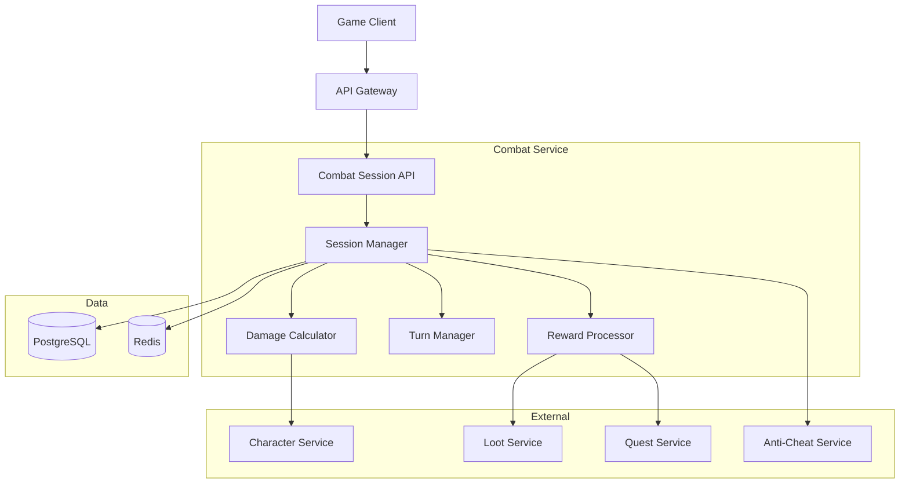
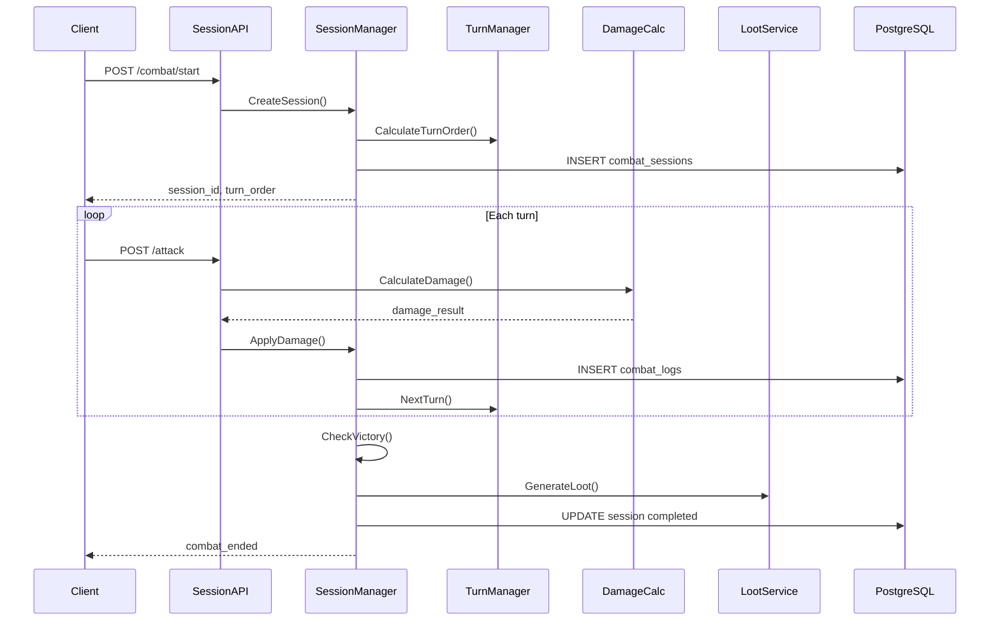

<!-- Issue: #130 -->

# Архитектура системы боевых сессий (Combat Session System)

## Метаданные

- **ID:** architecture-combat-session-system
- **Версия:** 1.0.0
- **Дата:** 2025-12-02
- **Автор:** Architect Agent
- **Статус:** Draft
- **Теги:** architecture, combat, gameplay, sessions

## Краткое описание

Combat Session System управляет боевыми сессиями, обработкой атак, расчётом урона, порядком ходов и выдачей наград после окончания боя.

## Связанные документы

- `knowledge/implementation/backend/combat-session-backend.yaml`

---

## 1. Архитектурный обзор

### 1.1. Цели

1. **Управление боями** - создание, завершение, отмена сессий
2. **Turn-based система** - порядок ходов, таймауты
3. **Расчёт урона** - учёт брони, модификаторов, критов
4. **PvE и PvP** - поддержка обоих режимов
5. **Награды** - выдача лута, опыта, валюты

### 1.2. Компоненты



---

## 2. Компоненты

### 2.1. Combat Service (в Gameplay Service)

**Технологии:** Go, gRPC, REST, PostgreSQL, Redis

**Подкомпоненты:**

#### Session Manager
- Создание/завершение сессий
- Управление участниками
- Состояние боя
- Event publishing

#### Turn Manager
- Определение порядка ходов (инициатива)
- Таймауты ходов
- Переключение ходов

#### Damage Calculator
- Расчёт физического урона
- Расчёт магического урона
- Критические удары
- Модификаторы (buffs/debuffs)

#### Reward Processor
- Выдача опыта
- Генерация лута
- Обновление квестов
- Валютные награды

### 2.2. Data Storage

#### PostgreSQL

```sql
CREATE TABLE combat_sessions (
    id UUID PRIMARY KEY,
    session_type VARCHAR(50) NOT NULL,    -- 'pve', 'pvp', 'boss'
    participants JSONB NOT NULL,          -- [{entity_id, type, team, hp, ...}, ...]
    turn_order JSONB NOT NULL,            -- [entity_id, ...]
    current_turn INTEGER DEFAULT 0,
    round_number INTEGER DEFAULT 1,
    session_status VARCHAR(50) NOT NULL,  -- 'active', 'completed', 'cancelled'
    location_id UUID,
    started_at TIMESTAMP NOT NULL DEFAULT NOW(),
    ended_at TIMESTAMP,
    winner_team VARCHAR(50)
);

CREATE INDEX idx_combat_session_status ON combat_sessions(session_status);
CREATE INDEX idx_combat_location ON combat_sessions(location_id, session_status);

CREATE TABLE combat_logs (
    id BIGSERIAL PRIMARY KEY,
    session_id UUID NOT NULL REFERENCES combat_sessions(id),
    round_number INTEGER NOT NULL,
    turn_number INTEGER NOT NULL,
    actor_id UUID NOT NULL,
    action_type VARCHAR(50) NOT NULL,     -- 'attack', 'ability', 'item', 'flee'
    target_id UUID,
    damage_dealt INTEGER,
    healing_done INTEGER,
    effects_applied JSONB,
    timestamp TIMESTAMP NOT NULL DEFAULT NOW()
);

CREATE INDEX idx_combat_logs_session ON combat_logs(session_id, round_number);
```

#### Redis

- `combat:session:{id}:state` - текущее состояние боя (TTL: 1 час)
- `combat:turn:{id}` - таймер хода (TTL: 30 секунд)
- `combat:active:{player_id}` - активная боевая сессия игрока

---

## 3. API Endpoints

### 3.1. Session Management

#### POST /api/v1/gameplay/combat/start
**Начать бой**

Request:
```json
{
  "session_type": "pve",
  "participants": [
    {"entity_id": "player_uuid", "type": "player"},
    {"entity_id": "enemy_001", "type": "npc"}
  ],
  "location_id": "uuid"
}
```

Response:
```json
{
  "session_id": "uuid",
  "turn_order": ["player_uuid", "enemy_001"],
  "current_turn": 0
}
```

#### GET /api/v1/gameplay/combat/{session_id}/state
**Получить состояние боя**

Response:
```json
{
  "session_id": "uuid",
  "participants": [{
    "entity_id": "uuid",
    "hp": 850,
    "max_hp": 1000,
    "team": "player"
  }],
  "current_turn": 2,
  "turn_order": [...],
  "round_number": 1
}
```

#### POST /api/v1/gameplay/combat/{session_id}/attack
**Атаковать**

Request:
```json
{
  "attacker_id": "uuid",
  "target_id": "uuid",
  "ability_id": "basic_attack"
}
```

Response:
```json
{
  "damage_dealt": 125,
  "critical_hit": true,
  "target_hp_remaining": 725,
  "effects_applied": ["bleeding"],
  "next_turn": "enemy_001"
}
```

#### POST /api/v1/gameplay/combat/{session_id}/flee
**Сбежать из боя**

#### POST /api/v1/gameplay/combat/{session_id}/end
**Завершить бой** (автоматически при победе/поражении)

---

## 4. Алгоритмы

### 4.1. Запуск боя

```
1. Создать запись в combat_sessions
2. Инициализировать участников (HP, stats)
3. Рассчитать turn order (по инициативе)
4. Установить таймер первого хода
5. Publish event combat:started
6. Вернуть session_id клиенту
```

### 4.2. Обработка атаки

```
1. Валидация (правильный ход, живой участник)
2. Получить stats атакующего и цели
3. Расчёт урона:
   a. Base damage = weapon_damage + strength_bonus
   b. Критический удар (chance, multiplier)
   c. Reduction = armor / (armor + 100)
   d. Final damage = Base * (1 - Reduction)
4. Применить урон к цели
5. Проверить смерть
6. Логирование в combat_logs
7. Переключить ход
8. Проверить условие победы
```

### 4.3. Turn Order (Initiative)

**Формула:**
```
Initiative = (Dexterity / 10) + random(1, 10)
```

Сортировка по убыванию инициативы.

### 4.4. Damage Calculation

**Физический урон:**
```
Base = WeaponDamage + (Strength * 0.5)
Critical = Base * CritMultiplier (если roll < CritChance)
Reduction = TargetArmor / (TargetArmor + 100)
Final = Base * (1 - Reduction)
```

**Магический урон:**
```
Base = SpellPower + (Intelligence * 0.75)
Reduction = MagicResist / (MagicResist + 100)
Final = Base * (1 - Reduction)
```

---

## 5. Потоки данных

### 5.1. Полный цикл боя



---

## 6. События

**Published:**
- `combat:started` - бой начат
- `combat:attack` - атака совершена
- `combat:ended` - бой окончен
- `combat:enemy_killed` - враг убит

**Subscribed:**
- `player:disconnected` - отменить бой
- `quest:combat_required` - запуск сюжетного боя

---

## 7. Производительность

### 7.1. Метрики

- Attack processing: < 100ms
- Turn switch: < 50ms
- Session creation: < 200ms
- Throughput: 500+ concurrent sessions

### 7.2. Оптимизации

- Redis кэш для активных сессий
- Batch logging (каждые 5 секунд)
- Партиционирование `combat_logs` по дате

---

## 8. Разбиение на подзадачи

### 8.1. Database Schema (P0)
**Срок:** 1 неделя

### 8.2. Session Manager (P0)
**Срок:** 2 недели

### 8.3. Turn Manager (P0)
**Срок:** 1 неделя

### 8.4. Damage Calculator (P0)
**Срок:** 2 недели

### 8.5. Reward Processor (P1)
**Срок:** 1 неделя

### 8.6. Anti-Cheat Integration (P1)
**Срок:** 1 неделя

---

## 9. Критерии готовности

- [x] Архитектура спроектирована
- [x] Компоненты определены
- [x] Микросервисы идентифицированы
- [x] API endpoints описаны
- [x] Техническое задание готово

---

**Конец документа**


