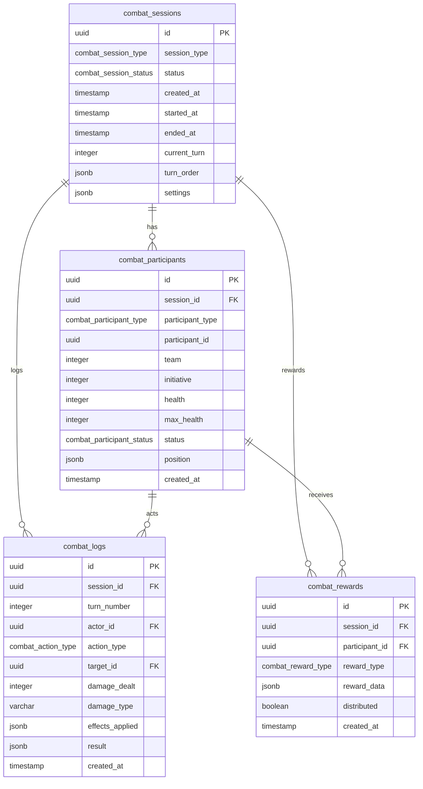

<!-- Issue: #130 -->
# Combat Session System - Database Schema

## Обзор

Схема базы данных для системы боевых сессий, управляющей боями (PvE, PvP, Raid, Arena), участниками, логами действий и наградами.

## ERD Диаграмма

## Таблицы

### combat_sessions

Боевые сессии (PvE, PvP, Raid, Arena).

**Колонки:**
- `id` (UUID, PK) - Уникальный идентификатор
- `session_type` (combat_session_type) - Тип сессии: pve, pvp, raid, arena
- `status` (combat_session_status) - Статус: created, active, paused, completed, cancelled
- `created_at` (TIMESTAMP) - Время создания
- `started_at` (TIMESTAMP) - Время начала
- `ended_at` (TIMESTAMP) - Время окончания
- `current_turn` (INTEGER) - Текущий номер хода
- `turn_order` (JSONB) - Порядок ходов (массив participant_id)
- `settings` (JSONB) - Настройки боя

**Ограничения:**
- CHECK: started_at и ended_at должны быть согласованы

**Индексы:**
- `idx_combat_sessions_status` - По статусу и времени создания
- `idx_combat_sessions_type_status` - По типу сессии и статусу
- `idx_combat_sessions_started_at` - По времени начала
- `idx_combat_sessions_active` - По активным сессиям

### combat_participants

Участники боевых сессий (игроки, NPC, враги).

**Колонки:**
- `id` (UUID, PK) - Уникальный идентификатор
- `session_id` (UUID, FK) - ID боевой сессии
- `participant_type` (combat_participant_type) - Тип участника: player, npc, enemy
- `participant_id` (UUID) - ID участника (character_id или npc_id)
- `team` (INTEGER) - Номер команды
- `initiative` (INTEGER) - Инициатива (для определения порядка ходов)
- `health` (INTEGER) - Текущее здоровье
- `max_health` (INTEGER) - Максимальное здоровье
- `status` (combat_participant_status) - Статус: alive, defeated, escaped
- `position` (JSONB) - Позиция участника (координаты)
- `created_at` (TIMESTAMP) - Время создания

**Ограничения:**
- CHECK: health <= max_health

**Индексы:**
- `idx_combat_participants_session_id` - По сессии и статусу
- `idx_combat_participants_participant` - По участнику и типу
- `idx_combat_participants_team` - По сессии и команде
- `idx_combat_participants_initiative` - По сессии и инициативе
- `idx_combat_participants_status` - По статусу (не alive)

### combat_logs

Логи действий в бою.

**Колонки:**
- `id` (UUID, PK) - Уникальный идентификатор
- `session_id` (UUID, FK) - ID боевой сессии
- `turn_number` (INTEGER) - Номер хода
- `actor_id` (UUID, FK) - ID актора (combat_participants)
- `action_type` (combat_action_type) - Тип действия: attack, ability, defend, item, move
- `target_id` (UUID, FK) - ID цели (combat_participants, nullable)
- `damage_dealt` (INTEGER) - Нанесенный урон
- `damage_type` (VARCHAR(50)) - Тип урона
- `effects_applied` (JSONB) - Примененные эффекты
- `result` (JSONB) - Результат действия
- `created_at` (TIMESTAMP) - Время действия

**Индексы:**
- `idx_combat_logs_session_id` - По сессии и номеру хода
- `idx_combat_logs_actor_id` - По актору и времени
- `idx_combat_logs_target_id` - По цели и времени
- `idx_combat_logs_action_type` - По типу действия и времени
- `idx_combat_logs_turn_number` - По сессии, номеру хода и времени

### combat_rewards

Награды за боевые сессии.

**Колонки:**
- `id` (UUID, PK) - Уникальный идентификатор
- `session_id` (UUID, FK) - ID боевой сессии
- `participant_id` (UUID, FK) - ID участника (combat_participants)
- `reward_type` (combat_reward_type) - Тип награды: experience, loot, currency, quest_progress
- `reward_data` (JSONB) - Данные награды
- `distributed` (BOOLEAN) - Распределена ли награда
- `created_at` (TIMESTAMP) - Время создания

**Индексы:**
- `idx_combat_rewards_session_id` - По сессии и статусу распределения
- `idx_combat_rewards_participant_id` - По участнику
- `idx_combat_rewards_distributed` - По статусу распределения и времени
- `idx_combat_rewards_type` - По типу награды и статусу распределения

## ENUM типы

### combat_session_type
- `pve` - PvE (Player vs Environment)
- `pvp` - PvP (Player vs Player)
- `raid` - Рейд
- `arena` - Арена

### combat_session_status
- `created` - Создана
- `active` - Активна
- `paused` - Приостановлена
- `completed` - Завершена
- `cancelled` - Отменена

### combat_participant_type
- `player` - Игрок
- `npc` - NPC
- `enemy` - Враг

### combat_participant_status
- `alive` - Жив
- `defeated` - Побежден
- `escaped` - Сбежал

### combat_action_type
- `attack` - Атака
- `ability` - Способность
- `defend` - Защита
- `item` - Предмет
- `move` - Движение

### combat_reward_type
- `experience` - Опыт
- `loot` - Лут
- `currency` - Валюта
- `quest_progress` - Прогресс квеста

## Связи

- `combat_participants.session_id` → `mvp_core.combat_sessions.id` (CASCADE при удалении)
- `combat_logs.session_id` → `mvp_core.combat_sessions.id` (CASCADE при удалении)
- `combat_logs.actor_id` → `mvp_core.combat_participants.id` (CASCADE при удалении)
- `combat_logs.target_id` → `mvp_core.combat_participants.id` (SET NULL при удалении)
- `combat_rewards.session_id` → `mvp_core.combat_sessions.id` (CASCADE при удалении)
- `combat_rewards.participant_id` → `mvp_core.combat_participants.id` (CASCADE при удалении)

## Миграция

Файл: `infrastructure/liquibase/migrations/V1_86__combat_session_system_tables.sql`

