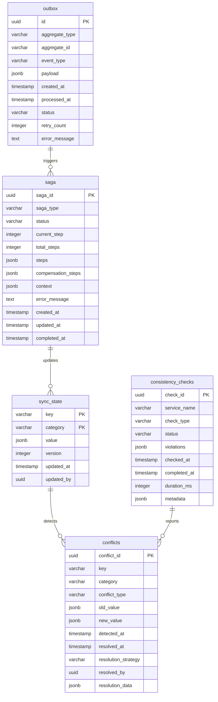

<!-- Issue: #142102432 -->
# Data Synchronization System - Database Schema

## Обзор

Схема базы данных для системы синхронизации данных между слоями и механиками, управляющей Saga транзакциями, состоянием синхронизации, конфликтами и проверками консистентности.

## ERD Диаграмма



## Описание таблиц

### outbox

Таблица Outbox Pattern для гарантированной доставки событий через Event Bus. Хранит события для публикации в Event Bus с гарантией доставки.

**Ключевые поля:**
- `id`: UUID первичный ключ
- `aggregate_type`: Тип агрегата (VARCHAR(100), NOT NULL)
- `aggregate_id`: ID агрегата (VARCHAR(100), NOT NULL)
- `event_type`: Тип события (VARCHAR(100), NOT NULL)
- `payload`: Данные события (JSONB, NOT NULL)
- `created_at`: Время создания (TIMESTAMP, default: CURRENT_TIMESTAMP)
- `processed_at`: Время обработки (TIMESTAMP, nullable) - **НОВОЕ**
- `status`: Статус обработки (VARCHAR(50), NOT NULL, default: 'pending') - **НОВОЕ**
- `retry_count`: Количество попыток обработки (INTEGER, NOT NULL, default: 0, CHECK: >= 0) - **НОВОЕ**
- `error_message`: Сообщение об ошибке (TEXT, nullable) - **НОВОЕ**

**Индексы:**
- По `(status, created_at)` для необработанных событий (WHERE status = 'pending')
- По `(aggregate_type, aggregate_id)` для событий агрегата
- По `event_type` для фильтрации по типу события

### saga

Таблица Saga Pattern для распределенных транзакций между сервисами. Хранит информацию о Saga транзакциях с шагами и компенсацией.

**Ключевые поля:**
- `saga_id`: UUID первичный ключ
- `saga_type`: Тип Saga транзакции (VARCHAR(255), NOT NULL)
- `status`: Статус Saga (VARCHAR(50), NOT NULL, default: 'pending', CHECK: pending/in_progress/completed/compensating/failed/cancelled)
- `current_step`: Текущий шаг Saga (INTEGER, NOT NULL, default: 0, CHECK: >= 0)
- `total_steps`: Общее количество шагов Saga (INTEGER, NOT NULL, default: 0, CHECK: >= 0)
- `steps`: Массив шагов Saga (JSONB, NOT NULL, default: '[]')
- `compensation_steps`: Компенсирующие шаги Saga (JSONB, default: '[]')
- `context`: Контекст Saga (JSONB, default: '{}')
- `error_message`: Сообщение об ошибке (TEXT, nullable)
- `created_at`: Время создания
- `updated_at`: Время последнего обновления
- `completed_at`: Время завершения (TIMESTAMP, nullable)

**Индексы:**
- По `status` для активных Saga (WHERE status IN ('pending', 'in_progress', 'compensating'))
- По `saga_type` для фильтрации по типу Saga
- По `created_at DESC` для последних Saga

### sync_state

Таблица состояния синхронизации данных между слоями и механиками. Хранит версионированное состояние синхронизации для оптимистичной блокировки.

**Ключевые поля:**
- `key`: Ключ состояния синхронизации (VARCHAR(255), NOT NULL, PRIMARY KEY)
- `category`: Категория состояния (VARCHAR(100), NOT NULL, PRIMARY KEY) - service, layer, mechanic
- `value`: Значение состояния (JSONB, NOT NULL, default: '{}')
- `version`: Версия состояния для оптимистичной блокировки (INTEGER, NOT NULL, default: 1, CHECK: >= 0)
- `updated_at`: Время последнего обновления (TIMESTAMP, NOT NULL, default: CURRENT_TIMESTAMP)
- `updated_by`: ID обновившего (UUID, nullable) - FK characters или сервис

**Индексы:**
- По `category` для фильтрации по категории
- По `updated_at DESC` для последних обновлений
- По `updated_by` для обновлений пользователя/сервиса (WHERE updated_by IS NOT NULL)

**PRIMARY KEY:** `(key, category)` - составной ключ

### conflicts

Таблица конфликтов синхронизации данных. Хранит информацию о конфликтах для разрешения.

**Ключевые поля:**
- `conflict_id`: UUID первичный ключ
- `key`: Ключ конфликта (VARCHAR(255), NOT NULL)
- `category`: Категория конфликта (VARCHAR(100), NOT NULL)
- `conflict_type`: Тип конфликта (VARCHAR(100), NOT NULL, CHECK: version/timestamp/state/custom)
- `old_value`: Старое значение (JSONB, nullable)
- `new_value`: Новое значение (JSONB, nullable)
- `detected_at`: Время обнаружения конфликта (TIMESTAMP, NOT NULL, default: CURRENT_TIMESTAMP)
- `resolved_at`: Время разрешения конфликта (TIMESTAMP, nullable)
- `resolution_strategy`: Стратегия разрешения конфликта (VARCHAR(100), nullable)
- `resolved_by`: ID разрешившего конфликт (UUID, nullable) - FK characters или сервис
- `resolution_data`: Данные разрешения конфликта (JSONB, default: '{}')

**Индексы:**
- По `(key, category)` для конфликтов по ключу и категории
- По `conflict_type` для фильтрации по типу конфликта
- По `resolved_at` для неразрешенных конфликтов (WHERE resolved_at IS NULL)
- По `detected_at DESC` для последних конфликтов

### consistency_checks

Таблица проверок консистентности данных между сервисами. Хранит информацию о проверках консистентности для мониторинга.

**Ключевые поля:**
- `check_id`: UUID первичный ключ
- `service_name`: Имя сервиса для проверки (VARCHAR(255), NOT NULL)
- `check_type`: Тип проверки консистентности (VARCHAR(100), NOT NULL)
- `status`: Статус проверки (VARCHAR(50), NOT NULL, default: 'pending', CHECK: pending/running/passed/failed/warning)
- `violations`: Массив нарушений консистентности (JSONB, default: '[]')
- `checked_at`: Время начала проверки (TIMESTAMP, NOT NULL, default: CURRENT_TIMESTAMP)
- `completed_at`: Время завершения проверки (TIMESTAMP, nullable)
- `duration_ms`: Длительность проверки в миллисекундах (INTEGER, nullable)
- `metadata`: Дополнительная информация о проверке (JSONB, default: '{}')

**Индексы:**
- По `service_name` для проверок сервиса
- По `status` для активных/проблемных проверок (WHERE status IN ('pending', 'running', 'failed', 'warning'))
- По `check_type` для фильтрации по типу проверки
- По `checked_at DESC` для последних проверок

## ENUM типы

### saga_status
- `pending`: Ожидает начала
- `in_progress`: В процессе выполнения
- `completed`: Завершена успешно
- `compensating`: Выполняется компенсация
- `failed`: Завершена с ошибкой
- `cancelled`: Отменена

### outbox_status
- `pending`: Ожидает обработки
- `processing`: В процессе обработки
- `processed`: Обработано успешно
- `failed`: Обработка завершилась ошибкой

### conflict_type
- `version`: Конфликт версий (оптимистичная блокировка)
- `timestamp`: Конфликт по времени
- `state`: Конфликт состояния
- `custom`: Пользовательский конфликт

### consistency_check_status
- `pending`: Ожидает выполнения
- `running`: Выполняется
- `passed`: Пройдена успешно
- `failed`: Провалена
- `warning`: Предупреждение

## Constraints и валидация

### CHECK Constraints

- `outbox.retry_count`: >= 0
- `saga.status`: IN ('pending', 'in_progress', 'completed', 'compensating', 'failed', 'cancelled')
- `saga.current_step`: >= 0
- `saga.total_steps`: >= 0
- `sync_state.version`: >= 0
- `conflicts.conflict_type`: IN ('version', 'timestamp', 'state', 'custom')
- `consistency_checks.status`: IN ('pending', 'running', 'passed', 'failed', 'warning')

### Foreign Keys

Нет прямых Foreign Keys, так как таблицы characters и сервисы могут быть в других схемах. Используются UUID ссылки.

### UNIQUE Constraints

- `sync_state(key, category)`: Составной PRIMARY KEY для уникальности состояния

## Оптимизация запросов

### Частые запросы

1. **Получение необработанных событий из Outbox:**
   ```sql
   SELECT * FROM mvp_meta.outbox 
   WHERE status = 'pending' 
   ORDER BY created_at ASC 
   LIMIT 100;
   ```
   Использует индекс `(status, created_at)`.

2. **Получение активных Saga:**
   ```sql
   SELECT * FROM mvp_meta.saga 
   WHERE status IN ('pending', 'in_progress', 'compensating') 
   ORDER BY created_at DESC;
   ```
   Использует индекс `status`.

3. **Получение состояния синхронизации:**
   ```sql
   SELECT * FROM mvp_meta.sync_state 
   WHERE key = $1 AND category = $2;
   ```
   Использует PRIMARY KEY `(key, category)`.

4. **Получение неразрешенных конфликтов:**
   ```sql
   SELECT * FROM mvp_meta.conflicts 
   WHERE resolved_at IS NULL 
   ORDER BY detected_at DESC;
   ```
   Использует индекс `resolved_at` и `detected_at DESC`.

5. **Получение последних проверок консистентности:**
   ```sql
   SELECT * FROM mvp_meta.consistency_checks 
   WHERE service_name = $1 
   ORDER BY checked_at DESC 
   LIMIT 50;
   ```
   Использует индекс `service_name` и `checked_at DESC`.

## Миграции

### Применение миграций:
```bash
liquibase update --changelog-file=infrastructure/liquibase/changelog.yaml
```

## Соответствие архитектуре

Схема БД полностью соответствует архитектуре из `knowledge/implementation/architecture/data-synchronization-consistency-architecture.yaml`:
- [OK] Outbox Pattern (обновлена существующая таблица)
- [OK] Saga Pattern (saga)
- [OK] State Synchronization (sync_state)
- [OK] Conflict Resolution (conflicts)
- [OK] Consistency Checks (consistency_checks)
- [OK] Индексы оптимизированы для частых запросов
- [OK] CHECK constraints обеспечивают валидацию данных
- [OK] ENUM типы соответствуют архитектуре

## Особенности реализации

### Outbox Pattern

Outbox Pattern обеспечивает гарантированную доставку событий:
- События записываются в транзакции с основной операцией
- Outbox Processor периодически обрабатывает события
- События публикуются в Event Bus (Kafka)
- После успешной публикации статус меняется на 'processed'
- При ошибке увеличивается `retry_count` и сохраняется `error_message`

### Saga Pattern

Saga Pattern для распределенных транзакций:
- **Choreography**: Каждый сервис знает следующий шаг
- **Orchestration**: Saga Orchestrator управляет шагами
- **Compensation**: Компенсирующие транзакции для отката
- **Context**: Контекст Saga хранится в JSONB для передачи между шагами

### State Synchronization

State Synchronization для синхронизации между слоями:
- **Optimistic Locking**: Версионирование для предотвращения конфликтов
- **Categories**: Разделение по категориям (service, layer, mechanic)
- **Version Control**: Автоматическое увеличение версии при обновлении

### Conflict Resolution

Conflict Resolution для разрешения конфликтов:
- **Detection**: Автоматическое обнаружение конфликтов
- **Types**: Различные типы конфликтов (version, timestamp, state, custom)
- **Strategies**: Стратегии разрешения (last-write-wins, merge, manual)
- **Tracking**: Отслеживание разрешенных конфликтов

### Consistency Checks

Consistency Checks для мониторинга консистентности:
- **Scheduled**: Периодические проверки консистентности
- **On-demand**: Проверки по запросу
- **Violations**: Детальная информация о нарушениях
- **Metrics**: Длительность проверок для мониторинга

### Интеграция с сервисами

Система интегрируется с:
- **Character Service**: Синхронизация данных персонажа
- **Inventory Service**: Синхронизация инвентаря
- **World Service**: Синхронизация состояния мира
- **Realtime Gateway**: Realtime синхронизация с клиентами
- **Event Bus (Kafka)**: Публикация и подписка на события

