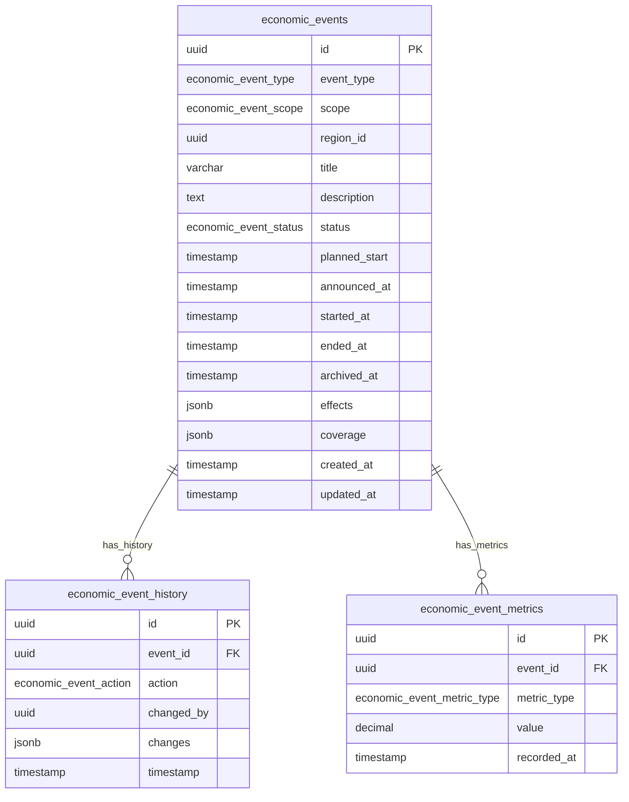

<!-- Issue: #140890219 -->

# Economy Events System - Database Schema

## Обзор

Схема базы данных для системы экономических событий, управляющей событиями, которые влияют на цены, курсы валют и
активность игроков. Включает события разных типов, масштабов и статусов.

## ERD Диаграмма



## Описание таблиц

### economic_events

Таблица экономических событий. Хранит информацию о событиях, влияющих на экономику игры.

**Ключевые поля:**

- `id`: UUID первичный ключ
- `event_type`: Тип события (economic_event_type ENUM, NOT NULL)
- `scope`: Охват события (economic_event_scope ENUM, NOT NULL: 'GLOBAL', 'REGIONAL')
- `region_id`: ID региона для региональных событий (UUID, nullable - NULL для глобальных)
- `title`: Название события (VARCHAR(255), NOT NULL)
- `description`: Описание события (TEXT, nullable)
- `status`: Статус события (economic_event_status ENUM, NOT NULL, default: 'PLANNED')
- `planned_start`: Запланированное время начала (TIMESTAMP, nullable)
- `announced_at`: Время анонса события (TIMESTAMP, nullable)
- `started_at`: Время начала события (TIMESTAMP, nullable)
- `ended_at`: Время окончания события (TIMESTAMP, nullable)
- `archived_at`: Время архивации события (TIMESTAMP, nullable)
- `effects`: Модификаторы цен, курсов, ликвидности (JSONB, NOT NULL, default: '{}')
- `coverage`: Охват события (регионы, отрасли, товары) (JSONB, NOT NULL, default: '{}')
- `created_at`: Время создания
- `updated_at`: Время последнего обновления

**Индексы:**

- По `event_type` для фильтрации по типу события
- По `status` для фильтрации по статусу
- По `scope` для фильтрации по охвату
- По `region_id` для региональных событий (WHERE region_id IS NOT NULL)
- По `planned_start` для запланированных событий (WHERE planned_start IS NOT NULL)
- По `started_at` для активных событий (WHERE started_at IS NOT NULL)
- По `(status, started_at)` для активных событий (WHERE status = 'ACTIVE')

**Constraints:**

- CHECK: (scope = 'REGIONAL' AND region_id IS NOT NULL) OR (scope = 'GLOBAL' AND region_id IS NULL)

### economic_event_history

Таблица истории изменений событий. Хранит аудит всех изменений событий.

**Ключевые поля:**

- `id`: UUID первичный ключ
- `event_id`: ID события (FK к economic_events, NOT NULL)
- `action`: Действие (economic_event_action ENUM, NOT NULL)
- `changed_by`: ID пользователя или system (UUID, nullable - NULL для системных изменений)
- `changes`: Детали изменений (JSONB, NOT NULL, default: '{}')
- `timestamp`: Время изменения

**Индексы:**

- По `event_id` для истории конкретного события
- По `timestamp DESC` для временных запросов
- По `action` для фильтрации по типу действия

### economic_event_metrics

Таблица метрик событий. Хранит метрики для мониторинга событий (PriceDeviation, TransactionVolume, EventUptime).

**Ключевые поля:**

- `id`: UUID первичный ключ
- `event_id`: ID события (FK к economic_events, NOT NULL)
- `metric_type`: Тип метрики (economic_event_metric_type ENUM, NOT NULL)
- `value`: Значение метрики (DECIMAL(20,8), NOT NULL)
- `recorded_at`: Время записи метрики

**Индексы:**

- По `event_id` для метрик конкретного события
- По `metric_type` для фильтрации по типу метрики
- По `recorded_at DESC` для временных запросов
- По `(event_id, metric_type, recorded_at DESC)` для комбинированных запросов

## ENUM типы

### economic_event_type

- `CRISIS`: Экономический кризис
- `BOOM`: Экономический бум
- `INFLATION`: Инфляция
- `EMBARGO`: Эмбарго
- `SANCTIONS`: Санкции
- `TARIFFS`: Тарифы
- `SCANDAL`: Скандал
- `TECH_BREAKTHROUGH`: Технологический прорыв

### economic_event_scope

- `GLOBAL`: Глобальное событие (влияет на весь мир)
- `REGIONAL`: Региональное событие (влияет на конкретный регион)

### economic_event_status

- `PLANNED`: Запланировано
- `ANNOUNCED`: Анонсировано
- `ACTIVE`: Активно
- `COOLDOWN`: Кулдаун (после завершения)
- `ARCHIVED`: Архивировано

### economic_event_action

- `CREATED`: Создано
- `UPDATED`: Обновлено
- `ANNOUNCED`: Анонсировано
- `ACTIVATED`: Активировано
- `ARCHIVED`: Архивировано

### economic_event_metric_type

- `PRICE_DEVIATION`: Отклонение цен
- `TRANSACTION_VOLUME`: Объем транзакций
- `EVENT_UPTIME`: Время работы события

## Constraints и валидация

### CHECK Constraints

- `economic_events`: (scope = 'REGIONAL' AND region_id IS NOT NULL) OR (scope = 'GLOBAL' AND region_id IS NULL)

### Foreign Keys

- `economic_event_history.event_id` → `economy.economic_events.id` (ON DELETE CASCADE)
- `economic_event_metrics.event_id` → `economy.economic_events.id` (ON DELETE CASCADE)

## Оптимизация запросов

### Частые запросы

1. **Получение активных событий:**
   ```sql
   SELECT * FROM economy.economic_events 
   WHERE status = 'ACTIVE' 
   ORDER BY started_at DESC;
   ```
   Использует индекс `(status, started_at)`.

2. **Получение запланированных событий:**
   ```sql
   SELECT * FROM economy.economic_events 
   WHERE status = 'PLANNED' AND planned_start <= $1 
   ORDER BY planned_start ASC;
   ```
   Использует индекс `planned_start`.

3. **Получение событий по типу:**
   ```sql
   SELECT * FROM economy.economic_events 
   WHERE event_type = $1 AND status = 'ACTIVE';
   ```
   Использует индексы `event_type` и `status`.

4. **Получение региональных событий:**
   ```sql
   SELECT * FROM economy.economic_events 
   WHERE scope = 'REGIONAL' AND region_id = $1 AND status = 'ACTIVE';
   ```
   Использует индексы `scope` и `region_id`.

5. **Получение истории события:**
   ```sql
   SELECT * FROM economy.economic_event_history 
   WHERE event_id = $1 
   ORDER BY timestamp DESC;
   ```
   Использует индекс `event_id`.

6. **Получение метрик события:**
   ```sql
   SELECT * FROM economy.economic_event_metrics 
   WHERE event_id = $1 AND metric_type = $2 
   ORDER BY recorded_at DESC;
   ```
   Использует индекс `(event_id, metric_type, recorded_at DESC)`.

## Миграции

### Применение миграций:

```bash
liquibase update --changelog-file=infrastructure/liquibase/changelog.yaml
```

## Соответствие архитектуре

Схема БД полностью соответствует архитектуре из
`knowledge/implementation/architecture/economy-events-system-architecture.yaml`:

- [OK] Все таблицы из архитектуры созданы
- [OK] Все поля соответствуют описанию
- [OK] Индексы оптимизированы для частых запросов
- [OK] Constraints обеспечивают целостность данных
- [OK] Foreign Keys настроены с CASCADE для автоматической очистки
- [OK] ENUM типы соответствуют архитектуре

## Особенности реализации

### Жизненный цикл событий

События проходят через следующие стадии:

1. **PLANNED**: Событие запланировано, но еще не анонсировано
2. **ANNOUNCED**: Событие анонсировано игрокам
3. **ACTIVE**: Событие активно, эффекты применяются
4. **COOLDOWN**: Событие завершено, но еще в кулдауне
5. **ARCHIVED**: Событие архивировано

### Типы событий

Система поддерживает следующие типы событий:

- **CRISIS**: Экономический кризис (снижение цен, ликвидности)
- **BOOM**: Экономический бум (рост цен, ликвидности)
- **INFLATION**: Инфляция (общее повышение цен)
- **EMBARGO**: Эмбарго (ограничение торговли)
- **SANCTIONS**: Санкции (ограничения для определенных регионов/фракций)
- **TARIFFS**: Тарифы (изменение тарифов на торговлю)
- **SCANDAL**: Скандал (влияние на репутацию и торговлю)
- **TECH_BREAKTHROUGH**: Технологический прорыв (влияние на цены технологий)

### Охват событий

События могут быть:

- **GLOBAL**: Влияют на весь мир игры
- **REGIONAL**: Влияют на конкретный регион (требует region_id)

### Эффекты и охват

- **effects**: JSONB поле для модификаторов цен, курсов, ликвидности
- **coverage**: JSONB поле для охвата события (регионы, отрасли, товары)

### История и аудит

Система истории событий включает:

- **Действия**: CREATED, UPDATED, ANNOUNCED, ACTIVATED, ARCHIVED
- **Изменения**: Детали изменений в JSONB
- **Автор**: changed_by (user_id или system)

### Метрики мониторинга

Система метрик включает:

- **PRICE_DEVIATION**: Отклонение цен от прогноза
- **TRANSACTION_VOLUME**: Объем транзакций во время события
- **EVENT_UPTIME**: Время работы события

### Интеграция с другими системами

Система экономических событий интегрируется с:

- **Pricing Engine**: Применение эффектов к ценам товаров
- **Currency Exchange**: Применение эффектов к курсам валют
- **Stock Exchange**: Применение эффектов к котировкам акций
- **Quest Service**: Триггеры событий от квестов
- **Analytics Service**: Метрики и аналитика событий
- **Notification Service**: Уведомления игроков о событиях

