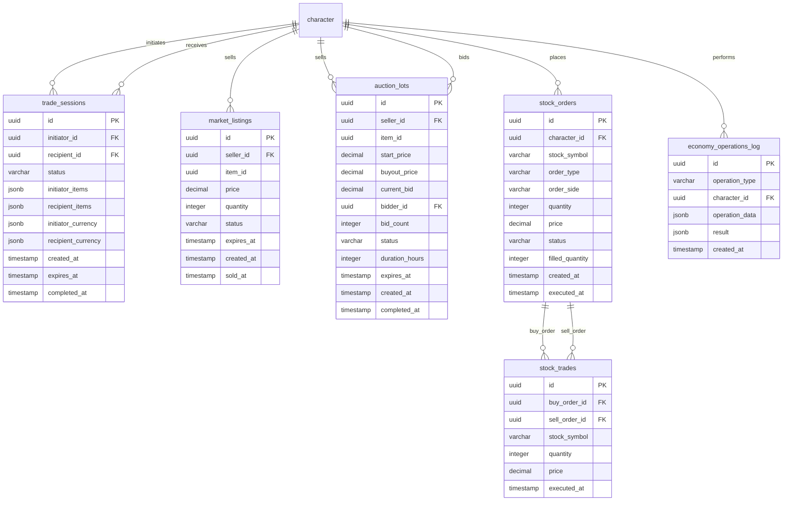

<!-- Issue: #140875788 -->

# Economy Trading Markets Auctions - Database Schema

## Обзор

Схема базы данных для экономической системы, включающая торговлю P2P, игровой рынок, аукционный дом, фондовую биржу и
лог экономических операций.

## ERD Диаграмма



## Описание таблиц

### trade_sessions

Таблица торговых сессий P2P. Хранит информацию о прямых обменах между игроками.

**Ключевые поля:**

- `initiator_id`: ID инициатора торговли (FK к characters)
- `recipient_id`: ID получателя предложения (FK к characters)
- `status`: Статус сессии (created, active, confirmed, completed, cancelled)
- `initiator_items`: JSONB предметы инициатора
- `recipient_items`: JSONB предметы получателя
- `initiator_currency`: JSONB валюта инициатора
- `recipient_currency`: JSONB валюта получателя
- `expires_at`: Время истечения сессии
- `completed_at`: Время завершения (nullable)

**Индексы:**

- По `(initiator_id, status)` для поиска сессий инициатора
- По `(recipient_id, status)` для поиска сессий получателя
- По `(status, expires_at)` для активных сессий

### market_listings

Таблица объявлений на игровом рынке. Хранит информацию о предметах, выставленных на продажу с фиксированными ценами.

**Ключевые поля:**

- `seller_id`: ID продавца (FK к characters)
- `item_id`: ID предмета
- `price`: Цена предмета (DECIMAL(15,2), > 0)
- `quantity`: Количество предметов (INTEGER, > 0)
- `status`: Статус объявления (active, sold, expired, cancelled)
- `expires_at`: Время истечения объявления
- `sold_at`: Время продажи (nullable)

**Индексы:**

- По `(seller_id, status)` для объявлений продавца
- По `(item_id, status)` для поиска активных объявлений по предмету
- По `(status, expires_at)` для активных объявлений
- По `price` для сортировки по цене
- По `expires_at` для очистки истекших объявлений

### auction_lots

Таблица лотов аукционного дома. Хранит информацию о предметах, выставленных на аукцион со ставками.

**Ключевые поля:**

- `seller_id`: ID продавца (FK к characters)
- `item_id`: ID предмета
- `start_price`: Начальная цена (DECIMAL(15,2), > 0)
- `buyout_price`: Цена мгновенного выкупа (nullable, >= start_price)
- `current_bid`: Текущая максимальная ставка (DECIMAL(15,2))
- `bidder_id`: ID игрока с текущей максимальной ставкой (FK к characters, nullable)
- `bid_count`: Количество ставок (INTEGER)
- `status`: Статус лота (active, sold, expired, cancelled)
- `duration_hours`: Длительность аукциона в часах (INTEGER, > 0)
- `expires_at`: Время окончания аукциона
- `completed_at`: Время завершения (nullable)

**Индексы:**

- По `(seller_id, status)` для лотов продавца
- По `bidder_id` для лотов, где игрок лидирует
- По `(item_id, status)` для поиска активных лотов по предмету
- По `(status, expires_at)` для активных лотов
- По `expires_at` для очистки истекших лотов
- По `current_bid` для сортировки по текущей ставке

### stock_orders

Таблица ордеров на фондовой бирже. Хранит информацию о заявках на покупку/продажу акций.

**Ключевые поля:**

- `character_id`: ID персонажа (FK к characters)
- `stock_symbol`: Символ акции (VARCHAR(20))
- `order_type`: Тип ордера (buy, sell)
- `order_side`: Тип ордера (market, limit)
- `quantity`: Количество акций (INTEGER, > 0)
- `price`: Цена для лимитного ордера (nullable, обязательна для limit)
- `status`: Статус ордера (pending, filled, partially_filled, cancelled)
- `filled_quantity`: Количество исполненных акций (INTEGER, 0 <= filled_quantity <= quantity)
- `executed_at`: Время исполнения (nullable)

**Индексы:**

- По `(character_id, status)` для ордеров персонажа
- По `(stock_symbol, status)` для активных ордеров по акции
- По `(order_type, stock_symbol, status)` для matching ордеров
- По `(price, stock_symbol)` для лимитных ордеров
- По `(status, created_at)` для обработки ордеров

### stock_trades

Таблица исполненных сделок на фондовой бирже. Хранит информацию о завершенных сделках.

**Ключевые поля:**

- `buy_order_id`: ID ордера на покупку (FK к stock_orders)
- `sell_order_id`: ID ордера на продажу (FK к stock_orders)
- `stock_symbol`: Символ акции (VARCHAR(20))
- `quantity`: Количество акций (INTEGER, > 0)
- `price`: Цена исполнения (DECIMAL(15,2), > 0)
- `executed_at`: Время исполнения

**Индексы:**

- По `buy_order_id` для поиска сделок по ордеру покупки
- По `sell_order_id` для поиска сделок по ордеру продажи
- По `(stock_symbol, executed_at DESC)` для истории сделок по акции
- По `executed_at DESC` для аналитики

### economy_operations_log

Таблица лога всех экономических операций. Хранит информацию о всех операциях для аналитики и аудита.

**Ключевые поля:**

- `operation_type`: Тип операции (trade, market_purchase, auction_bid, stock_order)
- `character_id`: ID персонажа (FK к characters)
- `operation_data`: JSONB данные операции
- `result`: JSONB результат операции
- `created_at`: Время операции

**Индексы:**

- По `(character_id, created_at DESC)` для операций персонажа
- По `(operation_type, created_at DESC)` для фильтрации по типу
- По `created_at DESC` для аналитики по времени

## Constraints и валидация

### CHECK Constraints

- `market_listings.price`: Должна быть > 0
- `market_listings.quantity`: Должна быть > 0
- `market_listings.status`: Допустимые значения: 'active', 'sold', 'expired', 'cancelled'
- `auction_lots.start_price`: Должна быть > 0
- `auction_lots.buyout_price`: Должна быть >= start_price (если указана)
- `auction_lots.duration_hours`: Должна быть > 0
- `auction_lots.status`: Допустимые значения: 'active', 'sold', 'expired', 'cancelled'
- `stock_orders.order_type`: Допустимые значения: 'buy', 'sell'
- `stock_orders.order_side`: Допустимые значения: 'market', 'limit'
- `stock_orders.quantity`: Должна быть > 0
- `stock_orders.price`: Обязательна для limit ордеров, NULL для market
- `stock_orders.status`: Допустимые значения: 'pending', 'filled', 'partially_filled', 'cancelled'
- `stock_orders.filled_quantity`: Должна быть >= 0 и <= quantity
- `stock_trades.quantity`: Должна быть > 0
- `stock_trades.price`: Должна быть > 0
- `economy_operations_log.operation_type`: Допустимые значения: 'trade', 'market_purchase', 'auction_bid', 'stock_order'

### Foreign Keys

- `trade_sessions.initiator_id` → `characters.id` (ON DELETE CASCADE)
- `trade_sessions.recipient_id` → `characters.id` (ON DELETE CASCADE)
- `market_listings.seller_id` → `characters.id` (ON DELETE CASCADE)
- `auction_lots.seller_id` → `characters.id` (ON DELETE CASCADE)
- `auction_lots.bidder_id` → `characters.id` (ON DELETE SET NULL)
- `stock_orders.character_id` → `characters.id` (ON DELETE CASCADE)
- `stock_trades.buy_order_id` → `stock_orders.id` (ON DELETE CASCADE)
- `stock_trades.sell_order_id` → `stock_orders.id` (ON DELETE CASCADE)
- `economy_operations_log.character_id` → `characters.id` (ON DELETE CASCADE)

## Оптимизация запросов

### Частые запросы

1. **Поиск активных объявлений на рынке:**
   ```sql
   SELECT * FROM market_listings 
   WHERE status = 'active' AND expires_at > NOW() 
   ORDER BY price ASC;
   ```
   Использует индекс `(status, expires_at)`.

2. **Поиск активных лотов на аукционе:**
   ```sql
   SELECT * FROM auction_lots 
   WHERE status = 'active' AND expires_at > NOW() 
   ORDER BY current_bid DESC;
   ```
   Использует индекс `(status, expires_at)`.

3. **Matching ордеров на бирже:**
   ```sql
   SELECT * FROM stock_orders 
   WHERE stock_symbol = $1 AND order_type = 'buy' 
   AND status IN ('pending', 'partially_filled') 
   ORDER BY price DESC;
   ```
   Использует индекс `(order_type, stock_symbol, status)`.

4. **История операций персонажа:**
   ```sql
   SELECT * FROM economy_operations_log 
   WHERE character_id = $1 
   ORDER BY created_at DESC 
   LIMIT 50;
   ```
   Использует индекс `(character_id, created_at DESC)`.

### Партиционирование

Для больших объемов данных рекомендуется партиционирование:

- По `created_at` для таблиц логов (economy_operations_log, stock_trades)
- По `stock_symbol` для stock_orders (если много разных акций)

## Миграции

### Существующие миграции:

- `V1_15__trade_tables.sql` - базовые таблицы торговли (trade_sessions, trade_history)
- `V1_51__economy_trading_markets_auctions_tables.sql` - дополнение схемы (market_listings, auction_lots, stock_orders,
  stock_trades, economy_operations_log)

### Применение миграций:

```bash
liquibase update --changelog-file=infrastructure/liquibase/changelog.yaml
```

## Соответствие архитектуре

Схема БД полностью соответствует архитектуре из
`knowledge/implementation/architecture/economy-trading-markets-auctions-architecture.yaml`:

- [OK] Все таблицы из архитектуры созданы
- [OK] Все поля соответствуют описанию
- [OK] Индексы оптимизированы для частых запросов
- [OK] Constraints обеспечивают целостность данных
- [OK] Foreign Keys настроены с CASCADE для автоматической очистки
- [OK] Поддержка JSONB для гибкого хранения данных

## Особенности реализации

### JSONB поля

Использование JSONB для гибкого хранения:

- `initiator_items`, `recipient_items`: Предметы в торговых сессиях
- `initiator_currency`, `recipient_currency`: Валюта в торговых сессиях
- `operation_data`: Данные операции для аналитики
- `result`: Результат операции

### Торговые сессии

P2P торговля требует двойного подтверждения:

- Оба игрока должны подтвердить обмен
- Предметы блокируются до завершения или отмены
- Сессия истекает через определенное время

### Игровой рынок

Рынок с фиксированными ценами:

- Продавец устанавливает цену
- Покупатель покупает по указанной цене
- Комиссия 1% удерживается автоматически

### Аукционный дом

Аукционы со ставками:

- Минимальная ставка: текущая + 5%
- Мгновенный выкуп по buyout_price (если указан)
- Таймер продлевается на 5 минут при новой ставке (если <5 минут осталось)

### Фондовая биржа

Order book система:

- Market ордера исполняются немедленно по лучшей цене
- Limit ордера ждут подходящей цены
- Matching происходит автоматически
- Цены обновляются при исполнении сделок

