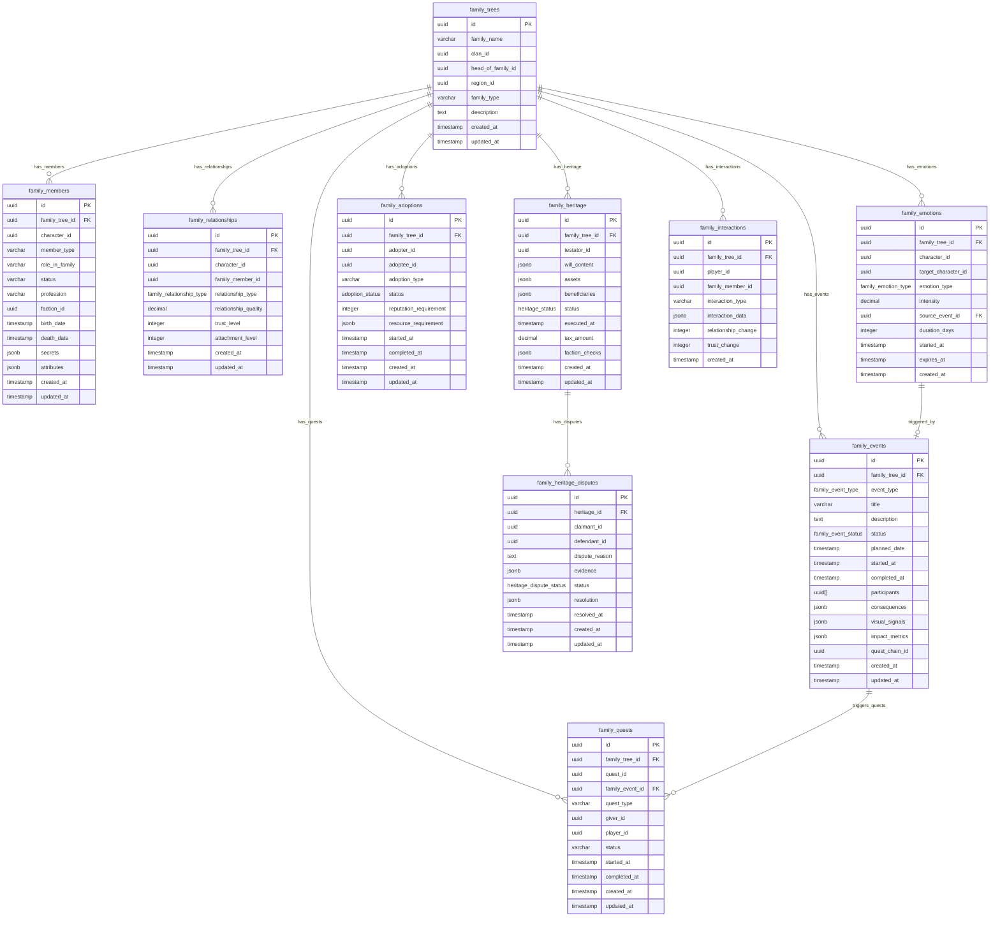

<!-- Issue: #140890862 -->

# Family Relationships System - Database Schema

## Обзор

Схема базы данных для системы семейных отношений с NPC, управляющей семейными деревьями, событиями, эмоциями,
усыновлениями, наследованием и взаимодействиями игрока с семьями.

## ERD Диаграмма



## Описание таблиц

### family_trees

Таблица семейных деревьев. Хранит информацию о семейных структурах (ядро, расширение, кланы).

**Ключевые поля:**

- `id`: UUID первичный ключ
- `family_name`: Название семьи (VARCHAR(255), nullable)
- `clan_id`: ID клана (FK clans, nullable)
- `head_of_family_id`: ID главы семьи (FK characters/NPC, nullable)
- `region_id`: ID региона (FK regions, nullable)
- `family_type`: Тип семьи (VARCHAR(50), nullable - 'core', 'extended', 'clan')
- `description`: Описание семьи (TEXT, nullable)
- `created_at`: Время создания
- `updated_at`: Время последнего обновления

**Индексы:**

- По `head_of_family_id` для глав семей (WHERE head_of_family_id IS NOT NULL)
- По `clan_id` для семей кланов (WHERE clan_id IS NOT NULL)
- По `region_id` для семей по регионам (WHERE region_id IS NOT NULL)

### family_members

Таблица членов семьи. Хранит информацию о членах семьи (игроки и NPC).

**Ключевые поля:**

- `id`: UUID первичный ключ
- `family_tree_id`: ID семейного дерева (FK family_trees, NOT NULL)
- `character_id`: ID персонажа/NPC (FK characters/NPC, NOT NULL)
- `member_type`: Тип члена (VARCHAR(50), NOT NULL - 'player', 'npc')
- `role_in_family`: Роль в семье (VARCHAR(50), nullable - 'head', 'elder', 'member', 'child')
- `status`: Статус (VARCHAR(50), NOT NULL, default: 'alive' - 'alive', 'deceased', 'missing')
- `profession`: Профессия (VARCHAR(100), nullable)
- `faction_id`: ID фракции (FK factions, nullable)
- `birth_date`: Дата рождения (TIMESTAMP, nullable)
- `death_date`: Дата смерти (TIMESTAMP, nullable)
- `secrets`: Секреты члена семьи (JSONB, default: '{}')
- `attributes`: Атрибуты члена семьи (JSONB, default: '{}')
- `created_at`: Время создания
- `updated_at`: Время последнего обновления

**Индексы:**

- По `family_tree_id` для членов семьи
- По `character_id` для поиска по персонажу
- По `status` для живых членов (WHERE status = 'alive')

**UNIQUE constraint:** `(family_tree_id, character_id)` - уникальная комбинация дерева и персонажа

### family_relationships

Таблица семейных отношений. Хранит информацию об отношениях между членами семьи.

**Ключевые поля:**

- `id`: UUID первичный ключ
- `family_tree_id`: ID семейного дерева (FK family_trees, NOT NULL)
- `character_id`: ID персонажа/NPC (FK characters/NPC, NOT NULL)
- `family_member_id`: ID члена семьи (FK characters/NPC, NOT NULL)
- `relationship_type`: Тип отношения (family_relationship_type ENUM, NOT NULL)
- `relationship_quality`: Качество отношения (DECIMAL(3,2), NOT NULL, default: 0.50, диапазон: 0.00-1.00)
- `trust_level`: Уровень доверия (INTEGER, NOT NULL, default: 50, диапазон: 0-100)
- `attachment_level`: Уровень привязанности (INTEGER, NOT NULL, default: 50, диапазон: 0-100)
- `created_at`: Время создания
- `updated_at`: Время последнего обновления

**Индексы:**

- По `family_tree_id` для отношений семьи
- По `character_id` для отношений персонажа
- По `family_member_id` для отношений с членом семьи
- По `relationship_type` для фильтрации по типу отношения

**UNIQUE constraint:** `(character_id, family_member_id, relationship_type)` - уникальная комбинация персонажей и типа
отношения

### family_emotions

Таблица эмоций членов семьи. Хранит информацию об эмоциях членов семьи (привязанность, тревога, гордость, гнев).

**Ключевые поля:**

- `id`: UUID первичный ключ
- `family_tree_id`: ID семейного дерева (FK family_trees, NOT NULL)
- `character_id`: ID персонажа/NPC (FK characters/NPC, NOT NULL)
- `target_character_id`: ID целевого персонажа/NPC (FK characters/NPC, nullable - для эмоций к конкретному члену семьи)
- `emotion_type`: Тип эмоции (family_emotion_type ENUM, NOT NULL)
- `intensity`: Интенсивность эмоции (DECIMAL(3,2), NOT NULL, default: 0.50, диапазон: 0.00-1.00)
- `source_event_id`: ID источника события (FK family_events, nullable)
- `duration_days`: Длительность эмоции в днях (INTEGER, default: 0, CHECK: >= 0)
- `started_at`: Время начала (TIMESTAMP, NOT NULL, default: CURRENT_TIMESTAMP)
- `expires_at`: Время истечения (TIMESTAMP, nullable)
- `created_at`: Время создания

**Индексы:**

- По `family_tree_id` для эмоций семьи
- По `character_id` для эмоций персонажа
- По `target_character_id` для эмоций к целевому персонажу (WHERE target_character_id IS NOT NULL)
- По `emotion_type` для фильтрации по типу эмоции
- По `expires_at` для истекающих эмоций (WHERE expires_at IS NOT NULL)

### family_events

Таблица семейных событий. Хранит информацию о событиях семьи (свадьбы, рождения, болезни, конфликты, трагедии,
праздники).

**Ключевые поля:**

- `id`: UUID первичный ключ
- `family_tree_id`: ID семейного дерева (FK family_trees, NOT NULL)
- `event_type`: Тип события (family_event_type ENUM, NOT NULL)
- `title`: Название события (VARCHAR(255), NOT NULL)
- `description`: Описание события (TEXT, nullable)
- `status`: Статус события (family_event_status ENUM, NOT NULL, default: 'planned')
- `planned_date`: Запланированная дата (TIMESTAMP, nullable)
- `started_at`: Время начала (TIMESTAMP, nullable)
- `completed_at`: Время завершения (TIMESTAMP, nullable)
- `participants`: Массив ID участников (UUID[], NOT NULL, default: '{}')
- `consequences`: Последствия события (JSONB, default: '{}')
- `visual_signals`: Визуальные сигналы (JSONB, default: '{}')
- `impact_metrics`: Метрики влияния (JSONB, default: '{}')
- `quest_chain_id`: ID цепочки квестов (FK quests, nullable)
- `created_at`: Время создания
- `updated_at`: Время последнего обновления

**Индексы:**

- По `family_tree_id` для событий семьи
- По `event_type` для фильтрации по типу события
- По `status` для фильтрации по статусу
- По `planned_date` для запланированных событий (WHERE planned_date IS NOT NULL)

### family_adoptions

Таблица усыновлений. Хранит информацию об усыновлениях (игрок усыновляет NPC, NPC усыновляет игрока, NPC усыновляет
NPC).

**Ключевые поля:**

- `id`: UUID первичный ключ
- `family_tree_id`: ID семейного дерева (FK family_trees, NOT NULL)
- `adopter_id`: ID усыновителя (FK characters/NPC, NOT NULL)
- `adoptee_id`: ID усыновляемого (FK characters/NPC, NOT NULL)
- `adoption_type`: Тип усыновления (VARCHAR(50), NOT NULL - 'player_adopts_npc', 'npc_adopts_player', 'npc_adopts_npc')
- `status`: Статус усыновления (adoption_status ENUM, NOT NULL, default: 'pending')
- `reputation_requirement`: Требование по репутации (INTEGER, default: 0, CHECK: >= 0)
- `resource_requirement`: Требования по ресурсам (JSONB, default: '{}')
- `started_at`: Время начала (TIMESTAMP, NOT NULL, default: CURRENT_TIMESTAMP)
- `completed_at`: Время завершения (TIMESTAMP, nullable)
- `created_at`: Время создания
- `updated_at`: Время последнего обновления

**Индексы:**

- По `family_tree_id` для усыновлений семьи
- По `adopter_id` для усыновителя
- По `adoptee_id` для усыновляемого
- По `status` для фильтрации по статусу

### family_heritage

Таблица наследования и завещаний. Хранит информацию о завещаниях и наследовании.

**Ключевые поля:**

- `id`: UUID первичный ключ
- `family_tree_id`: ID семейного дерева (FK family_trees, NOT NULL)
- `testator_id`: ID завещателя (FK characters/NPC, NOT NULL)
- `will_content`: Содержание завещания (JSONB, NOT NULL, default: '{}')
- `assets`: Активы (ресурсы, имущество, деньги) (JSONB, NOT NULL, default: '{}')
- `beneficiaries`: Бенефициары и их доли (JSONB, NOT NULL, default: '{}')
- `status`: Статус наследства (heritage_status ENUM, NOT NULL, default: 'active')
- `executed_at`: Время исполнения (TIMESTAMP, nullable)
- `tax_amount`: Сумма налога на наследство (DECIMAL(10,2), default: 0, CHECK: >= 0)
- `faction_checks`: Проверки фракций (JSONB, default: '{}')
- `created_at`: Время создания
- `updated_at`: Время последнего обновления

**Индексы:**

- По `family_tree_id` для наследства семьи
- По `testator_id` для завещателя
- По `status` для фильтрации по статусу

### family_heritage_disputes

Таблица споров о наследстве. Хранит информацию о спорах по наследству.

**Ключевые поля:**

- `id`: UUID первичный ключ
- `heritage_id`: ID наследства (FK family_heritage, NOT NULL)
- `claimant_id`: ID истца (FK characters/NPC, NOT NULL)
- `defendant_id`: ID ответчика (FK characters/NPC, nullable)
- `dispute_reason`: Причина спора (TEXT, NOT NULL)
- `evidence`: Доказательства (JSONB, default: '{}')
- `status`: Статус спора (heritage_dispute_status ENUM, NOT NULL, default: 'pending')
- `resolution`: Решение спора (JSONB, nullable)
- `resolved_at`: Время разрешения (TIMESTAMP, nullable)
- `created_at`: Время создания
- `updated_at`: Время последнего обновления

**Индексы:**

- По `heritage_id` для споров наследства
- По `claimant_id` для истца
- По `status` для фильтрации по статусу

### family_quests

Таблица семейных квестов. Хранит информацию о квестах, связанных с семейными событиями.

**Ключевые поля:**

- `id`: UUID первичный ключ
- `family_tree_id`: ID семейного дерева (FK family_trees, NOT NULL)
- `quest_id`: ID квеста (FK quests, NOT NULL)
- `family_event_id`: ID семейного события (FK family_events, nullable)
- `quest_type`: Тип квеста (VARCHAR(50), nullable - 'wedding', 'birth', 'conflict', 'tragedy', 'celebration', etc.)
- `giver_id`: ID дающего квест (FK characters/NPC, NOT NULL)
- `player_id`: ID игрока (FK characters, nullable)
- `status`: Статус квеста (VARCHAR(50), NOT NULL, default: 'available' - 'available', 'active', 'completed', 'failed')
- `started_at`: Время начала (TIMESTAMP, nullable)
- `completed_at`: Время завершения (TIMESTAMP, nullable)
- `created_at`: Время создания
- `updated_at`: Время последнего обновления

**Индексы:**

- По `family_tree_id` для квестов семьи
- По `quest_id` для поиска по квесту
- По `family_event_id` для квестов события (WHERE family_event_id IS NOT NULL)
- По `giver_id` для дающего квест
- По `player_id` для квестов игрока (WHERE player_id IS NOT NULL)
- По `status` для фильтрации по статусу

### family_interactions

Таблица взаимодействий игрока с семьей. Хранит информацию о взаимодействиях игрока с членами семьи (диалоги, помощь,
подарки, визиты, медиация).

**Ключевые поля:**

- `id`: UUID первичный ключ
- `family_tree_id`: ID семейного дерева (FK family_trees, NOT NULL)
- `player_id`: ID игрока (FK characters, NOT NULL)
- `family_member_id`: ID члена семьи (FK characters/NPC, NOT NULL)
- `interaction_type`: Тип взаимодействия (VARCHAR(50), NOT NULL - 'dialogue', 'help', 'gift', 'visit', 'mediation')
- `interaction_data`: Данные взаимодействия (JSONB, default: '{}')
- `relationship_change`: Изменение отношения (INTEGER, default: 0, диапазон: -100 до 100)
- `trust_change`: Изменение доверия (INTEGER, default: 0, диапазон: -100 до 100)
- `created_at`: Время создания

**Индексы:**

- По `family_tree_id` для взаимодействий семьи
- По `player_id` для взаимодействий игрока
- По `family_member_id` для взаимодействий с членом семьи
- По `interaction_type` для фильтрации по типу взаимодействия
- По `created_at DESC` для последних взаимодействий

## ENUM типы

### family_relationship_type

- `parent`: Родитель
- `child`: Ребенок
- `sibling`: Брат/сестра
- `spouse`: Супруг/супруга
- `extended`: Расширенная семья
- `adopted`: Усыновленный
- `guardian`: Опекун
- `ward`: Подопечный

### family_event_type

- `wedding`: Свадьба
- `birth`: Рождение
- `illness`: Болезнь
- `conflict`: Конфликт
- `tragedy`: Трагедия
- `celebration`: Праздник
- `adoption`: Усыновление
- `divorce`: Развод
- `death`: Смерть
- `inheritance`: Наследование

### family_event_status

- `planned`: Запланировано
- `active`: Активно
- `completed`: Завершено
- `cancelled`: Отменено

### family_emotion_type

- `attachment`: Привязанность
- `anxiety`: Тревога
- `pride`: Гордость
- `anger`: Гнев
- `love`: Любовь
- `jealousy`: Ревность
- `grief`: Горе
- `joy`: Радость
- `trust`: Доверие
- `betrayal`: Предательство

### adoption_status

- `pending`: Ожидает
- `approved`: Одобрено
- `rejected`: Отклонено
- `completed`: Завершено
- `cancelled`: Отменено

### heritage_status

- `active`: Активно
- `disputed`: Оспаривается
- `resolved`: Разрешено
- `executed`: Исполнено

### heritage_dispute_status

- `pending`: Ожидает
- `in_review`: На рассмотрении
- `resolved`: Разрешено
- `dismissed`: Отклонено

## Constraints и валидация

### CHECK Constraints

- `family_relationships.relationship_quality`: >= 0.00 AND <= 1.00
- `family_relationships.trust_level`: >= 0 AND <= 100
- `family_relationships.attachment_level`: >= 0 AND <= 100
- `family_emotions.intensity`: >= 0.00 AND <= 1.00
- `family_emotions.duration_days`: >= 0
- `family_adoptions.reputation_requirement`: >= 0
- `family_heritage.tax_amount`: >= 0

### Foreign Keys

- `family_members.family_tree_id` → `social.family_trees.id` (ON DELETE CASCADE)
- `family_relationships.family_tree_id` → `social.family_trees.id` (ON DELETE CASCADE)
- `family_emotions.family_tree_id` → `social.family_trees.id` (ON DELETE CASCADE)
- `family_events.family_tree_id` → `social.family_trees.id` (ON DELETE CASCADE)
- `family_adoptions.family_tree_id` → `social.family_trees.id` (ON DELETE CASCADE)
- `family_heritage.family_tree_id` → `social.family_trees.id` (ON DELETE CASCADE)
- `family_quests.family_tree_id` → `social.family_trees.id` (ON DELETE CASCADE)
- `family_interactions.family_tree_id` → `social.family_trees.id` (ON DELETE CASCADE)
- `family_heritage_disputes.heritage_id` → `social.family_heritage.id` (ON DELETE CASCADE)
- `family_quests.family_event_id` → `social.family_events.id` (ON DELETE SET NULL)

## Оптимизация запросов

### Частые запросы

1. **Получение членов семьи:**
   ```sql
   SELECT * FROM social.family_members 
   WHERE family_tree_id = $1 AND status = 'alive' 
   ORDER BY role_in_family;
   ```
   Использует индексы `family_tree_id` и `status`.

2. **Получение отношений члена семьи:**
   ```sql
   SELECT * FROM social.family_relationships 
   WHERE character_id = $1 OR family_member_id = $1;
   ```
   Использует индексы `character_id` и `family_member_id`.

3. **Получение активных событий:**
   ```sql
   SELECT * FROM social.family_events 
   WHERE family_tree_id = $1 AND status = 'active' 
   ORDER BY planned_date ASC;
   ```
   Использует индексы `family_tree_id` и `status`.

4. **Получение эмоций персонажа:**
   ```sql
   SELECT * FROM social.family_emotions 
   WHERE character_id = $1 
   AND (expires_at IS NULL OR expires_at > CURRENT_TIMESTAMP);
   ```
   Использует индексы `character_id` и `expires_at`.

5. **Получение активных усыновлений:**
   ```sql
   SELECT * FROM social.family_adoptions 
   WHERE family_tree_id = $1 AND status = 'pending';
   ```
   Использует индексы `family_tree_id` и `status`.

## Миграции

### Применение миграций:

```bash
liquibase update --changelog-file=infrastructure/liquibase/changelog.yaml
```

## Соответствие архитектуре

Схема БД полностью соответствует механике из `knowledge/mechanics/social/family-relationships-system-детально.yaml`:

- [OK] Семейные деревья (ядро, расширение, кланы)
- [OK] Члены семьи (игроки и NPC)
- [OK] Семейные отношения (родители, дети, братья/сестры, супруги, расширенная семья)
- [OK] Эмоции членов семьи (привязанность, тревога, гордость, гнев)
- [OK] Семейные события (свадьбы, рождения, болезни, конфликты, трагедии, праздники)
- [OK] Усыновления (игрок усыновляет NPC, NPC усыновляет игрока, NPC усыновляет NPC)
- [OK] Наследование и завещания
- [OK] Споры о наследстве
- [OK] Семейные квесты
- [OK] Взаимодействия игрока с семьей
- [OK] Индексы оптимизированы для частых запросов
- [OK] Foreign Keys настроены с правильными действиями (CASCADE, SET NULL)
- [OK] ENUM типы соответствуют механике

## Особенности реализации

### Типы семей

Система поддерживает следующие типы семей:

- **core**: Ядро семьи (родители и дети)
- **extended**: Расширенная семья (включая бабушек, дедушек, тетей, дядей)
- **clan**: Клан (большая семейная структура)

### Типы событий

Система поддерживает следующие типы событий:

- **wedding**: Свадьба
- **birth**: Рождение
- **illness**: Болезнь
- **conflict**: Конфликт
- **tragedy**: Трагедия
- **celebration**: Праздник
- **adoption**: Усыновление
- **divorce**: Развод
- **death**: Смерть
- **inheritance**: Наследование

### Типы эмоций

Система поддерживает следующие типы эмоций:

- **attachment**: Привязанность
- **anxiety**: Тревога
- **pride**: Гордость
- **anger**: Гнев
- **love**: Любовь
- **jealousy**: Ревность
- **grief**: Горе
- **joy**: Радость
- **trust**: Доверие
- **betrayal**: Предательство

### Типы усыновлений

Система поддерживает следующие типы усыновлений:

- **player_adopts_npc**: Игрок усыновляет NPC
- **npc_adopts_player**: NPC усыновляет игрока
- **npc_adopts_npc**: NPC усыновляет NPC

### Типы взаимодействий

Система поддерживает следующие типы взаимодействий:

- **dialogue**: Диалог
- **help**: Помощь
- **gift**: Подарок
- **visit**: Визит
- **mediation**: Медиация

### Интеграция с другими системами

Система семейных отношений интегрируется с:

- **Social Service**: Отношения, репутация, доверие
- **World Service**: Региональные события, триггеры
- **Economy Service**: Наследование, налоги, ресурсы
- **Character Service**: Персонажи, NPC, атрибуты
- **Quest Service**: Семейные квесты, цепочки квестов

