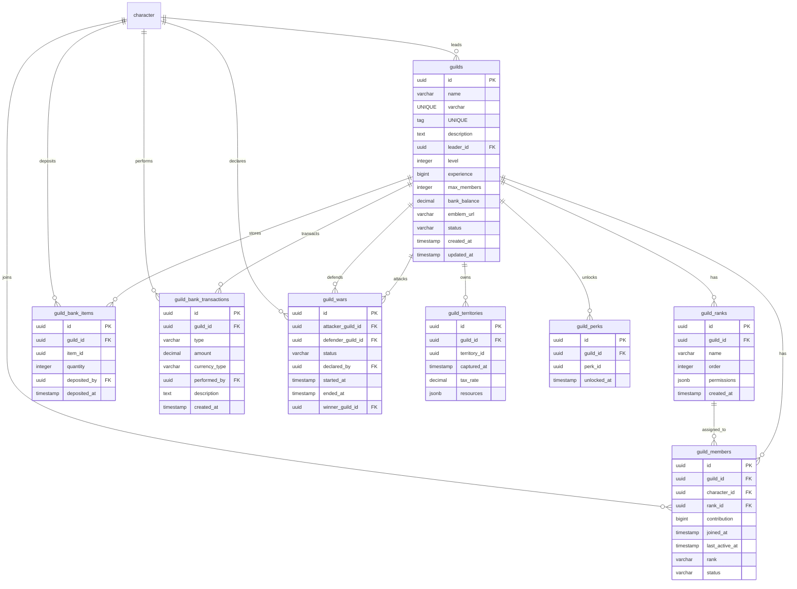

<!-- Issue: #140888360 -->

# Guild System - Database Schema

## Обзор

Схема базы данных для системы гильдий, включающая гильдии, участников, ранги, банк, войны, территории и перки.

## ERD Диаграмма



## Описание таблиц

### guilds

Таблица гильдий. Хранит информацию о гильдиях.

**Ключевые поля:**

- `id`: UUID первичный ключ
- `name`: Название гильдии (VARCHAR(100), UNIQUE, NOT NULL)
- `tag`: Тег гильдии (VARCHAR(10), UNIQUE, NOT NULL)
- `description`: Описание гильдии (TEXT, nullable)
- `leader_id`: ID лидера (FK к characters, NOT NULL)
- `level`: Уровень гильдии (INTEGER, NOT NULL, default: 1)
- `experience`: Опыт гильдии (BIGINT, NOT NULL, default: 0)
- `max_members`: Максимальное количество участников (INTEGER, NOT NULL, default: 50)
- `bank_balance`: Баланс банка (DECIMAL(20, 2), NOT NULL, default: 0)
- `emblem_url`: URL эмблемы (VARCHAR(500), nullable)
- `status`: Статус гильдии (VARCHAR(20), NOT NULL, default: 'active': 'active', 'disbanded', 'suspended')
- `created_at`: Время создания
- `updated_at`: Время последнего обновления

**Индексы:**

- По `name` для поиска по названию
- По `tag` для поиска по тегу
- По `leader_id` для гильдий лидера
- По `status` для активных гильдий

### guild_members

Таблица участников гильдий. Хранит информацию об участниках.

**Ключевые поля:**

- `id`: UUID первичный ключ
- `guild_id`: ID гильдии (FK к guilds, NOT NULL)
- `character_id`: ID персонажа (FK к characters, NOT NULL)
- `rank_id`: ID ранга (FK к guild_ranks, nullable)
- `rank`: Ранг участника (VARCHAR(20), NOT NULL, default: 'recruit')
- `status`: Статус участника (VARCHAR(20), NOT NULL, default: 'active')
- `contribution`: Вклад участника (BIGINT, NOT NULL, default: 0)
- `joined_at`: Время присоединения
- `last_active_at`: Время последней активности
- `updated_at`: Время последнего обновления

**Индексы:**

- По `(guild_id, character_id)` для уникальности
- По `(guild_id, status)` для участников гильдии
- По `(character_id, status)` для гильдий персонажа
- По `(guild_id, rank)` для участников по рангу
- По `(guild_id, rank_id)` для участников по rank_id

**Constraints:**

- UNIQUE(guild_id, character_id): Один участник на гильдию

### guild_ranks

Таблица рангов в гильдиях. Хранит информацию о рангах и правах.

**Ключевые поля:**

- `id`: UUID первичный ключ
- `guild_id`: ID гильдии (FK к guilds, NOT NULL)
- `name`: Название ранга (VARCHAR(50), NOT NULL)
- `order`: Порядок ранга (INTEGER, NOT NULL, default: 0)
- `permissions`: Права ранга (JSONB, NOT NULL, default: [])
- `created_at`: Время создания

**Индексы:**

- По `guild_id` для рангов гильдии
- По `(guild_id, order)` для сортировки по порядку
- По `(guild_id, name)` для поиска по названию

**Constraints:**

- UNIQUE(guild_id, name): Уникальное название ранга в гильдии

### guild_bank_items

Таблица предметов в банке гильдии. Хранит информацию о предметах в банке.

**Ключевые поля:**

- `id`: UUID первичный ключ
- `guild_id`: ID гильдии (FK к guilds, NOT NULL)
- `item_id`: ID предмета (UUID, NOT NULL)
- `quantity`: Количество (INTEGER, NOT NULL, default: 1, CHECK > 0)
- `deposited_by`: ID депозитора (FK к characters, NOT NULL)
- `deposited_at`: Время депозита

**Индексы:**

- По `guild_id` для предметов гильдии
- По `item_id` для поиска предмета

### guild_bank_transactions

Таблица транзакций банка гильдии. Хранит информацию о транзакциях.

**Ключевые поля:**

- `id`: UUID первичный ключ
- `guild_id`: ID гильдии (FK к guilds, NOT NULL)
- `type`: Тип транзакции (VARCHAR(20), NOT NULL: 'deposit', 'withdraw')
- `amount`: Сумма транзакции (DECIMAL(20, 2), nullable)
- `currency_type`: Тип валюты (VARCHAR(50), nullable)
- `currency`: Валюта (INTEGER, NOT NULL, default: 0) - legacy поле
- `items`: Предметы (JSONB, NOT NULL, default: []) - legacy поле
- `performed_by`: ID исполнителя (FK к characters, NOT NULL)
- `description`: Описание транзакции (TEXT, nullable)
- `created_at`: Время создания

**Индексы:**

- По `guild_id` для транзакций гильдии
- По `performed_by` для транзакций игрока
- По `created_at DESC` для последних транзакций

### guild_wars

Таблица гильдейских войн. Хранит информацию о войнах между гильдиями.

**Ключевые поля:**

- `id`: UUID первичный ключ
- `attacker_guild_id`: ID атакующей гильдии (FK к guilds, NOT NULL)
- `defender_guild_id`: ID защищающейся гильдии (FK к guilds, NOT NULL)
- `status`: Статус войны (VARCHAR(20), NOT NULL, default: 'declared': 'declared', 'active', 'ended', 'cancelled')
- `declared_by`: ID объявившего войну (FK к characters, NOT NULL)
- `started_at`: Время начала (TIMESTAMP, nullable)
- `ended_at`: Время окончания (TIMESTAMP, nullable)
- `winner_guild_id`: ID победившей гильдии (FK к guilds, nullable)

**Индексы:**

- По `(attacker_guild_id, status)` для войн атакующей гильдии
- По `(defender_guild_id, status)` для войн защищающейся гильдии
- По `status` для активных войн

**Constraints:**

- CHECK (attacker_guild_id != defender_guild_id): Гильдия не может воевать сама с собой

### guild_territories

Таблица территорий гильдий. Хранит информацию о захваченных территориях.

**Ключевые поля:**

- `id`: UUID первичный ключ
- `guild_id`: ID гильдии (FK к guilds, NOT NULL)
- `territory_id`: ID территории (UUID, NOT NULL)
- `captured_at`: Время захвата
- `tax_rate`: Налоговая ставка (DECIMAL(5, 2), NOT NULL, default: 0, CHECK 0-100)
- `resources`: Ресурсы территории (JSONB, default: {})

**Индексы:**

- По `guild_id` для территорий гильдии
- По `territory_id` для поиска территории

### guild_perks

Таблица перков гильдий. Хранит информацию о разблокированных перках.

**Ключевые поля:**

- `id`: UUID первичный ключ
- `guild_id`: ID гильдии (FK к guilds, NOT NULL)
- `perk_id`: ID перка (UUID, NOT NULL)
- `unlocked_at`: Время разблокировки

**Индексы:**

- По `guild_id` для перков гильдии
- По `perk_id` для поиска перка

**Constraints:**

- UNIQUE(guild_id, perk_id): Один перк на гильдию

## ENUM типы

### guild_status

- `active`: Активна
- `disbanded`: Распущена
- `suspended`: Приостановлена

### guild_war_status

- `declared`: Война объявлена
- `active`: Война активна
- `ended`: Война завершена
- `cancelled`: Война отменена

### bank_transaction_type

- `deposit`: Депозит
- `withdraw`: Снятие

## Constraints и валидация

### CHECK Constraints

- `guilds.status`: Должно быть одним из: 'active', 'disbanded', 'suspended'
- `guild_bank_items.quantity > 0`: Количество должно быть больше 0
- `guild_bank_transactions.type`: Должно быть одним из: 'deposit', 'withdraw'
- `guild_wars.status`: Должно быть одним из: 'declared', 'active', 'ended', 'cancelled'
- `guild_wars.attacker_guild_id != defender_guild_id`: Гильдия не может воевать сама с собой
- `guild_territories.tax_rate >= 0 AND tax_rate <= 100`: Налоговая ставка должна быть 0-100%

### Foreign Keys

- `guilds.leader_id` → `mvp_core.character.id` (ON DELETE CASCADE)
- `guild_members.guild_id` → `social.guilds.id` (ON DELETE CASCADE)
- `guild_members.character_id` → `mvp_core.character.id` (ON DELETE CASCADE)
- `guild_members.rank_id` → `social.guild_ranks.id` (ON DELETE SET NULL)
- `guild_ranks.guild_id` → `social.guilds.id` (ON DELETE CASCADE)
- `guild_bank_items.guild_id` → `social.guilds.id` (ON DELETE CASCADE)
- `guild_bank_items.deposited_by` → `mvp_core.character.id` (ON DELETE CASCADE)
- `guild_bank_transactions.guild_id` → `social.guilds.id` (ON DELETE CASCADE)
- `guild_bank_transactions.performed_by` → `mvp_core.character.id` (ON DELETE CASCADE)
- `guild_wars.attacker_guild_id` → `social.guilds.id` (ON DELETE CASCADE)
- `guild_wars.defender_guild_id` → `social.guilds.id` (ON DELETE CASCADE)
- `guild_wars.declared_by` → `mvp_core.character.id` (ON DELETE CASCADE)
- `guild_wars.winner_guild_id` → `social.guilds.id` (ON DELETE SET NULL)
- `guild_territories.guild_id` → `social.guilds.id` (ON DELETE CASCADE)
- `guild_perks.guild_id` → `social.guilds.id` (ON DELETE CASCADE)

### Unique Constraints

- `guilds.name`: Уникальное название гильдии
- `guilds.tag`: Уникальный тег гильдии
- `guild_members(guild_id, character_id)`: Один участник на гильдию
- `guild_ranks(guild_id, name)`: Уникальное название ранга в гильдии
- `guild_perks(guild_id, perk_id)`: Один перк на гильдию

## Оптимизация запросов

### Частые запросы

1. **Получение гильдии игрока:**
   ```sql
   SELECT g.* FROM social.guilds g
   JOIN social.guild_members gm ON g.id = gm.guild_id
   WHERE gm.character_id = $1 AND gm.status = 'active';
   ```
   Использует индекс `(character_id, status)`.

2. **Получение участников гильдии:**
   ```sql
   SELECT * FROM social.guild_members 
   WHERE guild_id = $1 AND status = 'active' 
   ORDER BY joined_at ASC;
   ```
   Использует индекс `(guild_id, status)`.

3. **Получение рангов гильдии:**
   ```sql
   SELECT * FROM social.guild_ranks 
   WHERE guild_id = $1 
   ORDER BY "order" ASC;
   ```
   Использует индекс `(guild_id, order)`.

4. **Получение активных войн гильдии:**
   ```sql
   SELECT * FROM social.guild_wars 
   WHERE (attacker_guild_id = $1 OR defender_guild_id = $1) 
   AND status IN ('declared', 'active');
   ```
   Использует индексы `(attacker_guild_id, status)` и `(defender_guild_id, status)`.

5. **Получение транзакций банка:**
   ```sql
   SELECT * FROM social.guild_bank_transactions 
   WHERE guild_id = $1 
   ORDER BY created_at DESC 
   LIMIT 50;
   ```
   Использует индекс `guild_id` и `created_at DESC`.

## Миграции

### Существующие миграции:

- `V1_14__guild_tables.sql` - базовые таблицы (guilds, guild_members, guild_invitations, guild_banks)
- `V1_29__guild_ranks_tables.sql` - таблица рангов
- `V1_30__guild_bank_transactions_tables.sql` - таблица транзакций
- `V1_66__guild_system_enhancement.sql` - расширенные таблицы и поля

### Применение миграций:

```bash
liquibase update --changelog-file=infrastructure/liquibase/changelog.yaml
```

## Соответствие архитектуре

Схема БД полностью соответствует архитектуре из `knowledge/implementation/architecture/guild-system-architecture.yaml`:

- [OK] Все таблицы из архитектуры созданы
- [OK] Все поля соответствуют описанию
- [OK] Индексы оптимизированы для частых запросов
- [OK] Constraints обеспечивают целостность данных
- [OK] Foreign Keys настроены с CASCADE/SET NULL для автоматической очистки
- [OK] Интеграция с существующими таблицами (characters)

## Особенности реализации

### Гильдии

Система гильдий включает:

- **Уровни**: level (1-50)
- **Опыт**: experience (BIGINT) для больших значений
- **Участники**: max_members (default: 50)
- **Банк**: bank_balance (DECIMAL(20, 2)) для точных значений
- **Статусы**: active, disbanded, suspended
- **Эмблема**: emblem_url для визуального представления

### Участники

Система участников включает:

- **Ранги**: rank_id (FK к guild_ranks) и rank (legacy)
- **Вклад**: contribution (BIGINT) для больших значений
- **Активность**: last_active_at для отслеживания активности
- **Статусы**: active для активных участников

### Ранги

Система рангов включает:

- **Порядок**: order для сортировки
- **Права**: permissions (JSONB) для гибкой системы прав
- **Уникальность**: уникальное название ранга в гильдии

### Банк

Система банка включает:

- **Предметы**: guild_bank_items для хранения предметов
- **Транзакции**: guild_bank_transactions для истории
- **Валюта**: amount и currency_type для гибкости
- **Описание**: description для детализации транзакций

### Войны

Система войн включает:

- **Статусы**: declared, active, ended, cancelled
- **Победитель**: winner_guild_id для определения победителя
- **Временные метки**: started_at и ended_at для отслеживания

### Территории

Система территорий включает:

- **Налоги**: tax_rate (0-100%) для управления экономикой
- **Ресурсы**: resources (JSONB) для гибкой структуры
- **Захват**: captured_at для отслеживания времени захвата

### Перки

Система перков включает:

- **Разблокировка**: unlocked_at для отслеживания времени
- **Уникальность**: один перк на гильдию

### Интеграция с другими системами

Система гильдий интегрируется с:

- **Characters**: через character_id для участников и лидеров
- **Economy Service**: через guild_bank_transactions для банка
- **World Service**: через guild_wars и guild_territories для войн и территории
- **Social Service**: через guild_invitations для приглашений

