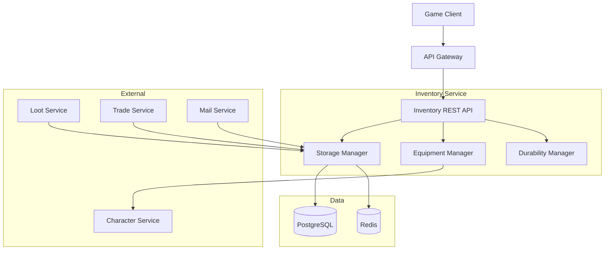

<!-- Issue: #135 -->

# Архитектура системы инвентаря (Inventory System)

## Метаданные

- **ID:** architecture-inventory-system
- **Версия:** 1.0.0
- **Дата:** 2025-12-02
- **Автор:** Architect Agent
- **Статус:** Draft
- **Теги:** architecture, inventory, economy, equipment

## Краткое описание

Inventory System управляет предметами игроков, экипировкой, хранилищем с поддержкой стеков, слотов, bind-on-pickup/equip и прочности предметов.

## Связанные документы

- `knowledge/implementation/backend/inventory-system/README.yaml`
- `knowledge/implementation/backend/inventory-system/part1-core-system.yaml`
- `knowledge/implementation/backend/inventory-system/part2-advanced-features.yaml`

---

## 1. Архитектурный обзор

### 1.1. Цели

1. **Хранение предметов** - инвентарь, банк, экипировка
2. **Стаки и слоты** - оптимизация пространства
3. **Экипировка** - equip/unequip с валидацией требований
4. **Binding** - bind-on-pickup, bind-on-equip
5. **Прочность** - durability system с ремонтом
6. **Передача** - между игроками, почта, трейд

### 1.2. Компоненты



---

## 2. Компоненты

### 2.1. Inventory Service (в Economy Service)

**Технологии:** Go, gRPC, REST, PostgreSQL, Redis

**Подкомпоненты:**

#### Storage Manager
- Управление слотами (bag, bank)
- Стаки предметов
- Добавление/удаление
- Сортировка

#### Equipment Manager
- Экипировка предметов
- Валидация требований (level, class)
- Слоты экипировки
- Bonuses расчёт

#### Durability Manager
- Снижение прочности
- Ремонт предметов
- Разрушение при 0 durability

### 2.2. Data Storage

#### PostgreSQL

```sql
CREATE TABLE player_inventory (
    id UUID PRIMARY KEY,
    player_id UUID NOT NULL,
    item_id UUID NOT NULL,
    quantity INTEGER NOT NULL DEFAULT 1,
    slot_index INTEGER,                   -- позиция в сумке (0-99)
    storage_type VARCHAR(50) NOT NULL,    -- 'bag', 'bank', 'equipped'
    equipment_slot VARCHAR(50),           -- 'head', 'chest', 'weapon', etc.
    
    -- Binding
    is_bound BOOLEAN DEFAULT FALSE,
    bind_type VARCHAR(50),                -- 'pickup', 'equip', 'none'
    
    -- Durability
    current_durability INTEGER,
    max_durability INTEGER,
    
    -- Metadata
    acquired_at TIMESTAMP NOT NULL DEFAULT NOW(),
    equipped_at TIMESTAMP
);

CREATE INDEX idx_inventory_player ON player_inventory(player_id, storage_type);
CREATE INDEX idx_inventory_item ON player_inventory(item_id);
CREATE INDEX idx_inventory_equipped ON player_inventory(player_id, equipment_slot) 
    WHERE storage_type = 'equipped';

CREATE TABLE item_definitions (
    id UUID PRIMARY KEY,
    item_name VARCHAR(255) NOT NULL,
    item_type VARCHAR(50) NOT NULL,      -- 'weapon', 'armor', 'consumable', etc.
    rarity VARCHAR(50),
    stack_size INTEGER DEFAULT 1,
    equip_slot VARCHAR(50),
    bind_type VARCHAR(50),
    base_durability INTEGER,
    required_level INTEGER,
    required_class VARCHAR(50),
    stats JSONB,                          -- {strength: 10, armor: 50, ...}
    icon_url VARCHAR(500)
);

CREATE INDEX idx_item_type ON item_definitions(item_type);
CREATE INDEX idx_item_rarity ON item_definitions(rarity);
```

#### Redis

- `inventory:{player_id}:bag` - кэш содержимого сумки (TTL: 5 мин)
- `inventory:{player_id}:equipped` - экипированные предметы (TTL: 5 мин)
- `item:def:{item_id}` - definition cache (TTL: 1 час)

---

## 3. API Endpoints

### 3.1. Inventory Management

#### GET /api/v1/economy/inventory
**Получить инвентарь**

Parameters: `storage_type` (bag, bank, equipped)

Response:
```json
{
  "items": [{
    "id": "uuid",
    "item_id": "uuid",
    "item_name": "Epic Sword",
    "quantity": 1,
    "slot_index": 5,
    "is_bound": false,
    "current_durability": 100,
    "max_durability": 100
  }],
  "total_slots": 100,
  "used_slots": 45
}
```

#### POST /api/v1/economy/inventory/add
**Добавить предмет** (internal, используется Loot Service)

Request: `{"item_id": "uuid", "quantity": 5}`

#### DELETE /api/v1/economy/inventory/{inventory_id}
**Удалить предмет**

#### POST /api/v1/economy/inventory/move
**Переместить предмет**

Request: `{"inventory_id": "uuid", "to_slot": 10}`

### 3.2. Equipment Management

#### POST /api/v1/economy/inventory/equip
**Экипировать**

Request: `{"inventory_id": "uuid", "equipment_slot": "weapon"}`

**Валидация:**
- Проверка level requirement
- Проверка class requirement
- Проверка equipment slot
- Bind-on-equip обработка

#### POST /api/v1/economy/inventory/unequip
**Снять**

Request: `{"equipment_slot": "weapon"}`

### 3.3. Durability

#### POST /api/v1/economy/inventory/repair
**Починить**

Request: `{"inventory_id": "uuid"}`

Response: `{"repair_cost": 500, "durability_restored": 100}`

---

## 4. Бизнес-логика

### 4.1. Storage Types

| Type | Max Slots | Description |
|------|-----------|-------------|
| bag | 100 | Основная сумка |
| bank | 500 | Банк (доступен в городах) |
| equipped | 15 | Экипированные предметы |

### 4.2. Equipment Slots

- `head`, `chest`, `legs`, `feet`, `hands` - броня
- `weapon`, `off_hand` - оружие и щит
- `ring1`, `ring2` - кольца
- `necklace`, `trinket1`, `trinket2` - аксессуары
- `back` - плащ

### 4.3. Binding Types

| Bind Type | Когда срабатывает |
|-----------|-------------------|
| `none` | Не привязывается |
| `pickup` | При подборе |
| `equip` | При экипировке |

### 4.4. Durability

- Снижение на 1-5 за смерть/использование
- Ремонт стоит % от цены предмета
- При 0 durability - предмет удаляется

---

## 5. Производительность

- GET inventory: < 100ms
- Equip/unequip: < 50ms
- Add item: < 30ms
- Cache hit rate: > 90%

---

## 6. Разбиение на подзадачи

### 6.1. Database Schema (P0)
**Срок:** 1 неделя

### 6.2. Storage Manager (P0)
**Срок:** 2 недели

### 6.3. Equipment Manager (P0)
**Срок:** 2 недели

### 6.4. Durability System (P1)
**Срок:** 1 неделя

### 6.5. Integration Layer (P1)
**Срок:** 1 неделя

---

## 7. Критерии готовности

- [x] Архитектура спроектирована
- [x] Компоненты определены
- [x] Микросервисы идентифицированы
- [x] API endpoints описаны
- [x] Система экипировки спроектирована
- [x] Техническое задание готово

---

**Конец документа**


