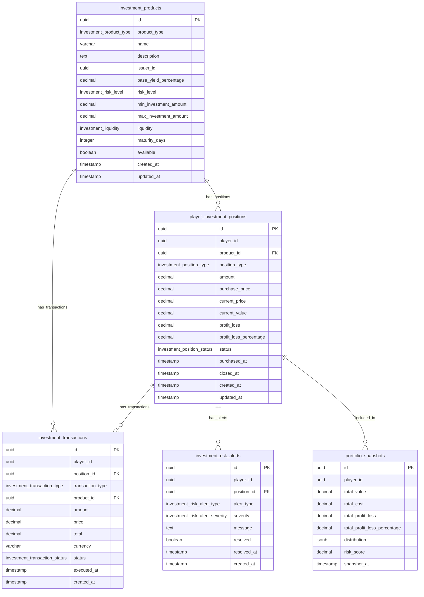

<!-- Issue: #140890222 -->
# Investments System - Database Schema

## Обзор

Схема базы данных для системы инвестиций, управляющей портфелями игроков, различными типами инвестиций (акции, облигации, недвижимость, производственные доли, спекуляции), транзакциями, аналитикой и рисками.

## ERD Диаграмма



## Описание таблиц

### investment_products

Таблица инвестиционных продуктов. Хранит информацию о доступных продуктах для инвестирования.

**Ключевые поля:**
- `id`: UUID первичный ключ
- `product_type`: Тип продукта (investment_product_type ENUM, NOT NULL)
- `name`: Название продукта (VARCHAR(255), NOT NULL)
- `description`: Описание продукта (TEXT, nullable)
- `issuer_id`: ID эмитента (корпорации/фракции) (UUID, nullable)
- `base_yield_percentage`: Базовая доходность в процентах (DECIMAL(5,2), NOT NULL)
- `risk_level`: Уровень риска (investment_risk_level ENUM, NOT NULL)
- `min_investment_amount`: Минимальная сумма инвестиции (DECIMAL(10,2), NOT NULL)
- `max_investment_amount`: Максимальная сумма инвестиции (DECIMAL(10,2), nullable - NULL = без ограничений)
- `liquidity`: Ликвидность (investment_liquidity ENUM, NOT NULL)
- `maturity_days`: Срок погашения в днях (INTEGER, nullable - для облигаций)
- `available`: Доступность продукта (BOOLEAN, NOT NULL, default: true)
- `created_at`: Время создания
- `updated_at`: Время последнего обновления

**Индексы:**
- По `(product_type, available)` для фильтрации доступных продуктов по типу
- По `issuer_id` для продуктов конкретного эмитента (WHERE issuer_id IS NOT NULL)
- По `risk_level` для фильтрации по уровню риска

### player_investment_positions

Таблица инвестиционных позиций игроков. Хранит информацию о текущих и закрытых позициях игроков.

**Ключевые поля:**
- `id`: UUID первичный ключ
- `player_id`: ID игрока (FK accounts, NOT NULL)
- `product_id`: ID продукта (FK investment_products, NOT NULL)
- `position_type`: Тип позиции (investment_position_type ENUM, nullable - NULL = long по умолчанию)
- `amount`: Количество единиц продукта (DECIMAL(10,2), NOT NULL)
- `purchase_price`: Цена покупки за единицу (DECIMAL(10,2), NOT NULL)
- `current_price`: Текущая цена за единицу (DECIMAL(10,2), NOT NULL)
- `current_value`: Текущая стоимость позиции (DECIMAL(10,2), NOT NULL)
- `profit_loss`: Прибыль/убыток в абсолютных значениях (DECIMAL(10,2), NOT NULL, default: 0)
- `profit_loss_percentage`: Прибыль/убыток в процентах (DECIMAL(5,2), NOT NULL, default: 0)
- `status`: Статус позиции (investment_position_status ENUM, NOT NULL, default: 'active')
- `purchased_at`: Время покупки
- `closed_at`: Время закрытия позиции (TIMESTAMP, nullable)
- `created_at`: Время создания
- `updated_at`: Время последнего обновления

**Индексы:**
- По `(player_id, status)` для позиций игрока по статусу
- По `(product_id, status)` для позиций по продукту и статусу
- По `purchased_at DESC` для временных запросов

### investment_transactions

Таблица транзакций по инвестициям. Хранит историю всех транзакций (покупка, продажа, дивиденды, проценты, комиссии, налоги).

**Ключевые поля:**
- `id`: UUID первичный ключ
- `player_id`: ID игрока (FK accounts, NOT NULL)
- `position_id`: ID позиции (FK player_investment_positions, nullable - NULL для транзакций без позиции)
- `transaction_type`: Тип транзакции (investment_transaction_type ENUM, NOT NULL)
- `product_id`: ID продукта (FK investment_products, NOT NULL)
- `amount`: Количество единиц (DECIMAL(10,2), NOT NULL)
- `price`: Цена за единицу (DECIMAL(10,2), nullable - NULL для дивидендов/процентов)
- `total`: Общая сумма транзакции (DECIMAL(10,2), NOT NULL)
- `currency`: Валюта (VARCHAR(10), NOT NULL, default: 'USD')
- `status`: Статус транзакции (investment_transaction_status ENUM, NOT NULL, default: 'pending')
- `executed_at`: Время выполнения транзакции
- `created_at`: Время создания

**Индексы:**
- По `(player_id, executed_at DESC)` для истории транзакций игрока
- По `position_id` для транзакций конкретной позиции (WHERE position_id IS NOT NULL)
- По `(transaction_type, status)` для фильтрации по типу и статусу

### portfolio_snapshots

Таблица снимков портфелей для аналитики. Хранит исторические снимки портфелей для анализа доходности и распределения.

**Ключевые поля:**
- `id`: UUID первичный ключ
- `player_id`: ID игрока (FK accounts, NOT NULL)
- `total_value`: Общая стоимость портфеля (DECIMAL(10,2), NOT NULL)
- `total_cost`: Общая стоимость покупки (DECIMAL(10,2), NOT NULL)
- `total_profit_loss`: Общая прибыль/убыток (DECIMAL(10,2), NOT NULL)
- `total_profit_loss_percentage`: Общая прибыль/убыток в процентах (DECIMAL(5,2), NOT NULL)
- `distribution`: Распределение портфеля по типам продуктов (JSONB, NOT NULL, default: '{}')
- `risk_score`: Оценка риска портфеля (DECIMAL(3,2), NOT NULL, default: 0.00, диапазон: 0.00-1.00)
- `snapshot_at`: Время создания снимка

**Индексы:**
- По `(player_id, snapshot_at DESC)` для истории снимков игрока
- По `snapshot_at DESC` для временных запросов

### investment_risk_alerts

Таблица алертов по рискам инвестиций. Хранит предупреждения о рисках (margin call, KYC, high risk, suitability warning).

**Ключевые поля:**
- `id`: UUID первичный ключ
- `player_id`: ID игрока (FK accounts, NOT NULL)
- `position_id`: ID позиции (FK player_investment_positions, nullable - NULL для портфельных алертов)
- `alert_type`: Тип алерта (investment_risk_alert_type ENUM, NOT NULL)
- `severity`: Серьезность алерта (investment_risk_alert_severity ENUM, NOT NULL)
- `message`: Текст сообщения (TEXT, NOT NULL)
- `resolved`: Решен ли алерт (BOOLEAN, NOT NULL, default: false)
- `resolved_at`: Время решения алерта (TIMESTAMP, nullable)
- `created_at`: Время создания

**Индексы:**
- По `(player_id, resolved)` для нерешенных алертов игрока
- По `(alert_type, severity)` для фильтрации по типу и серьезности

## ENUM типы

### investment_product_type
- `stock`: Акции
- `bond`: Облигации
- `real_estate`: Недвижимость
- `production_share`: Производственные доли
- `commodity_speculation`: Спекуляции на товарах

### investment_risk_level
- `low`: Низкий риск
- `medium`: Средний риск
- `high`: Высокий риск
- `very_high`: Очень высокий риск

### investment_liquidity
- `high`: Высокая ликвидность
- `medium`: Средняя ликвидность
- `low`: Низкая ликвидность

### investment_position_type
- `long`: Длинная позиция (покупка)
- `short`: Короткая позиция (продажа)

### investment_position_status
- `active`: Активная позиция
- `closed`: Закрытая позиция
- `suspended`: Приостановленная позиция

### investment_transaction_type
- `purchase`: Покупка
- `sale`: Продажа
- `dividend`: Дивиденды
- `interest`: Проценты
- `fee`: Комиссия
- `tax`: Налог

### investment_transaction_status
- `pending`: Ожидает выполнения
- `completed`: Выполнена
- `failed`: Не выполнена
- `cancelled`: Отменена

### investment_risk_alert_type
- `margin_call`: Маржинальный колл
- `kyc_required`: Требуется KYC
- `high_risk`: Высокий риск
- `suitability_warning`: Предупреждение о пригодности

### investment_risk_alert_severity
- `low`: Низкая серьезность
- `medium`: Средняя серьезность
- `high`: Высокая серьезность
- `critical`: Критическая серьезность

## Constraints и валидация

### Foreign Keys

- `player_investment_positions.product_id` → `economy.investment_products.id` (ON DELETE RESTRICT)
- `investment_transactions.position_id` → `economy.player_investment_positions.id` (ON DELETE SET NULL)
- `investment_transactions.product_id` → `economy.investment_products.id` (ON DELETE RESTRICT)
- `investment_risk_alerts.position_id` → `economy.player_investment_positions.id` (ON DELETE CASCADE)

## Оптимизация запросов

### Частые запросы

1. **Получение доступных продуктов по типу:**
   ```sql
   SELECT * FROM economy.investment_products 
   WHERE product_type = $1 AND available = true 
   ORDER BY risk_level, base_yield_percentage DESC;
   ```
   Использует индекс `(product_type, available)`.

2. **Получение активных позиций игрока:**
   ```sql
   SELECT * FROM economy.player_investment_positions 
   WHERE player_id = $1 AND status = 'active' 
   ORDER BY purchased_at DESC;
   ```
   Использует индекс `(player_id, status)`.

3. **Получение истории транзакций игрока:**
   ```sql
   SELECT * FROM economy.investment_transactions 
   WHERE player_id = $1 
   ORDER BY executed_at DESC 
   LIMIT 100;
   ```
   Использует индекс `(player_id, executed_at DESC)`.

4. **Получение последнего снимка портфеля:**
   ```sql
   SELECT * FROM economy.portfolio_snapshots 
   WHERE player_id = $1 
   ORDER BY snapshot_at DESC 
   LIMIT 1;
   ```
   Использует индекс `(player_id, snapshot_at DESC)`.

5. **Получение нерешенных алертов игрока:**
   ```sql
   SELECT * FROM economy.investment_risk_alerts 
   WHERE player_id = $1 AND resolved = false 
   ORDER BY severity DESC, created_at DESC;
   ```
   Использует индекс `(player_id, resolved)`.

## Миграции

### Применение миграций:
```bash
liquibase update --changelog-file=infrastructure/liquibase/changelog.yaml
```

## Соответствие архитектуре

Схема БД полностью соответствует архитектуре из `knowledge/implementation/architecture/economy-investments-system-architecture.yaml`:
- OK Все таблицы из архитектуры созданы
- OK Все поля соответствуют описанию
- OK Индексы оптимизированы для частых запросов
- OK Foreign Keys настроены с правильными действиями (RESTRICT, SET NULL, CASCADE)
- OK ENUM типы соответствуют архитектуре

## Особенности реализации

### Типы инвестиционных продуктов

Система поддерживает следующие типы продуктов:
- **stock**: Акции компаний (высокая волатильность, дивиденды)
- **bond**: Облигации (фиксированная доходность, срок погашения)
- **real_estate**: Недвижимость (стабильная доходность, низкая ликвидность)
- **production_share**: Производственные доли (доходность от производства)
- **commodity_speculation**: Спекуляции на товарах (высокий риск, высокая волатильность)

### Управление позициями

Позиции могут быть:
- **long**: Длинная позиция (покупка с ожиданием роста)
- **short**: Короткая позиция (продажа с ожиданием падения)

### Статусы позиций

Позиции проходят через следующие стадии:
1. **active**: Позиция активна, отслеживается прибыль/убыток
2. **closed**: Позиция закрыта, финальная прибыль/убыток зафиксированы
3. **suspended**: Позиция приостановлена (например, при маржинальном колле)

### Типы транзакций

Система поддерживает следующие типы транзакций:
- **purchase**: Покупка инвестиции
- **sale**: Продажа инвестиции
- **dividend**: Выплата дивидендов
- **interest**: Выплата процентов
- **fee**: Комиссия за транзакцию
- **tax**: Налог на прибыль

### Алерты по рискам

Система генерирует следующие типы алертов:
- **margin_call**: Маржинальный колл (требуется пополнение счета)
- **kyc_required**: Требуется KYC (проверка личности)
- **high_risk**: Высокий риск (превышение допустимого риска)
- **suitability_warning**: Предупреждение о пригодности (продукт не подходит игроку)

### Снимки портфелей

Снимки портфелей создаются для:
- Анализа исторической доходности
- Отслеживания изменений распределения
- Генерации отчетов и графиков
- Прогнозирования доходности

### Интеграция с другими системами

Система инвестиций интегрируется с:
- **Stock Exchange Service**: Получение данных об акциях, синхронизация цен, обработка дивидендов
- **Housing Service**: Получение данных о недвижимости, синхронизация доходности
- **Economy Events Service**: Влияние экономических событий на доходность и риски
- **Analytics Service**: Отправка метрик портфеля, получение аналитики и рекомендаций
- **Wallet Service**: Списание средств при покупке, начисление выплат, возврат средств при выходе

