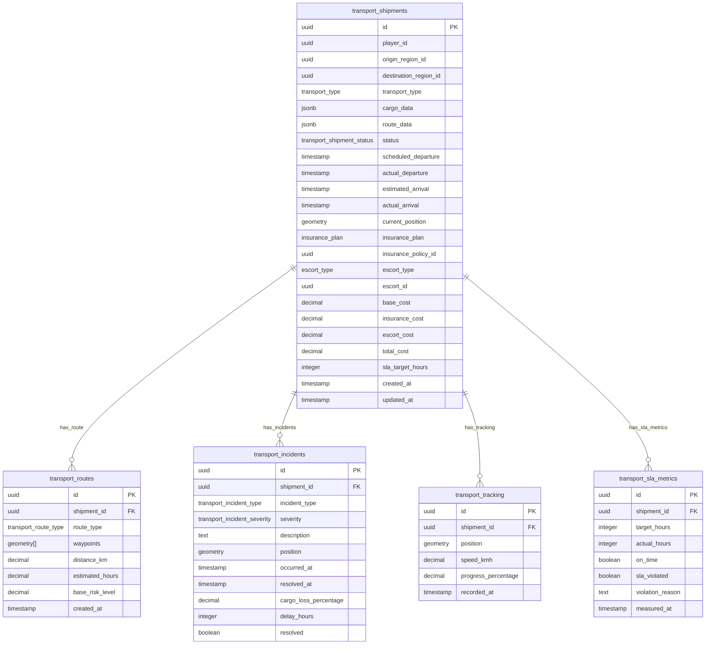

<!-- Issue: #140890225 -->
# Logistics System - Database Schema

## Обзор

Схема базы данных для системы логистики и перевозок, управляющей перемещением товаров между регионами с учётом рисков, страхования, эскорта и мониторинга SLA.

## ERD Диаграмма



## Описание таблиц

### transport_shipments

Таблица перевозок. Хранит информацию о перевозках товаров между регионами.

**Ключевые поля:**
- `id`: UUID первичный ключ
- `player_id`: ID игрока (FK accounts, NOT NULL)
- `origin_region_id`: ID региона отправления (FK regions, nullable)
- `destination_region_id`: ID региона назначения (FK regions, nullable)
- `transport_type`: Тип транспорта (transport_type ENUM, NOT NULL)
- `cargo_data`: Данные груза (JSONB, NOT NULL, default: '{}')
- `route_data`: Данные маршрута (JSONB, NOT NULL, default: '{}')
- `status`: Статус перевозки (transport_shipment_status ENUM, NOT NULL, default: 'DRAFT')
- `scheduled_departure`: Запланированное время отправления (TIMESTAMP, nullable)
- `actual_departure`: Фактическое время отправления (TIMESTAMP, nullable)
- `estimated_arrival`: Ожидаемое время прибытия (TIMESTAMP, nullable)
- `actual_arrival`: Фактическое время прибытия (TIMESTAMP, nullable)
- `current_position`: Текущая позиция перевозки (GEOMETRY(POINT, 4326), nullable - PostGIS, WGS84)
- `insurance_plan`: План страхования (insurance_plan ENUM, nullable)
- `insurance_policy_id`: ID страхового полиса (FK insurance_policies, nullable)
- `escort_type`: Тип эскорта (escort_type ENUM, nullable)
- `escort_id`: ID эскорта (UUID, nullable)
- `base_cost`: Базовая стоимость перевозки (DECIMAL(10,2), NOT NULL, default: 0)
- `insurance_cost`: Стоимость страхования (DECIMAL(10,2), NOT NULL, default: 0)
- `escort_cost`: Стоимость эскорта (DECIMAL(10,2), NOT NULL, default: 0)
- `total_cost`: Общая стоимость перевозки (DECIMAL(10,2), NOT NULL, default: 0)
- `sla_target_hours`: Целевое время доставки в часах (INTEGER, nullable)
- `created_at`: Время создания
- `updated_at`: Время последнего обновления

**Индексы:**
- По `(player_id, status)` для перевозок игрока по статусу
- По `(status, scheduled_departure)` для запланированных перевозок (WHERE scheduled_departure IS NOT NULL)
- По `(origin_region_id, destination_region_id)` для маршрутов (WHERE оба NOT NULL)
- По `current_position` (GIST индекс) для геопозиции (WHERE current_position IS NOT NULL)

### transport_routes

Таблица маршрутов перевозок. Хранит информацию о маршрутах с точками пути.

**Ключевые поля:**
- `id`: UUID первичный ключ
- `shipment_id`: ID перевозки (FK transport_shipments, NOT NULL)
- `route_type`: Тип маршрута (transport_route_type ENUM, NOT NULL)
- `waypoints`: Массив точек маршрута (GEOMETRY(POINT, 4326)[], nullable - PostGIS, WGS84)
- `distance_km`: Расстояние в километрах (DECIMAL(10,2), NOT NULL)
- `estimated_hours`: Ожидаемое время в часах (DECIMAL(10,2), NOT NULL)
- `base_risk_level`: Базовый уровень риска маршрута (DECIMAL(3,2), NOT NULL, default: 0.00, диапазон: 0.00-1.00)
- `created_at`: Время создания

**Индексы:**
- По `shipment_id` для маршрута конкретной перевозки

### transport_incidents

Таблица инцидентов перевозок. Хранит информацию об инцидентах (атаки, аварии, задержки).

**Ключевые поля:**
- `id`: UUID первичный ключ
- `shipment_id`: ID перевозки (FK transport_shipments, NOT NULL)
- `incident_type`: Тип инцидента (transport_incident_type ENUM, NOT NULL)
- `severity`: Серьезность инцидента (transport_incident_severity ENUM, NOT NULL)
- `description`: Описание инцидента (TEXT, nullable)
- `position`: Позиция инцидента (GEOMETRY(POINT, 4326), nullable - PostGIS, WGS84)
- `occurred_at`: Время возникновения инцидента
- `resolved_at`: Время разрешения инцидента (TIMESTAMP, nullable)
- `cargo_loss_percentage`: Процент потери груза (DECIMAL(5,2), NOT NULL, default: 0.00, диапазон: 0.00-100.00)
- `delay_hours`: Задержка в часах (INTEGER, NOT NULL, default: 0)
- `resolved`: Разрешен ли инцидент (BOOLEAN, NOT NULL, default: false)

**Индексы:**
- По `(shipment_id, occurred_at DESC)` для инцидентов перевозки
- По `(incident_type, severity)` для фильтрации по типу и серьезности
- По `position` (GIST индекс) для геопозиции (WHERE position IS NOT NULL)

### transport_tracking

Таблица отслеживания позиций перевозок. Хранит историю позиций перевозок в реальном времени.

**Ключевые поля:**
- `id`: UUID первичный ключ
- `shipment_id`: ID перевозки (FK transport_shipments, NOT NULL)
- `position`: Позиция перевозки (GEOMETRY(POINT, 4326), NOT NULL - PostGIS, WGS84)
- `speed_kmh`: Скорость в км/ч (DECIMAL(10,2), nullable)
- `progress_percentage`: Прогресс доставки в процентах (DECIMAL(5,2), NOT NULL, default: 0.00, диапазон: 0.00-100.00)
- `recorded_at`: Время записи позиции

**Индексы:**
- По `(shipment_id, recorded_at DESC)` для истории позиций перевозки
- По `position` (GIST индекс) для геопозиции

### transport_sla_metrics

Таблица метрик SLA перевозок. Хранит метрики для мониторинга времени доставки.

**Ключевые поля:**
- `id`: UUID первичный ключ
- `shipment_id`: ID перевозки (FK transport_shipments, NOT NULL)
- `target_hours`: Целевое время доставки в часах (INTEGER, NOT NULL)
- `actual_hours`: Фактическое время доставки в часах (INTEGER, nullable)
- `on_time`: Доставка в срок (BOOLEAN, nullable - NULL если еще не завершена)
- `sla_violated`: Нарушено ли SLA (BOOLEAN, NOT NULL, default: false)
- `violation_reason`: Причина нарушения SLA (TEXT, nullable)
- `measured_at`: Время измерения метрики

**Индексы:**
- По `shipment_id` для метрик конкретной перевозки
- По `(sla_violated, measured_at DESC)` для нарушений SLA

## ENUM типы

### transport_type
- `ground`: Наземный транспорт
- `air`: Воздушный транспорт
- `rail`: Железнодорожный транспорт
- `courier`: Курьерская доставка
- `player_pickup`: Самовывоз игроком

### transport_shipment_status
- `DRAFT`: Черновик (перевозка создана, но не запланирована)
- `SCHEDULED`: Запланирована (перевозка запланирована на определенное время)
- `IN_TRANSIT`: В пути (перевозка активна)
- `DELAYED`: Задержана (перевозка задержана из-за инцидента)
- `DELIVERED`: Доставлена (перевозка успешно завершена)
- `LOST`: Потеряна (груз потерян из-за критического инцидента)
- `CANCELLED`: Отменена (перевозка отменена)

### insurance_plan
- `none`: Без страхования
- `basic`: Базовое страхование
- `premium`: Премиум страхование
- `full`: Полное страхование

### escort_type
- `none`: Без эскорта
- `npc_escort`: Эскорт NPC
- `player_escort`: Эскорт игроков
- `armored_transport`: Бронированный транспорт

### transport_route_type
- `local`: Локальный маршрут
- `regional`: Региональный маршрут
- `global`: Глобальный маршрут

### transport_incident_type
- `bandit_attack`: Атака бандитов
- `accident`: Авария
- `customs_delay`: Таможенная задержка
- `weather`: Погодные условия
- `other`: Другое

### transport_incident_severity
- `low`: Низкая серьезность
- `medium`: Средняя серьезность
- `high`: Высокая серьезность
- `critical`: Критическая серьезность

## Constraints и валидация

### CHECK Constraints

- `transport_routes.base_risk_level`: >= 0.00 AND <= 1.00
- `transport_incidents.cargo_loss_percentage`: >= 0.00 AND <= 100.00
- `transport_tracking.progress_percentage`: >= 0.00 AND <= 100.00

### Foreign Keys

- `transport_routes.shipment_id` → `logistics.transport_shipments.id` (ON DELETE CASCADE)
- `transport_incidents.shipment_id` → `logistics.transport_shipments.id` (ON DELETE CASCADE)
- `transport_tracking.shipment_id` → `logistics.transport_shipments.id` (ON DELETE CASCADE)
- `transport_sla_metrics.shipment_id` → `logistics.transport_shipments.id` (ON DELETE CASCADE)

## Оптимизация запросов

### Частые запросы

1. **Получение активных перевозок игрока:**
   ```sql
   SELECT * FROM logistics.transport_shipments 
   WHERE player_id = $1 AND status IN ('SCHEDULED', 'IN_TRANSIT', 'DELAYED') 
   ORDER BY scheduled_departure ASC;
   ```
   Использует индекс `(player_id, status)`.

2. **Получение перевозок по маршруту:**
   ```sql
   SELECT * FROM logistics.transport_shipments 
   WHERE origin_region_id = $1 AND destination_region_id = $2 
   AND status = 'IN_TRANSIT';
   ```
   Использует индекс `(origin_region_id, destination_region_id)`.

3. **Получение позиции перевозки:**
   ```sql
   SELECT * FROM logistics.transport_tracking 
   WHERE shipment_id = $1 
   ORDER BY recorded_at DESC 
   LIMIT 1;
   ```
   Использует индекс `(shipment_id, recorded_at DESC)`.

4. **Получение инцидентов перевозки:**
   ```sql
   SELECT * FROM logistics.transport_incidents 
   WHERE shipment_id = $1 
   ORDER BY occurred_at DESC;
   ```
   Использует индекс `(shipment_id, occurred_at DESC)`.

5. **Поиск перевозок в радиусе:**
   ```sql
   SELECT * FROM logistics.transport_shipments 
   WHERE current_position IS NOT NULL 
   AND ST_DWithin(current_position, ST_MakePoint($1, $2)::geography, $3);
   ```
   Использует GIST индекс `current_position`.

## Миграции

### Применение миграций:
```bash
liquibase update --changelog-file=infrastructure/liquibase/changelog.yaml
```

**Примечание:** Миграция требует расширения PostGIS для работы с геопозициями. Если PostGIS недоступен, можно использовать альтернативу с JSONB для координат.

## Соответствие архитектуре

Схема БД полностью соответствует архитектуре из `knowledge/implementation/architecture/economy-logistics-system-architecture.yaml`:
- [OK] Все таблицы из архитектуры созданы
- [OK] Все поля соответствуют описанию
- [OK] Индексы оптимизированы для частых запросов
- [OK] Foreign Keys настроены с CASCADE для автоматической очистки
- [OK] ENUM типы соответствуют архитектуре
- [OK] Использован PostGIS для геопозиций (POINT, GIST индексы)

## Особенности реализации

### Жизненный цикл перевозок

Перевозки проходят через следующие стадии:
1. **DRAFT**: Перевозка создана, но не запланирована
2. **SCHEDULED**: Перевозка запланирована на определенное время
3. **IN_TRANSIT**: Перевозка активна, груз в пути
4. **DELAYED**: Перевозка задержана из-за инцидента
5. **DELIVERED**: Перевозка успешно завершена
6. **LOST**: Груз потерян из-за критического инцидента
7. **CANCELLED**: Перевозка отменена

### Типы транспорта

Система поддерживает следующие типы транспорта:
- **ground**: Наземный транспорт (грузовики, фургоны)
- **air**: Воздушный транспорт (самолеты, вертолеты)
- **rail**: Железнодорожный транспорт (поезда)
- **courier**: Курьерская доставка (быстрая, но дорогая)
- **player_pickup**: Самовывоз игроком (бесплатно, но требует времени игрока)

### Страхование

Система поддерживает следующие планы страхования:
- **none**: Без страхования (нет защиты от потери)
- **basic**: Базовое страхование (частичная компенсация)
- **premium**: Премиум страхование (большая компенсация)
- **full**: Полное страхование (полная компенсация)

### Эскорт

Система поддерживает следующие типы эскорта:
- **none**: Без эскорта (высокий риск атак)
- **npc_escort**: Эскорт NPC (снижение риска атак)
- **player_escort**: Эскорт игроков (значительное снижение риска)
- **armored_transport**: Бронированный транспорт (максимальная защита)

### Инциденты

Система обрабатывает следующие типы инцидентов:
- **bandit_attack**: Атака бандитов (может привести к потере груза)
- **accident**: Авария (может привести к задержке или повреждению груза)
- **customs_delay**: Таможенная задержка (задержка доставки)
- **weather**: Погодные условия (задержка доставки)
- **other**: Другие инциденты

### Отслеживание в реальном времени

Система отслеживания использует:
- **PostGIS POINT**: Для хранения геопозиций (WGS84)
- **GIST индексы**: Для быстрого поиска по геопозиции
- **WebSocket**: Для обновлений в реальном времени
- **Периодические обновления**: Позиция обновляется каждые 1-5 секунд

### SLA мониторинг

Система мониторинга SLA отслеживает:
- **Целевое время доставки**: SLA target_hours
- **Фактическое время доставки**: actual_hours
- **Нарушения SLA**: sla_violated, violation_reason
- **KPI метрики**: Для анализа производительности

### Интеграция с другими системами

Система логистики интегрируется с:
- **Economy Service**: Получение данных о грузе, синхронизация стоимости
- **Inventory Service**: Резервирование груза, передача в пункте назначения
- **Insurance Service**: Расчёт стоимости страхования, создание полисов, обработка требований
- **World Service**: Получение данных о регионах и маршрутах, интеграция с картой
- **Economy Events Service**: Влияние экономических событий на риски и стоимость
- **Notification Service**: Уведомления о статусе перевозки, инцидентах, доставке

