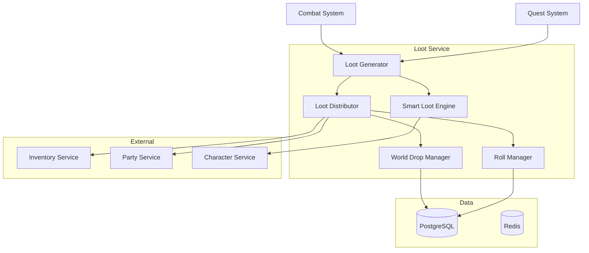
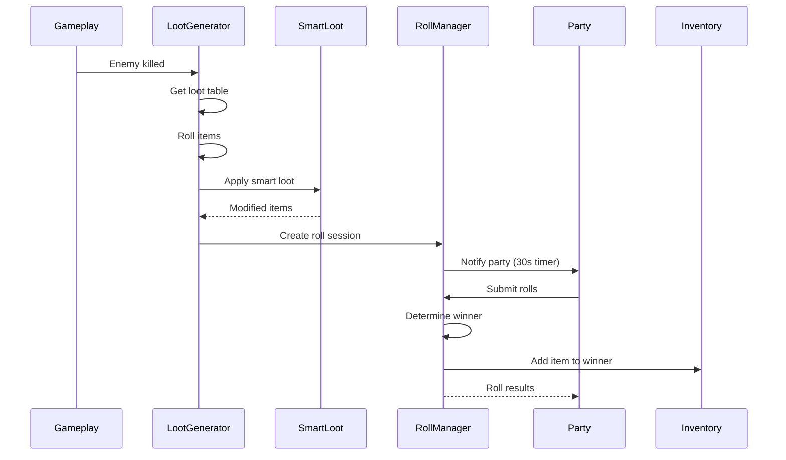

<!-- Issue: #142 -->

# Архитектура системы лута (Loot System)

## Метаданные

- **ID:** architecture-loot-system
- **Версия:** 1.0.0
- **Дата:** 2025-12-02
- **Автор:** Architect Agent
- **Статус:** Draft
- **Теги:** architecture, loot, economy, gameplay

## Краткое описание

Loot System управляет генерацией, распределением и выдачей предметов игрокам из таблиц лута с поддержкой рарности, Smart
Loot, Bad Luck Protection и различных режимов распределения.

## Связанные документы

- `knowledge/implementation/backend/loot-system/README.yaml`
- `knowledge/implementation/backend/loot-system/part1-loot-generation.yaml`
- `knowledge/implementation/backend/loot-system/part2-advanced-loot.yaml`

---

## 1. Архитектурный обзор

### 1.1. Цели системы

1. **Генерация лута** - из таблиц на основе вероятностей и рарности
2. **Распределение** - personal/shared/party roll режимы
3. **Smart Loot** - подбор предметов по классу и специализации
4. **Boss Loot** - гарантированные награды с боссов
5. **Bad Luck Protection** - защита от долгого отсутствия легендарных предметов
6. **World Drops** - физические объекты в мире для подбора

### 1.2. Компоненты



---

## 2. Компоненты системы

### 2.1. Loot Service (в Economy Service)

**Технологии:** Go, gRPC, PostgreSQL, Redis

**Подкомпоненты:**

#### Loot Generator

- Генерация предметов из таблиц
- Применение rarity weights
- Luck модификаторы
- Валютные награды

#### Loot Distributor

- Определение режима распределения (personal/party/roll)
- Создание world drops
- Прямая выдача в инвентарь

#### Smart Loot Engine

- Анализ класса и спека игрока
- Повышение вероятности подходящих предметов
- Исключение неподходящих

#### Roll Manager

- Управление roll-системой
- Need/Greed/Pass логика
- Определение победителя

#### World Drop Manager

- Создание физических объектов в мире
- TTL и автоочистка
- Pickup механика

### 2.2. Data Storage

#### PostgreSQL

```sql
CREATE TABLE loot_tables (
    id UUID PRIMARY KEY,
    source_type VARCHAR(50) NOT NULL,     -- 'mob', 'boss', 'chest', 'quest'
    source_id VARCHAR(255) NOT NULL,      -- mob_type_id или chest_id
    item_id UUID NOT NULL,
    drop_chance DECIMAL(5,4) NOT NULL,    -- 0.0001 - 1.0000
    quantity_min INTEGER DEFAULT 1,
    quantity_max INTEGER DEFAULT 1,
    rarity VARCHAR(50),                    -- 'common', 'rare', 'epic', 'legendary'
    required_level INTEGER,
    currency_type VARCHAR(50),
    currency_min INTEGER,
    currency_max INTEGER
);

CREATE INDEX idx_loot_source ON loot_tables(source_type, source_id);
CREATE INDEX idx_loot_rarity ON loot_tables(rarity);

CREATE TABLE world_drops (
    id UUID PRIMARY KEY,
    location_id UUID NOT NULL,
    position_x DECIMAL(10,2),
    position_y DECIMAL(10,2),
    position_z DECIMAL(10,2),
    items JSONB NOT NULL,                 -- [{item_id, quantity}, ...]
    currency JSONB,                        -- {type: amount}
    drop_status VARCHAR(50) NOT NULL,     -- 'active', 'picked_up', 'expired'
    owner_id UUID,                         -- для personal loot
    party_id UUID,                         -- для party loot
    created_at TIMESTAMP NOT NULL DEFAULT NOW(),
    expires_at TIMESTAMP NOT NULL,
    picked_up_at TIMESTAMP,
    picked_up_by UUID
);

CREATE INDEX idx_world_drops_location ON world_drops(location_id, drop_status);
CREATE INDEX idx_world_drops_expires ON world_drops(expires_at) WHERE drop_status = 'active';

CREATE TABLE loot_rolls (
    id UUID PRIMARY KEY,
    world_drop_id UUID NOT NULL REFERENCES world_drops(id),
    party_id UUID NOT NULL,
    item_id UUID NOT NULL,
    roll_results JSONB NOT NULL,          -- [{player_id, roll_type, roll_value}, ...]
    winner_id UUID,
    roll_status VARCHAR(50) NOT NULL,     -- 'pending', 'completed', 'cancelled'
    started_at TIMESTAMP NOT NULL DEFAULT NOW(),
    completed_at TIMESTAMP
);

CREATE INDEX idx_loot_rolls_party ON loot_rolls(party_id, roll_status);
CREATE INDEX idx_loot_rolls_drop ON loot_rolls(world_drop_id);

CREATE TABLE player_loot_history (
    id BIGSERIAL PRIMARY KEY,
    player_id UUID NOT NULL,
    item_id UUID NOT NULL,
    item_rarity VARCHAR(50),
    quantity INTEGER,
    source_type VARCHAR(50),
    received_at TIMESTAMP NOT NULL DEFAULT NOW()
);

CREATE INDEX idx_loot_history_player ON player_loot_history(player_id, received_at DESC);
CREATE INDEX idx_loot_history_legendary ON player_loot_history(player_id, item_rarity) 
    WHERE item_rarity = 'legendary';
```

#### Redis

- `loot:tables:{source_type}:{source_id}` - кэш таблиц лута (TTL: 1 час)
- `loot:bad_luck:{player_id}` - счётчик для Bad Luck Protection
- `loot:active_rolls:{party_id}` - активные rolls (TTL: 5 минут)

---

## 3. API Endpoints

### 3.1. Loot Management

#### GET /api/v1/economy/loot/drops/nearby

**Получить дропы поблизости**

Parameters: `location_id`, `radius`

Response:

```json
{
  "drops": [
    {
      "id": "uuid",
      "position": {"x": 100.5, "y": 50.2, "z": 10.0},
      "items": [{"item_id": "uuid", "name": "Epic Sword", "rarity": "epic"}],
      "currency": {"gold": 500},
      "can_pickup": true,
      "expires_in_seconds": 180
    }
  ]
}
```

#### POST /api/v1/economy/loot/pickup/{drop_id}

**Подобрать дроп**

Response:

```json
{
  "success": true,
  "items_received": [...],
  "currency_received": {...}
}
```

Автоматически добавляет предметы в инвентарь.

#### GET /api/v1/economy/loot/history

**История полученных предметов**

Parameters: `rarity`, `limit`, `before_timestamp`

Response:

```json
{
  "history": [
    {
      "item_id": "uuid",
      "item_name": "Legendary Gun",
      "rarity": "legendary",
      "quantity": 1,
      "source": "boss_defeated",
      "received_at": "2025-12-02T10:00:00Z"
    }
  ]
}
```

### 3.2. Roll System

#### GET /api/v1/economy/loot/rolls/active

**Получить активные rolls**

Response:

```json
{
  "rolls": [
    {
      "roll_id": "uuid",
      "item_id": "uuid",
      "item_name": "Epic Helmet",
      "party_id": "uuid",
      "time_remaining": 25
    }
  ]
}
```

#### POST /api/v1/economy/loot/rolls/{roll_id}/submit

**Сделать roll**

Request: `{"roll_type": "need"|"greed"|"pass"}`

Response:

```json
{
  "roll_value": 87,
  "roll_type": "need",
  "player_id": "uuid"
}
```

### 3.3. Internal API

#### POST /internal/v1/loot/generate

**Генерация лута** (вызывается Gameplay Service)

Request:

```json
{
  "source_type": "mob",
  "source_id": "elite_enemy_001",
  "killer_id": "uuid",
  "party_id": "uuid",
  "location_id": "uuid",
  "position": {"x": 100, "y": 50, "z": 10}
}
```

Response:

```json
{
  "world_drop_id": "uuid",
  "items": [...],
  "currency": {...},
  "requires_roll": true
}
```

---

## 4. Алгоритмы

### 4.1. Генерация лута

```
1. Получить loot_table для source (mob/boss/chest)
2. Для каждой записи в таблице:
   a. Генерировать random (0.0 - 1.0)
   b. Если random < drop_chance * luck_modifier:
      - Добавить предмет в результат
      - Генерировать quantity (min - max)
3. Генерировать валюту (currency_min - currency_max)
4. Применить Smart Loot (если включен)
5. Вернуть результат
```

### 4.2. Smart Loot

**Логика:**

1. Получить класс и спек игрока
2. Для каждого предмета:
    - Если предмет подходит классу: weight *= 2.0
    - Если не подходит: weight *= 0.5
3. Пересчитать вероятности
4. Генерировать с новыми весами

**Пример:**

- Warrior получает больше strength/armor предметов
- Mage получает больше intelligence/mana предметов

### 4.3. Bad Luck Protection

**Механика:**

1. Отслеживание времени с последнего legendary drop
2. Если > 7 дней:
    - Увеличить шанс legendary на 10%
    - Каждый день: +5% бонус
3. При получении legendary - сброс счётчика

### 4.4. Boss Loot

**Гарантированные награды:**

- Каждый участник получает: currency + XP + гарантированный предмет (rare+)
- Party roll для epic/legendary предметов
- First kill bonus (дополнительный legendary)

---

## 5. Режимы распределения

| Mode          | Описание                    | Использование   |
|---------------|-----------------------------|-----------------|
| Personal      | Каждый игрок видит свой лут | Solo, PvE зоны  |
| Shared        | Все видят общий лут         | Party questing  |
| Party Roll    | Need/Greed система          | Dungeons, raids |
| Master Looter | Лидер распределяет          | Organized raids |
| Free for All  | Первый подобравший          | PvP зоны        |

---

## 6. Потоки данных

### 6.1. Генерация и распределение (Party Roll)



---

## 7. Производительность

### 7.1. Метрики

- Loot generation: < 50ms
- World drop creation: < 100ms
- Pickup response: < 200ms
- Throughput: 1000+ drops/sec

### 7.2. Оптимизации

**Кэширование:**

- Loot tables в Redis (TTL: 1 час)
- Снижение нагрузки на БД

**Автоочистка:**

- World drops с `expires_at < NOW()` удаляются каждые 5 минут
- Старые rolls (> 1 день) архивируются

**Партиционирование:**

- `player_loot_history` партиционирована по дате (ежемесячно)

---

## 8. Разбиение на подзадачи

### 8.1. Database Schema (P0)

Схемы `loot_tables`, `world_drops`, `loot_rolls`, `player_loot_history`
**Срок:** 1 неделя

### 8.2. Loot Generator (P0)

Core генерация из таблиц, rarity weights
**Срок:** 2 недели

### 8.3. Loot Distributor (P0)

Режимы распределения (personal/shared/roll)
**Срок:** 1.5 недели

### 8.4. Smart Loot Engine (P1)

Анализ класса, подбор подходящих предметов
**Срок:** 2 недели

### 8.5. Roll System (P0)

Need/Greed/Pass, таймеры, победитель
**Срок:** 1.5 недели

### 8.6. World Drop Manager (P0)

Физические объекты, pickup, автоочистка
**Срок:** 1 неделя

### 8.7. Bad Luck Protection (P2)

Отслеживание legendary drops, бонусы
**Срок:** 1 неделя

### 8.8. Boss Loot Logic (P1)

Гарантированные награды, first kill bonuses
**Срок:** 1 неделя

---

## 9. События

**Published:**

- `loot:generated` - лут сгенерирован
- `loot:picked_up` - предмет подобран
- `legendary:dropped` - выпал legendary предмет
- `loot:roll_started` - начат roll
- `loot:roll_completed` - roll завершён

**Subscribed:**

- `combat:enemy_killed` - враг убит
- `raid:boss_defeated` - босс побеждён
- `quest:objective_completed` - цель квеста выполнена
- `party:disbanded` - группа распущена (отменить rolls)

---

## 10. Рарность и вероятности

### 10.1. Rarity Tiers

| Rarity    | Color  | Base Drop Chance | Smart Loot Modifier |
|-----------|--------|------------------|---------------------|
| Common    | Gray   | 60%              | 1.0x                |
| Uncommon  | Green  | 25%              | 1.2x                |
| Rare      | Blue   | 10%              | 1.5x                |
| Epic      | Purple | 4%               | 2.0x                |
| Legendary | Orange | 1%               | 2.5x                |
| Mythic    | Red    | 0.1%             | 3.0x                |

### 10.2. Luck Modifiers

**Sources:**

- Player stats: +0% to +20%
- Buffs: +5% to +50%
- Party bonus: +10%
- First kill: +25%
- Bad Luck Protection: +10% per day (max +50%)

**Formula:**

```
Final Drop Chance = Base Drop Chance * (1 + sum(luck_modifiers))
```

---

## 11. Безопасность

### 11.1. Защита от эксплойтов

- Валидация прав на подбор (owner_id/party_id)
- Проверка дистанции до дропа (max 10m)
- Rate limiting на pickup (max 100/minute)
- Логирование всех подборов

### 11.2. Анти-дубликаты

- Проверка инвентаря для legendary+ предметов
- Bad Luck Protection для компенсации

---

## 12. Критерии готовности

- [x] Архитектура спроектирована
- [x] Компоненты определены
- [x] Микросервисы идентифицированы
- [x] API endpoints описаны
- [x] Система генерации лута спроектирована
- [x] Система распределения лута спроектирована
- [x] Техническое задание готово

---

**Конец документа**


