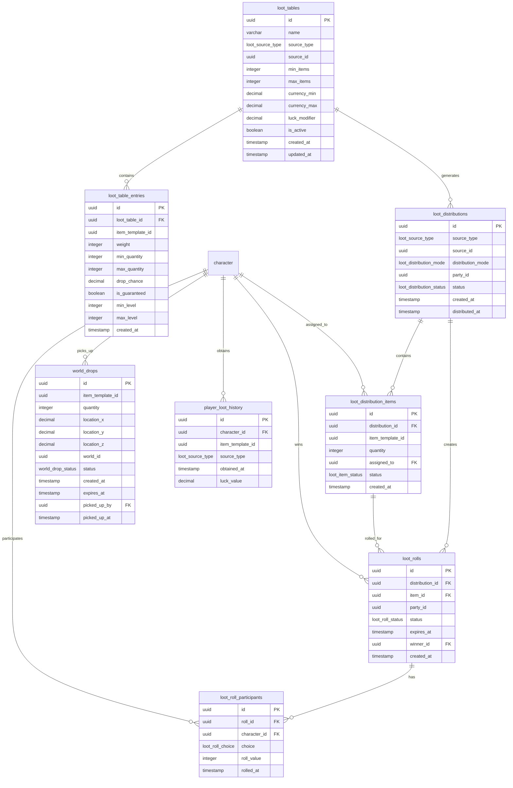

<!-- Issue: #140888539 -->
# Loot System - Database Schema

## Обзор

Схема базы данных для системы лута, включающая таблицы лута, распределения, roll систему, мировые дропы и историю лута игроков.

**Примечание:** Все таблицы уже созданы в миграции `V1_62__loot_tables_system_tables.sql` (Issue #140876092). Эта документация описывает полную схему системы лута.

## ERD Диаграмма



## Описание таблиц

### loot_tables

Таблица таблиц лута. Хранит определения дропов для различных источников.

**Ключевые поля:**
- `id`: UUID первичный ключ
- `name`: Название таблицы лута (VARCHAR(255), NOT NULL)
- `source_type`: Тип источника (ENUM: 'npc', 'container', 'quest', 'boss', 'world_event')
- `source_id`: ID источника (UUID, NOT NULL)
- `min_items`: Минимальное количество предметов (INTEGER, NOT NULL, default: 1, CHECK >= 0)
- `max_items`: Максимальное количество предметов (INTEGER, NOT NULL, default: 1, CHECK >= min_items)
- `currency_min`: Минимальная валюта (DECIMAL(20, 2), NOT NULL, default: 0.0, CHECK >= 0)
- `currency_max`: Максимальная валюта (DECIMAL(20, 2), NOT NULL, default: 0.0, CHECK >= currency_min)
- `luck_modifier`: Модификатор удачи (DECIMAL(5, 2), NOT NULL, default: 0.0)
- `is_active`: Активна ли таблица (BOOLEAN, NOT NULL, default: true)
- `created_at`: Время создания
- `updated_at`: Время последнего обновления

**Индексы:**
- По `(source_type, source_id)` для поиска по источнику
- По `is_active` для активных таблиц

### loot_table_entries

Таблица записей в таблицах лута. Хранит предметы с весами и шансами.

**Ключевые поля:**
- `id`: UUID первичный ключ
- `loot_table_id`: ID таблицы лута (FK к loot_tables, NOT NULL)
- `item_template_id`: ID шаблона предмета (UUID, NOT NULL)
- `weight`: Вес предмета (INTEGER, NOT NULL, default: 1, CHECK > 0)
- `min_quantity`: Минимальное количество (INTEGER, NOT NULL, default: 1, CHECK > 0)
- `max_quantity`: Максимальное количество (INTEGER, NOT NULL, default: 1, CHECK >= min_quantity)
- `drop_chance`: Шанс дропа в процентах (DECIMAL(5, 2), NOT NULL, default: 0.0, CHECK 0-100)
- `is_guaranteed`: Гарантированный дроп (BOOLEAN, NOT NULL, default: false)
- `min_level`: Минимальный уровень (INTEGER, nullable, CHECK >= 1)
- `max_level`: Максимальный уровень (INTEGER, nullable, CHECK >= min_level)
- `created_at`: Время создания

**Индексы:**
- По `loot_table_id` для записей таблицы
- По `item_template_id` для поиска предмета

### loot_distributions

Таблица распределений лута. Хранит сгенерированные дропы.

**Ключевые поля:**
- `id`: UUID первичный ключ
- `source_type`: Тип источника (ENUM: 'npc', 'container', 'quest', 'boss')
- `source_id`: ID источника (UUID, NOT NULL)
- `distribution_mode`: Режим распределения (ENUM: 'personal', 'party', 'shared', 'boss')
- `party_id`: ID группы (UUID, nullable)
- `status`: Статус распределения (ENUM: 'pending', 'distributed', 'expired')
- `created_at`: Время создания
- `distributed_at`: Время распределения (TIMESTAMP, nullable)

**Индексы:**
- По `(source_type, source_id)` для поиска по источнику
- По `(party_id, status)` для распределений группы
- По `(status, created_at)` для статуса распределения

### loot_distribution_items

Таблица предметов в распределениях. Хранит конкретные предметы для выдачи.

**Ключевые поля:**
- `id`: UUID первичный ключ
- `distribution_id`: ID распределения (FK к loot_distributions, NOT NULL)
- `item_template_id`: ID шаблона предмета (UUID, NOT NULL)
- `quantity`: Количество (INTEGER, NOT NULL, default: 1, CHECK > 0)
- `assigned_to`: ID получателя (FK к characters, nullable)
- `status`: Статус предмета (ENUM: 'pending', 'assigned', 'claimed')
- `created_at`: Время создания

**Индексы:**
- По `distribution_id` для предметов распределения
- По `(assigned_to, status)` для предметов игрока

### loot_rolls

Таблица roll сессий для групп. Хранит Need/Greed систему.

**Ключевые поля:**
- `id`: UUID первичный ключ
- `distribution_id`: ID распределения (FK к loot_distributions, NOT NULL)
- `item_id`: ID предмета (FK к loot_distribution_items, NOT NULL)
- `party_id`: ID группы (UUID, NOT NULL)
- `status`: Статус roll сессии (ENUM: 'active', 'completed', 'expired')
- `expires_at`: Время истечения (TIMESTAMP, NOT NULL)
- `winner_id`: ID победителя (FK к characters, nullable)
- `created_at`: Время создания

**Индексы:**
- По `distribution_id` для roll сессий распределения
- По `(party_id, status)` для roll сессий группы
- По `expires_at` для истекающих сессий

### loot_roll_participants

Таблица участников roll сессий. Хранит выборы игроков.

**Ключевые поля:**
- `id`: UUID первичный ключ
- `roll_id`: ID roll сессии (FK к loot_rolls, NOT NULL)
- `character_id`: ID персонажа (FK к characters, NOT NULL)
- `choice`: Выбор игрока (ENUM: 'need', 'greed', 'pass')
- `roll_value`: Значение roll (INTEGER, nullable, CHECK 1-100)
- `rolled_at`: Время броска (TIMESTAMP, nullable)

**Индексы:**
- По `(roll_id, character_id)` для уникальности
- По `(roll_id, choice)` для выборов по типу
- По `character_id` для roll сессий персонажа

**Constraints:**
- UNIQUE(roll_id, character_id): Один участник на roll сессию

### world_drops

Таблица мировых дропов. Хранит предметы, выпавшие в мире.

**Ключевые поля:**
- `id`: UUID первичный ключ
- `item_template_id`: ID шаблона предмета (UUID, NOT NULL)
- `quantity`: Количество (INTEGER, NOT NULL, default: 1, CHECK > 0)
- `location_x`: Координата X (DECIMAL(10, 2), NOT NULL)
- `location_y`: Координата Y (DECIMAL(10, 2), NOT NULL)
- `location_z`: Координата Z (DECIMAL(10, 2), NOT NULL)
- `world_id`: ID мира (UUID, NOT NULL)
- `status`: Статус дропа (ENUM: 'active', 'picked_up', 'expired')
- `created_at`: Время создания
- `expires_at`: Время истечения (TIMESTAMP, NOT NULL)
- `picked_up_by`: ID поднявшего (FK к characters, nullable)
- `picked_up_at`: Время подбора (TIMESTAMP, nullable)

**Индексы:**
- По `(world_id, location_x, location_y)` для поиска по координатам
- По `(status, expires_at)` для активных дропов
- По `(status, created_at)` для статуса дропа

### player_loot_history

Таблица истории лута игроков. Хранит данные для smart loot.

**Ключевые поля:**
- `id`: UUID первичный ключ
- `character_id`: ID персонажа (FK к characters, NOT NULL)
- `item_template_id`: ID шаблона предмета (UUID, NOT NULL)
- `source_type`: Тип источника (ENUM: 'npc', 'container', 'quest', 'boss')
- `obtained_at`: Время получения
- `luck_value`: Значение удачи (DECIMAL(5, 2), NOT NULL, default: 0.0)

**Индексы:**
- По `(character_id, obtained_at DESC)` для истории персонажа
- По `(item_template_id, character_id)` для предметов персонажа

## ENUM типы

### loot_source_type
- `npc`: Лут от NPC
- `container`: Лут из контейнеров
- `quest`: Награды за квесты
- `boss`: Лут от боссов
- `world_event`: Лут от мировых событий

### loot_distribution_mode
- `personal`: Личный лут
- `party`: Лут для группы
- `shared`: Общий лут
- `boss`: Специальный режим для боссов

### loot_distribution_status
- `pending`: Ожидает распределения
- `distributed`: Распределен
- `expired`: Истек

### loot_item_status
- `pending`: Ожидает назначения
- `assigned`: Назначен
- `claimed`: Получен

### loot_roll_status
- `active`: Активна
- `completed`: Завершена
- `expired`: Истекла

### loot_roll_choice
- `need`: Нужен предмет
- `greed`: Жадность
- `pass`: Пропустить

### world_drop_status
- `active`: Активен
- `picked_up`: Подобран
- `expired`: Истек

## Constraints и валидация

### CHECK Constraints

- `loot_tables.min_items >= 0`: Минимальное количество >= 0
- `loot_tables.max_items >= min_items`: Максимальное количество >= минимального
- `loot_tables.currency_min >= 0`: Минимальная валюта >= 0
- `loot_tables.currency_max >= currency_min`: Максимальная валюта >= минимальной
- `loot_table_entries.weight > 0`: Вес должен быть > 0
- `loot_table_entries.min_quantity > 0`: Минимальное количество > 0
- `loot_table_entries.max_quantity >= min_quantity`: Максимальное количество >= минимального
- `loot_table_entries.drop_chance >= 0 AND drop_chance <= 100`: Шанс дропа 0-100%
- `loot_table_entries.min_level >= 1`: Минимальный уровень >= 1
- `loot_table_entries.max_level >= min_level`: Максимальный уровень >= минимального
- `loot_distribution_items.quantity > 0`: Количество > 0
- `loot_roll_participants.roll_value >= 1 AND roll_value <= 100`: Значение roll 1-100
- `world_drops.quantity > 0`: Количество > 0

### Foreign Keys

- `loot_table_entries.loot_table_id` → `economy.loot_tables.id` (ON DELETE CASCADE)
- `loot_distribution_items.distribution_id` → `economy.loot_distributions.id` (ON DELETE CASCADE)
- `loot_distribution_items.assigned_to` → `mvp_core.character.id` (ON DELETE SET NULL)
- `loot_rolls.distribution_id` → `economy.loot_distributions.id` (ON DELETE CASCADE)
- `loot_rolls.item_id` → `economy.loot_distribution_items.id` (ON DELETE CASCADE)
- `loot_rolls.winner_id` → `mvp_core.character.id` (ON DELETE SET NULL)
- `loot_roll_participants.roll_id` → `economy.loot_rolls.id` (ON DELETE CASCADE)
- `loot_roll_participants.character_id` → `mvp_core.character.id` (ON DELETE CASCADE)
- `world_drops.picked_up_by` → `mvp_core.character.id` (ON DELETE SET NULL)
- `player_loot_history.character_id` → `mvp_core.character.id` (ON DELETE CASCADE)

### Unique Constraints

- `loot_roll_participants(roll_id, character_id)`: Один участник на roll сессию

## Оптимизация запросов

### Частые запросы

1. **Получение loot table по источнику:**
   ```sql
   SELECT * FROM economy.loot_tables 
   WHERE source_type = $1 AND source_id = $2 AND is_active = true;
   ```
   Использует индекс `(source_type, source_id)`.

2. **Получение записей loot table:**
   ```sql
   SELECT * FROM economy.loot_table_entries 
   WHERE loot_table_id = $1;
   ```
   Использует индекс `loot_table_id`.

3. **Получение активных распределений группы:**
   ```sql
   SELECT * FROM economy.loot_distributions 
   WHERE party_id = $1 AND status = 'pending';
   ```
   Использует индекс `(party_id, status)`.

4. **Получение активных roll сессий:**
   ```sql
   SELECT * FROM economy.loot_rolls 
   WHERE party_id = $1 AND status = 'active' AND expires_at > CURRENT_TIMESTAMP;
   ```
   Использует индекс `(party_id, status)` и `expires_at`.

5. **Получение ближайших world drops:**
   ```sql
   SELECT * FROM economy.world_drops 
   WHERE world_id = $1 
   AND status = 'active' 
   AND expires_at > CURRENT_TIMESTAMP
   AND location_x BETWEEN $2 - 100 AND $2 + 100
   AND location_y BETWEEN $3 - 100 AND $3 + 100;
   ```
   Использует индекс `(world_id, location_x, location_y)`.

## Миграции

### Существующие миграции:
- `V1_62__loot_tables_system_tables.sql` - все таблицы системы лута (Issue #140876092)

### Применение миграций:
```bash
liquibase update --changelog-file=infrastructure/liquibase/changelog.yaml
```

## Соответствие архитектуре

Схема БД полностью соответствует архитектуре из `knowledge/implementation/architecture/loot-system-architecture.yaml`:
- [OK] Все таблицы из архитектуры созданы
- [OK] Все поля соответствуют описанию
- [OK] Индексы оптимизированы для частых запросов
- [OK] Constraints обеспечивают целостность данных
- [OK] Foreign Keys настроены с CASCADE/SET NULL для автоматической очистки
- [OK] Интеграция с существующими таблицами (characters, parties)

## Особенности реализации

### Генерация лута

Система генерации включает:
- **Loot Tables**: определения дропов для различных источников
- **Luck Modifier**: модификатор удачи для влияния на дроп
- **Weight System**: система весов для вероятности дропа
- **Drop Chance**: процентный шанс дропа
- **Guaranteed Drops**: гарантированные предметы

### Распределение лута

Система распределения включает:
- **Режимы**: personal, party, shared, boss
- **Статусы**: pending, distributed, expired
- **Party Integration**: интеграция с группами для группового лута
- **Assignment**: назначение предметов игрокам

### Roll система

Система roll включает:
- **Need/Greed/Pass**: выбор игрока
- **Roll Values**: значения бросков (1-100)
- **Timeouts**: истечение сессий (30 секунд)
- **Winner Selection**: определение победителя
- **Automatic Distribution**: автоматическое распределение при таймауте

### Мировые дропы

Система мировых дропов включает:
- **Координаты**: location_x, location_y, location_z для позиционирования
- **World ID**: привязка к миру
- **Expiration**: истечение дропов (5 минут)
- **First Pickup**: первый подобрал - получил
- **Status Tracking**: отслеживание статуса (active, picked_up, expired)

### Smart Loot

Система smart loot включает:
- **History Tracking**: отслеживание истории лута игрока
- **Luck Value**: значение удачи при получении
- **Source Type**: тип источника для анализа
- **Duplicate Prevention**: предотвращение дубликатов
- **Adaptive Loot**: адаптация под стиль игры

### Интеграция с другими системами

Система лута интегрируется с:
- **Characters**: через character_id для участников и получателей
- **Parties**: через party_id для группового лута
- **Inventory Service**: для выдачи предметов
- **Economy Service**: для выдачи валюты
- **Gameplay Service**: для получения событий о луте


