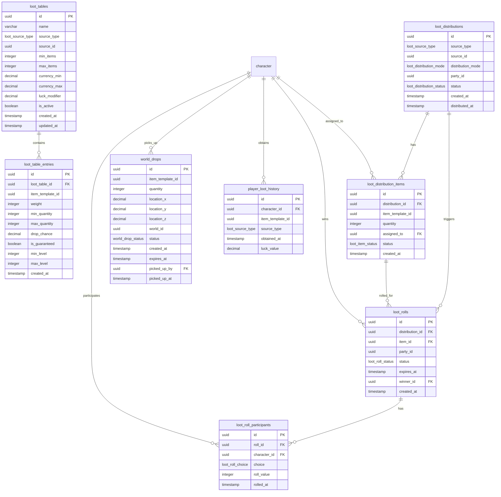

<!-- Issue: #140876092 -->

# Loot Tables System - Database Schema

## Обзор

Схема базы данных для системы Loot Tables, включающая таблицы лута, записи в таблицах, распределения лута, roll сессии
для групп, мировые дропы и историю лута игроков.

## ERD Диаграмма



## Описание таблиц

### loot_tables

Таблица таблиц лута. Хранит определения дропов для различных источников.

**Ключевые поля:**

- `id`: UUID первичный ключ
- `name`: Название таблицы лута (VARCHAR(255), NOT NULL)
- `source_type`: Тип источника (ENUM: npc, container, quest, boss, world_event, NOT NULL)
- `source_id`: ID источника (UUID, NOT NULL)
- `min_items`: Минимальное количество предметов (INTEGER, NOT NULL, default: 1, >= 0)
- `max_items`: Максимальное количество предметов (INTEGER, NOT NULL, default: 1, >= min_items)
- `currency_min`: Минимальная валюта (DECIMAL(20,2), NOT NULL, default: 0.0, >= 0)
- `currency_max`: Максимальная валюта (DECIMAL(20,2), NOT NULL, default: 0.0, >= currency_min)
- `luck_modifier`: Модификатор удачи (DECIMAL(5,2), NOT NULL, default: 0.0)
- `is_active`: Флаг активности (BOOLEAN, NOT NULL, default: true)
- `created_at`: Время создания
- `updated_at`: Время последнего обновления

**Индексы:**

- По `(source_type, source_id)` для поиска по источнику
- По `is_active` для активных таблиц

### loot_table_entries

Таблица записей в таблицах лута. Хранит предметы с весами и шансами дропа.

**Ключевые поля:**

- `id`: UUID первичный ключ
- `loot_table_id`: ID таблицы лута (FK к loot_tables, NOT NULL)
- `item_template_id`: ID шаблона предмета (UUID, NOT NULL)
- `weight`: Вес предмета в таблице (INTEGER, NOT NULL, default: 1, > 0)
- `min_quantity`: Минимальное количество (INTEGER, NOT NULL, default: 1, > 0)
- `max_quantity`: Максимальное количество (INTEGER, NOT NULL, default: 1, >= min_quantity)
- `drop_chance`: Шанс дропа в процентах (DECIMAL(5,2), NOT NULL, default: 0.0, 0-100)
- `is_guaranteed`: Гарантированный дроп (BOOLEAN, NOT NULL, default: false)
- `min_level`: Минимальный уровень (INTEGER, nullable, >= 1)
- `max_level`: Максимальный уровень (INTEGER, nullable, >= min_level)
- `created_at`: Время создания

**Индексы:**

- По `loot_table_id` для записей таблицы
- По `item_template_id` для поиска по предмету

### loot_distributions

Таблица распределений лута. Хранит сгенерированные дропы для выдачи.

**Ключевые поля:**

- `id`: UUID первичный ключ
- `source_type`: Тип источника (ENUM, NOT NULL)
- `source_id`: ID источника (UUID, NOT NULL)
- `distribution_mode`: Режим распределения (ENUM: personal, party, shared, boss, NOT NULL)
- `party_id`: ID группы (UUID, nullable)
- `status`: Статус распределения (ENUM: pending, distributed, expired, NOT NULL, default: pending)
- `created_at`: Время создания
- `distributed_at`: Время распределения (TIMESTAMP, nullable)

**Индексы:**

- По `(source_type, source_id)` для поиска по источнику
- По `(party_id, status)` для распределений группы
- По `(status, created_at)` для статуса

### loot_distribution_items

Таблица предметов в распределениях. Хранит конкретные предметы для выдачи.

**Ключевые поля:**

- `id`: UUID первичный ключ
- `distribution_id`: ID распределения (FK к loot_distributions, NOT NULL)
- `item_template_id`: ID шаблона предмета (UUID, NOT NULL)
- `quantity`: Количество (INTEGER, NOT NULL, default: 1, > 0)
- `assigned_to`: ID персонажа, которому назначен предмет (FK к characters, nullable)
- `status`: Статус предмета (ENUM: pending, assigned, claimed, NOT NULL, default: pending)
- `created_at`: Время создания

**Индексы:**

- По `distribution_id` для предметов распределения
- По `(assigned_to, status)` для назначенных предметов

### loot_rolls

Таблица roll сессий для групп. Хранит информацию о Need/Greed системе.

**Ключевые поля:**

- `id`: UUID первичный ключ
- `distribution_id`: ID распределения (FK к loot_distributions, NOT NULL)
- `item_id`: ID предмета (FK к loot_distribution_items, NOT NULL)
- `party_id`: ID группы (UUID, NOT NULL)
- `status`: Статус roll сессии (ENUM: active, completed, expired, NOT NULL, default: active)
- `expires_at`: Время истечения (TIMESTAMP, NOT NULL)
- `winner_id`: ID победителя (FK к characters, nullable)
- `created_at`: Время создания

**Индексы:**

- По `distribution_id` для roll сессий распределения
- По `(party_id, status)` для roll сессий группы
- По `expires_at` для активных roll сессий

### loot_roll_participants

Таблица участников roll сессий. Хранит выборы игроков (Need/Greed/Pass).

**Ключевые поля:**

- `id`: UUID первичный ключ
- `roll_id`: ID roll сессии (FK к loot_rolls, NOT NULL)
- `character_id`: ID персонажа (FK к characters, NOT NULL)
- `choice`: Выбор игрока (ENUM: need, greed, pass, NOT NULL)
- `roll_value`: Значение roll (INTEGER, nullable, 1-100)
- `rolled_at`: Время roll (TIMESTAMP, nullable)

**Индексы:**

- По `(roll_id, choice)` для выборов в roll сессии
- По `character_id` для roll сессий персонажа

**Constraints:**

- UNIQUE(roll_id, character_id): Один выбор на персонажа в roll сессии

### world_drops

Таблица мировых дропов. Хранит предметы, выпавшие в мире.

**Ключевые поля:**

- `id`: UUID первичный ключ
- `item_template_id`: ID шаблона предмета (UUID, NOT NULL)
- `quantity`: Количество (INTEGER, NOT NULL, default: 1, > 0)
- `location_x`: Координата X (DECIMAL(10,2), NOT NULL)
- `location_y`: Координата Y (DECIMAL(10,2), NOT NULL)
- `location_z`: Координата Z (DECIMAL(10,2), NOT NULL)
- `world_id`: ID мира (UUID, NOT NULL)
- `status`: Статус дропа (ENUM: active, picked_up, expired, NOT NULL, default: active)
- `created_at`: Время создания
- `expires_at`: Время истечения (TIMESTAMP, NOT NULL)
- `picked_up_by`: ID персонажа, поднявшего дроп (FK к characters, nullable)
- `picked_up_at`: Время поднятия (TIMESTAMP, nullable)

**Индексы:**

- По `(world_id, location_x, location_y)` для поиска по локации
- По `(status, expires_at)` для активных дропов
- По `(status, created_at)` для статуса

### player_loot_history

Таблица истории лута игроков. Хранит историю получения предметов для smart loot.

**Ключевые поля:**

- `id`: UUID первичный ключ
- `character_id`: ID персонажа (FK к characters, NOT NULL)
- `item_template_id`: ID шаблона предмета (UUID, NOT NULL)
- `source_type`: Тип источника (ENUM, NOT NULL)
- `obtained_at`: Время получения (TIMESTAMP, NOT NULL, default: CURRENT_TIMESTAMP)
- `luck_value`: Значение удачи при получении (DECIMAL(5,2), NOT NULL, default: 0.0)

**Индексы:**

- По `(character_id, obtained_at DESC)` для истории персонажа
- По `(item_template_id, character_id)` для истории по предмету

## ENUM типы

### loot_source_type

- `npc`: NPC
- `container`: Контейнер
- `quest`: Квест
- `boss`: Босс
- `world_event`: Мировое событие

### loot_distribution_mode

- `personal`: Личное распределение
- `party`: Распределение в группе
- `shared`: Общее распределение
- `boss`: Распределение босса

### loot_distribution_status

- `pending`: Ожидает распределения
- `distributed`: Распределено
- `expired`: Истекло

### loot_item_status

- `pending`: Ожидает назначения
- `assigned`: Назначено
- `claimed`: Получено

### loot_roll_status

- `active`: Активна
- `completed`: Завершена
- `expired`: Истекла

### loot_roll_choice

- `need`: Нужно
- `greed`: Жадность
- `pass`: Пропустить

### world_drop_status

- `active`: Активен
- `picked_up`: Поднят
- `expired`: Истек

## Constraints и валидация

### CHECK Constraints

- `loot_tables.min_items`: Должно быть >= 0
- `loot_tables.max_items`: Должно быть >= min_items
- `loot_tables.currency_min`: Должно быть >= 0
- `loot_tables.currency_max`: Должно быть >= currency_min
- `loot_table_entries.weight`: Должно быть > 0
- `loot_table_entries.min_quantity`: Должно быть > 0
- `loot_table_entries.max_quantity`: Должно быть >= min_quantity
- `loot_table_entries.drop_chance`: Должно быть >= 0 и <= 100
- `loot_table_entries.min_level`: Должно быть >= 1 (если не NULL)
- `loot_table_entries.max_level`: Должно быть >= min_level (если не NULL)
- `loot_distribution_items.quantity`: Должно быть > 0
- `loot_roll_participants.roll_value`: Должно быть >= 1 и <= 100 (если не NULL)
- `world_drops.quantity`: Должно быть > 0

### Foreign Keys

- `loot_table_entries.loot_table_id` → `economy.loot_tables.id` (ON DELETE CASCADE)
- `loot_distribution_items.distribution_id` → `economy.loot_distributions.id` (ON DELETE CASCADE)
- `loot_distribution_items.assigned_to` → `mvp_core.character.id` (ON DELETE SET NULL)
- `loot_rolls.distribution_id` → `economy.loot_distributions.id` (ON DELETE CASCADE)
- `loot_rolls.item_id` → `economy.loot_distribution_items.id` (ON DELETE CASCADE)
- `loot_rolls.winner_id` → `mvp_core.character.id` (ON DELETE SET NULL)
- `loot_roll_participants.roll_id` → `economy.loot_rolls.id` (ON DELETE CASCADE)
- `loot_roll_participants.character_id` → `mvp_core.character.id` (ON DELETE CASCADE)
- `world_drops.picked_up_by` → `mvp_core.character.id` (ON DELETE SET NULL)
- `player_loot_history.character_id` → `mvp_core.character.id` (ON DELETE CASCADE)

### Unique Constraints

- `loot_roll_participants(roll_id, character_id)`: Один выбор на персонажа в roll сессии

## Оптимизация запросов

### Частые запросы

1. **Получение таблицы лута по источнику:**
   ```sql
   SELECT * FROM economy.loot_tables 
   WHERE source_type = $1 AND source_id = $2 AND is_active = true;
   ```
   Использует индекс `(source_type, source_id)`.

2. **Получение записей таблицы лута:**
   ```sql
   SELECT * FROM economy.loot_table_entries 
   WHERE loot_table_id = $1;
   ```
   Использует индекс `loot_table_id`.

3. **Получение распределений группы:**
   ```sql
   SELECT * FROM economy.loot_distributions 
   WHERE party_id = $1 AND status = 'pending';
   ```
   Использует индекс `(party_id, status)`.

4. **Получение активных roll сессий:**
   ```sql
   SELECT * FROM economy.loot_rolls 
   WHERE party_id = $1 AND status = 'active' AND expires_at > CURRENT_TIMESTAMP;
   ```
   Использует индекс `(party_id, status)`.

5. **Поиск мировых дропов по локации:**
   ```sql
   SELECT * FROM economy.world_drops 
   WHERE world_id = $1 
   AND location_x BETWEEN $2 - 10 AND $2 + 10 
   AND location_y BETWEEN $3 - 10 AND $3 + 10 
   AND status = 'active';
   ```
   Использует индекс `(world_id, location_x, location_y)`.

## Миграции

### Существующие миграции:

- `V1_62__loot_tables_system_tables.sql` - полная схема Loot Tables

### Применение миграций:

```bash
liquibase update --changelog-file=infrastructure/liquibase/changelog.yaml
```

## Соответствие архитектуре

Схема БД полностью соответствует архитектуре из `knowledge/implementation/architecture/loot-system-architecture.yaml`:

- [OK] Все таблицы из архитектуры созданы
- [OK] Все поля соответствуют описанию
- [OK] ENUM типы созданы для всех категорий
- [OK] Индексы оптимизированы для частых запросов
- [OK] Constraints обеспечивают целостность данных
- [OK] Foreign Keys настроены с CASCADE для автоматической очистки
- [OK] Интеграция с существующими таблицами (characters, item_templates)

## Особенности реализации

### Таблицы лута

Система таблиц лута включает:

- **Источники**: npc, container, quest, boss, world_event
- **Диапазоны**: min_items/max_items для количества предметов
- **Валюта**: currency_min/currency_max для валютных дропов
- **Удача**: luck_modifier для модификации удачи

### Записи в таблицах

Система записей включает:

- **Вес**: weight для вероятности дропа
- **Шанс**: drop_chance в процентах
- **Гарантия**: is_guaranteed для гарантированных дропов
- **Уровни**: min_level/max_level для ограничений по уровню

### Распределения лута

Система распределений включает:

- **Режимы**: personal, party, shared, boss
- **Группы**: party_id для группового лута
- **Статусы**: pending, distributed, expired

### Roll сессии

Система roll сессий включает:

- **Need/Greed**: выборы игроков (need, greed, pass)
- **Roll значения**: roll_value (1-100) для определения победителя
- **Истечение**: expires_at для ограничения времени
- **Победитель**: winner_id для назначения предмета

### Мировые дропы

Система мировых дропов включает:

- **Локация**: location_x, location_y, location_z для позиции
- **Истечение**: expires_at для автоматического удаления
- **Статус**: active, picked_up, expired для отслеживания

### История лута

Система истории включает:

- **Smart loot**: отслеживание полученных предметов
- **Удача**: luck_value для анализа удачи
- **Источники**: source_type для анализа дропов

### Интеграция с другими системами

Система Loot Tables интегрируется с:

- **Inventory Service**: через item_template_id для выдачи предметов
- **Party Service**: через party_id для группового лута
- **Gameplay Service**: через source_id для событий
- **Characters**: через character_id для назначения предметов

