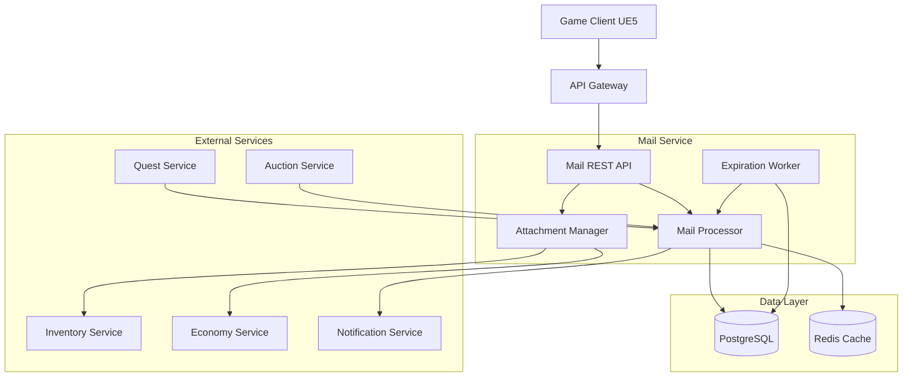
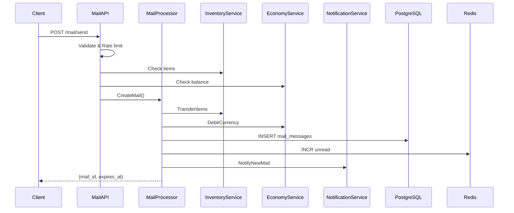
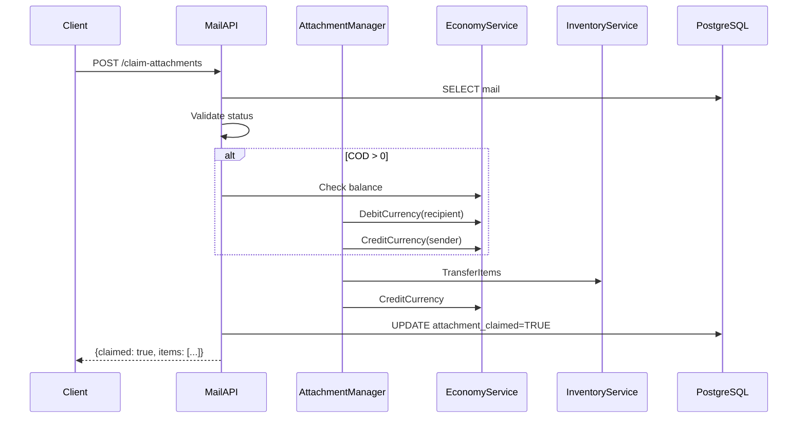

<!-- Issue: #151 -->

# Архитектура почтовой системы - Part 1: Core Architecture

## Метаданные

- **ID:** architecture-mail-system-part1
- **Версия:** 1.0.0
- **Дата:** 2025-12-02
- **Автор:** Architect Agent
- **Статус:** Draft
- **Теги:** architecture, mail, social, backend

## Краткое описание

Почтовая система обеспечивает доставку сообщений, предметов, валюты и наград между игроками. Система поддерживает личные письма, системные рассылки, вложения, COD (Cash on Delivery), автоматическое истечение и возврат писем.

**См. также:** [Part 2: Business Logic & Operations](./mail-system-architecture-part2.md)

## Связанные документы

- `knowledge/implementation/backend/mail-system.yaml`

---

## 1. Архитектурный обзор

### 1.1. Цели системы

1. **Универсальная доставка** - сообщения, предметы, валюта, награды
2. **Надёжность** - гарантированная доставка с подтверждением
3. **Безопасность** - защита от спама, дублирования, эксплойтов
4. **COD механика** - оплата при получении для торговли
5. **Системные рассылки** - автоматическая доставка наград, уведомлений
6. **Автоматическое управление** - истечение срока, возврат, очистка

### 1.2. Ключевые компоненты



---

## 2. Компоненты системы

### 2.1. Mail Service

**Технологии:** Go, gRPC, REST, PostgreSQL, Redis

**Подкомпоненты:**

#### Mail API
- REST endpoints
- Валидация запросов
- Rate limiting
- Авторизация

#### Mail Processor
- Бизнес-логика отправки/получения
- Обработка событий
- Управление жизненным циклом
- Event publishing

#### Attachment Manager
- Управление вложениями
- Списание/зачисление предметов
- Обработка валюты
- COD транзакции

#### Expiration Worker
- Фоновый worker
- Возврат писем
- Очистка просроченных
- Архивация

### 2.2. Data Storage

#### PostgreSQL Schema

```sql
CREATE TABLE mail_messages (
    id UUID PRIMARY KEY DEFAULT gen_random_uuid(),
    sender_id UUID NOT NULL,
    recipient_id UUID NOT NULL,
    mail_type VARCHAR(50) NOT NULL,
    
    subject VARCHAR(255) NOT NULL,
    body TEXT,
    
    has_attachments BOOLEAN DEFAULT FALSE,
    attachment_items JSONB,
    attachment_currency JSONB,
    
    cod_amount INTEGER DEFAULT 0,
    cod_currency VARCHAR(50),
    cod_paid BOOLEAN DEFAULT FALSE,
    
    mail_status VARCHAR(50) NOT NULL,
    attachment_claimed BOOLEAN DEFAULT FALSE,
    
    sent_at TIMESTAMP NOT NULL DEFAULT NOW(),
    read_at TIMESTAMP,
    claimed_at TIMESTAMP,
    expires_at TIMESTAMP NOT NULL,
    deleted_at TIMESTAMP,
    
    returned_to_sender BOOLEAN DEFAULT FALSE,
    return_reason VARCHAR(255),
    
    created_at TIMESTAMP NOT NULL DEFAULT NOW(),
    updated_at TIMESTAMP NOT NULL DEFAULT NOW()
);

CREATE INDEX idx_mail_recipient ON mail_messages(recipient_id, mail_status);
CREATE INDEX idx_mail_expires ON mail_messages(expires_at) WHERE mail_status != 'expired';
CREATE INDEX idx_mail_sender ON mail_messages(sender_id);
CREATE INDEX idx_mail_type ON mail_messages(mail_type);

CREATE TABLE mail_audit_log (
    id BIGSERIAL PRIMARY KEY,
    mail_id UUID NOT NULL REFERENCES mail_messages(id),
    action VARCHAR(50) NOT NULL,
    actor_id UUID,
    details JSONB,
    timestamp TIMESTAMP NOT NULL DEFAULT NOW()
);

CREATE INDEX idx_audit_mail ON mail_audit_log(mail_id);
CREATE INDEX idx_audit_timestamp ON mail_audit_log(timestamp);
```

#### Redis

- `mail:unread:{player_id}` - счётчик непрочитанных
- `mail:inbox:{player_id}` - кэш последних 50 писем (TTL: 5 мин)
- `mail:ratelimit:send:{player_id}` - счётчик отправленных (TTL: 1 час)

### 2.3. External Integration

#### Inventory Service
`TransferItems(fromPlayerId, toPlayerId, items)` - gRPC

#### Economy Service
`DebitCurrency()` / `CreditCurrency()` - gRPC

#### Notification Service
`NotifyNewMail(playerId, mailSummary)` - WebSocket/gRPC

#### Quest/Auction Services
Event subscribers для автоматической отправки наград

---

## 3. API Endpoints

### 3.1. Mail Management

#### GET /api/v1/social/mail/inbox
**Получить входящие**

Parameters: `status`, `page`, `limit`

Response:
```json
{
  "mails": [{
    "id": "uuid",
    "sender_name": "Player",
    "subject": "Trade offer",
    "has_attachments": true,
    "mail_status": "sent",
    "sent_at": "...",
    "expires_at": "..."
  }],
  "unread_count": 5,
  "total_count": 42
}
```

#### GET /api/v1/social/mail/{mail_id}
**Детали письма** (автоматически помечает как прочитанное)

#### POST /api/v1/social/mail/send
**Отправить письмо**

Request:
```json
{
  "recipient_id": "uuid",
  "subject": "...",
  "body": "...",
  "attachment_items": [...],
  "attachment_currency": {...},
  "cod_amount": 500
}
```

#### POST /api/v1/social/mail/{mail_id}/claim-attachments
**Забрать вложения** (с оплатой COD)

#### DELETE /api/v1/social/mail/{mail_id}
**Удалить письмо** (soft delete)

### 3.2. System Mails (Internal)

#### POST /internal/v1/mail/send-system
Для автоматической отправки наград

#### POST /internal/v1/mail/send-broadcast
Массовая рассылка с фильтрами (level, region, etc.)

### 3.3. WebSocket Events

- `mail:new` - новое письмо
- `mail:claimed` - вложения забраны
- `mail:expired` - истекло
- `mail:returned` - возвращено

---

## 4. Потоки данных

### 4.1. Отправка письма



### 4.2. Получение вложений с COD



---

**См. [Part 2](./mail-system-architecture-part2.md) для бизнес-логики, событий и операций**


