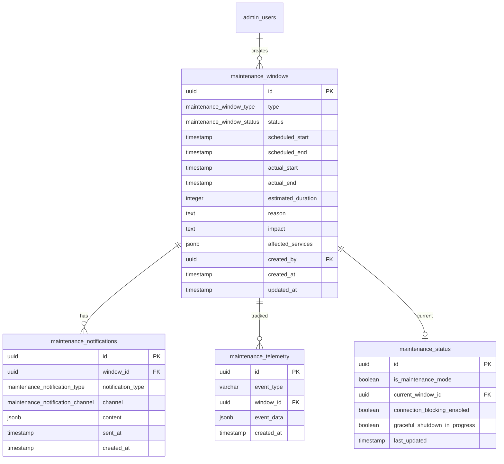

<!-- Issue: #316 -->

# Maintenance Mode System - Database Schema

## Обзор

Схема базы данных для системы режима обслуживания, управляющей окнами обслуживания, статусом и уведомлениями.

## ERD Диаграмма

## Таблицы

### maintenance_windows

Окна обслуживания системы.

**Колонки:**

- `id` (UUID, PK) - Уникальный идентификатор
- `type` (maintenance_window_type) - Тип окна: scheduled, emergency, hot_fix, rollback, upgrade
- `status` (maintenance_window_status) - Статус: planned, starting, in_progress, ending, completed, cancelled
- `scheduled_start` (TIMESTAMP) - Запланированное время начала
- `scheduled_end` (TIMESTAMP) - Запланированное время окончания
- `actual_start` (TIMESTAMP) - Фактическое время начала
- `actual_end` (TIMESTAMP) - Фактическое время окончания
- `estimated_duration` (INTEGER) - Оценочная длительность в секундах
- `reason` (TEXT) - Причина обслуживания
- `impact` (TEXT) - Влияние на игроков
- `affected_services` (JSONB) - Затронутые сервисы
- `created_by` (UUID, FK) - ID создателя (admin_user)
- `created_at` (TIMESTAMP) - Время создания
- `updated_at` (TIMESTAMP) - Время обновления

**Ограничения:**

- CHECK: scheduled_end > scheduled_start
- CHECK: actual_start и actual_end должны быть согласованы

**Индексы:**

- `idx_maintenance_windows_type` - По типу и запланированному времени начала
- `idx_maintenance_windows_status` - По статусу и запланированному времени начала
- `idx_maintenance_windows_scheduled_start` - По запланированному времени начала
- `idx_maintenance_windows_scheduled_end` - По запланированному времени окончания
- `idx_maintenance_windows_active` - По активным окнам
- `idx_maintenance_windows_created_by` - По создателю

### maintenance_status

Текущий статус обслуживания (единственная строка).

**Колонки:**

- `id` (UUID, PK) - Уникальный идентификатор (фиксированный: 00000000-0000-0000-0000-000000000001)
- `is_maintenance_mode` (BOOLEAN) - Включен ли режим обслуживания
- `current_window_id` (UUID, FK) - ID текущего окна обслуживания
- `connection_blocking_enabled` (BOOLEAN) - Блокировка новых подключений
- `graceful_shutdown_in_progress` (BOOLEAN) - Идет ли плавное завершение работы
- `last_updated` (TIMESTAMP) - Время последнего обновления

**Ограничения:**

- CHECK: id = '00000000-0000-0000-0000-000000000001'::uuid (единственная строка)

**Индексы:**

- `idx_maintenance_status_is_maintenance_mode` - По режиму обслуживания
- `idx_maintenance_status_current_window_id` - По текущему окну

### maintenance_notifications

Уведомления об обслуживании.

**Колонки:**

- `id` (UUID, PK) - Уникальный идентификатор
- `window_id` (UUID, FK) - ID окна обслуживания
- `notification_type` (maintenance_notification_type) - Тип уведомления: advance_24h, advance_1h, immediate, completion
- `channel` (maintenance_notification_channel) - Канал: in_game, email, push, social_media
- `content` (JSONB) - Содержимое уведомления
- `sent_at` (TIMESTAMP) - Время отправки
- `created_at` (TIMESTAMP) - Время создания

**Индексы:**

- `idx_maintenance_notifications_window_id` - По окну и типу уведомления
- `idx_maintenance_notifications_type` - По типу уведомления и времени отправки
- `idx_maintenance_notifications_channel` - По каналу и времени отправки
- `idx_maintenance_notifications_sent_at` - По времени отправки

### maintenance_telemetry

Телеметрия обслуживания.

**Колонки:**

- `id` (UUID, PK) - Уникальный идентификатор
- `event_type` (VARCHAR(50)) - Тип события
- `window_id` (UUID, FK) - ID окна обслуживания
- `event_data` (JSONB) - Дополнительные данные события
- `created_at` (TIMESTAMP) - Время события

**Индексы:**

- `idx_maintenance_telemetry_event_type` - По типу события и времени
- `idx_maintenance_telemetry_window_id` - По окну и времени
- `idx_maintenance_telemetry_created_at` - По времени события

## ENUM типы

### maintenance_window_type

- `scheduled` - Запланированное
- `emergency` - Экстренное
- `hot_fix` - Горячее исправление
- `rollback` - Откат
- `upgrade` - Обновление

### maintenance_window_status

- `planned` - Запланировано
- `starting` - Запускается
- `in_progress` - В процессе
- `ending` - Завершается
- `completed` - Завершено
- `cancelled` - Отменено

### maintenance_notification_type

- `advance_24h` - За 24 часа
- `advance_1h` - За 1 час
- `immediate` - Немедленно
- `completion` - Завершение

### maintenance_notification_channel

- `in_game` - В игре
- `email` - Email
- `push` - Push-уведомление
- `social_media` - Социальные сети

## Связи

- `maintenance_windows.created_by` → `admin.admin_users.id` (SET NULL при удалении)
- `maintenance_status.current_window_id` → `admin.maintenance_windows.id` (SET NULL при удалении)
- `maintenance_notifications.window_id` → `admin.maintenance_windows.id` (CASCADE при удалении)
- `maintenance_telemetry.window_id` → `admin.maintenance_windows.id` (CASCADE при удалении)

## Миграция

Файл: `infrastructure/liquibase/migrations/V1_85__maintenance_mode_system_tables.sql`

