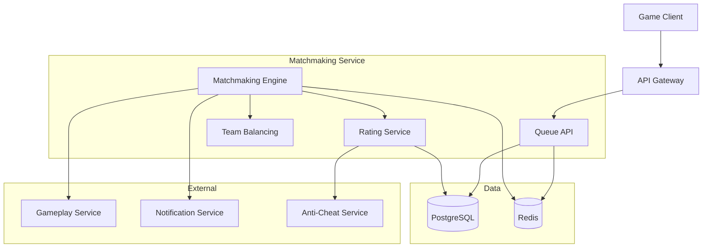
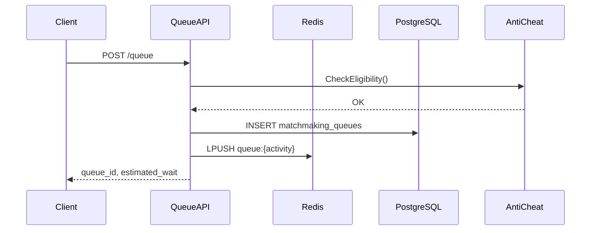
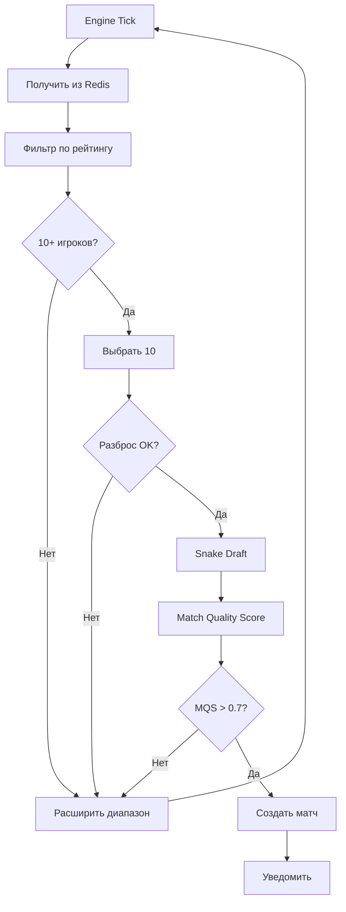

<!-- Issue: #150 -->

# Архитектура системы матчмейкинга - Part 1: Core Architecture & Algorithms

## Метаданные

- **ID:** architecture-matchmaking-system-part1
- **Версия:** 1.0.0
- **Дата:** 2025-12-02
- **Автор:** Architect Agent
- **Статус:** Draft

## Краткое описание

Система матчмейкинга обеспечивает подбор игроков для PvP, PvE и рейдов с учётом рейтинга, ролей, времени ожидания и качества матча.

**См. также:** [Part 2: Rating System & Operations](./matchmaking-system-architecture-part2.md)

## Связанные документы

- `knowledge/implementation/backend/matchmaking/matchmaking-queue.yaml`
- `knowledge/implementation/backend/matchmaking/matchmaking-algorithm.yaml`
- `knowledge/implementation/backend/matchmaking/matchmaking-rating.yaml`

---

## 1. Архитектурный обзор

### 1.1. Цели

1. **Быстрый подбор** - минимизация ожидания
2. **Сбалансированные команды** - равный рейтинг, роли
3. **Качественный опыт** - учёт латентности, предпочтений
4. **Масштабируемость** - тысячи игроков в очереди
5. **Анти-читинг** - обнаружение смурфов

### 1.2. Компоненты



---

## 2. Компоненты

### 2.1. Matchmaking Service

**Технологии:** Go, gRPC, REST, Redis, PostgreSQL

**Подкомпоненты:**

#### Queue Manager
- Вход/выход из очереди
- Приоритизация
- Расширение диапазона поиска
- Управление партиями

#### Matchmaking Engine
- Подбор кандидатов
- Проверка совместимости
- Создание матчей
- Мониторинг качества

#### Team Balancing Service
- Snake draft алгоритм
- Распределение ролей
- Балансировка рейтинга
- Проверка композиций

#### Rating Service
- Расчёт MMR/ELO
- Сезонные рейтинги
- Ранги (Bronze → Grandmaster)
- Анти-smurf проверки

### 2.2. Data Storage

#### PostgreSQL

```sql
CREATE TABLE matchmaking_queues (
    id UUID PRIMARY KEY,
    player_id UUID,
    party_id UUID,
    activity_type VARCHAR(50) NOT NULL,
    preferred_roles TEXT[],
    rating INTEGER NOT NULL,
    rating_range_min INTEGER,
    rating_range_max INTEGER,
    queue_status VARCHAR(50) NOT NULL,
    entered_at TIMESTAMP NOT NULL,
    priority INTEGER DEFAULT 0
);

CREATE INDEX idx_queue_activity_status ON matchmaking_queues(activity_type, queue_status);
CREATE INDEX idx_queue_rating ON matchmaking_queues(rating, activity_type);
```

#### Redis

- `queue:pvp:5v5` - список заявок
- `player:{id}:queue` - активная заявка (TTL 1ч)
- `player:{id}:rating:{activity}` - кэш рейтинга (TTL 5мин)
- `stats:queue:{activity}:size` - размер очереди

---

## 3. API Endpoints

### 3.1. Queue Management

#### POST /api/v1/matchmaking/queue
**Вход в очередь**

Request: `{"activity_type": "pvp_5v5", "preferred_roles": [...]}`

Response: `{"queue_id": "uuid", "estimated_wait_time": 120}`

#### DELETE /api/v1/matchmaking/queue/{id}
**Выход из очереди**

#### GET /api/v1/matchmaking/queue/{id}/status
**Статус очереди**

Response:
```json
{
  "status": "waiting",
  "time_in_queue": 95,
  "rating_range": [1450, 1550],
  "estimated_wait_time": 45
}
```

### 3.2. WebSocket Events

#### /ws/matchmaking

Events:
- `queue_update` - обновление позиции
- `match_found` - матч найден
- `match_ready` - все приняли
- `match_cancelled` - отменён
- `rating_updated` - рейтинг обновлён

---

## 4. Алгоритмы

### 4.1. Вход в очередь



### 4.2. Алгоритм подбора (PvP 5v5)



### 4.3. Snake Draft Балансировка

**Алгоритм:**
1. Сортировка 10 игроков по рейтингу (desc)
2. Распределение: A,A,B,B,B,B,A,A,A,A
3. Результат: примерно равные средние рейтинги

**Пример:**
```
Рейтинги: 1800, 1750, 1700, 1650, 1600, 1550, 1500, 1450, 1400, 1350

Team A: 1800, 1750, 1500, 1450, 1400 (avg: 1580)
Team B: 1700, 1650, 1600, 1550, 1350 (avg: 1570)
```

### 4.4. Match Quality Score

**Формула:**
```
MQS = 0.4 * rating_balance + 0.2 * role_distribution + 
      0.2 * wait_time_fairness + 0.2 * latency_score
```

**Компоненты:**
- `rating_balance` = 1 - (|avg_A - avg_B| / 200)
- `role_distribution` = % ролей заполнены
- `wait_time_fairness` = 1 - (std_dev / mean)
- `latency_score` = 1 - (max_latency / 150ms)

**Пороги:**
- MQS >= 0.9 - отличный
- MQS >= 0.7 - хороший (минимум)
- MQS < 0.7 - недостаточный

### 4.5. Расширение диапазона поиска

| Время ожидания | Диапазон MMR |
|----------------|--------------|
| 0-2 минуты | ±50 |
| 2-5 минут | ±100 |
| 5-10 минут | ±200 |
| 10+ минут | ±400 + приоритет |

Проверка: каждые 15 секунд

---

**См. [Part 2](./matchmaking-system-architecture-part2.md) для рейтинговой системы и операций**


