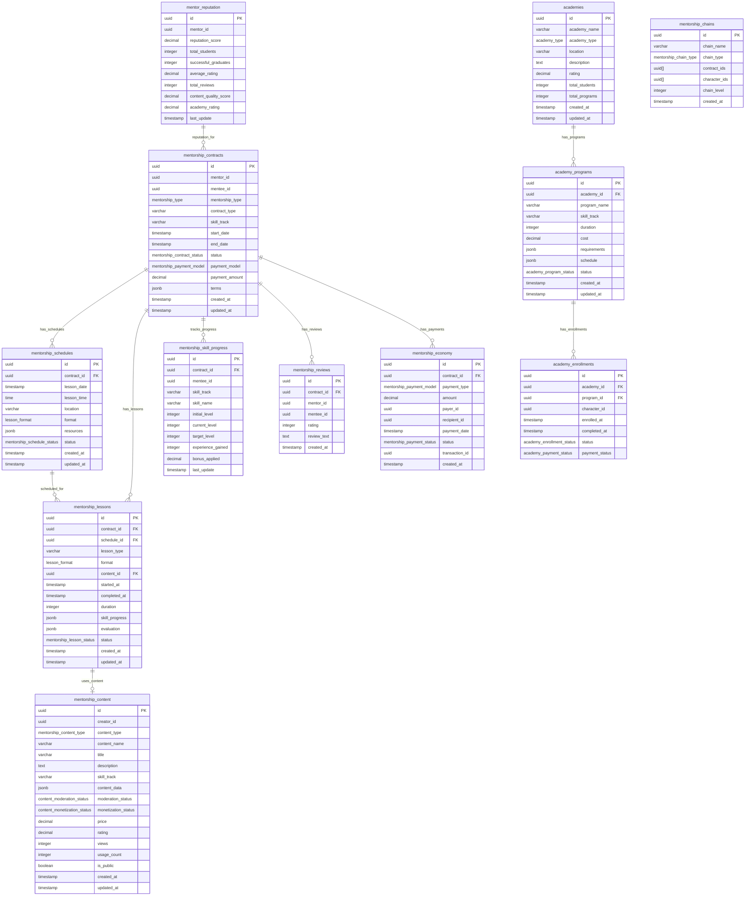

<!-- Issue: #140890865 -->
# Mentorship System - Database Schema

## Обзор

Схема базы данных для системы наставничества, управляющей договорами наставничества, уроками, прогрессом навыков, репутацией наставников, академиями и учебным контентом.

## ERD Диаграмма



## Описание таблиц

### mentorship_contracts

Таблица договоров наставничества. Хранит информацию о договорах между наставниками и учениками.

**Ключевые поля:**
- `id`: UUID первичный ключ
- `mentor_id`: ID наставника (FK accounts/characters, NOT NULL)
- `mentee_id`: ID ученика (FK accounts/characters, NOT NULL)
- `mentorship_type`: Тип наставничества (mentorship_type ENUM, NOT NULL)
- `contract_type`: Тип контракта (VARCHAR(50), nullable)
- `skill_track`: Трек навыков (VARCHAR(50), nullable)
- `start_date`: Дата начала (TIMESTAMP, NOT NULL, default: CURRENT_TIMESTAMP)
- `end_date`: Дата окончания (TIMESTAMP, nullable)
- `status`: Статус контракта (mentorship_contract_status ENUM, NOT NULL, default: 'active')
- `payment_model`: Модель оплаты (mentorship_payment_model ENUM, nullable)
- `payment_amount`: Сумма оплаты (DECIMAL(10,2), default: 0, CHECK: >= 0)
- `terms`: Условия контракта (JSONB, default: '{}')
- `created_at`: Время создания
- `updated_at`: Время последнего обновления

**Индексы:**
- По `(mentor_id, status)` для контрактов наставника по статусу
- По `(mentee_id, status)` для контрактов ученика по статусу
- По `(mentorship_type, status)` для фильтрации по типу и статусу
- По `skill_track` для контрактов по треку навыков (WHERE skill_track IS NOT NULL)

### mentorship_schedules

Таблица расписаний уроков. Хранит информацию о запланированных уроках.

**Ключевые поля:**
- `id`: UUID первичный ключ
- `contract_id`: ID контракта (FK mentorship_contracts, NOT NULL)
- `lesson_date`: Дата урока (TIMESTAMP, NOT NULL)
- `lesson_time`: Время урока (TIME, nullable)
- `location`: Место проведения (VARCHAR(255), nullable)
- `format`: Формат урока (lesson_format ENUM, NOT NULL)
- `resources`: Ресурсы для урока (JSONB, default: '{}')
- `status`: Статус расписания (mentorship_schedule_status ENUM, NOT NULL, default: 'scheduled')
- `created_at`: Время создания
- `updated_at`: Время последнего обновления

**Индексы:**
- По `(contract_id, status)` для расписаний контракта по статусу
- По `(lesson_date, status)` для запланированных уроков (WHERE status = 'scheduled')

### mentorship_lessons

Таблица уроков наставничества. Хранит информацию о проведенных уроках.

**Ключевые поля:**
- `id`: UUID первичный ключ
- `contract_id`: ID контракта (FK mentorship_contracts, NOT NULL)
- `schedule_id`: ID расписания (FK mentorship_schedules, nullable)
- `lesson_type`: Тип урока (VARCHAR(50), nullable)
- `format`: Формат урока (lesson_format ENUM, NOT NULL)
- `content_id`: ID контента (FK mentorship_content, nullable)
- `started_at`: Время начала урока (TIMESTAMP, nullable)
- `completed_at`: Время завершения урока (TIMESTAMP, nullable)
- `duration`: Длительность урока в минутах (INTEGER, nullable, CHECK: >= 0)
- `skill_progress`: Прогресс навыков после урока (JSONB, default: '{}')
- `evaluation`: Оценка урока (JSONB, default: '{}')
- `status`: Статус урока (mentorship_lesson_status ENUM, NOT NULL, default: 'scheduled')
- `created_at`: Время создания
- `updated_at`: Время последнего обновления

**Индексы:**
- По `(contract_id, status)` для уроков контракта по статусу
- По `schedule_id` для уроков по расписанию (WHERE schedule_id IS NOT NULL)
- По `(status, started_at)` для активных уроков (WHERE started_at IS NOT NULL)

### mentorship_skill_progress

Таблица прогресса навыков учеников. Хранит информацию о прогрессе навыков в рамках наставничества.

**Ключевые поля:**
- `id`: UUID первичный ключ
- `contract_id`: ID контракта (FK mentorship_contracts, NOT NULL)
- `mentee_id`: ID ученика (FK accounts/characters, NOT NULL)
- `skill_track`: Трек навыков (VARCHAR(50), NOT NULL)
- `skill_name`: Название навыка (VARCHAR(100), NOT NULL)
- `initial_level`: Начальный уровень (INTEGER, NOT NULL, default: 0, CHECK: >= 0)
- `current_level`: Текущий уровень (INTEGER, NOT NULL, default: 0, CHECK: >= 0)
- `target_level`: Целевой уровень (INTEGER, NOT NULL, default: 0, CHECK: >= 0)
- `experience_gained`: Полученный опыт (INTEGER, NOT NULL, default: 0, CHECK: >= 0)
- `bonus_applied`: Бонус опыта от наставничества (DECIMAL(5,2), NOT NULL, default: 0.00, CHECK: >= 0)
- `last_update`: Время последнего обновления

**Индексы:**
- По `contract_id` для прогресса контракта
- По `mentee_id` для прогресса ученика
- По `(skill_track, skill_name)` для прогресса по навыку

**UNIQUE constraint:** `(contract_id, skill_track, skill_name)` - уникальная комбинация контракта, трека и навыка

### mentor_reputation

Таблица репутации наставников. Хранит информацию о репутации и статистике наставников.

**Ключевые поля:**
- `id`: UUID первичный ключ
- `mentor_id`: ID наставника (FK accounts/characters, NOT NULL)
- `reputation_score`: Общий рейтинг наставника (DECIMAL(5,2), NOT NULL, default: 0.00, диапазон: 0-100)
- `total_students`: Общее количество учеников (INTEGER, NOT NULL, default: 0, CHECK: >= 0)
- `successful_graduates`: Количество успешных выпускников (INTEGER, NOT NULL, default: 0, CHECK: >= 0)
- `average_rating`: Средний рейтинг отзывов (DECIMAL(3,2), NOT NULL, default: 0.00, диапазон: 0-5)
- `total_reviews`: Общее количество отзывов (INTEGER, NOT NULL, default: 0, CHECK: >= 0)
- `content_quality_score`: Оценка качества контента (DECIMAL(5,2), NOT NULL, default: 0.00, диапазон: 0-100)
- `academy_rating`: Рейтинг в академии (DECIMAL(3,2), NOT NULL, default: 0.00, диапазон: 0-5)
- `last_update`: Время последнего обновления

**Индексы:**
- По `mentor_id` для репутации наставника
- По `reputation_score DESC` для топ наставников
- По `average_rating DESC` для наставников по рейтингу

**UNIQUE constraint:** `(mentor_id)` - одна репутация на наставника

### mentorship_reviews

Таблица отзывов о наставниках. Хранит отзывы учеников о наставниках.

**Ключевые поля:**
- `id`: UUID первичный ключ
- `contract_id`: ID контракта (FK mentorship_contracts, NOT NULL)
- `mentor_id`: ID наставника (FK accounts/characters, NOT NULL)
- `mentee_id`: ID ученика (FK accounts/characters, NOT NULL)
- `rating`: Рейтинг наставника (INTEGER, NOT NULL, CHECK: 1-5)
- `review_text`: Текст отзыва (TEXT, nullable)
- `created_at`: Время создания

**Индексы:**
- По `contract_id` для отзывов контракта
- По `mentor_id` для отзывов наставника
- По `mentee_id` для отзывов ученика
- По `rating DESC` для отзывов по рейтингу

### academies

Таблица академий и образовательных центров. Хранит информацию об академиях.

**Ключевые поля:**
- `id`: UUID первичный ключ
- `academy_name`: Название академии (VARCHAR(255), NOT NULL)
- `academy_type`: Тип академии (academy_type ENUM, NOT NULL)
- `location`: Расположение (VARCHAR(255), nullable)
- `description`: Описание академии (TEXT, nullable)
- `rating`: Рейтинг академии (DECIMAL(3,2), NOT NULL, default: 0.00, диапазон: 0-5)
- `total_students`: Общее количество студентов (INTEGER, NOT NULL, default: 0, CHECK: >= 0)
- `total_programs`: Общее количество программ (INTEGER, NOT NULL, default: 0, CHECK: >= 0)
- `created_at`: Время создания
- `updated_at`: Время последнего обновления

**Индексы:**
- По `academy_type` для фильтрации по типу академии
- По `rating DESC` для академий по рейтингу

### academy_programs

Таблица программ академий. Хранит информацию о программах обучения в академиях.

**Ключевые поля:**
- `id`: UUID первичный ключ
- `academy_id`: ID академии (FK academies, NOT NULL)
- `program_name`: Название программы (VARCHAR(255), NOT NULL)
- `skill_track`: Трек навыков (VARCHAR(50), NOT NULL)
- `duration`: Длительность программы в днях (INTEGER, NOT NULL, default: 0, CHECK: >= 0)
- `cost`: Стоимость программы (DECIMAL(10,2), NOT NULL, default: 0, CHECK: >= 0)
- `requirements`: Требования для поступления (JSONB, default: '{}')
- `schedule`: Расписание программы (JSONB, default: '{}')
- `status`: Статус программы (academy_program_status ENUM, NOT NULL, default: 'active')
- `created_at`: Время создания
- `updated_at`: Время последнего обновления

**Индексы:**
- По `(academy_id, status)` для программ академии по статусу
- По `skill_track` для программ по треку навыков
- По `status` для активных программ (WHERE status = 'active')

### academy_enrollments

Таблица записей в академии. Хранит информацию о записях персонажей в академии.

**Ключевые поля:**
- `id`: UUID первичный ключ
- `academy_id`: ID академии (FK academies, NOT NULL)
- `program_id`: ID программы (FK academy_programs, NOT NULL)
- `character_id`: ID персонажа (FK accounts/characters, NOT NULL)
- `enrolled_at`: Время записи (TIMESTAMP, NOT NULL, default: CURRENT_TIMESTAMP)
- `completed_at`: Время завершения (TIMESTAMP, nullable)
- `status`: Статус записи (academy_enrollment_status ENUM, NOT NULL, default: 'enrolled')
- `payment_status`: Статус оплаты (academy_payment_status ENUM, NOT NULL, default: 'pending')

**Индексы:**
- По `(academy_id, program_id, status)` для записей академии и программы по статусу
- По `(character_id, status)` для записей персонажа по статусу
- По `status` для фильтрации по статусу

### mentorship_chains

Таблица цепочек наставничества. Хранит информацию о цепочках наставничества (линейные, сетевые, фракционные, академические).

**Ключевые поля:**
- `id`: UUID первичный ключ
- `chain_name`: Название цепочки (VARCHAR(255), NOT NULL)
- `chain_type`: Тип цепочки (mentorship_chain_type ENUM, NOT NULL)
- `contract_ids`: Массив ID контрактов в цепочке (UUID[], NOT NULL, default: '{}')
- `character_ids`: Массив ID персонажей в цепочке (UUID[], NOT NULL, default: '{}')
- `chain_level`: Уровень цепочки (INTEGER, NOT NULL, default: 1, CHECK: >= 1)
- `created_at`: Время создания

**Индексы:**
- По `chain_type` для фильтрации по типу цепочки
- По `chain_level` для фильтрации по уровню цепочки

### mentorship_content

Таблица учебного контента. Хранит информацию об учебном контенте (гайды, симуляции, VR сцены, видео, тексты).

**Ключевые поля:**
- `id`: UUID первичный ключ
- `creator_id`: ID создателя (FK accounts/characters, NOT NULL)
- `content_type`: Тип контента (mentorship_content_type ENUM, NOT NULL)
- `content_name`: Название контента (VARCHAR(255), NOT NULL)
- `title`: Заголовок контента (VARCHAR(255), nullable)
- `description`: Описание контента (TEXT, nullable)
- `skill_track`: Трек навыков (VARCHAR(50), nullable)
- `content_data`: Данные контента (JSONB, default: '{}')
- `moderation_status`: Статус модерации (content_moderation_status ENUM, NOT NULL, default: 'pending')
- `monetization_status`: Статус монетизации (content_monetization_status ENUM, NOT NULL, default: 'free')
- `price`: Цена контента (DECIMAL(10,2), NOT NULL, default: 0, CHECK: >= 0)
- `rating`: Рейтинг контента (DECIMAL(3,2), NOT NULL, default: 0.00, диапазон: 0-5)
- `views`: Количество просмотров (INTEGER, NOT NULL, default: 0, CHECK: >= 0)
- `usage_count`: Количество использований (INTEGER, NOT NULL, default: 0, CHECK: >= 0)
- `is_public`: Публичный ли контент (BOOLEAN, NOT NULL, default: false)
- `created_at`: Время создания
- `updated_at`: Время последнего обновления

**Индексы:**
- По `creator_id` для контента создателя
- По `(content_type, skill_track)` для контента по типу и треку (WHERE skill_track IS NOT NULL)
- По `is_public` для публичного контента (WHERE is_public = true)
- По `rating DESC` для контента по рейтингу
- По `moderation_status` для контента на модерации (WHERE moderation_status = 'pending')

### mentorship_economy

Таблица экономики наставничества. Хранит информацию о финансовых транзакциях в рамках наставничества.

**Ключевые поля:**
- `id`: UUID первичный ключ
- `contract_id`: ID контракта (FK mentorship_contracts, NOT NULL)
- `payment_type`: Тип платежа (mentorship_payment_model ENUM, NOT NULL)
- `amount`: Сумма платежа (DECIMAL(10,2), NOT NULL, CHECK: >= 0)
- `payer_id`: ID плательщика (FK accounts/characters, NOT NULL)
- `recipient_id`: ID получателя (FK accounts/characters, NOT NULL)
- `payment_date`: Дата платежа (TIMESTAMP, NOT NULL, default: CURRENT_TIMESTAMP)
- `status`: Статус платежа (mentorship_payment_status ENUM, NOT NULL, default: 'pending')
- `transaction_id`: ID транзакции (UUID, nullable)
- `created_at`: Время создания

**Индексы:**
- По `contract_id` для платежей контракта
- По `(payer_id, status)` для платежей плательщика по статусу
- По `(recipient_id, status)` для платежей получателя по статусу
- По `(payment_date, status)` для платежей по дате и статусу

## ENUM типы

### mentorship_type
- `player_to_player`: Игрок → Игрок
- `player_to_npc`: Игрок → NPC
- `npc_to_player`: NPC → Игрок
- `npc_to_npc`: NPC → NPC
- `academy`: Академия

### mentorship_contract_status
- `active`: Активен
- `completed`: Завершен
- `terminated`: Прерван

### mentorship_payment_model
- `paid`: Платное
- `grant`: Грант
- `influence_points`: Очки влияния
- `resources`: Ресурсы

### lesson_format
- `theoretical`: Теоретический
- `practical`: Практический
- `content_based`: На основе контента
- `examination`: Экзамен
- `group`: Групповой
- `vr`: VR

### mentorship_schedule_status
- `scheduled`: Запланирован
- `in-progress`: В процессе
- `completed`: Завершен
- `cancelled`: Отменен

### mentorship_lesson_status
- `scheduled`: Запланирован
- `in-progress`: В процессе
- `completed`: Завершен
- `failed`: Провален

### academy_type
- `corporate`: Корпоративная
- `gang`: Бандитская
- `independent`: Независимая

### academy_program_status
- `active`: Активна
- `inactive`: Неактивна

### academy_enrollment_status
- `enrolled`: Записан
- `in-progress`: В процессе
- `completed`: Завершен
- `dropped`: Отчислен

### academy_payment_status
- `pending`: Ожидает оплаты
- `paid`: Оплачено
- `refunded`: Возвращено

### mentorship_chain_type
- `linear`: Линейная
- `network`: Сетевая
- `faction`: Фракционная
- `academy`: Академическая

### mentorship_content_type
- `guide`: Гайд
- `simulation`: Симуляция
- `vr_scene`: VR сцена
- `video`: Видео
- `text`: Текст

### content_moderation_status
- `pending`: На модерации
- `approved`: Одобрен
- `rejected`: Отклонен

### content_monetization_status
- `free`: Бесплатный
- `paid`: Платный
- `subscription`: По подписке

### mentorship_payment_status
- `pending`: Ожидает
- `paid`: Оплачено
- `failed`: Провалено
- `refunded`: Возвращено

## Constraints и валидация

### CHECK Constraints

- `mentorship_contracts.payment_amount`: >= 0
- `mentorship_lessons.duration`: >= 0
- `mentorship_skill_progress.initial_level`: >= 0
- `mentorship_skill_progress.current_level`: >= 0
- `mentorship_skill_progress.target_level`: >= 0
- `mentorship_skill_progress.experience_gained`: >= 0
- `mentorship_skill_progress.bonus_applied`: >= 0
- `mentor_reputation.reputation_score`: >= 0 AND <= 100
- `mentor_reputation.total_students`: >= 0
- `mentor_reputation.successful_graduates`: >= 0
- `mentor_reputation.average_rating`: >= 0 AND <= 5
- `mentor_reputation.total_reviews`: >= 0
- `mentor_reputation.content_quality_score`: >= 0 AND <= 100
- `mentor_reputation.academy_rating`: >= 0 AND <= 5
- `mentorship_reviews.rating`: >= 1 AND <= 5
- `academies.rating`: >= 0 AND <= 5
- `academies.total_students`: >= 0
- `academies.total_programs`: >= 0
- `academy_programs.duration`: >= 0
- `academy_programs.cost`: >= 0
- `mentorship_chains.chain_level`: >= 1
- `mentorship_content.price`: >= 0
- `mentorship_content.rating`: >= 0 AND <= 5
- `mentorship_content.views`: >= 0
- `mentorship_content.usage_count`: >= 0
- `mentorship_economy.amount`: >= 0

### Foreign Keys

- `mentorship_schedules.contract_id` → `social.mentorship_contracts.id` (ON DELETE CASCADE)
- `mentorship_lessons.contract_id` → `social.mentorship_contracts.id` (ON DELETE CASCADE)
- `mentorship_lessons.schedule_id` → `social.mentorship_schedules.id` (ON DELETE SET NULL)
- `mentorship_skill_progress.contract_id` → `social.mentorship_contracts.id` (ON DELETE CASCADE)
- `mentorship_reviews.contract_id` → `social.mentorship_contracts.id` (ON DELETE CASCADE)
- `mentorship_economy.contract_id` → `social.mentorship_contracts.id` (ON DELETE CASCADE)
- `academy_programs.academy_id` → `social.academies.id` (ON DELETE CASCADE)
- `academy_enrollments.academy_id` → `social.academies.id` (ON DELETE CASCADE)
- `academy_enrollments.program_id` → `social.academy_programs.id` (ON DELETE CASCADE)

## Оптимизация запросов

### Частые запросы

1. **Получение активных контрактов наставника:**
   ```sql
   SELECT * FROM social.mentorship_contracts 
   WHERE mentor_id = $1 AND status = 'active' 
   ORDER BY start_date DESC;
   ```
   Использует индекс `(mentor_id, status)`.

2. **Получение расписания уроков:**
   ```sql
   SELECT * FROM social.mentorship_schedules 
   WHERE contract_id = $1 AND status = 'scheduled' 
   ORDER BY lesson_date ASC;
   ```
   Использует индекс `(contract_id, status)`.

3. **Получение прогресса навыков ученика:**
   ```sql
   SELECT * FROM social.mentorship_skill_progress 
   WHERE mentee_id = $1 
   ORDER BY skill_track, skill_name;
   ```
   Использует индекс `mentee_id`.

4. **Получение репутации наставника:**
   ```sql
   SELECT * FROM social.mentor_reputation 
   WHERE mentor_id = $1;
   ```
   Использует индекс `mentor_id`.

5. **Получение программ академии:**
   ```sql
   SELECT * FROM social.academy_programs 
   WHERE academy_id = $1 AND status = 'active' 
   ORDER BY skill_track;
   ```
   Использует индекс `(academy_id, status)`.

## Миграции

### Применение миграций:
```bash
liquibase update --changelog-file=infrastructure/liquibase/changelog.yaml
```

## Соответствие архитектуре

Схема БД полностью соответствует архитектуре из `knowledge/implementation/architecture/mentorship-system-architecture.yaml`:
- [OK] Все таблицы из архитектуры созданы
- [OK] Все поля соответствуют описанию
- [OK] Индексы оптимизированы для частых запросов
- [OK] Foreign Keys настроены с правильными действиями (CASCADE, SET NULL)
- [OK] ENUM типы соответствуют архитектуре
- [OK] CHECK constraints обеспечивают валидацию данных

## Особенности реализации

### Типы наставничества

Система поддерживает следующие типы наставничества:
- **player_to_player**: Игрок обучает игрока
- **player_to_npc**: Игрок обучает NPC
- **npc_to_player**: NPC обучает игрока
- **npc_to_npc**: NPC обучает NPC
- **academy**: Обучение в академии

### Форматы уроков

Система поддерживает следующие форматы уроков:
- **theoretical**: Теоретический урок
- **practical**: Практический урок
- **content_based**: Урок на основе контента
- **examination**: Экзамен
- **group**: Групповой урок
- **vr**: VR урок

### Модели оплаты

Система поддерживает следующие модели оплаты:
- **paid**: Платное обучение
- **grant**: Грант на обучение
- **influence_points**: Оплата очками влияния
- **resources**: Оплата ресурсами

### Типы академий

Система поддерживает следующие типы академий:
- **corporate**: Корпоративная академия
- **gang**: Бандитская академия
- **independent**: Независимая академия

### Типы цепочек наставничества

Система поддерживает следующие типы цепочек:
- **linear**: Линейная цепочка (A → B → C)
- **network**: Сетевая цепочка (множественные связи)
- **faction**: Фракционная цепочка (в рамках фракции)
- **academy**: Академическая цепочка (в рамках академии)

### Типы учебного контента

Система поддерживает следующие типы контента:
- **guide**: Гайд
- **simulation`: Симуляция
- **vr_scene**: VR сцена
- **video**: Видео
- **text**: Текст

### Интеграция с другими системами

Система наставничества интегрируется с:
- **NPC Service**: Получение информации о NPC-наставниках, проверка доступности
- **Economy Service**: Обработка платежей, грантов, очков влияния, ресурсов
- **Social Service**: Репутация наставников, отзывы, социальные связи
- **Quest Service**: Интеграция с квестами обучения
- **Skills Service**: Прогресс навыков, бонусы опыта
- **Content Service**: Управление учебным контентом, модерация

