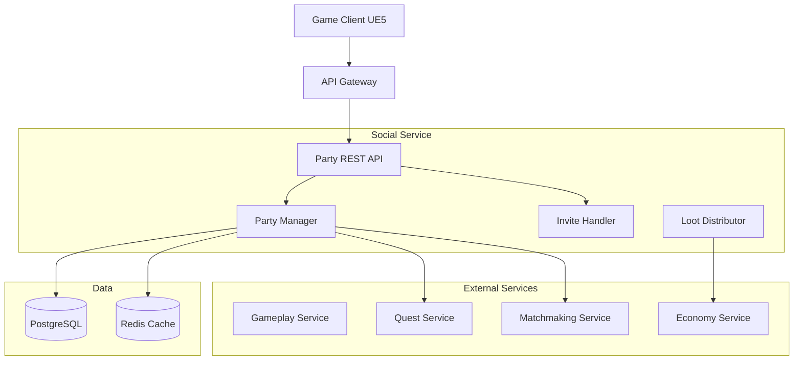
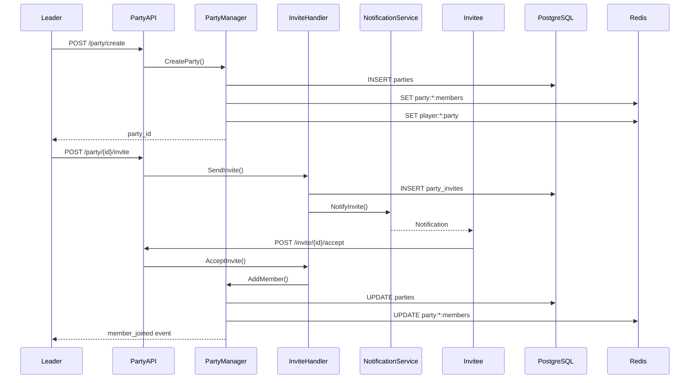
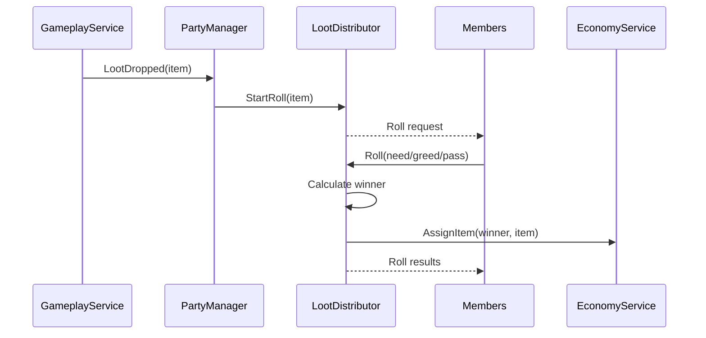

<!-- Issue: #139 -->

# Архитектура системы групп (Party System)

## Метаданные

- **ID:** architecture-party-system
- **Версия:** 1.0.0
- **Дата:** 2025-12-02
- **Автор:** Architect Agent
- **Статус:** Draft
- **Теги:** architecture, party, social, backend, gameplay

## Краткое описание

Party System управляет кооперативными группами до 5 игроков для совместного прохождения контента с поддержкой приглашений, ролей, общих квестов и различных режимов распределения лута.

## Связанные документы

- `knowledge/implementation/backend/party-system.yaml`

---

## 1. Архитектурный обзор

### 1.1. Цели системы

1. **Кооперативный геймплей** - группы до 5 игроков для PvE/PvP контента
2. **Управление участниками** - приглашения, исключение, роли (leader, member)
3. **Распределение лута** - 4 режима (need/greed, master looter, free for all, round robin)
4. **Общие квесты** - синхронизация прогресса между участниками
5. **Matchmaking** - групповые очереди для поиска матчей

### 1.2. Ключевые компоненты



---

## 2. Компоненты системы

### 2.1. Party Service (в составе Social Service)

**Технологии:** Go, gRPC, REST, PostgreSQL, Redis

**Подкомпоненты:**

#### Party Manager
- Создание/роспуск групп
- Управление участниками
- Роли (leader, member)
- Настройки группы

#### Invite Handler
- Отправка/принятие приглашений
- Валидация (размер группы, статус игрока)
- Уведомления

#### Loot Distributor
- Need/Greed система
- Master Looter
- Free for All
- Round Robin
- Roll система

### 2.2. Data Storage

#### PostgreSQL Schema

```sql
CREATE TABLE parties (
    id UUID PRIMARY KEY DEFAULT gen_random_uuid(),
    leader_id UUID NOT NULL,
    members JSONB NOT NULL,              -- [{player_id, role, joined_at}, ...]
    max_members INTEGER NOT NULL DEFAULT 5,
    loot_mode VARCHAR(50) NOT NULL,       -- 'need_greed', 'master_looter', 'ffa', 'round_robin'
    quest_sharing BOOLEAN DEFAULT TRUE,
    party_status VARCHAR(50) NOT NULL,    -- 'forming', 'active', 'in_combat', 'disbanded'
    created_at TIMESTAMP NOT NULL DEFAULT NOW(),
    updated_at TIMESTAMP NOT NULL DEFAULT NOW()
);

CREATE INDEX idx_party_leader ON parties(leader_id);
CREATE INDEX idx_party_status ON parties(party_status);

CREATE TABLE party_invites (
    id UUID PRIMARY KEY DEFAULT gen_random_uuid(),
    party_id UUID NOT NULL REFERENCES parties(id),
    inviter_id UUID NOT NULL,
    invitee_id UUID NOT NULL,
    invite_status VARCHAR(50) NOT NULL,   -- 'pending', 'accepted', 'declined', 'expired'
    expires_at TIMESTAMP NOT NULL,
    created_at TIMESTAMP NOT NULL DEFAULT NOW()
);

CREATE INDEX idx_invite_invitee ON party_invites(invitee_id, invite_status);
```

#### Redis

- `party:{party_id}:members` - список участников (TTL: бесконечно)
- `player:{player_id}:party` - текущая группа игрока (TTL: бесконечно)
- `party:{party_id}:loot_queue` - очередь для round robin (TTL: 1 час)

---

## 3. API Endpoints

### 3.1. Party Management

#### POST /api/v1/social/party/create
**Создать группу**

Response:
```json
{
  "party_id": "uuid",
  "leader_id": "uuid",
  "members": [{"player_id": "uuid", "role": "leader"}],
  "loot_mode": "need_greed"
}
```

#### DELETE /api/v1/social/party/{party_id}
**Распустить группу** (только leader)

#### POST /api/v1/social/party/{party_id}/invite
**Пригласить игрока**

Request: `{"player_id": "uuid"}`

Response: `{"invite_id": "uuid", "expires_at": "..."}`

#### POST /api/v1/social/party/invite/{invite_id}/accept
**Принять приглашение**

#### POST /api/v1/social/party/invite/{invite_id}/decline
**Отклонить приглашение**

#### DELETE /api/v1/social/party/{party_id}/member/{player_id}
**Исключить участника** (только leader)

#### POST /api/v1/social/party/{party_id}/leave
**Покинуть группу**

#### PATCH /api/v1/social/party/{party_id}/settings
**Изменить настройки**

Request:
```json
{
  "loot_mode": "master_looter",
  "quest_sharing": true
}
```

### 3.2. Loot Distribution

#### POST /api/v1/social/party/{party_id}/loot/roll
**Бросить кубик на предмет**

Request: `{"item_id": "uuid", "roll_type": "need"|"greed"|"pass"}`

Response: `{"roll_value": 85, "player_id": "uuid"}`

#### POST /api/v1/social/party/{party_id}/loot/assign
**Выдать предмет** (Master Looter only)

Request: `{"item_id": "uuid", "player_id": "uuid"}`

---

## 4. Потоки данных

### 4.1. Создание группы и приглашение



### 4.2. Распределение лута (Need/Greed)



---

## 5. Режимы распределения лута

### 5.1. Need/Greed

**Приоритет:** Need > Greed > Pass

**Процесс:**
1. Предмет выпадает
2. Все участники бросают кубик (1-100)
3. Need броски сравниваются первыми
4. Если нет Need, сравниваются Greed
5. Победитель получает предмет

### 5.2. Master Looter

- Лидер назначает предметы вручную
- Участники не бросают кубики
- Полный контроль лидера

### 5.3. Free for All

- Первый подобравший получает
- Нет ограничений
- Быстрый лут

### 5.4. Round Robin

- Автоматическая ротация
- Каждый следующий предмет - следующему игроку
- Справедливое распределение

---

## 6. События (Event-Driven)

**Published:**
- `party:created` - группа создана
- `party:member_joined` - участник присоединился
- `party:member_left` - участник покинул
- `party:disbanded` - группа распущена
- `party:loot_rolled` - брошен кубик на лут

**Subscribed:**
- `quest:progress` - обновление прогресса квеста
- `combat:ended` - завершение боя (для лута)
- `player:disconnected` - отключение игрока

---

## 7. Производительность

### 7.1. Метрики

- API latency: < 100ms (p95)
- Party creation: < 50ms
- Invite send: < 30ms

### 7.2. Оптимизации

- Redis кэш для активных групп
- Индексы БД
- Event batching для лута

---

## 8. Разбиение на подзадачи

### 8.1. Database Schema (P0)
Создать схемы для `parties`, `party_invites`
**Срок:** 1 неделя

### 8.2. Party Manager API (P0)
REST API для создания/управления группами
**Срок:** 2 недели

### 8.3. Invite System (P0)
Система приглашений
**Срок:** 1 неделя

### 8.4. Loot Distributor (P1)
Реализовать 4 режима лута
**Срок:** 2 недели

### 8.5. Quest Integration (P1)
Синхронизация квестов
**Срок:** 1 неделя

### 8.6. Matchmaking Integration (P2)
Групповые очереди
**Срок:** 1 неделя

---

## 9. Критерии готовности

- [x] Архитектура спроектирована
- [x] Компоненты определены
- [x] Микросервисы идентифицированы
- [x] API endpoints описаны
- [x] Система распределения лута спроектирована
- [x] Техническое задание готово

---

**Конец документа**


