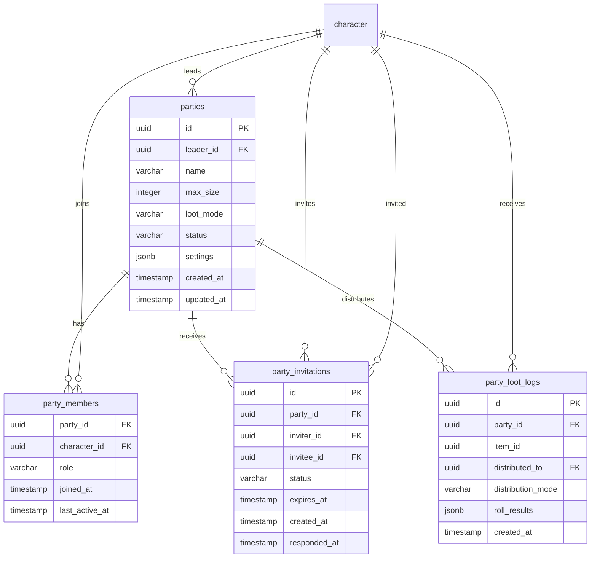

<!-- Issue: #140887526 -->
# Party System - Database Schema

## Обзор

Схема базы данных для системы групп (Party System), включающая группы, участников, приглашения и логи распределения лута.

## ERD Диаграмма



## Описание таблиц

### parties

Таблица групп игроков. Хранит информацию о группах до 5 участников.

**Ключевые поля:**
- `id`: UUID первичный ключ
- `leader_id`: ID лидера группы (FK к characters, NOT NULL)
- `name`: Название группы (VARCHAR(255), nullable)
- `max_size`: Максимальный размер группы (INTEGER, NOT NULL, default: 5, 2-5)
- `loot_mode`: Режим распределения лута (VARCHAR(50), NOT NULL, default: 'free_for_all')
- `status`: Статус группы (VARCHAR(20), NOT NULL, default: 'active')
- `settings`: Дополнительные настройки (JSONB, default: {})
- `created_at`: Время создания
- `updated_at`: Время последнего обновления

**Индексы:**
- По `leader_id` для групп лидера
- По `created_at DESC` для последних групп
- По `(leader_id, status)` для активных групп лидера
- По `(status, created_at DESC)` для активных групп

### party_members

Таблица участников групп. Хранит информацию об участниках групп.

**Ключевые поля:**
- `party_id`: ID группы (FK к parties, NOT NULL)
- `character_id`: ID персонажа (FK к characters, NOT NULL)
- `role`: Роль участника (VARCHAR(20), NOT NULL: 'leader', 'member')
- `joined_at`: Время присоединения (TIMESTAMP, NOT NULL, default: CURRENT_TIMESTAMP)
- `last_active_at`: Время последней активности (TIMESTAMP, NOT NULL, default: CURRENT_TIMESTAMP)

**Индексы:**
- По `party_id` для участников группы
- По `character_id` для групп персонажа
- По `joined_at ASC` для сортировки по времени присоединения
- По `(character_id, party_id)` для поиска участия

**Constraints:**
- PRIMARY KEY(party_id, character_id): Один участник на группу

### party_invitations

Таблица приглашений в группы. Хранит информацию о приглашениях в группы.

**Ключевые поля:**
- `id`: UUID первичный ключ
- `party_id`: ID группы (FK к parties, NOT NULL)
- `inviter_id`: ID приглашающего (FK к characters, NOT NULL)
- `invitee_id`: ID приглашаемого (FK к characters, NOT NULL)
- `status`: Статус приглашения (VARCHAR(20), NOT NULL, default: 'pending')
- `expires_at`: Время истечения (TIMESTAMP, NOT NULL)
- `created_at`: Время создания
- `responded_at`: Время ответа (TIMESTAMP, nullable)

**Индексы:**
- По `(invitee_id, status)` для приглашений приглашаемого
- По `(party_id, status)` для приглашений группы
- По `expires_at` для истекающих приглашений

**Constraints:**
- UNIQUE(party_id, invitee_id, status) WHERE status = 'pending': Одно активное приглашение на группу

### party_loot_logs

Таблица логов распределения лута. Хранит информацию о распределении лута в группах.

**Ключевые поля:**
- `id`: UUID первичный ключ
- `party_id`: ID группы (FK к parties, NOT NULL)
- `item_id`: ID предмета (UUID, NOT NULL)
- `distributed_to`: ID получателя (FK к characters, NOT NULL)
- `distribution_mode`: Режим распределения (VARCHAR(30), NOT NULL)
- `roll_results`: Результаты бросков кубика (JSONB, nullable)
- `created_at`: Время создания

**Индексы:**
- По `(party_id, created_at DESC)` для логов группы
- По `(distributed_to, created_at DESC)` для логов получателя

## ENUM типы

### party_loot_mode
- `free_for_all`: Каждый забирает свой лут
- `need_before_greed`: Приоритет нуждающимся
- `master_looter`: Лидер распределяет
- `round_robin`: По очереди

### party_status
- `active`: Активна
- `disbanded`: Распущена

### party_member_role
- `leader`: Лидер
- `member`: Участник

### invitation_status
- `pending`: Ожидает ответа
- `accepted`: Принято
- `declined`: Отклонено
- `expired`: Истекло

### loot_distribution_mode
- `free_for_all`: Каждый забирает свой лут
- `need_before_greed`: Приоритет нуждающимся
- `master_looter`: Лидер распределяет
- `round_robin`: По очереди

## Constraints и валидация

### CHECK Constraints

- `parties.max_size`: Должно быть >= 2 и <= 5
- `parties.loot_mode`: Должно быть одним из: 'free_for_all', 'round_robin', 'need_before_greed', 'master_looter'
- `parties.status`: Должно быть одним из: 'active', 'disbanded'
- `party_members.role`: Должно быть одним из: 'leader', 'member'
- `party_invitations.status`: Должно быть одним из: 'pending', 'accepted', 'declined', 'expired'
- `party_loot_logs.distribution_mode`: Должно быть одним из: 'free_for_all', 'need_before_greed', 'master_looter', 'round_robin'

### Foreign Keys

- `parties.leader_id` → `mvp_core.character.id` (ON DELETE CASCADE)
- `party_members.party_id` → `social.parties.id` (ON DELETE CASCADE)
- `party_members.character_id` → `mvp_core.character.id` (ON DELETE CASCADE)
- `party_invitations.party_id` → `social.parties.id` (ON DELETE CASCADE)
- `party_invitations.inviter_id` → `mvp_core.character.id` (ON DELETE CASCADE)
- `party_invitations.invitee_id` → `mvp_core.character.id` (ON DELETE CASCADE)
- `party_loot_logs.party_id` → `social.parties.id` (ON DELETE CASCADE)
- `party_loot_logs.distributed_to` → `mvp_core.character.id` (ON DELETE CASCADE)

### Unique Constraints

- `party_members(party_id, character_id)`: Один участник на группу
- `party_invitations(party_id, invitee_id, status)`: Одно активное приглашение на группу (WHERE status = 'pending')

## Оптимизация запросов

### Частые запросы

1. **Получение группы игрока:**
   ```sql
   SELECT p.* FROM social.parties p
   JOIN social.party_members pm ON p.id = pm.party_id
   WHERE pm.character_id = $1 AND p.status = 'active';
   ```
   Использует индекс `(character_id, party_id)`.

2. **Получение участников группы:**
   ```sql
   SELECT * FROM social.party_members 
   WHERE party_id = $1 
   ORDER BY joined_at ASC;
   ```
   Использует индекс `party_id`.

3. **Получение активных приглашений игрока:**
   ```sql
   SELECT * FROM social.party_invitations 
   WHERE invitee_id = $1 AND status = 'pending' AND expires_at > CURRENT_TIMESTAMP;
   ```
   Использует индекс `(invitee_id, status)`.

4. **Получение логов лута группы:**
   ```sql
   SELECT * FROM social.party_loot_logs 
   WHERE party_id = $1 
   ORDER BY created_at DESC 
   LIMIT 50;
   ```
   Использует индекс `(party_id, created_at DESC)`.

5. **Получение активных групп лидера:**
   ```sql
   SELECT * FROM social.parties 
   WHERE leader_id = $1 AND status = 'active';
   ```
   Использует индекс `(leader_id, status)`.

## Миграции

### Существующие миграции:
- `V1_32__party_tables.sql` - базовые таблицы (parties, party_members)
- `V1_64__party_system_enhancement.sql` - расширенные таблицы и поля

### Применение миграций:
```bash
liquibase update --changelog-file=infrastructure/liquibase/changelog.yaml
```

## Соответствие архитектуре

Схема БД полностью соответствует архитектуре из `knowledge/implementation/architecture/party-system-architecture.yaml`:
- OK Все таблицы из архитектуры созданы
- OK Все поля соответствуют описанию
- OK Индексы оптимизированы для частых запросов
- OK Constraints обеспечивают целостность данных
- OK Foreign Keys настроены с CASCADE для автоматической очистки
- OK Интеграция с существующими таблицами (characters)

## Особенности реализации

### Группы

Система групп включает:
- **Лимит участников**: max_size (2-5, default: 5)
- **Режимы лута**: free_for_all, need_before_greed, master_looter, round_robin
- **Статусы**: active, disbanded
- **Настройки**: settings (JSONB) для дополнительных настроек
- **Название**: name (nullable) для именованных групп

### Участники

Система участников включает:
- **Роли**: leader, member
- **Время присоединения**: joined_at для истории
- **Активность**: last_active_at для отслеживания активности

### Приглашения

Система приглашений включает:
- **Статусы**: pending, accepted, declined, expired
- **Истечение**: expires_at для таймаутов
- **Ответ**: responded_at для времени ответа
- **Уникальность**: одно активное приглашение на группу

### Логи лута

Система логов лута включает:
- **Режимы распределения**: free_for_all, need_before_greed, master_looter, round_robin
- **Результаты бросков**: roll_results (JSONB) для need-before-greed
- **История**: created_at для отслеживания распределений

### Интеграция с другими системами

Система групп интегрируется с:
- **Characters**: через character_id для участников и лидеров
- **Economy Service**: через party_loot_logs для распределения лута
- **Gameplay Service**: через party_id для совместных заданий
- **Matchmaking Service**: через party_id для групповой очереди
- **Notification Service**: через party_invitations для уведомлений


