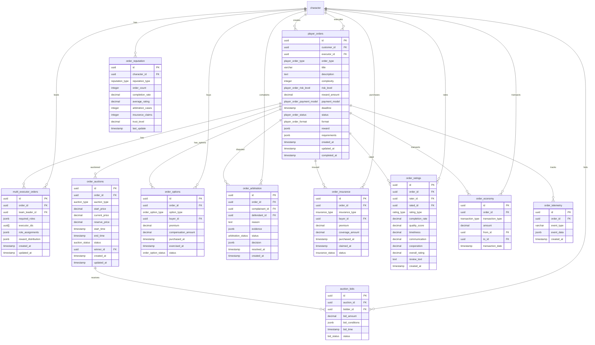

<!-- Issue: #140876094 -->

# Player Orders System - Database Schema

## Обзор

Схема базы данных для системы заказов от игроков, включающая основные заказы, мульти-исполнительные заказы, аукционы,
опционы, арбитраж, страхование, рейтинги, репутацию, экономику и телеметрию.

## ERD Диаграмма



## Описание таблиц

### player_orders

Таблица заказов от игроков. Основная таблица системы заказов.

**Ключевые поля:**

- `id`: UUID первичный ключ
- `customer_id`: ID заказчика (FK к characters, NOT NULL)
- `executor_id`: ID исполнителя (FK к characters, nullable)
- `order_type`: Тип заказа (ENUM: combat, hacking, trade, political, research, social, NOT NULL)
- `title`: Название заказа (VARCHAR(255), NOT NULL)
- `description`: Описание заказа (TEXT, NOT NULL)
- `complexity`: Сложность заказа (INTEGER, default: 0)
- `risk_level`: Уровень риска (ENUM: low, medium, high, nullable)
- `reward_amount`: Сумма награды (DECIMAL(10,2), nullable)
- `payment_model`: Модель оплаты (ENUM: fixed, hourly, percentage, hybrid, nullable)
- `deadline`: Срок выполнения (TIMESTAMP, nullable)
- `status`: Статус заказа (ENUM: created, published, accepted, in-progress, completed, cancelled, failed, NOT NULL,
  default: open)
- `format`: Формат заказа (ENUM: public, selective, private, auction, nullable)
- `reward`: Награда (JSONB, nullable)
- `requirements`: Требования (JSONB, nullable)
- `created_at`: Время создания
- `updated_at`: Время последнего обновления
- `completed_at`: Время завершения (TIMESTAMP, nullable)

**Индексы:**

- По `customer_id` для заказов заказчика
- По `executor_id` для заказов исполнителя
- По `status` для фильтрации по статусу
- По `order_type` для фильтрации по типу
- По `created_at DESC` для последних заказов
- По `(complexity, status)` для сложности
- По `(risk_level, status)` для уровня риска
- По `(format, status)` для формата
- По `deadline` для заказов с дедлайном

### multi_executor_orders

Таблица мульти-исполнительных заказов. Хранит информацию о заказах с несколькими исполнителями.

**Ключевые поля:**

- `id`: UUID первичный ключ
- `order_id`: ID заказа (FK к player_orders, NOT NULL)
- `team_leader_id`: ID лидера команды (FK к characters, NOT NULL)
- `required_roles`: Требуемые роли (JSONB, NOT NULL)
- `executor_ids`: ID исполнителей (UUID[], NOT NULL)
- `role_assignments`: Назначения ролей (JSONB, nullable)
- `reward_distribution`: Распределение награды (JSONB, nullable)
- `created_at`: Время создания
- `updated_at`: Время последнего обновления

**Индексы:**

- По `order_id` для связи с заказом
- По `team_leader_id` для лидера команды

### order_auctions

Таблица аукционов заказов. Хранит информацию об аукционах заказов.

**Ключевые поля:**

- `id`: UUID первичный ключ
- `order_id`: ID заказа (FK к player_orders, NOT NULL)
- `auction_type`: Тип аукциона (ENUM: ascending, descending, sealed, NOT NULL)
- `start_price`: Начальная цена (DECIMAL(10,2), NOT NULL, >= 0)
- `current_price`: Текущая цена (DECIMAL(10,2), NOT NULL, >= 0)
- `reserve_price`: Резервная цена (DECIMAL(10,2), nullable, >= 0)
- `start_time`: Время начала (TIMESTAMP, NOT NULL, default: CURRENT_TIMESTAMP)
- `end_time`: Время окончания (TIMESTAMP, NOT NULL)
- `status`: Статус аукциона (ENUM: open, closed, cancelled, NOT NULL, default: open)
- `winner_id`: ID победителя (FK к characters, nullable)
- `created_at`: Время создания
- `updated_at`: Время последнего обновления

**Индексы:**

- По `order_id` для связи с заказом
- По `(status, end_time)` для активных аукционов
- По `winner_id` для победителей

### auction_bids

Таблица ставок на аукционах. Хранит информацию о ставках на аукционах заказов.

**Ключевые поля:**

- `id`: UUID первичный ключ
- `auction_id`: ID аукциона (FK к order_auctions, NOT NULL)
- `bidder_id`: ID участника торгов (FK к characters, NOT NULL)
- `bid_amount`: Сумма ставки (DECIMAL(10,2), NOT NULL, > 0)
- `bid_conditions`: Условия ставки (JSONB, nullable)
- `bid_time`: Время ставки (TIMESTAMP, NOT NULL, default: CURRENT_TIMESTAMP)
- `status`: Статус ставки (ENUM: active, outbid, winning, lost, NOT NULL, default: active)

**Индексы:**

- По `(auction_id, bid_amount DESC)` для лучших ставок
- По `(bidder_id, status)` для ставок участника
- По `(status, bid_time DESC)` для статуса

### order_options

Таблица опционов на заказы. Хранит информацию об опционах на отмену заказов.

**Ключевые поля:**

- `id`: UUID первичный ключ
- `order_id`: ID заказа (FK к player_orders, NOT NULL)
- `option_type`: Тип опциона (ENUM: customer_cancellation, executor_cancellation, mutual_cancellation, NOT NULL)
- `buyer_id`: ID покупателя опциона (FK к characters, NOT NULL)
- `premium`: Премия (DECIMAL(10,2), NOT NULL, >= 0)
- `compensation_amount`: Сумма компенсации (DECIMAL(10,2), NOT NULL, >= 0)
- `purchased_at`: Время покупки (TIMESTAMP, NOT NULL, default: CURRENT_TIMESTAMP)
- `exercised_at`: Время исполнения (TIMESTAMP, nullable)
- `status`: Статус опциона (ENUM: active, exercised, expired, NOT NULL, default: active)

**Индексы:**

- По `(order_id, status)` для опционов заказа
- По `(buyer_id, status)` для опционов покупателя
- По `status` для статуса

### order_arbitration

Таблица арбитража заказов. Хранит информацию о спорах по заказам.

**Ключевые поля:**

- `id`: UUID первичный ключ
- `order_id`: ID заказа (FK к player_orders, NOT NULL)
- `complainant_id`: ID жалобщика (FK к characters, NOT NULL)
- `defendant_id`: ID ответчика (FK к characters, NOT NULL)
- `reason`: Причина спора (TEXT, NOT NULL)
- `evidence`: Доказательства (JSONB, nullable)
- `status`: Статус арбитража (ENUM: pending, in-review, resolved, dismissed, NOT NULL, default: pending)
- `decision`: Решение (JSONB, nullable)
- `resolved_at`: Время разрешения (TIMESTAMP, nullable)
- `created_at`: Время создания

**Индексы:**

- По `(order_id, status)` для арбитража заказа
- По `(complainant_id, status)` для жалобщика
- По `(defendant_id, status)` для ответчика

### order_insurance

Таблица страхования заказов. Хранит информацию о страховках заказов.

**Ключевые поля:**

- `id`: UUID первичный ключ
- `order_id`: ID заказа (FK к player_orders, NOT NULL)
- `insurance_type`: Тип страхования (ENUM: mission_failure, cargo, delay, comprehensive, NOT NULL)
- `buyer_id`: ID покупателя страховки (FK к characters, NOT NULL)
- `premium`: Премия (DECIMAL(10,2), NOT NULL, >= 0)
- `coverage_amount`: Сумма покрытия (DECIMAL(10,2), NOT NULL, >= 0)
- `purchased_at`: Время покупки (TIMESTAMP, NOT NULL, default: CURRENT_TIMESTAMP)
- `claimed_at`: Время требования (TIMESTAMP, nullable)
- `status`: Статус страховки (ENUM: active, claimed, expired, NOT NULL, default: active)

**Индексы:**

- По `(order_id, status)` для страховок заказа
- По `(buyer_id, status)` для страховок покупателя
- По `status` для статуса

### order_ratings

Таблица рейтингов заказов. Хранит информацию о рейтингах заказов.

**Ключевые поля:**

- `id`: UUID первичный ключ
- `order_id`: ID заказа (FK к player_orders, NOT NULL)
- `rater_id`: ID оценивающего (FK к characters, NOT NULL)
- `rated_id`: ID оцениваемого (FK к characters, NOT NULL)
- `rating_type`: Тип рейтинга (ENUM: customer, executor, NOT NULL)
- `completion_rate`: Процент выполнения (DECIMAL(3,2), NOT NULL, default: 0.00, 0-1)
- `quality_score`: Оценка качества (DECIMAL(3,2), NOT NULL, default: 0.00, 0-1)
- `timeliness`: Своевременность (DECIMAL(3,2), NOT NULL, default: 0.00, 0-1)
- `communication`: Коммуникация (DECIMAL(3,2), NOT NULL, default: 0.00, 0-1)
- `cooperation`: Сотрудничество (DECIMAL(3,2), NOT NULL, default: 0.00, 0-1)
- `overall_rating`: Общая оценка (DECIMAL(3,2), NOT NULL, default: 0.00, 0-1)
- `review_text`: Текст отзыва (TEXT, nullable)
- `created_at`: Время создания

**Индексы:**

- По `order_id` для рейтингов заказа
- По `(rated_id, rating_type)` для рейтингов персонажа
- По `overall_rating DESC` для лучших рейтингов

**Constraints:**

- UNIQUE(order_id, rater_id, rating_type): Один рейтинг на заказ от оценивающего

### order_reputation

Таблица репутации в заказах. Хранит агрегированную репутацию персонажей.

**Ключевые поля:**

- `id`: UUID первичный ключ
- `character_id`: ID персонажа (FK к characters, NOT NULL)
- `reputation_type`: Тип репутации (ENUM: customer, executor, NOT NULL)
- `order_count`: Количество заказов (INTEGER, NOT NULL, default: 0, >= 0)
- `completion_rate`: Процент выполнения (DECIMAL(5,4), NOT NULL, default: 0.0000, 0-1)
- `average_rating`: Средний рейтинг (DECIMAL(3,2), NOT NULL, default: 0.00, 0-1)
- `arbitration_cases`: Количество арбитражных дел (INTEGER, NOT NULL, default: 0, >= 0)
- `insurance_claims`: Количество страховых случаев (INTEGER, NOT NULL, default: 0, >= 0)
- `trust_level`: Уровень доверия (DECIMAL(3,2), NOT NULL, default: 0.00, 0-1)
- `last_update`: Время последнего обновления

**Индексы:**

- По `character_id` для репутации персонажа
- По `(reputation_type, trust_level DESC)` для топ репутации
- По `trust_level DESC` для уровня доверия

**Constraints:**

- UNIQUE(character_id, reputation_type): Одна репутация на персонажа и тип

### order_economy

Таблица экономики заказов. Хранит информацию о финансовых транзакциях по заказам.

**Ключевые поля:**

- `id`: UUID первичный ключ
- `order_id`: ID заказа (FK к player_orders, NOT NULL)
- `transaction_type`: Тип транзакции (ENUM: deposit, payment, commission, refund, penalty, NOT NULL)
- `amount`: Сумма (DECIMAL(10,2), NOT NULL)
- `from_id`: ID отправителя (FK к characters, nullable)
- `to_id`: ID получателя (FK к characters, nullable)
- `transaction_date`: Дата транзакции (TIMESTAMP, NOT NULL, default: CURRENT_TIMESTAMP)

**Индексы:**

- По `(order_id, transaction_date DESC)` для транзакций заказа
- По `(from_id, transaction_date DESC)` для транзакций отправителя
- По `(to_id, transaction_date DESC)` для транзакций получателя
- По `(transaction_type, transaction_date DESC)` для типа транзакции

### order_telemetry

Таблица телеметрии заказов. Хранит информацию о событиях заказов для аналитики.

**Ключевые поля:**

- `id`: UUID первичный ключ
- `order_id`: ID заказа (FK к player_orders, NOT NULL)
- `event_type`: Тип события (VARCHAR(50), NOT NULL)
- `event_data`: Данные события (JSONB, nullable)
- `created_at`: Время создания

**Индексы:**

- По `(order_id, created_at DESC)` для событий заказа
- По `(event_type, created_at DESC)` для типа события
- По `created_at DESC` для последних событий

## ENUM типы

### player_order_type

- `combat`: Боевой заказ
- `hacking`: Заказ на взлом
- `trade`: Торговый заказ
- `political`: Политический заказ
- `research`: Исследовательский заказ
- `social`: Социальный заказ

### player_order_risk_level

- `low`: Низкий риск
- `medium`: Средний риск
- `high`: Высокий риск

### player_order_payment_model

- `fixed`: Фиксированная оплата
- `hourly`: Почасовая оплата
- `percentage`: Процентная оплата
- `hybrid`: Гибридная оплата

### player_order_status

- `created`: Создан
- `published`: Опубликован
- `accepted`: Принят
- `in-progress`: В процессе
- `completed`: Завершен
- `cancelled`: Отменен
- `failed`: Провален

### player_order_format

- `public`: Публичный
- `selective`: Селективный
- `private`: Приватный
- `auction`: Аукцион

### auction_type

- `ascending`: Возрастающий
- `descending`: Убывающий
- `sealed`: Закрытый

### auction_status

- `open`: Открыт
- `closed`: Закрыт
- `cancelled`: Отменен

### bid_status

- `active`: Активна
- `outbid`: Перебита
- `winning`: Выигрывает
- `lost`: Проиграна

### order_option_type

- `customer_cancellation`: Отмена заказчиком
- `executor_cancellation`: Отмена исполнителем
- `mutual_cancellation`: Взаимная отмена

### order_option_status

- `active`: Активен
- `exercised`: Исполнен
- `expired`: Истек

### arbitration_status

- `pending`: Ожидает рассмотрения
- `in-review`: На рассмотрении
- `resolved`: Разрешен
- `dismissed`: Отклонен

### insurance_type

- `mission_failure`: Провал миссии
- `cargo`: Груз
- `delay`: Задержка
- `comprehensive`: Комплексное

### insurance_status

- `active`: Активна
- `claimed`: Заявлена
- `expired`: Истекла

### rating_type

- `customer`: Заказчик
- `executor`: Исполнитель

### reputation_type

- `customer`: Заказчик
- `executor`: Исполнитель

### transaction_type

- `deposit`: Депозит
- `payment`: Платеж
- `commission`: Комиссия
- `refund`: Возврат
- `penalty`: Штраф

## Constraints и валидация

### CHECK Constraints

- `order_auctions.start_price`: Должно быть >= 0
- `order_auctions.current_price`: Должно быть >= 0
- `order_auctions.reserve_price`: Должно быть >= 0 (если не NULL)
- `auction_bids.bid_amount`: Должно быть > 0
- `order_options.premium`: Должно быть >= 0
- `order_options.compensation_amount`: Должно быть >= 0
- `order_insurance.premium`: Должно быть >= 0
- `order_insurance.coverage_amount`: Должно быть >= 0
- `order_ratings.completion_rate`: Должно быть >= 0 и <= 1
- `order_ratings.quality_score`: Должно быть >= 0 и <= 1
- `order_ratings.timeliness`: Должно быть >= 0 и <= 1
- `order_ratings.communication`: Должно быть >= 0 и <= 1
- `order_ratings.cooperation`: Должно быть >= 0 и <= 1
- `order_ratings.overall_rating`: Должно быть >= 0 и <= 1
- `order_reputation.order_count`: Должно быть >= 0
- `order_reputation.completion_rate`: Должно быть >= 0 и <= 1
- `order_reputation.average_rating`: Должно быть >= 0 и <= 1
- `order_reputation.arbitration_cases`: Должно быть >= 0
- `order_reputation.insurance_claims`: Должно быть >= 0
- `order_reputation.trust_level`: Должно быть >= 0 и <= 1

### Foreign Keys

- `player_orders.customer_id` → `mvp_core.character.id`
- `player_orders.executor_id` → `mvp_core.character.id` (nullable)
- `multi_executor_orders.order_id` → `social.player_orders.id` (ON DELETE CASCADE)
- `multi_executor_orders.team_leader_id` → `mvp_core.character.id` (ON DELETE CASCADE)
- `order_auctions.order_id` → `social.player_orders.id` (ON DELETE CASCADE)
- `order_auctions.winner_id` → `mvp_core.character.id` (ON DELETE SET NULL)
- `auction_bids.auction_id` → `social.order_auctions.id` (ON DELETE CASCADE)
- `auction_bids.bidder_id` → `mvp_core.character.id` (ON DELETE CASCADE)
- `order_options.order_id` → `social.player_orders.id` (ON DELETE CASCADE)
- `order_options.buyer_id` → `mvp_core.character.id` (ON DELETE CASCADE)
- `order_arbitration.order_id` → `social.player_orders.id` (ON DELETE CASCADE)
- `order_arbitration.complainant_id` → `mvp_core.character.id` (ON DELETE CASCADE)
- `order_arbitration.defendant_id` → `mvp_core.character.id` (ON DELETE CASCADE)
- `order_insurance.order_id` → `social.player_orders.id` (ON DELETE CASCADE)
- `order_insurance.buyer_id` → `mvp_core.character.id` (ON DELETE CASCADE)
- `order_ratings.order_id` → `social.player_orders.id` (ON DELETE CASCADE)
- `order_ratings.rater_id` → `mvp_core.character.id` (ON DELETE CASCADE)
- `order_ratings.rated_id` → `mvp_core.character.id` (ON DELETE CASCADE)
- `order_reputation.character_id` → `mvp_core.character.id` (ON DELETE CASCADE)
- `order_economy.order_id` → `social.player_orders.id` (ON DELETE CASCADE)
- `order_economy.from_id` → `mvp_core.character.id` (ON DELETE SET NULL)
- `order_economy.to_id` → `mvp_core.character.id` (ON DELETE SET NULL)
- `order_telemetry.order_id` → `social.player_orders.id` (ON DELETE CASCADE)

### Unique Constraints

- `order_ratings(order_id, rater_id, rating_type)`: Один рейтинг на заказ от оценивающего
- `order_reputation(character_id, reputation_type)`: Одна репутация на персонажа и тип

## Оптимизация запросов

### Частые запросы

1. **Получение заказов заказчика:**
   ```sql
   SELECT * FROM social.player_orders 
   WHERE customer_id = $1 
   ORDER BY created_at DESC;
   ```
   Использует индекс `customer_id`.

2. **Получение активных заказов:**
   ```sql
   SELECT * FROM social.player_orders 
   WHERE status IN ('published', 'accepted', 'in-progress') 
   ORDER BY created_at DESC;
   ```
   Использует индекс `status`.

3. **Получение ставок аукциона:**
   ```sql
   SELECT * FROM social.auction_bids 
   WHERE auction_id = $1 
   ORDER BY bid_amount DESC;
   ```
   Использует индекс `(auction_id, bid_amount DESC)`.

4. **Получение репутации персонажа:**
   ```sql
   SELECT * FROM social.order_reputation 
   WHERE character_id = $1 AND reputation_type = $2;
   ```
   Использует UNIQUE constraint `(character_id, reputation_type)`.

5. **Получение транзакций заказа:**
   ```sql
   SELECT * FROM social.order_economy 
   WHERE order_id = $1 
   ORDER BY transaction_date DESC;
   ```
   Использует индекс `(order_id, transaction_date DESC)`.

## Миграции

### Существующие миграции:

- `V1_27__player_orders_tables.sql` - базовые таблицы (player_orders, player_order_reviews)
- `V1_53__social_system_player_orders_enhancement.sql` - расширенные таблицы
- `V1_63__player_orders_system_enhancement.sql` - ENUM типы и дополнительные поля

### Применение миграций:

```bash
liquibase update --changelog-file=infrastructure/liquibase/changelog.yaml
```

## Соответствие архитектуре

Схема БД полностью соответствует архитектуре из `knowledge/implementation/architecture/player-orders-database.yaml`:

- [OK] Все таблицы из архитектуры созданы
- [OK] Все поля соответствуют описанию
- [OK] ENUM типы созданы для всех категорий
- [OK] Индексы оптимизированы для частых запросов
- [OK] Constraints обеспечивают целостность данных
- [OK] Foreign Keys настроены с CASCADE для автоматической очистки
- [OK] Интеграция с существующими таблицами (characters)

## Особенности реализации

### Основные заказы

Система заказов включает:

- **Типы заказов**: combat, hacking, trade, political, research, social
- **Форматы**: public, selective, private, auction
- **Модели оплаты**: fixed, hourly, percentage, hybrid
- **Уровни риска**: low, medium, high
- **Статусы**: created, published, accepted, in-progress, completed, cancelled, failed

### Мульти-исполнительные заказы

Система мульти-исполнительных заказов включает:

- **Роли**: required_roles для определения требуемых ролей
- **Исполнители**: executor_ids для списка исполнителей
- **Распределение награды**: reward_distribution для справедливого распределения

### Аукционы заказов

Система аукционов включает:

- **Типы аукционов**: ascending, descending, sealed
- **Цены**: start_price, current_price, reserve_price
- **Ставки**: auction_bids для отслеживания ставок
- **Победитель**: winner_id для назначения победителя

### Опционы на заказы

Система опционов включает:

- **Типы опционов**: customer_cancellation, executor_cancellation, mutual_cancellation
- **Премия**: premium за покупку опциона
- **Компенсация**: compensation_amount при исполнении
- **Статусы**: active, exercised, expired

### Арбитраж заказов

Система арбитража включает:

- **Споры**: complainant_id и defendant_id для участников спора
- **Доказательства**: evidence для хранения доказательств
- **Решения**: decision для хранения решений арбитража
- **Статусы**: pending, in-review, resolved, dismissed

### Страхование заказов

Система страхования включает:

- **Типы страхования**: mission_failure, cargo, delay, comprehensive
- **Покрытие**: coverage_amount для суммы покрытия
- **Премия**: premium за страховку
- **Статусы**: active, claimed, expired

### Рейтинги заказов

Система рейтингов включает:

- **Метрики**: completion_rate, quality_score, timeliness, communication, cooperation
- **Общая оценка**: overall_rating для агрегированной оценки
- **Типы рейтингов**: customer, executor
- **Отзывы**: review_text для текстовых отзывов

### Репутация в заказах

Система репутации включает:

- **Типы репутации**: customer, executor
- **Метрики**: order_count, completion_rate, average_rating
- **Доверие**: trust_level для уровня доверия
- **Арбитраж**: arbitration_cases для отслеживания споров
- **Страхование**: insurance_claims для отслеживания страховых случаев

### Экономика заказов

Система экономики включает:

- **Типы транзакций**: deposit, payment, commission, refund, penalty
- **Участники**: from_id и to_id для отправителя и получателя
- **Суммы**: amount для суммы транзакции
- **История**: transaction_date для отслеживания транзакций

### Телеметрия заказов

Система телеметрии включает:

- **События**: event_type для типа события
- **Данные**: event_data для JSONB данных события
- **Отслеживание**: created_at для времени события

### Интеграция с другими системами

Система Player Orders интегрируется с:

- **Characters**: через character_id для заказчиков и исполнителей
- **Economy Service**: через order_economy для финансовых транзакций
- **Party Service**: через party_id для групповых заказов
- **Inventory Service**: через reward для наград

