<!-- Issue: #140890233 -->
# Production Chains System - Database Schema

## Обзор

Схема базы данных для системы производственных цепочек, управляющей многоэтапным производством предметов от добычи сырья до крафта легендарных предметов.

## ERD Диаграмма

```mermaid
erDiagram
    production_chains ||--o{ production_orders : "has_orders"
    production_orders ||--o{ production_stages : "has_stages"
    production_orders ||--o{ production_accelerators : "has_accelerators"
    production_stations ||--o{ production_orders : "processes"
    production_licenses ||--o{ player_production_licenses : "purchased_by"
    production_legendary_quests ||--o{ production_orders : "for_legendary"

    production_chains {
        uuid id PK
        varchar name
        text description
        integer item_tier
        varchar item_type
        jsonb stages
        decimal base_cost
        integer base_time_minutes
        decimal base_success_rate
        uuid[] required_licenses
        timestamp created_at
        timestamp updated_at
    }

    production_orders {
        uuid id PK
        uuid player_id
        uuid chain_id FK
        uuid guild_id
        integer quantity
        production_order_status status
        integer current_stage
        integer total_stages
        decimal total_cost
        decimal actual_cost
        integer estimated_time_minutes
        integer actual_time_minutes
        decimal success_rate
        boolean is_rush
        decimal rush_cost_multiplier
        boolean is_bulk
        decimal bulk_efficiency
        uuid station_id FK
        timestamp started_at
        timestamp completed_at
        timestamp created_at
        timestamp updated_at
    }

    production_stages {
        uuid id PK
        uuid order_id FK
        integer stage_number
        production_stage_type stage_type
        production_stage_status status
        jsonb required_resources
        jsonb consumed_resources
        jsonb result
        boolean success
        timestamp started_at
        timestamp completed_at
        timestamp created_at
    }

    production_stations {
        uuid id PK
        uuid player_id
        production_station_type station_type
        integer level
        decimal efficiency_bonus
        integer capacity
        integer current_orders
        varchar location
        timestamp created_at
        timestamp updated_at
    }

    production_licenses {
        uuid id PK
        varchar name
        text description
        integer item_tier
        varchar item_type
        decimal cost
        integer duration_days
        timestamp created_at
    }

    player_production_licenses {
        uuid id PK
        uuid player_id
        uuid license_id FK
        timestamp purchased_at
        timestamp expires_at
        boolean active
    }

    production_accelerators {
        uuid id PK
        uuid order_id FK
        production_accelerator_type accelerator_type
        jsonb effect
        timestamp applied_at
        timestamp expires_at
    }

    production_legendary_quests {
        uuid id PK
        varchar name
        text description
        uuid item_id
        jsonb quest_chain
        boolean required_blueprint
        integer required_mastery
        jsonb required_components
        boolean legendary_forge_required
        decimal base_success_rate
        timestamp created_at
    }
```



## Описание таблиц

### production_chains

Производственные цепочки. Хранит информацию о цепочках производства предметов.

**Ключевые поля:**
- `id`: UUID первичный ключ
- `name`: Название цепочки (VARCHAR(255), NOT NULL)
- `description`: Описание цепочки (TEXT, nullable)
- `item_tier`: Тиер предмета (INTEGER, NOT NULL, CHECK: 1-5)
- `item_type`: Тип предмета (VARCHAR(50), NOT NULL)
- `stages`: Массив этапов цепочки (JSONB, NOT NULL, default: '[]')
- `base_cost`: Базовая стоимость производства (DECIMAL(10,2), NOT NULL, default: 0)
- `base_time_minutes`: Базовое время производства в минутах (INTEGER, NOT NULL, default: 0)
- `base_success_rate`: Базовая вероятность успеха в процентах (DECIMAL(5,2), NOT NULL, default: 0.00, диапазон: 0.00-100.00)
- `required_licenses`: Массив UUID лицензий (UUID[], nullable)
- `created_at`: Время создания
- `updated_at`: Время последнего обновления

**Индексы:**
- По `(item_tier, item_type)` для фильтрации по тиеру и типу
- По `name` для поиска по названию

### production_orders

Заказы на производство. Хранит информацию о заказах игроков на производство.

**Ключевые поля:**
- `id`: UUID первичный ключ
- `player_id`: ID игрока (FK accounts, NOT NULL)
- `chain_id`: ID цепочки (FK production_chains, NOT NULL)
- `guild_id`: ID гильдии (FK guilds, nullable)
- `quantity`: Количество предметов (INTEGER, NOT NULL, default: 1, CHECK: > 0)
- `status`: Статус заказа (production_order_status ENUM, NOT NULL, default: 'pending')
- `current_stage`: Текущий этап производства (INTEGER, NOT NULL, default: 0)
- `total_stages`: Общее количество этапов (INTEGER, NOT NULL, default: 0)
- `total_cost`: Общая стоимость заказа (DECIMAL(10,2), NOT NULL, default: 0)
- `actual_cost`: Фактическая стоимость заказа (DECIMAL(10,2), NOT NULL, default: 0)
- `estimated_time_minutes`: Ожидаемое время в минутах (INTEGER, NOT NULL, default: 0)
- `actual_time_minutes`: Фактическое время в минутах (INTEGER, nullable)
- `success_rate`: Вероятность успеха в процентах (DECIMAL(5,2), NOT NULL, default: 0.00, диапазон: 0.00-100.00)
- `is_rush`: Является ли заказ rush-заказом (BOOLEAN, NOT NULL, default: false)
- `rush_cost_multiplier`: Множитель стоимости для rush-заказа (DECIMAL(3,2), nullable)
- `is_bulk`: Является ли заказ массовым производством (BOOLEAN, NOT NULL, default: false)
- `bulk_efficiency`: Эффективность массового производства (DECIMAL(5,2), nullable)
- `station_id`: ID станции (FK production_stations, nullable)
- `started_at`: Время начала производства (TIMESTAMP, nullable)
- `completed_at`: Время завершения производства (TIMESTAMP, nullable)
- `created_at`: Время создания
- `updated_at`: Время последнего обновления

**Индексы:**
- По `(player_id, status)` для заказов игрока по статусу
- По `(chain_id, status)` для заказов по цепочке и статусу
- По `(guild_id, status)` для гильдийных заказов (WHERE guild_id IS NOT NULL)
- По `(status, started_at)` для активных заказов (WHERE started_at IS NOT NULL)

### production_stages

Этапы производства. Хранит информацию об этапах выполнения заказа.

**Ключевые поля:**
- `id`: UUID первичный ключ
- `order_id`: ID заказа (FK production_orders, NOT NULL)
- `stage_number`: Номер этапа (INTEGER, NOT NULL)
- `stage_type`: Тип этапа (production_stage_type ENUM, NOT NULL)
- `status`: Статус этапа (production_stage_status ENUM, NOT NULL, default: 'pending')
- `required_resources`: Требуемые ресурсы (JSONB, NOT NULL, default: '{}')
- `consumed_resources`: Потребленные ресурсы (JSONB, nullable)
- `result`: Результат этапа (JSONB, nullable)
- `success`: Успешен ли этап (BOOLEAN, nullable)
- `started_at`: Время начала этапа (TIMESTAMP, nullable)
- `completed_at`: Время завершения этапа (TIMESTAMP, nullable)
- `created_at`: Время создания

**Индексы:**
- По `(order_id, stage_number)` для этапов заказа
- По `status` для фильтрации по статусу

### production_stations

Производственные станции игроков. Хранит информацию о станциях игроков.

**Ключевые поля:**
- `id`: UUID первичный ключ
- `player_id`: ID игрока (FK accounts, NOT NULL)
- `station_type`: Тип станции (production_station_type ENUM, NOT NULL)
- `level`: Уровень станции (INTEGER, NOT NULL, default: 1, CHECK: >= 1)
- `efficiency_bonus`: Бонус эффективности в процентах (DECIMAL(5,2), NOT NULL, default: 0.00)
- `capacity`: Вместимость станции (INTEGER, NOT NULL, default: 1, CHECK: > 0)
- `current_orders`: Текущее количество заказов (INTEGER, NOT NULL, default: 0, CHECK: >= 0)
- `location`: Расположение станции (VARCHAR(255), nullable)
- `created_at`: Время создания
- `updated_at`: Время последнего обновления

**Индексы:**
- По `(player_id, station_type)` для станций игрока по типу
- По `(station_type, level)` для станций по типу и уровню

### production_licenses

Лицензии на производство. Хранит информацию о доступных лицензиях.

**Ключевые поля:**
- `id`: UUID первичный ключ
- `name`: Название лицензии (VARCHAR(255), NOT NULL)
- `description`: Описание лицензии (TEXT, nullable)
- `item_tier`: Тиер предмета (INTEGER, NOT NULL, CHECK: 1-5)
- `item_type`: Тип предмета (VARCHAR(50), NOT NULL)
- `cost`: Стоимость лицензии (DECIMAL(10,2), NOT NULL, default: 0)
- `duration_days`: Длительность лицензии в днях (INTEGER, nullable - NULL = постоянная)
- `created_at`: Время создания

**Индексы:**
- По `(item_tier, item_type)` для фильтрации по тиеру и типу

### player_production_licenses

Лицензии игроков. Хранит информацию о купленных лицензиях игроков.

**Ключевые поля:**
- `id`: UUID первичный ключ
- `player_id`: ID игрока (FK accounts, NOT NULL)
- `license_id`: ID лицензии (FK production_licenses, NOT NULL)
- `purchased_at`: Время покупки
- `expires_at`: Время истечения лицензии (TIMESTAMP, nullable - NULL = постоянная)
- `active`: Активна ли лицензия (BOOLEAN, NOT NULL, default: true)

**Индексы:**
- По `(player_id, active)` для активных лицензий игрока
- По `(license_id, active)` для активных лицензий по типу
- По `expires_at` для истекающих лицензий (WHERE expires_at IS NOT NULL)

### production_accelerators

Ускорители производства. Хранит информацию о примененных ускорителях.

**Ключевые поля:**
- `id`: UUID первичный ключ
- `order_id`: ID заказа (FK production_orders, NOT NULL)
- `accelerator_type`: Тип ускорителя (production_accelerator_type ENUM, NOT NULL)
- `effect`: Описание эффекта ускорителя (JSONB, NOT NULL, default: '{}')
- `applied_at`: Время применения ускорителя
- `expires_at`: Время истечения эффекта

**Индексы:**
- По `order_id` для ускорителей заказа
- По `expires_at` для истекающих ускорителей

### production_legendary_quests

Квестовые цепочки для легендарного крафта. Хранит информацию о квестах для легендарных предметов.

**Ключевые поля:**
- `id`: UUID первичный ключ
- `name`: Название квестовой цепочки (VARCHAR(255), NOT NULL)
- `description`: Описание квестовой цепочки (TEXT, nullable)
- `item_id`: ID предмета (FK items, nullable)
- `quest_chain`: Массив квестов (JSONB, NOT NULL, default: '[]')
- `required_blueprint`: Требуется ли чертеж (BOOLEAN, NOT NULL, default: false)
- `required_mastery`: Требуемый уровень мастерства (INTEGER, NOT NULL, default: 0, CHECK: >= 0)
- `required_components`: Требуемые компоненты (JSONB, NOT NULL, default: '{}')
- `legendary_forge_required`: Требуется ли легендарная кузня (BOOLEAN, NOT NULL, default: false)
- `base_success_rate`: Базовая вероятность успеха в процентах (DECIMAL(5,2), NOT NULL, default: 0.00, диапазон: 0.00-100.00)
- `created_at`: Время создания

**Индексы:**
- По `item_id` для квестов по предмету (WHERE item_id IS NOT NULL)

## ENUM типы

### production_order_status
- `pending`: Ожидает начала
- `started`: Начато
- `in_progress`: В процессе
- `completed`: Завершено
- `failed`: Провалено
- `cancelled`: Отменено

### production_stage_type
- `resource_extraction`: Добыча сырья
- `processing`: Переработка
- `crafting`: Крафт
- `assembly`: Сборка

### production_stage_status
- `pending`: Ожидает начала
- `in_progress`: В процессе
- `completed`: Завершено
- `failed`: Провалено

### production_station_type
- `smelter`: Плавильня
- `processor`: Процессор
- `assembler`: Сборщик
- `legendary_forge`: Легендарная кузня

### production_accelerator_type
- `efficiency_catalyst`: Катализатор эффективности
- `quality_enhancer`: Улучшитель качества
- `material_optimizer`: Оптимизатор материалов

## Constraints и валидация

### CHECK Constraints

- `production_chains.item_tier`: >= 1 AND <= 5
- `production_chains.base_success_rate`: >= 0.00 AND <= 100.00
- `production_orders.quantity`: > 0
- `production_orders.success_rate`: >= 0.00 AND <= 100.00
- `production_stations.level`: >= 1
- `production_stations.capacity`: > 0
- `production_stations.current_orders`: >= 0
- `production_licenses.item_tier`: >= 1 AND <= 5
- `production_legendary_quests.required_mastery`: >= 0
- `production_legendary_quests.base_success_rate`: >= 0.00 AND <= 100.00

### Foreign Keys

- `production_orders.chain_id` → `production.production_chains.id` (ON DELETE RESTRICT)
- `production_orders.station_id` → `production.production_stations.id` (ON DELETE SET NULL)
- `production_stages.order_id` → `production.production_orders.id` (ON DELETE CASCADE)
- `player_production_licenses.license_id` → `production.production_licenses.id` (ON DELETE RESTRICT)
- `production_accelerators.order_id` → `production.production_orders.id` (ON DELETE CASCADE)

## Оптимизация запросов

### Частые запросы

1. **Получение цепочек по тиеру и типу:**
   ```sql
   SELECT * FROM production.production_chains 
   WHERE item_tier = $1 AND item_type = $2;
   ```
   Использует индекс `(item_tier, item_type)`.

2. **Получение активных заказов игрока:**
   ```sql
   SELECT * FROM production.production_orders 
   WHERE player_id = $1 AND status IN ('started', 'in_progress') 
   ORDER BY started_at ASC;
   ```
   Использует индекс `(player_id, status)`.

3. **Получение этапов заказа:**
   ```sql
   SELECT * FROM production.production_stages 
   WHERE order_id = $1 
   ORDER BY stage_number ASC;
   ```
   Использует индекс `(order_id, stage_number)`.

4. **Получение станций игрока:**
   ```sql
   SELECT * FROM production.production_stations 
   WHERE player_id = $1 AND station_type = $2;
   ```
   Использует индекс `(player_id, station_type)`.

5. **Получение активных лицензий игрока:**
   ```sql
   SELECT * FROM production.player_production_licenses 
   WHERE player_id = $1 AND active = true 
   AND (expires_at IS NULL OR expires_at > CURRENT_TIMESTAMP);
   ```
   Использует индекс `(player_id, active)`.

## Миграции

### Применение миграций:
```bash
liquibase update --changelog-file=infrastructure/liquibase/changelog.yaml
```

## Соответствие архитектуре

Схема БД полностью соответствует архитектуре из `knowledge/implementation/architecture/economy-production-chains-system-architecture.yaml`:
- [OK] Все таблицы из архитектуры созданы
- [OK] Все поля соответствуют описанию
- [OK] Индексы оптимизированы для частых запросов
- [OK] Foreign Keys настроены с правильными действиями (RESTRICT, SET NULL, CASCADE)
- [OK] ENUM типы соответствуют архитектуре
- [OK] CHECK constraints обеспечивают валидацию данных

## Особенности реализации

### Жизненный цикл заказов

Заказы проходят через следующие стадии:
1. **pending**: Заказ создан, ожидает начала
2. **started**: Производство начато
3. **in_progress**: Производство в процессе
4. **completed**: Производство завершено успешно
5. **failed**: Производство провалено
6. **cancelled**: Заказ отменен

### Типы этапов

Система поддерживает следующие типы этапов:
- **resource_extraction**: Добыча сырья (извлечение ресурсов)
- **processing**: Переработка (обработка сырья)
- **crafting**: Крафт (создание компонентов)
- **assembly**: Сборка (финальная сборка предмета)

### Типы станций

Система поддерживает следующие типы станций:
- **smelter**: Плавильня (для плавки металлов)
- **processor**: Процессор (для обработки материалов)
- **assembler**: Сборщик (для сборки предметов)
- **legendary_forge**: Легендарная кузня (для легендарного крафта)

### Ускорители

Система поддерживает следующие типы ускорителей:
- **efficiency_catalyst**: Катализатор эффективности (ускоряет производство)
- **quality_enhancer**: Улучшитель качества (повышает качество)
- **material_optimizer**: Оптимизатор материалов (экономит ресурсы)

### Массовое производство

Массовое производство (`is_bulk = true`) оптимизирует:
- Время производства (bulk_efficiency)
- Расход ресурсов
- Использование производственных линий

### Rush-заказы

Rush-заказы (`is_rush = true`) позволяют:
- Сократить время производства
- Увеличить стоимость (rush_cost_multiplier)
- Приоритетную обработку

### Легендарный крафт

Легендарный крафт требует:
- Квестовую цепочку (quest_chain)
- Чертеж (required_blueprint)
- Уровень мастерства (required_mastery)
- Специальные компоненты (required_components)
- Легендарную кузню (legendary_forge_required)

### Интеграция с другими системами

Система производственных цепочек интегрируется с:
- **Crafting Service**: Выполнение этапов крафта, получение рецептов
- **Guild Service**: Гильдийное производство, распределение ролей
- **Inventory Service**: Проверка ресурсов, резервирование, получение готовых предметов
- **Economy Service**: Расчёт стоимости производства, анализ прибыльности
- **Quest Service**: Квестовые цепочки для легендарных предметов

