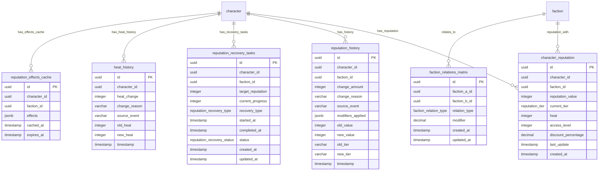

<!-- Issue: #140890882 -->

# Reputation System - Database Schema

## Обзор

Схема базы данных для системы репутации, управляющей репутацией персонажей с фракциями, историей изменений, задачами
восстановления, Heat, матрицей отношений между фракциями и кэшем эффектов.

## ERD Диаграмма



## Описание таблиц

### character_reputation

Таблица репутации персонажей с фракциями. Хранит текущую репутацию персонажей с фракциями (7 уровней: hated, hostile,
unfriendly, neutral, friendly, honored, legendary).

**Ключевые поля:**

- `id`: UUID первичный ключ
- `character_id`: ID персонажа (FK characters, NOT NULL)
- `faction_id`: ID фракции (FK factions, NOT NULL)
- `reputation_value`: Значение репутации (INTEGER, NOT NULL, default: 0, диапазон: -100 до 100)
- `current_tier`: Текущий уровень репутации (reputation_tier ENUM, NOT NULL, default: 'neutral')
- `heat`: Heat (внимание фракции) (INTEGER, NOT NULL, default: 0, CHECK: >= 0)
- `access_level`: Уровень доступа (INTEGER, NOT NULL, default: 0, CHECK: >= 0)
- `discount_percentage`: Процент скидки (DECIMAL(5,2), NOT NULL, default: 0.00, диапазон: 0.00-100.00)
- `last_update`: Время последнего обновления
- `created_at`: Время создания

**Индексы:**

- По `character_id` для репутации персонажа
- По `faction_id` для репутации с фракцией
- По `current_tier` для фильтрации по уровню
- По `reputation_value DESC` для сортировки по значению
- По `heat DESC` для персонажей с Heat (WHERE heat > 0)

**UNIQUE constraint:** `(character_id, faction_id)` - уникальная комбинация персонажа и фракции

### reputation_history

Таблица истории изменений репутации. Хранит историю всех изменений репутации для аудита и анализа.

**Ключевые поля:**

- `id`: UUID первичный ключ
- `character_id`: ID персонажа (FK characters, NOT NULL)
- `faction_id`: ID фракции (FK factions, NOT NULL)
- `change_amount`: Изменение репутации (INTEGER, NOT NULL, CHECK: -100 до 100)
- `change_reason`: Причина изменения (VARCHAR(255), nullable)
- `source_event`: Источник события (VARCHAR(100), nullable)
- `modifiers_applied`: Примененные модификаторы (JSONB, default: '{}')
- `old_value`: Старое значение репутации (INTEGER, NOT NULL, CHECK: -100 до 100)
- `new_value`: Новое значение репутации (INTEGER, NOT NULL, CHECK: -100 до 100)
- `old_tier`: Старый уровень репутации (VARCHAR(50), nullable)
- `new_tier`: Новый уровень репутации (VARCHAR(50), nullable)
- `timestamp`: Время изменения (TIMESTAMP, NOT NULL, default: CURRENT_TIMESTAMP)

**Индексы:**

- По `(character_id, faction_id, timestamp DESC)` для истории персонажа с фракцией
- По `timestamp DESC` для последних изменений
- По `source_event` для изменений по событию (WHERE source_event IS NOT NULL)

### reputation_recovery_tasks

Таблица задач восстановления репутации. Хранит информацию о задачах восстановления репутации (квесты, взятки, услуги,
время).

**Ключевые поля:**

- `id`: UUID первичный ключ
- `character_id`: ID персонажа (FK characters, NOT NULL)
- `faction_id`: ID фракции (FK factions, NOT NULL)
- `target_reputation`: Целевое значение репутации (INTEGER, NOT NULL, CHECK: -100 до 100)
- `current_progress`: Текущий прогресс восстановления (INTEGER, NOT NULL, default: 0, CHECK: >= 0)
- `recovery_type`: Тип восстановления (reputation_recovery_type ENUM, NOT NULL)
- `started_at`: Время начала (TIMESTAMP, NOT NULL, default: CURRENT_TIMESTAMP)
- `completed_at`: Время завершения (TIMESTAMP, nullable)
- `status`: Статус задачи (reputation_recovery_status ENUM, NOT NULL, default: 'active')
- `created_at`: Время создания
- `updated_at`: Время последнего обновления

**Индексы:**

- По `(character_id, faction_id, status)` для задач персонажа с фракцией по статусу
- По `status` для активных задач (WHERE status = 'active')
- По `recovery_type` для фильтрации по типу восстановления

### heat_history

Таблица истории изменений Heat. Хранит историю изменений Heat (внимание фракций).

**Ключевые поля:**

- `id`: UUID первичный ключ
- `character_id`: ID персонажа (FK characters, NOT NULL)
- `heat_change`: Изменение Heat (INTEGER, NOT NULL, CHECK: -1000 до 1000)
- `change_reason`: Причина изменения (VARCHAR(255), nullable)
- `source_event`: Источник события (VARCHAR(100), nullable)
- `old_heat`: Старое значение Heat (INTEGER, NOT NULL, default: 0, CHECK: >= 0)
- `new_heat`: Новое значение Heat (INTEGER, NOT NULL, default: 0, CHECK: >= 0)
- `timestamp`: Время изменения (TIMESTAMP, NOT NULL, default: CURRENT_TIMESTAMP)

**Индексы:**

- По `(character_id, timestamp DESC)` для истории Heat персонажа
- По `timestamp DESC` для последних изменений
- По `source_event` для изменений по событию (WHERE source_event IS NOT NULL)

### faction_relations_matrix

Таблица матрицы отношений между фракциями. Хранит информацию об отношениях между фракциями (союзники, нейтральные,
враждебные).

**Ключевые поля:**

- `id`: UUID первичный ключ
- `faction_a_id`: ID фракции A (FK factions, NOT NULL)
- `faction_b_id`: ID фракции B (FK factions, NOT NULL)
- `relation_type`: Тип отношения (faction_relation_type ENUM, NOT NULL, default: 'neutral')
- `modifier`: Модификатор отношения (DECIMAL(5,2), NOT NULL, default: 0.00, диапазон: -100.00 до 100.00)
- `created_at`: Время создания
- `updated_at`: Время последнего обновления

**Индексы:**

- По `faction_a_id` для отношений фракции A
- По `faction_b_id` для отношений фракции B
- По `relation_type` для фильтрации по типу отношения

**UNIQUE constraint:** `(faction_a_id, faction_b_id)` - уникальная комбинация фракций
**CHECK constraint:** `faction_a_id < faction_b_id` - гарантирует порядок фракций

### reputation_effects_cache

Таблица кэша эффектов репутации. Хранит кэшированные эффекты репутации (скидки, доступ, бонусы).

**Ключевые поля:**

- `id`: UUID первичный ключ
- `character_id`: ID персонажа (FK characters, NOT NULL)
- `faction_id`: ID фракции (FK factions, NOT NULL)
- `effects`: Эффекты репутации (JSONB, NOT NULL, default: '{}' - скидки, доступ, бонусы)
- `cached_at`: Время кэширования (TIMESTAMP, NOT NULL, default: CURRENT_TIMESTAMP)
- `expires_at`: Время истечения кэша (TIMESTAMP, NOT NULL)

**Индексы:**

- По `(character_id, faction_id)` для кэша персонажа с фракцией
- По `expires_at` для истекающих кэшей (WHERE expires_at < CURRENT_TIMESTAMP)

**UNIQUE constraint:** `(character_id, faction_id)` - уникальная комбинация персонажа и фракции

## ENUM типы

### reputation_tier

- `hated`: Ненависть (-100 до -76)
- `hostile`: Враждебность (-75 до -51)
- `unfriendly`: Недружелюбность (-50 до -26)
- `neutral`: Нейтральность (-25 до +25)
- `friendly`: Дружелюбность (+26 до +50)
- `honored`: Почет (+51 до +75)
- `legendary`: Легендарный (+76 до +100)

### reputation_recovery_type

- `quest`: Квест
- `bribe`: Взятка
- `service`: Услуга
- `time`: Время

### reputation_recovery_status

- `active`: Активна
- `completed`: Завершена
- `cancelled`: Отменена

### faction_relation_type

- `allied`: Союзники
- `neutral`: Нейтральные
- `hostile`: Враждебные

## Constraints и валидация

### CHECK Constraints

- `character_reputation.reputation_value`: >= -100 AND <= 100
- `character_reputation.heat`: >= 0
- `character_reputation.access_level`: >= 0
- `character_reputation.discount_percentage`: >= 0.00 AND <= 100.00
- `reputation_history.change_amount`: >= -100 AND <= 100
- `reputation_history.old_value`: >= -100 AND <= 100
- `reputation_history.new_value`: >= -100 AND <= 100
- `reputation_recovery_tasks.target_reputation`: >= -100 AND <= 100
- `reputation_recovery_tasks.current_progress`: >= 0
- `heat_history.heat_change`: >= -1000 AND <= 1000
- `heat_history.old_heat`: >= 0
- `heat_history.new_heat`: >= 0
- `faction_relations_matrix.modifier`: >= -100.00 AND <= 100.00

### Foreign Keys

Нет прямых Foreign Keys, так как таблицы characters и factions могут быть в других схемах. Используются UUID ссылки.

### UNIQUE Constraints

- `character_reputation(character_id, faction_id)`: Одна репутация на персонажа и фракцию
- `faction_relations_matrix(faction_a_id, faction_b_id)`: Одно отношение на пару фракций
- `reputation_effects_cache(character_id, faction_id)`: Один кэш на персонажа и фракцию

## Оптимизация запросов

### Частые запросы

1. **Получение репутации персонажа с фракцией:**
   ```sql
   SELECT * FROM social.character_reputation 
   WHERE character_id = $1 AND faction_id = $2;
   ```
   Использует UNIQUE constraint.

2. **Получение всех репутаций персонажа:**
   ```sql
   SELECT * FROM social.character_reputation 
   WHERE character_id = $1 
   ORDER BY reputation_value DESC;
   ```
   Использует индекс `character_id` и `reputation_value DESC`.

3. **Получение истории репутации:**
   ```sql
   SELECT * FROM social.reputation_history 
   WHERE character_id = $1 AND faction_id = $2 
   ORDER BY timestamp DESC 
   LIMIT 100;
   ```
   Использует индекс `(character_id, faction_id, timestamp DESC)`.

4. **Получение активных задач восстановления:**
   ```sql
   SELECT * FROM social.reputation_recovery_tasks 
   WHERE character_id = $1 AND status = 'active';
   ```
   Использует индекс `(character_id, faction_id, status)` и `status`.

5. **Получение истории Heat:**
   ```sql
   SELECT * FROM social.heat_history 
   WHERE character_id = $1 
   ORDER BY timestamp DESC 
   LIMIT 50;
   ```
   Использует индекс `(character_id, timestamp DESC)`.

6. **Получение отношений фракций:**
   ```sql
   SELECT * FROM social.faction_relations_matrix 
   WHERE faction_a_id = $1 OR faction_b_id = $1;
   ```
   Использует индексы `faction_a_id` и `faction_b_id`.

7. **Получение кэша эффектов:**
   ```sql
   SELECT * FROM social.reputation_effects_cache 
   WHERE character_id = $1 AND faction_id = $2 
   AND expires_at > CURRENT_TIMESTAMP;
   ```
   Использует UNIQUE constraint и индекс `expires_at`.

## Миграции

### Применение миграций:

```bash
liquibase update --changelog-file=infrastructure/liquibase/changelog.yaml
```

## Соответствие архитектуре

Схема БД полностью соответствует архитектуре из
`knowledge/implementation/architecture/reputation-system-architecture.yaml`:

- [OK] Репутация персонажей с фракциями (7 уровней)
- [OK] История изменений репутации
- [OK] Задачи восстановления репутации
- [OK] История изменений Heat
- [OK] Матрица отношений между фракциями
- [OK] Кэш эффектов репутации
- [OK] Индексы оптимизированы для частых запросов
- [OK] CHECK constraints обеспечивают валидацию данных
- [OK] ENUM типы соответствуют архитектуре

## Особенности реализации

### Уровни репутации

Система поддерживает 7 уровней репутации:

- **hated** (-100 до -76): Ненависть - блокирует территории, торговлю, вызывает агрессию NPC
- **hostile** (-75 до -51): Враждебность - минимум сервисов с жесткими наценками и охраной
- **unfriendly** (-50 до -26): Недружелюбность - ограничивает квесты и повышает цены
- **neutral** (-25 до +25): Нейтральность - стандартные условия, стартовая точка
- **friendly** (+26 до +50): Дружелюбность - открывает VIP сервисы, скидки, рекрутинг NPC
- **honored** (+51 до +75): Почет - фракционные бонусы, ускоренный decay негативных статусов
- **legendary** (+76 до +100): Легендарный - эксклюзивные локации, максимальные бонусы

### Heat (внимание фракций)

Heat - это мера внимания фракции к персонажу:

- Увеличивается при враждебных действиях
- Уменьшается со временем
- Влияет на доступ к территориям и сервисам
- Может привести к преследованию

### Матрица отношений фракций

Матрица отношений определяет, как отношения между фракциями влияют на репутацию:

- **allied**: Союзники - положительный модификатор
- **neutral**: Нейтральные - без модификатора
- **hostile**: Враждебные - отрицательный модификатор

### Восстановление репутации

Система поддерживает следующие типы восстановления:

- **quest**: Восстановление через квесты
- **bribe**: Восстановление через взятки
- **service**: Восстановление через услуги
- **time**: Восстановление со временем (decay)

### Кэш эффектов репутации

Кэш эффектов хранит предвычисленные эффекты репутации:

- Скидки на товары и услуги
- Уровень доступа к территориям и сервисам
- Бонусы и штрафы
- Автоматически обновляется при изменении репутации

### Интеграция с другими системами

Система репутации интегрируется с:

- **Economy Service**: Применение скидок, ограничение доступа к торговле, модификация цен
- **World Service**: Ограничение доступа к территориям, триггеры событий, реакция мира
- **Quest Service**: Ограничение доступа к квестам, модификация наград, триггеры квестов
- **Social Service**: Влияние на отношения с NPC и игроками
- **Faction Service**: Матрица отношений между фракциями

