<!-- Issue: #140875791 -->

# Social System - Database Schema

## Обзор

Схема базы данных для социальной системы, включающая отношения с NPC, найм NPC, отношения между игроками и систему
заказов игроков.

## ERD Диаграмма

```mermaid
erDiagram
    character ||--o{ npc_relationships : "has"
    character ||--o{ npc_hiring_contracts : "hires"
    npc_hiring_contracts ||--o{ npc_hiring_tasks : "has"
    npc_hiring_contracts ||--o{ npc_hiring_performance : "tracks"
    npc_hiring_contracts ||--o{ npc_hiring_economy : "pays"
    character ||--o{ player_relationships : "relates"
    character ||--o{ trust_levels : "trusts"
    character ||--o{ trust_contracts : "contracts"
    character ||--o{ alliances : "creates"
    alliances ||--o{ alliance_members : "has"
    character ||--o{ character_ratings : "rated"
    character ||--o{ social_capital : "has"
    character ||--o{ player_orders : "creates"
    player_orders ||--o{ multi_executor_orders : "has"
    player_orders ||--o{ order_auctions : "auctions"
    order_auctions ||--o{ auction_bids : "receives"
    player_orders ||--o{ order_options : "has"
    player_orders ||--o{ order_arbitration : "disputes"
    player_orders ||--o{ order_insurance : "insures"
    player_orders ||--o{ order_ratings : "rated"
    character ||--o{ order_reputation : "has"
    player_orders ||--o{ order_economy : "transacts"
    player_orders ||--o{ order_telemetry : "logs"

    npc_relationships {
        uuid id PK
        uuid character_id FK
        uuid npc_id
        varchar relationship_type
        integer reputation_value
        integer trust_level
        integer interaction_count
        timestamp last_interaction
        jsonb relationship_data
    }

    npc_hiring_contracts {
        uuid id PK
        uuid character_id FK
        uuid npc_id
        varchar hiring_type
        varchar contract_type
        decimal salary_amount
        timestamp start_date
        timestamp end_date
        varchar status
        varchar autonomy_level
        jsonb terms
    }

    npc_hiring_tasks {
        uuid id PK
        uuid contract_id FK
        uuid npc_id
        varchar task_type
        text task_description
        integer priority
        varchar status
        timestamp assigned_at
        timestamp started_at
        timestamp completed_at
        jsonb resources
    }

    player_relationships {
        uuid id PK
        uuid character_id_1 FK
        uuid character_id_2 FK
        varchar relationship_type
        integer reputation_value
    }

    trust_levels {
        uuid id PK
        uuid character_id_1 FK
        uuid character_id_2 FK
        integer trust_level
        integer trust_value
    }

    alliances {
        uuid id PK
        varchar alliance_type
        uuid creator_id
        varchar creator_type
        varchar name
        text description
        uuid[] member_ids
        jsonb member_types
        jsonb parameters
        varchar status
    }

    player_orders {
        uuid id PK
        uuid customer_id FK
        uuid executor_id FK
        varchar order_type
        varchar title
        text description
        integer complexity
        varchar risk_level
        decimal reward_amount
        varchar payment_model
        timestamp deadline
        varchar status
        varchar format
    }

    multi_executor_orders {
        uuid id PK
        uuid order_id FK
        uuid team_leader_id FK
        jsonb required_roles
        uuid[] executor_ids
        jsonb role_assignments
        jsonb reward_distribution
    }

    order_auctions {
        uuid id PK
        uuid order_id FK
        varchar auction_type
        decimal start_price
        decimal current_price
        decimal reserve_price
        timestamp start_time
        timestamp end_time
        varchar status
        uuid winner_id FK
    }
```



## Описание таблиц

### NPC Relationships

**npc_relationships** - Отношения персонажей с NPC (репутация, доверие, взаимодействия)

**Ключевые поля:**

- `character_id`: ID персонажа (FK к characters)
- `npc_id`: ID NPC
- `relationship_type`: Тип отношения
- `reputation_value`: Репутация (-100 до 100)
- `trust_level`: Уровень доверия (0 до 100)
- `interaction_count`: Количество взаимодействий
- `last_interaction`: Время последнего взаимодействия
- `relationship_data`: JSONB дополнительные данные

**Индексы:**

- По `(character_id)` для поиска отношений персонажа
- По `(npc_id)` для поиска отношений с NPC
- По `(character_id, reputation_value)` для сортировки по репутации

### NPC Hiring

**npc_hiring_contracts** - Контракты найма NPC (зарплата, сроки, статус)

**Ключевые поля:**

- `character_id`: ID персонажа (FK к characters)
- `npc_id`: ID NPC
- `hiring_type`: Тип найма
- `contract_type`: Тип контракта (salary, one-time, profit-share, combined)
- `salary_amount`: Размер зарплаты
- `start_date`, `end_date`: Сроки контракта
- `status`: Статус (active, terminated, completed)
- `autonomy_level`: Уровень автономии (direct, autonomous, hybrid)
- `terms`: JSONB условия контракта

**npc_hiring_tasks** - Задачи нанятых NPC

**npc_hiring_performance** - Эффективность нанятых NPC (навыки, лояльность, выполнение задач)

**npc_hiring_economy** - Экономика найма NPC (выплаты, транзакции)

**npc_hiring_limits** - Лимиты найма для персонажей

**npc_hiring_chains** - Цепочки найма NPC (синергии)

**npc_hiring_groups** - Групповые контракты найма

**npc_hiring_automation** - Настройки автоматизации найма NPC

### Player Relationships

**player_relationships** - Отношения между игроками (друзья, союзники, враги)

**Ключевые поля:**

- `character_id_1`, `character_id_2`: ID персонажей (FK к characters)
- `relationship_type`: Тип отношения (friends, close_allies, pact, neutral, enemies, nemesis)
- `reputation_value`: Значение репутации

**trust_levels** - Уровни доверия между игроками

**trust_contracts** - Договоры доверия (обмен ресурсами, прибыль, доступ к базе)

**alliances** - Союзы между игроками/кланами/фракциями

**alliance_members** - Участники союзов

**character_ratings** - Рейтинги персонажей (общий, боевой, торговый, надежность, влияние)

**social_capital** - Социальный капитал персонажей

**interaction_history** - История взаимодействий между игроками

**relationship_arbitration** - Арбитраж отношений между игроками

### Player Orders Enhancement

**multi_executor_orders** - Мульти-исполнительные заказы (команды исполнителей)

**order_auctions** - Аукционы заказов (ascending, descending, sealed)

**auction_bids** - Ставки на аукционах заказов

**order_options** - Опционы на заказы (отмена, компенсация)

**order_arbitration** - Арбитраж заказов (споры, решения)

**order_insurance** - Страхование заказов (провал миссии, груз, задержка)

**order_ratings** - Рейтинги заказов (качество, своевременность, коммуникация)

**order_reputation** - Репутация в заказах (заказчик/исполнитель)

**order_economy** - Экономика заказов (депозиты, выплаты, комиссии)

**order_telemetry** - Телеметрия заказов (события, аналитика)

## Constraints и валидация

### CHECK Constraints

- `npc_relationships.reputation_value`: -100 до 100
- `npc_relationships.trust_level`: 0 до 100
- `npc_hiring_contracts.contract_type`: salary, one-time, profit-share, combined
- `npc_hiring_contracts.status`: active, terminated, completed
- `npc_hiring_contracts.autonomy_level`: direct, autonomous, hybrid
- `player_relationships.relationship_type`: friends, close_allies, pact, neutral, enemies, nemesis
- `trust_levels.trust_level`: 0 до 100
- `alliances.alliance_type`: combat, trade, clan, faction
- `order_auctions.auction_type`: ascending, descending, sealed
- `order_ratings.*_score`: 0.00 до 1.00

### Foreign Keys

- Все таблицы ссылаются на `mvp_core.character(id)` с CASCADE
- Таблицы найма ссылаются на `npc_hiring_contracts(id)` с CASCADE
- Таблицы заказов ссылаются на `social.player_orders(id)` с CASCADE

## Оптимизация запросов

### Частые запросы

1. **Поиск отношений персонажа с NPC:**
   ```sql
   SELECT * FROM npc_relationships 
   WHERE character_id = $1 
   ORDER BY reputation_value DESC;
   ```
   Использует индекс `(character_id, reputation_value)`.

2. **Поиск активных контрактов найма:**
   ```sql
   SELECT * FROM npc_hiring_contracts 
   WHERE character_id = $1 AND status = 'active' 
   AND end_date > NOW();
   ```
   Использует индекс `(character_id, status)`.

3. **Поиск отношений между игроками:**
   ```sql
   SELECT * FROM player_relationships 
   WHERE character_id_1 = $1 OR character_id_2 = $1;
   ```
   Использует индексы по обоим полям.

4. **Поиск активных заказов:**
   ```sql
   SELECT * FROM player_orders 
   WHERE status = 'open' AND format = 'public' 
   ORDER BY created_at DESC;
   ```
   Использует индекс `(status, format)`.

## Миграции

### Существующие миграции:

- `V1_9__social_tables.sql` - базовые социальные таблицы (notifications, friendships)
- `V1_27__player_orders_tables.sql` - базовые таблицы заказов (player_orders, player_order_reviews)
- `V1_45__romance_core_tables.sql` - таблицы романтических отношений
- `V1_52__social_system_relationships_npc_hiring_tables.sql` - отношения, найм NPC
- `V1_53__social_system_player_orders_enhancement.sql` - дополнение системы заказов

### Применение миграций:

```bash
liquibase update --changelog-file=infrastructure/liquibase/changelog.yaml
```

## Соответствие архитектуре

Схема БД полностью соответствует архитектурам:

- [OK] `npc-hiring-system-architecture.yaml` - все таблицы найма NPC созданы
- [OK] `relationships-system-architecture.yaml` - все таблицы отношений созданы
- [OK] `player-orders-database.yaml` - все таблицы заказов созданы
- [OK] Индексы оптимизированы для частых запросов
- [OK] Constraints обеспечивают целостность данных
- [OK] Foreign Keys настроены с CASCADE для автоматической очистки
- [OK] Поддержка JSONB для гибкого хранения данных

## Особенности реализации

### JSONB поля

Использование JSONB для гибкого хранения:

- `relationship_data`: Данные отношений
- `terms`: Условия контрактов
- `resources`: Ресурсы задач
- `parameters`: Параметры союзов и контрактов
- `evidence`: Доказательства в арбитраже
- `event_data`: Данные событий

### NPC Hiring

Система найма NPC включает:

- Контракты с разными типами оплаты
- Задачи для нанятых NPC
- Отслеживание эффективности
- Экономика выплат
- Лимиты найма
- Цепочки и группы для синергий
- Автоматизация найма

### Player Relationships

Система отношений включает:

- Типы отношений (друзья, союзники, враги)
- Уровни доверия
- Договоры доверия
- Союзы между игроками/кланами/фракциями
- Рейтинги персонажей
- Социальный капитал
- История взаимодействий
- Арбитраж отношений

### Player Orders

Система заказов включает:

- Мульти-исполнительные заказы
- Аукционы заказов
- Опционы на заказы
- Арбитраж заказов
- Страхование заказов
- Рейтинги и репутация
- Экономика заказов
- Телеметрия для аналитики

