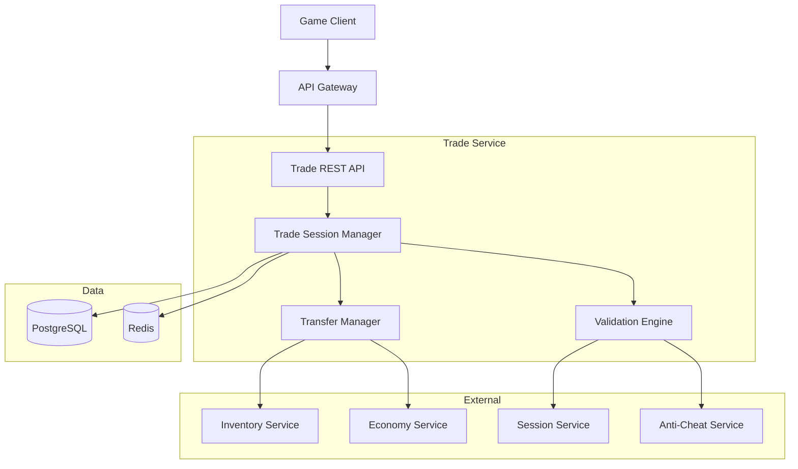
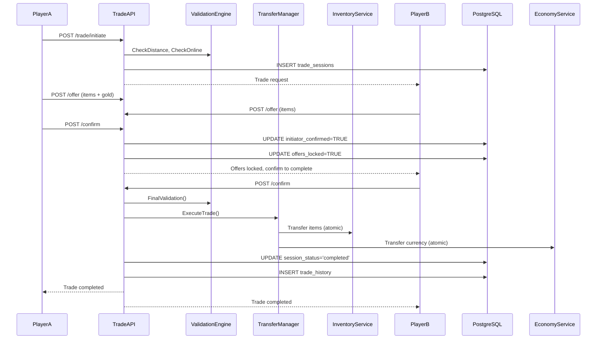

<!-- Issue: #131 -->

# Архитектура системы P2P торговли (Trade System)

## Метаданные

- **ID:** architecture-trade-system
- **Версия:** 1.0.0
- **Дата:** 2025-12-02
- **Автор:** Architect Agent
- **Статус:** Draft
- **Теги:** architecture, trade, economy, p2p

## Краткое описание

Trade System обеспечивает безопасный обмен предметами и валютой между игроками с двойным подтверждением, контролем расстояния и антифрод механизмами.

## Связанные документы

- `knowledge/implementation/backend/trade-system.yaml`
- `knowledge/mechanics/economy/economy-trading.yaml`

---

## 1. Архитектурный обзор

### 1.1. Цели

1. **Безопасный обмен** - защита от мошенничества
2. **Двойное подтверждение** - обе стороны подтверждают сделку
3. **Контроль расстояния** - только в пределах 10м
4. **Audit trail** - полная история сделок
5. **Антифрод** - обнаружение подозрительных паттернов

### 1.2. Компоненты



---

## 2. Компоненты

### 2.1. Trade Service (в Economy Service)

**Технологии:** Go, gRPC, REST, PostgreSQL, Redis

**Подкомпоненты:**

#### Session Manager
- Создание trade sessions
- Управление предложениями
- Двойное подтверждение
- Тайм-ауты (5 минут)

#### Validation Engine
- Проверка расстояния (max 10м)
- Проверка bind-on-pickup предметов
- Проверка владения
- Антифрод проверки

#### Transfer Manager
- Атомарная передача предметов
- Передача валюты
- Rollback при ошибках

### 2.2. Data Storage

#### PostgreSQL

```sql
CREATE TABLE trade_sessions (
    id UUID PRIMARY KEY,
    initiator_id UUID NOT NULL,
    acceptor_id UUID NOT NULL,
    
    initiator_offer_items JSONB,         -- [{item_id, quantity}, ...]
    initiator_offer_currency JSONB,      -- {currency_type: amount}
    acceptor_offer_items JSONB,
    acceptor_offer_currency JSONB,
    
    initiator_confirmed BOOLEAN DEFAULT FALSE,
    acceptor_confirmed BOOLEAN DEFAULT FALSE,
    offers_locked BOOLEAN DEFAULT FALSE,  -- после первого подтверждения
    
    session_status VARCHAR(50) NOT NULL,  -- 'pending', 'completed', 'cancelled'
    location_id UUID,
    
    started_at TIMESTAMP NOT NULL DEFAULT NOW(),
    completed_at TIMESTAMP,
    expires_at TIMESTAMP NOT NULL,
    
    cancel_reason VARCHAR(255)
);

CREATE INDEX idx_trade_initiator ON trade_sessions(initiator_id, session_status);
CREATE INDEX idx_trade_acceptor ON trade_sessions(acceptor_id, session_status);
CREATE INDEX idx_trade_expires ON trade_sessions(expires_at) WHERE session_status = 'pending';

CREATE TABLE trade_history (
    id BIGSERIAL PRIMARY KEY,
    session_id UUID NOT NULL,
    initiator_id UUID NOT NULL,
    acceptor_id UUID NOT NULL,
    items_exchanged JSONB NOT NULL,
    currency_exchanged JSONB NOT NULL,
    completed_at TIMESTAMP NOT NULL,
    location_id UUID
);

CREATE INDEX idx_trade_history_players ON trade_history(initiator_id, acceptor_id);
CREATE INDEX idx_trade_history_timestamp ON trade_history(completed_at);
```

#### Redis

- `trade:active:{player_id}` - активная trade session (TTL: 5 мин)
- `trade:offers:{session_id}` - текущие предложения (TTL: 5 мин)
- `trade:ratelimit:{player_id}` - счётчик сделок (TTL: 1 час)

---

## 3. API Endpoints

### 3.1. Trade Management

#### POST /api/v1/economy/trade/initiate
**Начать обмен**

Request: `{"target_player_id": "uuid"}`

Response: `{"session_id": "uuid", "expires_at": "..."}`

**Валидация:**
- Дистанция < 10м
- Оба игрока онлайн
- Нет активных трейдов

#### POST /api/v1/economy/trade/{session_id}/offer
**Предложить предметы/валюту**

Request:
```json
{
  "items": [{"item_id": "uuid", "quantity": 1}],
  "currency": {"gold": 500}
}
```

**Валидация:**
- Владение предметами
- НЕ bind-on-pickup
- Достаточный баланс

#### POST /api/v1/economy/trade/{session_id}/confirm
**Подтвердить сделку**

**Логика:**
- 1-е подтверждение → блокирует изменение предложений
- 2-е подтверждение → выполняет обмен

#### POST /api/v1/economy/trade/{session_id}/cancel
**Отменить**

#### GET /api/v1/economy/trade/{session_id}/state
**Состояние трейда**

Response:
```json
{
  "initiator_offer": {...},
  "acceptor_offer": {...},
  "initiator_confirmed": true,
  "acceptor_confirmed": false,
  "offers_locked": true
}
```

---

## 4. Потоки данных

### 4.1. Полный цикл обмена



---

## 5. Безопасность

### 5.1. Антифрод механизмы

**Проверки:**
- Контроль расстояния (max 10м)
- НЕ bind-on-pickup предметы
- Проверка владения
- Rate limiting (max 20 трейдов/час)
- История сделок для анализа

**Подозрительные паттерны:**
- Много сделок с одним игроком
- Неравный обмен (мало получает взамен)
- Быстрая последовательность сделок

### 5.2. Audit Trail

Все сделки в `trade_history`:
- Участники
- Обменянные предметы
- Временная метка
- Локация

---

## 6. Производительность

- Session creation: < 100ms
- Offer update: < 50ms
- Trade execution: < 500ms (атомарная транзакция)

---

## 7. Разбиение на подзадачи

### 7.1. Database Schema (P0)
**Срок:** 1 неделя

### 7.2. Trade Session Manager (P0)
**Срок:** 2 недели

### 7.3. Validation Engine (P0)
**Срок:** 1.5 недели

### 7.4. Transfer Manager (P0)
**Срок:** 1.5 недели

### 7.5. Antifraud Detection (P2)
**Срок:** 1 неделя

---

## 9. Критерии готовности

- [x] Архитектура спроектирована
- [x] Компоненты определены
- [x] Микросервисы идентифицированы
- [x] API endpoints описаны
- [x] Антифрод механизмы спроектированы
- [x] Техническое задание готово

---

**Конец документа**


