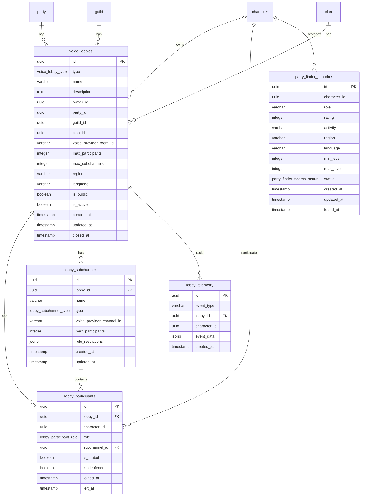

<!-- Issue: #140892117 -->
# Voice Lobby System - Database Schema

## Обзор

Схема базы данных для системы голосовых лобби, управляющей голосовыми лобби для различных типов активностей, участниками, подканалами, поиском групп и телеметрией.

## ERD Диаграмма



## Описание таблиц

### voice_lobbies

Таблица голосовых лобби. Хранит информацию о голосовых лобби для различных типов активностей (activity, clan, guild, raid, tournament).

**Ключевые поля:**
- `id`: UUID первичный ключ
- `type`: Тип лобби (voice_lobby_type ENUM, NOT NULL)
- `name`: Название лобби (VARCHAR(255), NOT NULL)
- `description`: Описание лобби (TEXT, nullable)
- `owner_id`: ID владельца (UUID, NOT NULL, FK characters)
- `party_id`: ID группы (UUID, nullable, FK parties)
- `guild_id`: ID гильдии (UUID, nullable, FK guilds)
- `clan_id`: ID клана (UUID, nullable, FK clans)
- `voice_provider_room_id`: ID комнаты в провайдере голосовой связи (VARCHAR(255), nullable)
- `max_participants`: Максимальное количество участников (INTEGER, NOT NULL, default: 8, CHECK: > 0)
- `max_subchannels`: Максимальное количество подканалов (INTEGER, NOT NULL, default: 4, CHECK: >= 0)
- `region`: Регион (VARCHAR(50), nullable)
- `language`: Язык (VARCHAR(10), nullable)
- `is_public`: Публичное лобби (BOOLEAN, NOT NULL, default: false)
- `is_active`: Активное лобби (BOOLEAN, NOT NULL, default: true)
- `created_at`: Время создания
- `updated_at`: Время последнего обновления
- `closed_at`: Время закрытия (TIMESTAMP, nullable)

**Индексы:**
- По `owner_id` для лобби владельца
- По `type` для фильтрации по типу
- По `party_id` для лобби группы (WHERE party_id IS NOT NULL)
- По `guild_id` для лобби гильдии (WHERE guild_id IS NOT NULL)
- По `clan_id` для лобби клана (WHERE clan_id IS NOT NULL)
- По `is_active` для активных лобби (WHERE is_active = true)
- По `is_public` для публичных лобби (WHERE is_public = true)
- По `(region, language)` для поиска по региону и языку (WHERE region IS NOT NULL AND language IS NOT NULL)

### lobby_participants

Таблица участников лобби. Хранит информацию об участниках голосовых лобби с ролями и настройками.

**Ключевые поля:**
- `id`: UUID первичный ключ
- `lobby_id`: ID лобби (UUID, NOT NULL, FK voice_lobbies, ON DELETE CASCADE)
- `character_id`: ID персонажа (UUID, NOT NULL, FK characters)
- `role`: Роль участника (lobby_participant_role ENUM, NOT NULL, default: 'member')
- `subchannel_id`: ID подканала (UUID, nullable, FK lobby_subchannels, ON DELETE SET NULL)
- `is_muted`: Участник заглушен (BOOLEAN, NOT NULL, default: false)
- `is_deafened`: Участник оглушен (BOOLEAN, NOT NULL, default: false)
- `joined_at`: Время присоединения (TIMESTAMP, NOT NULL, default: CURRENT_TIMESTAMP)
- `left_at`: Время выхода (TIMESTAMP, nullable)

**Индексы:**
- По `lobby_id` для участников лобби
- По `character_id` для лобби персонажа
- По `subchannel_id` для участников подканала (WHERE subchannel_id IS NOT NULL)
- По `role` для фильтрации по роли
- По `joined_at DESC` для последних присоединившихся

**UNIQUE constraint:** `(lobby_id, character_id)` - один участник на лобби

### lobby_subchannels

Таблица подканалов лобби. Хранит информацию о подканалах лобби для разделения участников.

**Ключевые поля:**
- `id`: UUID первичный ключ
- `lobby_id`: ID лобби (UUID, NOT NULL, FK voice_lobbies, ON DELETE CASCADE)
- `name`: Название подканала (VARCHAR(255), NOT NULL)
- `type`: Тип подканала (lobby_subchannel_type ENUM, NOT NULL, default: 'main')
- `voice_provider_channel_id`: ID канала в провайдере голосовой связи (VARCHAR(255), nullable)
- `max_participants`: Максимальное количество участников (INTEGER, nullable, CHECK: > 0)
- `role_restrictions`: Ограничения по ролям (JSONB, default: '{}')
- `created_at`: Время создания
- `updated_at`: Время последнего обновления

**Индексы:**
- По `lobby_id` для подканалов лобби
- По `type` для фильтрации по типу
- По `name` для поиска по названию

### party_finder_searches

Таблица поисков групп. Хранит информацию о поисках групп для подбора игроков.

**Ключевые поля:**
- `id`: UUID первичный ключ
- `character_id`: ID персонажа (UUID, NOT NULL, FK characters)
- `role`: Роль для поиска (VARCHAR(50), nullable)
- `rating`: Рейтинг игрока (INTEGER, nullable, CHECK: >= 0)
- `activity`: Активность (VARCHAR(50), nullable)
- `region`: Регион (VARCHAR(50), nullable)
- `language`: Язык (VARCHAR(10), nullable)
- `min_level`: Минимальный уровень (INTEGER, nullable, CHECK: >= 0)
- `max_level`: Максимальный уровень (INTEGER, nullable, CHECK: >= 0)
- `status`: Статус поиска (party_finder_search_status ENUM, NOT NULL, default: 'searching')
- `created_at`: Время создания
- `updated_at`: Время последнего обновления
- `found_at`: Время нахождения группы (TIMESTAMP, nullable)

**Индексы:**
- По `character_id` для поисков персонажа
- По `status` для активных поисков (WHERE status = 'searching')
- По `(role, activity)` для поиска по роли и активности (WHERE role IS NOT NULL AND activity IS NOT NULL)
- По `(region, language)` для поиска по региону и языку (WHERE region IS NOT NULL AND language IS NOT NULL)
- По `rating` для поиска по рейтингу (WHERE rating IS NOT NULL)

### lobby_telemetry

Таблица телеметрии лобби. Хранит информацию о событиях лобби для аналитики и мониторинга.

**Ключевые поля:**
- `id`: UUID первичный ключ
- `event_type`: Тип события (VARCHAR(50), NOT NULL)
- `lobby_id`: ID лобби (UUID, nullable, FK voice_lobbies, ON DELETE CASCADE)
- `character_id`: ID персонажа (UUID, nullable, FK characters)
- `event_data`: Данные события (JSONB, default: '{}')
- `created_at`: Время события (TIMESTAMP, NOT NULL, default: CURRENT_TIMESTAMP)

**Индексы:**
- По `lobby_id` для событий лобби (WHERE lobby_id IS NOT NULL)
- По `character_id` для событий персонажа (WHERE character_id IS NOT NULL)
- По `event_type` для фильтрации по типу события
- По `created_at DESC` для последних событий

## ENUM типы

### voice_lobby_type
- `activity`: Активность (для игровых активностей, max 8 участников, max 4 подканала)
- `clan`: Клан (для клановых лобби, max 50 участников, max 10 подканалов)
- `guild`: Гильдия (для гильдийных лобби, max 100 участников, max 20 подканалов)
- `raid`: Рейд (для рейдовых лобби, max 24 участника, max 6 подканалов)
- `tournament`: Турнир (для турнирных лобби, max 16 участников, max 4 подканала)

### lobby_participant_role
- `leader`: Лидер
- `commander`: Командир
- `party_leader`: Лидер группы
- `officer`: Офицер
- `member`: Участник

### lobby_subchannel_type
- `main`: Основной канал (главный канал лобби, auto_create: true)
- `role_based`: Ролевой канал (для определенных ролей, auto_create: false)
- `commander`: Командирский канал (для командиров, max 8 участников, auto_create: false)
- `party`: Групповой канал (для групп, max 8 участников, auto_create: false)

### party_finder_search_status
- `searching`: Поиск активен
- `found`: Группа найдена
- `cancelled`: Поиск отменен
- `timeout`: Поиск завершен по таймауту

## Constraints и валидация

### CHECK Constraints

- `voice_lobbies.max_participants`: > 0
- `voice_lobbies.max_subchannels`: >= 0
- `lobby_subchannels.max_participants`: > 0 (если не NULL)
- `party_finder_searches.rating`: >= 0 (если не NULL)
- `party_finder_searches.min_level`: >= 0 (если не NULL)
- `party_finder_searches.max_level`: >= 0 (если не NULL)

### Foreign Keys

- `lobby_participants.lobby_id` → `voice_lobbies.id` (ON DELETE CASCADE)
- `lobby_participants.subchannel_id` → `lobby_subchannels.id` (ON DELETE SET NULL)
- `lobby_subchannels.lobby_id` → `voice_lobbies.id` (ON DELETE CASCADE)
- `lobby_telemetry.lobby_id` → `voice_lobbies.id` (ON DELETE CASCADE)

### UNIQUE Constraints

- `lobby_participants(lobby_id, character_id)`: Один участник на лобби

## Оптимизация запросов

### Частые запросы

1. **Получение активных публичных лобби:**
   ```sql
   SELECT * FROM social.voice_lobbies 
   WHERE is_active = true AND is_public = true 
   ORDER BY created_at DESC;
   ```
   Использует индексы `is_active` и `is_public`.

2. **Получение участников лобби:**
   ```sql
   SELECT * FROM social.lobby_participants 
   WHERE lobby_id = $1 AND left_at IS NULL 
   ORDER BY joined_at DESC;
   ```
   Использует индекс `lobby_id` и `joined_at DESC`.

3. **Получение подканалов лобби:**
   ```sql
   SELECT * FROM social.lobby_subchannels 
   WHERE lobby_id = $1 
   ORDER BY created_at;
   ```
   Использует индекс `lobby_id`.

4. **Поиск активных поисков групп:**
   ```sql
   SELECT * FROM social.party_finder_searches 
   WHERE status = 'searching' 
   AND role = $1 AND activity = $2 
   AND region = $3 AND language = $4;
   ```
   Использует индексы `status`, `(role, activity)`, `(region, language)`.

5. **Получение событий лобби:**
   ```sql
   SELECT * FROM social.lobby_telemetry 
   WHERE lobby_id = $1 
   ORDER BY created_at DESC 
   LIMIT 100;
   ```
   Использует индекс `lobby_id` и `created_at DESC`.

## Миграции

### Применение миграций:
```bash
liquibase update --changelog-file=infrastructure/liquibase/changelog.yaml
```

## Соответствие архитектуре

Схема БД полностью соответствует архитектуре из `knowledge/implementation/architecture/voice-lobby-database.yaml`:
- [OK] Голосовые лобби (5 типов: activity, clan, guild, raid, tournament)
- [OK] Участники лобби с ролями и настройками
- [OK] Подканалы лобби (4 типа: main, role_based, commander, party)
- [OK] Поиск групп (Party Finder)
- [OK] Телеметрия лобби
- [OK] Индексы оптимизированы для частых запросов
- [OK] CHECK constraints обеспечивают валидацию данных
- [OK] ENUM типы соответствуют архитектуре

## Особенности реализации

### Типы лобби

Система поддерживает 5 типов лобби:
- **activity**: Для игровых активностей (max 8 участников, max 4 подканала)
- **clan**: Для клановых лобби (max 50 участников, max 10 подканалов)
- **guild**: Для гильдийных лобби (max 100 участников, max 20 подканалов)
- **raid**: Для рейдовых лобби (max 24 участника, max 6 подканалов)
- **tournament**: Для турнирных лобби (max 16 участников, max 4 подканала)

### Роли участников

Система поддерживает 5 ролей участников:
- **leader**: Лидер лобби
- **commander**: Командир (для рейдов и турниров)
- **party_leader**: Лидер группы
- **officer**: Офицер (для кланов и гильдий)
- **member**: Обычный участник

### Подканалы

Система поддерживает 4 типа подканалов:
- **main**: Основной канал (автоматически создается)
- **role_based**: Ролевой канал (для определенных ролей)
- **commander**: Командирский канал (max 8 участников)
- **party**: Групповой канал (max 8 участников)

### Поиск групп (Party Finder)

Система поддерживает поиск групп по:
- Роли (role)
- Рейтингу (rating)
- Активности (activity)
- Региону (region)
- Языку (language)
- Уровню (min_level, max_level)

### Интеграция с провайдером голосовой связи

Система интегрируется с провайдером голосовой связи через:
- `voice_provider_room_id`: ID комнаты в провайдере
- `voice_provider_channel_id`: ID канала в провайдере

### Телеметрия

Система собирает телеметрию для:
- Аналитики использования лобби
- Мониторинга производительности
- Отладки проблем
- Оптимизации алгоритмов подбора

