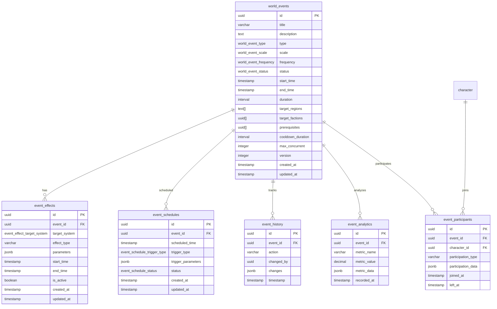

<!-- Issue: #140875793 -->
# World Events System - Database Schema

## Обзор

Схема базы данных для системы мировых событий, управляющей крупными событиями, которые влияют на весь мир игры или большие регионы. Включает события разных типов, масштабов и частоты.

## ERD Диаграмма



## Описание таблиц

### world_events

Таблица мировых событий. Хранит информацию о событиях разных типов, масштабов и частоты.

**Ключевые поля:**
- `title`: Название события
- `description`: Описание события
- `type`: Тип события (STORY, TECHNOLOGICAL, ECONOMIC, POLITICAL, MILITARY, SPORTS, ENVIRONMENTAL)
- `scale`: Масштаб события (GLOBAL, REGIONAL, CITY, LOCAL)
- `frequency`: Частота события (ONE_TIME, PERIODIC, REGULAR)
- `status`: Статус события (PLANNED, ANNOUNCED, ACTIVE, COOLDOWN, ARCHIVED)
- `start_time`, `end_time`: Время начала и окончания события
- `duration`: Длительность события (INTERVAL)
- `target_regions`: Целевые регионы (TEXT[])
- `target_factions`: Целевые фракции (UUID[])
- `prerequisites`: Предварительные условия (UUID[] других событий)
- `cooldown_duration`: Длительность кулдауна (INTERVAL)
- `max_concurrent`: Максимальное количество одновременных экземпляров события
- `version`: Версия события для оптимистичной блокировки

**Индексы:**
- По `type` для фильтрации по типу
- По `scale` для фильтрации по масштабу
- По `(status, start_time)` для активных событий
- По `start_time` и `end_time` для временных запросов
- По `status` для активных событий

### event_effects

Таблица эффектов событий. Хранит информацию о эффектах, применяемых к различным системам.

**Ключевые поля:**
- `event_id`: ID события (FK к world_events)
- `target_system`: Целевая система (ECONOMY, SOCIAL, GAMEPLAY, REPUTATION, QUEST)
- `effect_type`: Тип эффекта (VARCHAR)
- `parameters`: Параметры эффекта (JSONB)
- `start_time`, `end_time`: Время начала и окончания эффекта
- `is_active`: Флаг активности эффекта

**Индексы:**
- По `(event_id, is_active)` для эффектов события
- По `(target_system, is_active)` для фильтрации по системе
- По `(is_active, start_time)` для активных эффектов
- По `(start_time, end_time)` для временных запросов

### event_schedules

Таблица расписания событий. Хранит информацию о запланированных запусках событий.

**Ключевые поля:**
- `event_id`: ID события (FK к world_events)
- `scheduled_time`: Запланированное время запуска
- `trigger_type`: Тип триггера (CRON, MANUAL, QUEST, SIMULATION)
- `trigger_parameters`: Параметры триггера (JSONB, например, CRON выражение)
- `status`: Статус расписания (SCHEDULED, TRIGGERED, CANCELLED)

**Индексы:**
- По `(event_id, status)` для расписаний события
- По `(scheduled_time, status)` для запланированных запусков
- По `trigger_type` для фильтрации по типу триггера
- По `(status, scheduled_time)` для обработки расписания

### event_history

Таблица истории событий. Хранит информацию об изменениях событий для аудита.

**Ключевые поля:**
- `event_id`: ID события (FK к world_events)
- `action`: Действие (CREATED, UPDATED, ANNOUNCED, ACTIVATED, DEACTIVATED, ARCHIVED, CANCELLED)
- `changed_by`: ID пользователя, внесшего изменение (UUID, nullable)
- `changes`: Детали изменений (JSONB)
- `timestamp`: Время изменения

**Индексы:**
- По `(event_id, timestamp DESC)` для истории события
- По `(action, timestamp DESC)` для фильтрации по действию
- По `timestamp DESC` для временных запросов
- По `changed_by` для изменений пользователя

### event_analytics

Таблица аналитики событий. Хранит метрики и статистику по событиям.

**Ключевые поля:**
- `event_id`: ID события (FK к world_events)
- `metric_name`: Название метрики (VARCHAR)
- `metric_value`: Значение метрики (DECIMAL)
- `metric_data`: Дополнительные данные метрики (JSONB)
- `recorded_at`: Время записи метрики

**Индексы:**
- По `(event_id, recorded_at DESC)` для метрик события
- По `(metric_name, recorded_at DESC)` для фильтрации по метрике
- По `recorded_at DESC` для временных запросов

### event_participants

Таблица участников событий. Хранит информацию об участии игроков в событиях.

**Ключевые поля:**
- `event_id`: ID события (FK к world_events)
- `character_id`: ID персонажа (FK к characters)
- `participation_type`: Тип участия (VARCHAR)
- `participation_data`: Данные участия (JSONB)
- `joined_at`: Время присоединения
- `left_at`: Время выхода (nullable)

**Индексы:**
- По `event_id` для участников события
- По `character_id` для событий персонажа
- По `event_id` для активных участников (WHERE left_at IS NULL)

## Constraints и валидация

### CHECK Constraints

- `world_events.max_concurrent`: Должно быть > 0
- `event_history.action`: Допустимые значения: 'CREATED', 'UPDATED', 'ANNOUNCED', 'ACTIVATED', 'DEACTIVATED', 'ARCHIVED', 'CANCELLED'

### ENUM Types

- `world_event_type`: STORY, TECHNOLOGICAL, ECONOMIC, POLITICAL, MILITARY, SPORTS, ENVIRONMENTAL
- `world_event_scale`: GLOBAL, REGIONAL, CITY, LOCAL
- `world_event_frequency`: ONE_TIME, PERIODIC, REGULAR
- `world_event_status`: PLANNED, ANNOUNCED, ACTIVE, COOLDOWN, ARCHIVED
- `event_effect_target_system`: ECONOMY, SOCIAL, GAMEPLAY, REPUTATION, QUEST
- `event_schedule_trigger_type`: CRON, MANUAL, QUEST, SIMULATION
- `event_schedule_status`: SCHEDULED, TRIGGERED, CANCELLED

### Foreign Keys

- `event_effects.event_id` → `world_events.id` (ON DELETE CASCADE)
- `event_schedules.event_id` → `world_events.id` (ON DELETE CASCADE)
- `event_history.event_id` → `world_events.id` (ON DELETE CASCADE)
- `event_analytics.event_id` → `world_events.id` (ON DELETE CASCADE)
- `event_participants.event_id` → `world_events.id` (ON DELETE CASCADE)
- `event_participants.character_id` → `mvp_core.character.id` (ON DELETE CASCADE)

### Unique Constraints

- `event_participants(event_id, character_id)`: Один персонаж может участвовать в событии только один раз

## Оптимизация запросов

### Частые запросы

1. **Поиск активных событий:**
   ```sql
   SELECT * FROM world_events.world_events 
   WHERE status = 'ACTIVE' 
   ORDER BY start_time DESC;
   ```
   Использует индекс `(status, start_time)`.

2. **Поиск запланированных событий:**
   ```sql
   SELECT * FROM world_events.event_schedules 
   WHERE status = 'SCHEDULED' 
   AND scheduled_time <= NOW() 
   ORDER BY scheduled_time ASC;
   ```
   Использует индекс `(scheduled_time, status)`.

3. **Поиск активных эффектов события:**
   ```sql
   SELECT * FROM world_events.event_effects 
   WHERE event_id = $1 AND is_active = true 
   AND start_time <= NOW() 
   AND (end_time IS NULL OR end_time > NOW());
   ```
   Использует индекс `(event_id, is_active)`.

4. **История изменений события:**
   ```sql
   SELECT * FROM world_events.event_history 
   WHERE event_id = $1 
   ORDER BY timestamp DESC 
   LIMIT 50;
   ```
   Использует индекс `(event_id, timestamp DESC)`.

## Миграции

### Существующие миграции:
- `V1_54__world_events_system_tables.sql` - создание всех таблиц системы мировых событий

### Применение миграций:
```bash
liquibase update --changelog-file=infrastructure/liquibase/changelog.yaml
```

## Соответствие архитектуре

Схема БД полностью соответствует архитектуре из `knowledge/implementation/architecture/world-events-system-architecture.yaml`:
- OK Все таблицы из архитектуры созданы
- OK Все поля соответствуют описанию
- OK ENUM типы созданы для всех перечислений
- OK Индексы оптимизированы для частых запросов
- OK Constraints обеспечивают целостность данных
- OK Foreign Keys настроены с CASCADE для автоматической очистки
- OK Поддержка JSONB для гибкого хранения данных
- OK Поддержка массивов (TEXT[], UUID[]) для целевых регионов и фракций

## Особенности реализации

### JSONB поля

Использование JSONB для гибкого хранения:
- `parameters`: Параметры эффектов
- `trigger_parameters`: Параметры триггеров (CRON выражения, условия)
- `changes`: Детали изменений в истории
- `metric_data`: Дополнительные данные метрик
- `participation_data`: Данные участия игроков

### Массивы

Использование массивов PostgreSQL:
- `target_regions`: TEXT[] - целевые регионы
- `target_factions`: UUID[] - целевые фракции
- `prerequisites`: UUID[] - предварительные условия (ID других событий)

### INTERVAL типы

Использование INTERVAL для длительности:
- `duration`: Длительность события
- `cooldown_duration`: Длительность кулдауна

### Версионирование

Поддержка оптимистичной блокировки:
- `version`: Версия события для предотвращения конфликтов при одновременном обновлении

### Типы событий

Система поддерживает различные типы событий:
- **STORY**: Сюжетные события
- **TECHNOLOGICAL**: Технологические события
- **ECONOMIC**: Экономические события
- **POLITICAL**: Политические события
- **MILITARY**: Военные события
- **SPORTS**: Спортивные события
- **ENVIRONMENTAL**: Экологические события

### Масштабы событий

События могут иметь разные масштабы:
- **GLOBAL**: Глобальные события (весь мир)
- **REGIONAL**: Региональные события (регион)
- **CITY**: Городские события (город)
- **LOCAL**: Локальные события (локальная зона)

### Частота событий

События могут иметь разную частоту:
- **ONE_TIME**: Разовые события
- **PERIODIC**: Периодические события
- **REGULAR**: Регулярные события

### Эффекты событий

Эффекты могут применяться к различным системам:
- **ECONOMY**: Экономическая система
- **SOCIAL**: Социальная система
- **GAMEPLAY**: Игровая механика
- **REPUTATION**: Система репутации
- **QUEST**: Система квестов

### Триггеры расписания

События могут запускаться различными способами:
- **CRON**: По расписанию (CRON выражение)
- **MANUAL**: Вручную
- **QUEST**: По квесту
- **SIMULATION**: По симуляции


