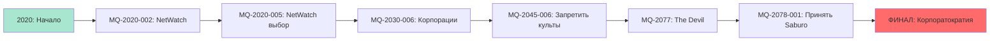
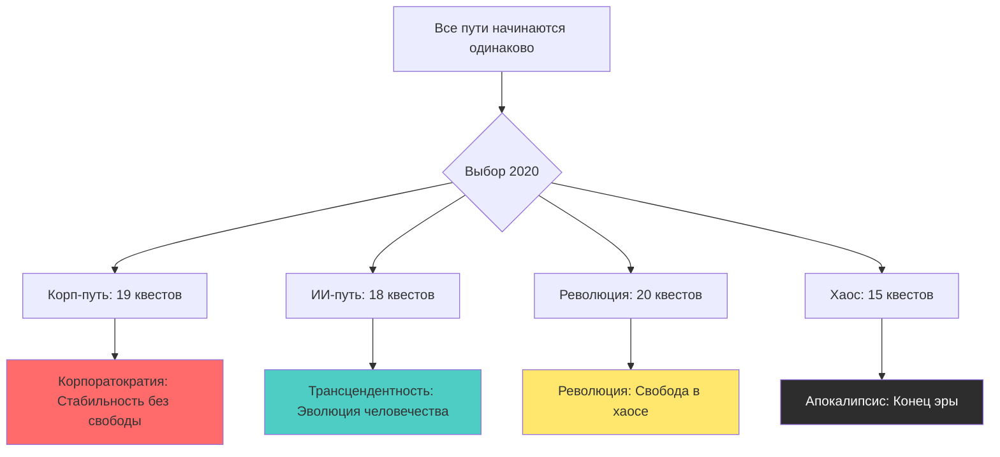

# Критические пути к финалам

**Версия:** 1.0.0  
**Дата:** 2025-11-06 23:57

---

## Описание

Визуализация 4 критических путей от начала игры (2020) до финалов (2093).

---

## Path 1: Корпоратократия (19 квестов)

---

## Path 2: Трансцендентность (18 квестов)

---

## Path 3: Революция (20 квестов)

---

## Path 4: Апокалипсис (хаос)

---

## Сравнение путей

---

## Статистика путей

| Путь | Квестов | Сложность | Репутация | Финал |
|------|---------|-----------|-----------|-------|
| Корпоратократия | 19 | Средняя | Корпорации высоко | Стабильность |
| Трансцендентность | 18 | Высокая | ИИ-культы высоко | Эволюция |
| Революция | 20 | Очень высокая | Народ высоко | Свобода |
| Апокалипсис | 15 | Экстремальная | Все низко | Коллапс |

---

## История изменений

- v1.0.0 (2025-11-06 23:57) - Критические пути к финалам

