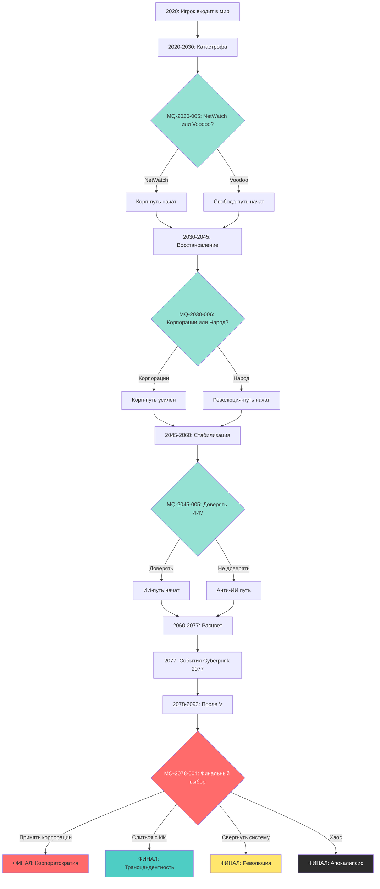

# Диаграмма главной сюжетной линии 2020-2093

**Версия:** 1.0.0  
**Дата:** 2025-11-06 23:56

---

## Описание

Визуализация главной сюжетной линии NECPGAME через все эпохи с поворотными точками и финалами.

---

## Главная арка

---

## Легенда

- **Зелёные узлы (Choice)** - Критические выборы игрока
- **Синие узлы (Era)** - Эпохи
- **Красный узел (F1)** - Финал Корпоратократии
- **Бирюзовый узел (F2)** - Финал Трансцендентности
- **Жёлтый узел (F3)** - Финал Революции
- **Чёрный узел (F4)** - Финал Апокалипсиса

---

## Критические выборы

1. **MQ-2020-005:** NetWatch vs Voodoo Boys (определяет отношение к контролю NET)
2. **MQ-2030-006:** Корпорации vs Народ (определяет социальную позицию)
3. **MQ-2045-005:** Доверять ИИ или нет (определяет путь к Трансцендентности)
4. **MQ-2078-004:** Финальный выбор (4 пути)

---

## История изменений

- v1.0.0 (2025-11-06 23:56) - Диаграмма главной сюжетной линии

