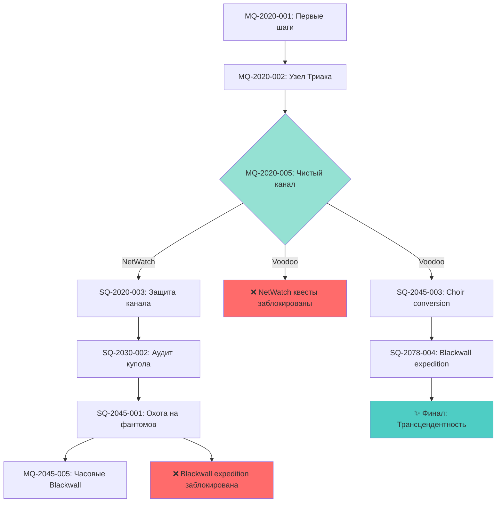
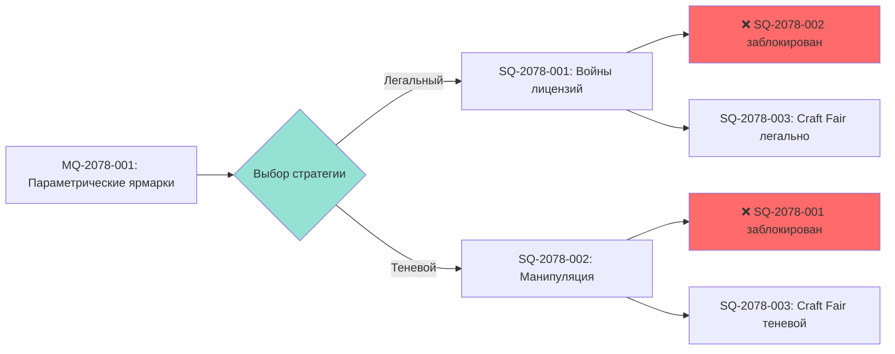

# Пример графа зависимостей квестов

**Версия:** 1.0.0  
**Дата:** 2025-11-06 23:58

---

## Описание

Пример визуализации зависимостей между квестами (триггеры, блокираторы, влияния).

---

## Пример: NetWatch vs Voodoo Boys цепочка

---

## Легенда

- **Зелёный узел** - Критический выбор
- **Синий узел** - Квест (доступен)
- **Красный узел** - Заблокировано
- **Бирюзовый узел** - Финал
- **Стрелка** - Зависимость (requires/unlocks)

---

## Пример: Mutual Exclusion

---

## История изменений

- v1.0.0 (2025-11-06 23:58) - Примеры зависимостей квестов

