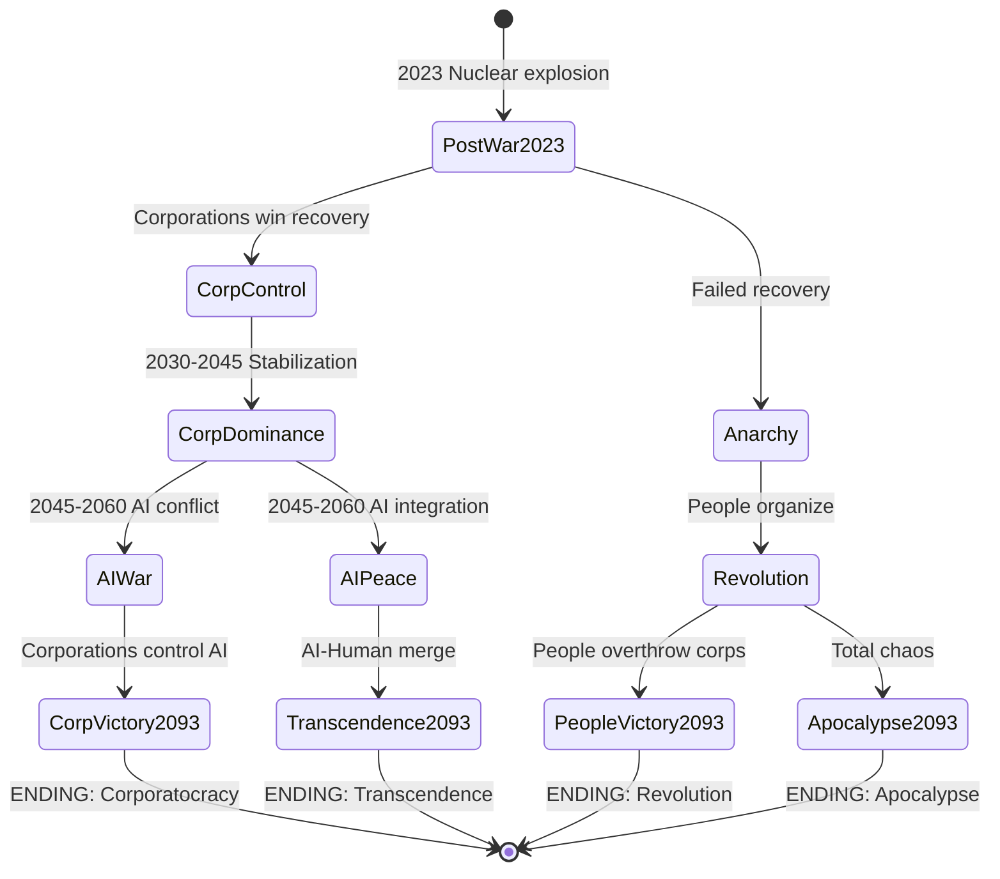
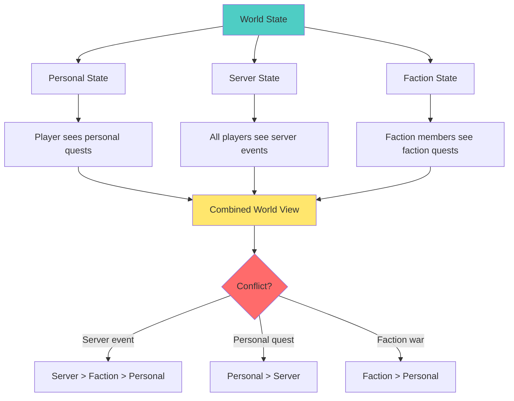
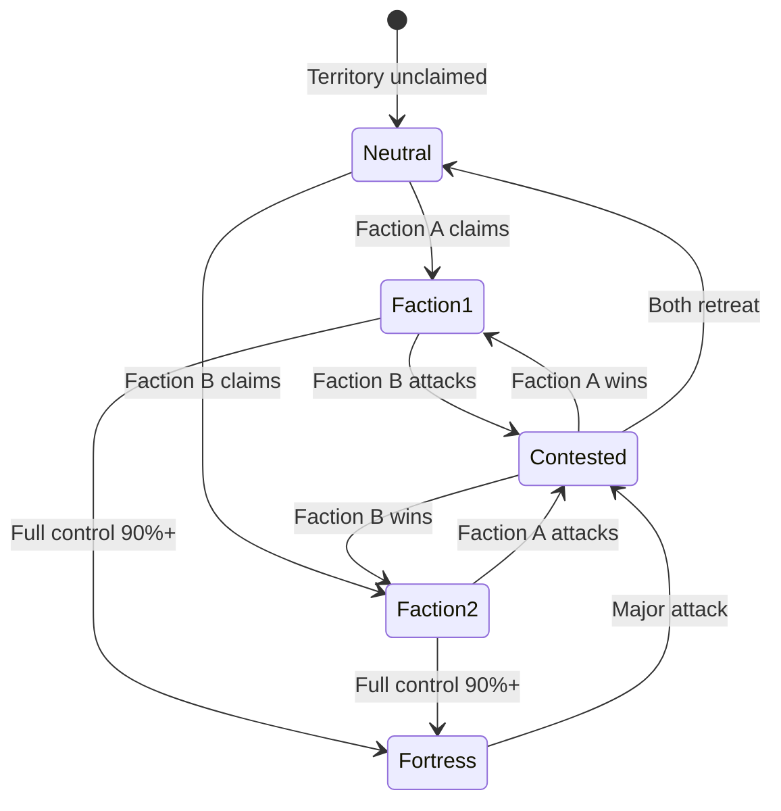

# Диаграмма состояний мира

**Версия:** 1.0.0  
**Дата:** 2025-11-06 23:59

---

## Описание

Визуализация возможных состояний мира и переходов между ними.

---

## Основные состояния мира

---

## Ключевые переходы

**PostWar2023 → CorpControl:**
- Условие: Игроки поддерживают корпорации в восстановлении
- Квесты: MQ-2030-006 (выбор корпораций)

**CorpDominance → AIPeace:**
- Условие: Игроки доверяют ИИ
- Квесты: MQ-2045-005 (доверять ИИ), MQ-2045-006 (поддержать культы)

**AIPeace → Transcendence2093:**
- Условие: Контакт с ИИ за Blackwall
- Квесты: SQ-2078-004 (Blackwall expedition)

---

## Гибридная система влияния

---

## Territory Control States

---

## История изменений

- v1.0.0 (2025-11-06 23:59) - Диаграммы состояний мира

