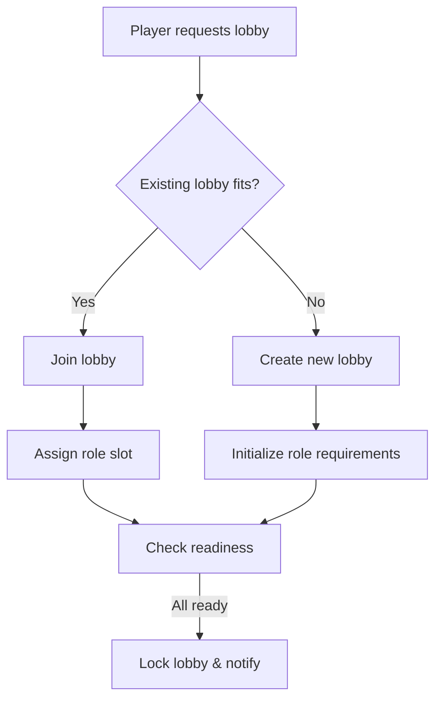

---

- **Status:** queued
- **Last Updated:** 2025-11-07 15:45
---

---
**api-readiness:** ready  
**api-readiness-check-date:** 2025-11-07 02:50
**api-readiness-notes:** Voice Lobby & Party Finder. Расширение voice chat: лобби, подбор команд, управление подканалами. ~380 строк.
---

# Voice Lobby & Party Finder - Система голосовых лобби

**Статус:** approved  
**Версия:** 1.0.0  
**Дата создания:** 2025-11-07 02:50  
**Приоритет:** HIGH (Team Coordination!)  
**Автор:** AI Brain Manager

**Микрофича:** Voice lobby matchmaking & management  
**Размер:** ~380 строк ✅

---

## Краткое описание

**Voice Lobby & Party Finder** расширяет текущий Voice Chat:

- ✅ Доменные голосовые комнаты (лобби)  
- ✅ Автоматический подбор группы по ролям/рейтингу  
- ✅ Подканалы (subchannels) для рейдов/патти  
- ✅ Управление правами в голосовом лобби  
- ✅ Интеграция с Party/Guild/Clan системами

Лобби — центральная точка коммуникации, где игроки находят команду перед активностями (рейды, PvP, клан-войны).

---

## Архитектура

```
Player → Lobby Finder UI
    ↓
LFG Service (Lobby Matching)
    ↓
Create/Join Voice Lobby
    ↓
Voice Lobby Service (WebRTC control)
    ↓
Voice Chat Provider (Agora/Twilio/Self-hosted)
    ↓
Participants (with subchannels)
```

Состав подсистем:

1. **Lobby Directory API** — поиск/фильтрация лобби  
2. **Party Finder** — алгоритм подбора группы  
3. **Voice Lobby Manager** — создание/управление каналами  
4. **Subchannel Controller** — динамические подканалы  
5. **Permissions Engine** — права на mute/kick/lock  
6. **Integration Layer** — Party/Guild/Clan системы

---

## Типы голосовых лобби

### 1. Activity Lobby (для PvE/PvP активностей)

```
Назначение: сбор группы под конкретную активность
Размер: 4-12 участников (зависит от активности)
Фильтры: уровень, роль, язык, рейтинг
Встроенные подканалы: 
  - main  
  - role-based (tank/heal/dps)  
  - strategy (officers)
```

### 2. Clan/Guild Lobby

```
Назначение: постоянные голосовые комнаты клана/гильдии
Размер: до 100 участников
Подканалы: 
  - офицеры  
  - рейды  
  - социальные
Права: привязаны к ролям гильдии (Leader, Officer, Member)
```

### 3. Raid Lobby

```
Назначение: подготовка к рейду (10-20 игроков)
Инструменты: ready-check, таймер pull, синхронизация
Авторазбиение: по группам или ролям
Запись: опция сохранять аудио (анализ ошибок)
```

### 4. Tournament Lobby

```
Назначение: киберспортивные матчи, клан-войны
Особенности:
  - отдельные комнаты для каждой команды
  - наблюдатели/комментаторы (listen-only)
  - push-to-talk only (по умолчанию)
```

---

## База данных

### Таблица `voice_lobbies`

```sql
CREATE TABLE voice_lobbies (
    id UUID PRIMARY KEY DEFAULT gen_random_uuid(),
    
    lobby_type VARCHAR(30) NOT NULL,
    name VARCHAR(200) NOT NULL,
    description TEXT,
    
    activity_code VARCHAR(50),     -- например: RAID_BLACKWALL, ARENA_5V5
    min_required_level INTEGER DEFAULT 1,
    max_participants INTEGER DEFAULT 12,
    
    creator_id UUID NOT NULL,
    owner_type VARCHAR(20) DEFAULT 'player',   -- player/guild/clan
    owner_id UUID NOT NULL,
    
    voice_channel_id UUID,         -- связь с voice_channels
    
    region VARCHAR(30),            -- EU/US/ASIA
    language VARCHAR(5) DEFAULT 'en',
    
    required_roles VARCHAR(20)[],  -- напр. ["tank","heal","dps"]
    current_role_counts JSONB,     -- {"tank":1,"heal":0,"dps":2}
    
    status VARCHAR(20) DEFAULT 'OPEN',   -- OPEN / IN_PROGRESS / CLOSED
    is_public BOOLEAN DEFAULT TRUE,
    
    created_at TIMESTAMP NOT NULL DEFAULT CURRENT_TIMESTAMP,
    started_at TIMESTAMP,
    closed_at TIMESTAMP,
    
    CONSTRAINT fk_lobby_owner_player FOREIGN KEY (creator_id)
        REFERENCES players(id) ON DELETE CASCADE
);

CREATE INDEX idx_voice_lobbies_status ON voice_lobbies(status);
CREATE INDEX idx_voice_lobbies_activity ON voice_lobbies(activity_code);
CREATE INDEX idx_voice_lobbies_region ON voice_lobbies(region);
```

### Таблица `lobby_participants`

```sql
CREATE TABLE lobby_participants (
    lobby_id UUID NOT NULL,
    player_id UUID NOT NULL,
    
    role VARCHAR(20),                   -- выбранная роль
    mic_status VARCHAR(10) DEFAULT 'PTT',  -- PTT / VOX / MUTED
    ready_status VARCHAR(10) DEFAULT 'NOT_READY', -- READY/NOT_READY
    
    joined_at TIMESTAMP NOT NULL DEFAULT CURRENT_TIMESTAMP,
    left_at TIMESTAMP,
    
    is_leader BOOLEAN DEFAULT FALSE,
    is_commander BOOLEAN DEFAULT FALSE,  -- для рейдов/турниров
    
    PRIMARY KEY (lobby_id, player_id),
    CONSTRAINT fk_lobby_participant_lobby FOREIGN KEY (lobby_id)
        REFERENCES voice_lobbies(id) ON DELETE CASCADE,
    CONSTRAINT fk_lobby_participant_player FOREIGN KEY (player_id)
        REFERENCES players(id) ON DELETE CASCADE
);
```

### Таблица `lobby_subchannels`

```sql
CREATE TABLE lobby_subchannels (
    id UUID PRIMARY KEY DEFAULT gen_random_uuid(),
    lobby_id UUID NOT NULL,
    
    voice_channel_id UUID NOT NULL,
    name VARCHAR(100) NOT NULL,
    purpose VARCHAR(30),    -- main, strategy, role, private
    max_participants INTEGER,
    
    is_locked BOOLEAN DEFAULT FALSE,
    password VARCHAR(30),
    
    created_at TIMESTAMP NOT NULL DEFAULT CURRENT_TIMESTAMP,
    
    CONSTRAINT fk_subchannel_lobby FOREIGN KEY (lobby_id)
        REFERENCES voice_lobbies(id) ON DELETE CASCADE
);
```

---

## Алгоритм Party Finder

### Параметры подбора

```
Входные параметры:
  - Роли (tank/heal/dps/utility)
  - Activity (raid/arena/dungeon)
  - МMR/рейтинг
  - Уровень/gear score
  - Язык/регион
  - Временная зона/доступность
  - Предпочтения голосового общения
```

### Flow



### Баланс ролей

```java
public Optional<VoiceLobby> findBestLobby(PlayerProfile profile, LobbySearchRequest request) {
    List<VoiceLobby> candidates = lobbyRepository.findOpenLobbies(
        request.getActivityCode(),
        request.getRegion(),
        request.getLanguage()
    );
    
    return candidates.stream()
        .filter(lobby -> roleNeeded(lobby, profile.getPreferredRole()))
        .filter(lobby -> ratingFits(lobby, profile.getRating()))
        .filter(lobby -> levelFits(lobby, profile.getLevel()))
        .sorted(new LobbyScoreComparator(profile))
        .findFirst();
}
```

---

## Управление подканалами

### Автоматическое создание

```java
public void ensureSubchannels(UUID lobbyId) {
    VoiceLobby lobby = lobbyRepository.findById(lobbyId).orElseThrow();
    
    // Основной канал
    ensureMainChannel(lobby);
    
    // Ролевые подканалы
    if (lobby.getRequiredRoles() != null) {
        for (String role : lobby.getRequiredRoles()) {
            ensureRoleChannel(lobby, role);
        }
    }
    
    // Командный канал для офицеров/лидеров
    if (lobby.requiresCommanderChannel()) {
        ensureCommanderChannel(lobby);
    }
}
```

### Управление участниками

```java
public void moveToSubchannel(UUID lobbyId, UUID playerId, String subchannelPurpose) {
    VoiceLobby lobby = lobbyRepository.findById(lobbyId).orElseThrow();
    VoiceSubchannel subchannel = subchannelRepository
        .findByLobbyAndPurpose(lobbyId, subchannelPurpose)
        .orElseThrow();
    
    voiceProvider.moveParticipant(
        lobby.getVoiceChannelId(),
        subchannel.getVoiceChannelId(),
        playerId
    );
}
```

---

## Права и модерация

### Уровни доступа

| Роль                | Возможности                                        |
|---------------------|----------------------------------------------------|
| Lobby Leader        | Приглашения, кик, mute, lock, создание подканалов   |
| Lobby Commander     | Управление подканалами, объявление готовности       |
| Party Leader        | Инвайт/кик игроков, запуск активности               |
| Officer (guild)     | Управление гильдейскими лобби                       |
| Member              | Voice chat, ready-check                             |

### Ready Check / Countdown

```java
public void startReadyCheck(UUID lobbyId, UUID leaderId) {
    ensureLeaderPrivileges(lobbyId, leaderId);
    
    List<LobbyParticipant> participants = participantRepository.findActive(lobbyId);
    for (LobbyParticipant participant : participants) {
        notificationService.send(participant.getPlayerId(),
            new ReadyCheckNotification(lobbyId));
        participant.setReadyStatus("PENDING");
    }
    participantRepository.saveAll(participants);
    
    // Авто-завершение через 60 секунд
    scheduler.schedule(() -> finalizeReadyCheck(lobbyId), 60, TimeUnit.SECONDS);
}
```

---

## Интеграция с другими системами

### Party System

- Авто-создание party при подтверждении готовности  
- Синхронизация состава лобби и party  
- Перенос voice лобби в party voice channel (если требуется)

### Guild/Clan Systems

- Привязка постоянных лобби к кланам  
- Авто-создание каналов под события (рейды, клан-войны)  
- Наследование ролей/прав из гильдейных рангов

### Clan War & Territory

- Специальные лобби для атакующих/обороняющихся  
- Каналы для командиров/офицеров  
- Интеграция с расписанием битв

### Housing & Social

- Приватные social-лобби в апартаментах  
- Возможность стримить музыку/радио  
- Ограничения по доступу (friends-only, invite-only)

---

## API Endpoints

### Lobby Directory

**GET `/api/v1/voice-lobbies`** — поиск лобби

```json
{
  "filters": {
    "activityCode": "RAID_BLACKWALL",
    "role": "heal",
    "region": "EU",
    "language": "ru"
  },
  "results": [
    {
      "lobbyId": "uuid",
      "name": "Blackwall Raid - Need Healers",
      "activity": "RAID_BLACKWALL",
      "requiredRoles": [
        {"role": "tank", "needed": 1, "current": 1},
        {"role": "heal", "needed": 2, "current": 1},
        {"role": "dps", "needed": 4, "current": 4}
      ],
      "status": "OPEN",
      "participants": 6,
      "maxParticipants": 8,
      "voiceQuality": "HIGH"
    }
  ],
  "total": 12
}
```

### Lobby Management

- **POST `/api/v1/voice-lobbies`** — создать лобби  
- **POST `/api/v1/voice-lobbies/{id}/join`** — присоединиться  
- **POST `/api/v1/voice-lobbies/{id}/ready-check`** — запустить ready-check  
- **POST `/api/v1/voice-lobbies/{id}/lock`** — заблокировать лобби  
- **POST `/api/v1/voice-lobbies/{id}/subchannels`** — управлять подканалами  
- **POST `/api/v1/voice-lobbies/{id}/voice-settings`** — изменить качество/режим

### Party Finder

- **POST `/api/v1/voice-lobbies/matchmaking/search`** — найти подходящее лобби  
- **POST `/api/v1/voice-lobbies/matchmaking/create`** — создать лобби с автоподбором  
- **GET `/api/v1/voice-lobbies/matchmaking/status/{requestId}`** — статус подбора

### Moderation

- **POST `/api/v1/voice-lobbies/{id}/moderation/mute`**  
- **POST `/api/v1/voice-lobbies/{id}/moderation/kick`**  
- **POST `/api/v1/voice-lobbies/{id}/moderation/invite`**  
- **POST `/api/v1/voice-lobbies/{id}/moderation/promote`** (назначение командира)

---

## Показатели и аналитика

### Метрики лобби

```sql
CREATE MATERIALIZED VIEW voice_lobby_stats AS
SELECT 
    l.activity_code,
    l.region,
    COUNT(*) FILTER (WHERE l.status = 'OPEN') AS open_lobbies,
    COUNT(*) FILTER (WHERE l.status = 'IN_PROGRESS') AS active_lobbies,
    AVG(l.max_participants) AS avg_capacity,
    AVG(CARDINALITY(lp.player_id)) AS avg_participants
FROM voice_lobbies l
LEFT JOIN lobby_participants lp ON lp.lobby_id = l.id AND lp.left_at IS NULL
GROUP BY l.activity_code, l.region;
```

### Engagement Analytics

- Среднее время заполнения лобби  
- Время ожидания роли (tank/heal/dps)  
- Конверсия “lobby → activity start”  
- QoS голосовой связи (latency, packet loss)

---

## События и уведомления

- `voice_lobby.created` — новое лобби  
- `voice_lobby.role_needed` — нехватка роли  
- `voice_lobby.ready_check_started` — ready-check  
- `voice_lobby.ready_check_completed` — все готовы / не готовы  
- `voice_lobby.voice_issue_detected` — проблемы с голосом (например, высокий ping)  
- `voice_lobby.closed` — лобби закрыто  
- `voice_lobby.converted_to_party` — лобби перешло в party/raid

---

## Связанные документы

- [Voice Chat System](../voice-chat/voice-chat-system.md)  
- [Party System](../party-system.md)  
- [Guild System](../guild-system-backend.md)  
- [Clan War System](../clan-war/clan-war-system.md)  
- [Matchmaking Algorithm](../matchmaking/matchmaking-algorithm.md)  
- [Daily Reset System](../daily-reset/daily-reset-compact.md)

